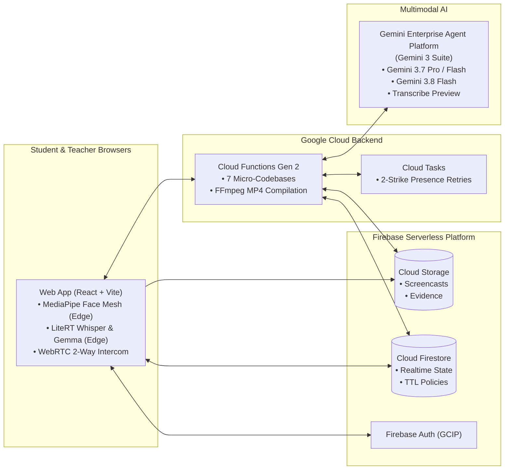

<p align="center"></p>

# Google AI Classroom Assistant

[](https://cloud.google.com)
[](https://cloud.google.com)
[](https://firebase.google.com)
[](https://react.dev)
[-brightgreen)](./docs/testing-strategy-and-coverage.md)
[](LICENSE)

A next-generation, serverless educational platform designed to proactively assist instructors and support students during computer-based tests and interactive lab sessions. Built on **Google Cloud**, **Firebase**, and **Gemini Enterprise Agent Platform**, the system pairs frontier multimodal AI reasoning with client-side edge computing to create a secure, supportive, and cost-effective classroom environment.

Rather than acting as a punitive monitoring tool, the platform functions as an empathetic **Proactive Proctor**, **Technical Support Assistant**, and **Wellness Coach**—intervening before academic integrity issues or technical hurdles arise.

---

## 🚀 Key Technical Highlights & Innovations

* 🧠 **Edge AI Invigilation (Zero-Egress Privacy)**: Browser-native MediaPipe Face/Iris mesh, LiteRT Whisper STT, and LiteRT Gemma 4 running in isolated Web Workers at 15–30 FPS. Evaluates focus and intent locally with zero cloud streaming costs and zero raw biometrics leaving the student device.
* 🎙️ **Acoustic Invigilation & Rolling Diarization**: Dual-mode audio architecture featuring client-side silence suppression (>80% bandwidth saved) paired with cloud-side `gemini-3.5-transcribe-preview` multi-speaker diarization and word-level timestamps.
* 🎬 **Two-Stage Map-Reduce-Map Lab Rubric Synthesis**: Discovers cohort-wide lab milestones and friction points using Gemini 3.7 Vision, automatically synthesizes structured rubrics with Gemini 3.8 Flash, and executes high-precision batch re-analysis.
* 🔒 **Zero-Trust Assessment Integrity**: Real-time exam mode with hard Cloud Storage rules (`resource.metadata.isExam`), full-screen enforcement, and 1-click Microsoft Word (`.docx`) incident dossier exports complete with embedded side-by-side screen/webcam evidence.
* 🎯 **"Bingo" Active Presence Verification**: Interactive challenge engine with 3 FinOps cost modes and a cheat-resistant Two-Strike attendance deduction system scheduled through serverless **Google Cloud Tasks**.
* 👥 **Institutional Student Directory & Cross-Class Profile Propagation**: Unified single `Student Name` data model and central institutional repository (`studentDirectory`). Uploading or editing a student's profile in any class instantly propagates their name, nickname, academic programme, and cohort across all classes in the institution, with zero manual migration.
* 🖥️ **Teacher Screen Broadcast & Anonymous Public Presentation Mode**: High-efficiency instructor screen sharing (`720p` @ `3.0s` default) with pure frame streaming avoiding WebRTC mesh CPU limits. Features an **Anonymous Public Presentation Mode** allowing conference and seminar audiences to view live screens and real-time multilingual subtitles on mobile devices by scanning a projected QR code with a 4-digit PIN—all while maintaining complete class privacy.
* 🌐 **Multimodal Live Subtitles & Multilingual Translation**: 3 selectable translation modes (Mode 1: LiteRT Whisper + Chrome Nano; Mode 2: LiteRT Whisper + Cloud Function Gemini 3.8 Flash; Mode 3: Firebase AI Logic Gemini Live WebSocket) powered by modern `AudioWorkletNode` background resampling. Features class-configurable subject domain glossaries (Healthcare, Business, Design, Engineering, Hospitality, Humanities, IT, or custom) and custom translation AI prompts saved directly per class in Cloud Firestore, with full Prompt Library integration (dedicated "Translation Prompts" tab, Gemini AI optimization, and repository markdown presets), delivering real-time dual-line bilingual subtitles across 7 languages.
* 💰 **AI FinOps & Quota Governance**: Real-time class spend caps, token consumption metrics, and unit cost accounting ($0.02/student) tracked live in the AI Cost Report dashboard.

---

## 🏛️ High-Level System Architecture



> 📖 **Deep Dive**: For full sequence diagrams, Cloud Function triggers, and data pipeline topologies, see **[🏛️ End-to-End System Architecture & Design](./docs/system-architecture.md)**.

---

<a id="documentation-index"></a>
## 📚 Documentation Index

Every operational workflow, data model, AI pipeline, and security policy is documented in depth:

| Category | Document | Description |
| :--- | :--- | :--- |
| **Release & Architecture Updates** | 📝 **[Recent Changes & Architectural Enhancements](./docs/recent-changes.md)** | Technical summary of recent updates: Gemini 3 migration, multi-location architecture, Bingo 1-min scheduler & FinOps, Live Subtitles, and Chrome enforcement. |
| **User Manuals & UI Catalogs** | 👨‍🏫 **[Instructor & TA User Manual](./docs/user-manual-teacher.md)** | Live grid invigilation, WebRTC peek & talkback, Bingo challenges, rubric studio, and incident dossiers. |
| | 🧑‍🎓 **[Student User Manual & Guide](./docs/user-manual-student.md)** | Pre-flight onboarding, 3-step readiness wizard, dual-channel capture, HUD indicators, and self-service portal. |
| | 🛠️ **[System Admin & DevOps Manual](./docs/user-manual-admin.md)** | Cloud provisioning, Terraform IaC, GCIP blocking functions, zero-trust storage rules, and disaster recovery. |
| | 📘 **[Comprehensive UI Controls & Features Catalog](./docs/comprehensive-ui-controls-and-features-catalog.md)** | Exhaustive 19-domain UI inventory detailing every button, slider, modal, toggle, and data flow. |
| **Architecture & Data Models** | 🏛️ **[System Architecture & Design](./docs/system-architecture.md)** | High-level system topology, comprehensive Mermaid architecture diagram, and edge/cloud partitioning. |
| | 🔑 **[Hybrid Role Resolution & Identity](./docs/hybrid-role-resolution-and-auth.md)** | 4-tier domain hierarchy, GCIP before-create triggers, role elevation, and zero-trust security. |
| | 🗄️ **[Firestore Schema & Database Design](./docs/firestore-schema.md)** | Complete collection schemas, field definitions, composite indexes, and TTL policies. |
| | ⚡ **[Cloud Functions Gen 2 Architecture](./docs/functions.md)** | Micro-codebase topology across 7 runtimes, callable endpoints, task queues, and storage triggers. |
| | 🧭 **[Frontend React Components & State Flows](./docs/frontend-components.md)** | React component hierarchy, code-splitting router, custom hooks, and shared UI utilities. |
| | ⏱️ **[Student View Logic & Timetable Engine](./docs/student-view-logic.md)** | Schedule-driven class matching, multi-stream capture, edge Web Workers, and live exam mode. |
| **AI, Acoustic & Media Processing** | 🧠 **[Teacher AI Prompt & Domain Configuration](./docs/teacher-ai-prompt-configuration-guide.md)** | Universal prompt library, dual-surface configuration, real-time live modal sync, and multi-modal inference trace. |
| | 🎙️ **[Audio Invigilation & Voice AI Architecture](./docs/audio-invigilation-and-transcription.md)** | Dual-mode acoustic processing: LiteRT edge Whisper/Gemma and rolling window cloud diarization. |
| | 🌐 **[Live Subtitles & Multilingual Translation](./docs/live-subtitles-and-translation.md)** | 3-tier selectable subtitle pipeline (LiteRT + Chrome Nano, Cloud Function Gemini 3.8 Flash, Firebase AI Logic Gemini Live WebSocket) with 350ms debounced Firestore delivery. |
| | 🎥 **[Teacher Lecture Recording & YouTube CC](./docs/teacher-lecture-recording-and-youtube-workflow.md)** | Sovereign dual-stream recording (WebM + Opus), automated multi-clip merging with fuzzy schedule tolerance (-45m early / +60m overrun), class-level default recording policy, Studio 2-card mode selector, and offline Gemini 3.8 multilingual CC. |
| | ☁️ **[Google Drive Hierarchical Backup & Lesson Naming](./docs/google-drive-backup-and-lesson-naming.md)** | Standardized 3-tier lesson naming resolution, least-privilege `drive.file` scope, in-memory folder lookup caching, and practical task student video backup directly from the grading matrix. |
| | 📦 **[Batch Media Export & ZIP Audit](./docs/batch-media-export-and-zip-audit.md)** | Technical audit of legacy server-side ZIP exports (`processZipJob.js`), in-memory `/tmp` double-storage traps, 540s timeout limits, and Google Drive archival comparison. |
| | 🎞️ **[Image-to-Video Compilation Pipeline](./docs/image-to-video-compilation.md)** | Discrete screenshot upload, FFmpeg H.264 MP4 encoding, SVG timestamp overlays, and exam tagging. |
| | 🎬 **[Video Analysis & Map-Reduce Prompt Synthesis](./docs/video-analysis-workflow.md)** | Gemini 3.7 vision discovery, Gemini 3.8 Flash rubric synthesis studio, and milestone matrix generation. |
| | 🔄 **[Data Retention & Media Lifecycle](./docs/data-retention-and-storage-lifecycle.md)** | Native Firestore TTL expiration, GCS event-driven cleanup triggers, and cascading class deletion. |
| **DevOps, Setup & Testing** | 🚀 **[Complete Setup & Customization Guide](./docs/setup-instructions.md)** | Step-by-step institutional deployment, automated 1-click script, and multi-school customization. |
| | 👥 **[Demo Accounts & Development Sandbox](./docs/demo-accounts-and-sandbox.md)** | Pre-seeded accounts (`IT114115-Demo`), 24/7 class configuration, and sandbox credentials. |
| | 🏗️ **[Deployment & Infrastructure Guide](./docs/deployment-and-infrastructure.md)** | Dual-environment setup (`it114115-dev-2026` / `it114115-2627`), Terraform specs, and build guardrails. |
| | 🧪 **[Testing Strategy, Pyramid & Coverage](./docs/testing-strategy-and-coverage.md)** | 846+ tests across 4 tiers: Frontend React suites, Cloud Functions, real-token security rules, and smoke tests. |
| **Presentations & Tech Talks** | 📊 **[Google Cloud Presentation Deck (Marp)](./docs/presentation/google-cloud-slides.marp.md)** | 26-slide presentation deck covering edge AI, Genkit resilience, FinOps, and live demo flows. |
| | 🌐 **[Interactive HTML Presentation](./docs/presentation/google-cloud-slides.html)** | Bespoke interactive web presentation deck with transitions and presenter controls. |
| | 📄 **[Printable Vector PDF Presentation](./docs/presentation/google-cloud-slides.pdf)** | 16:9 high-resolution vector PDF slide export. |
| | 📽️ **[PowerPoint Presentation (.pptx)](./docs/presentation/google-cloud-slides.pptx)** | Microsoft PowerPoint presentation deck. |
| | 🎙️ **[Masterclass Speaker Notes & Delivery Script](./docs/presentation/speaker-notes-and-script.md)** | Minute-by-minute talking points, technical deep dives, and live demonstration script. |
| **Subsystem Modules** | 💻 **[`web-app/` Client README](./web-app/README.md)** | Frontend React + Vite SPA structure, scripts, and edge worker bundles. |
| | 🛠️ **[`admin/` Scripts README](./admin/README.md)** | Administrative automation scripts, role provisioning, and smoke test execution. |
| | 🌐 **[`terraform/` IaC README](./terraform/README.md)** | Terraform infrastructure definitions, IAM roles, and Google Cloud resource provisioning. |

---

## ⚡ Quick Start (Local & Cloud)

### 🚀 1-Command Automated Cloud Deployment (Zero UI Clicks)
Provision all 15 GCP services, Firestore, Storage buckets, GCIP Auth, and Cloud Functions automatically via Terraform:
```bash
./setup-new-project.sh <PROJECT_ID> [BILLING_ACCOUNT_ID]
```

### 💻 Local Development Setup
```bash
# 1. Clone the repository
git clone https://github.com/wongcyrus/Gemini-Multimodal-Classroom-Agent.git
cd Gemini-Multimodal-Classroom-Agent

# 2. Configure environment credentials
cp web-app/.env.example web-app/.env
./switch-env.sh dev

# 3. Start React frontend dev server
cd web-app
npm install
npm run dev
```
The application runs locally at `http://localhost:5173`. Students must use **Google Chrome** on desktop.

### 👥 Pre-Configured Demo Accounts
The development sandbox ([`it114115-dev-2026.web.app`](https://it114115-dev-2026.web.app)) includes an active 24/7 demo class (`IT114115-Demo`):
- **👨‍🏫 Lead Teacher**: `teacher1@vtc.edu.hk`
- **🧑‍🎓 Demo Student**: `student1@stu.vtc.edu.hk`
- 📖 See **[👥 Demo Accounts & Sandbox Guide](./docs/demo-accounts-and-sandbox.md)** for the complete credentials directory and 1-click clipboard helpers.

---

## 🧪 Testing & Quality Assurance

The repository enforces strict continuous integration standards with **846+ tests and assertions**, exceeding the **80% line and branch coverage benchmark**:

```bash
# Run all test suites across the entire repository
npm test

# Run all test suites with V8 code coverage report
npm run test:coverage

# Run specific sub-suites
npm run test:frontend   # React component & utility unit tests (Vitest: 636 tests across 90 suites)
npm run test:functions  # Cloud Functions AI & media logic tests (Vitest: 138 tests across 6 codebases)
npm run test:smoke      # Live end-to-end smoke tests (Node.js + Firebase Admin: 28 assertions)
npm run test:security   # Real-token security rules verification (42 assertions)
```

For complete architectural details and coverage reports, see the **[🧪 Testing Strategy & Coverage Guide](./docs/testing-strategy-and-coverage.md)**.

---

## 👨‍💻 Author & Acknowledgments

**Cyrus Wong (黃俊彥)**  
* Google Developer Expert (GCP & AI/ML)  
* Senior Lecturer, Hong Kong Institute of Information Technology (HKIIT), Vocational Training Council (VTC) Hong Kong  
* Email: `cywong@vtc.edu.hk` | GitHub: [@wongcyrus](https://github.com/wongcyrus)

---

## 📄 License

This project is licensed under the Apache License 2.0. See the [LICENSE](LICENSE) file for details.