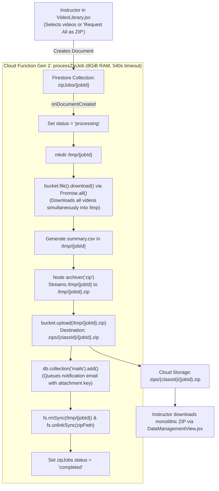

# 📦 Batch Media Export & ZIP Archiving Technical Audit: Feasibility & Limitations

[🏠 Documentation Index](../README.md#documentation-index) | [☁️ Google Drive Backup](./google-drive-backup-and-lesson-naming.md) | [⚡ Cloud Functions](./functions.md) | [🔄 Data Retention](./data-retention-and-storage-lifecycle.md) | [🏛️ System Architecture](./system-architecture.md)

---

## 1. Executive Summary & Audit Verdict

This document delivers a comprehensive architectural review of the batch media export and ZIP archiving pipeline implemented in [`processZipJob.js`](file:///home/developer/Documents/Gemini-AI-Classroom-Assistant/functions/media_processing/processZipJob.js) and triggered from [`VideoLibrary.jsx`](file:///home/developer/Documents/Gemini-AI-Classroom-Assistant/web-app/src/components/VideoLibrary.jsx).

### 🎯 Key Verdicts

| Media Category & Scale | Workable Status | Technical Finding |
| :--- | :--- | :--- |
| **Small Video Batches**<br/>(1–5 short clips, $< 1 \text{ GB}$ total) | 🟢 **Workable** | Functions within memory limits and finishes within the 540s timeout. |
| **Classroom Cohort Video Batches**<br/>(20–40 students, 1–2 hr sessions, 6–10 GB) | 🔴 **Unworkable** | **Guaranteed failure**: Triggers Cloud Function Out-Of-Memory (OOM `Exit Code 137`) or hard 540-second timeout kill. |
| **Student Screenshots & Images**<br/>(Tens of thousands of session JPEGs) | ⚪ **Not Supported** | `processZipJob.js` strictly handles `videoJobs`. There is **no backend batch ZIP mechanism** for raw images/screenshots. |

---

## 2. Legacy Server-Side ZIP Architecture (`processZipJob.js`)

When a teacher clicks **`📦 Request Selected as ZIP`** or **`📦 Request All as ZIP`** in the Video Library:



---

## 3. The 6 Critical Limitations & Failure Modes

### 3.1 Limitation 1: The `/tmp` In-Memory Double-Storage Trap (OOM Crashes)
In Google Cloud Functions Gen 2 (running inside Cloud Run containers), **`/tmp` is not a physical disk drive**. It is an in-memory `tmpfs` RAM disk that shares the total container memory allocation (`8GiB`).

Crucially, **video files (H.264 MP4 / WebM) are already compressed** via discrete cosine transform and inter-frame predictive coding. Deflate/ZIP compression achieves $\approx 0\%$ size reduction on video. Consequently, `/tmp` must hold both the source videos and the output ZIP file concurrently:

$$\text{RAM Consumption in } /tmp \approx \text{Downloaded MP4s } (S) + \text{Output ZIP Archive } (Z) \approx 2 \times S$$

```text
┌─────────────────────────────────────────────────────────────────┐
│ Container Memory (Total: 8 GiB)                                 │
├──────────────────────────┬──────────────────────────┬───────────┤
│ Downloaded MP4s in /tmp  │ Output .zip File in /tmp │ Node Heap │
│ S = 3.5 GB               │ Z = 3.5 GB               │ 0.6 GB    │
└──────────────────────────┴──────────────────────────┴───────────┘
Total RAM Used: 7.6 GB / 8.0 GB (DANGER THRESHOLD)
```

- **Crash Point**: If a cohort's total video size $S$ exceeds **$\approx 3.5 \text{ GB}$** (e.g. 18 students with ~200 MB screencasts), the container runs out of RAM or disk space:
  - `ENOSPC: no space left on device`
  - Linux Kernel OOM killer terminates the container: `Process exited with code 137 (SIGKILL)`.

---

### 3.2 Limitation 2: Hard 540-Second (9-Minute) Serverless Execution Cap
Cloud Functions Gen 2 enforces a strict maximum execution duration of **540 seconds (9 minutes)**. 

Consider a standard vocational laboratory session of 35 students where each compiled screencast is 220 MB (total cohort media: **7.7 GB**):
1. **Download Phase**: Downloading 7.7 GB from GCS across Node streams: $\approx 150 - 200 \text{ s}$.
2. **Archiving Phase**: Deflating 7.7 GB and writing back to `/tmp`: $\approx 180 - 240 \text{ s}$.
3. **Upload Phase**: Uploading the 7.7 GB monolithic archive back to Cloud Storage: $\approx 160 - 220 \text{ s}$.
4. **Total Elapsed Time**: **$490 - 660 \text{ seconds}$**.

Any network jitter, GCS API rate limits, or container CPU throttling pushes the execution past 540 seconds. The container is forcibly terminated mid-upload, leaving:
- A corrupted, partial ZIP in storage.
- The `zipJobs` document permanently stranded in `status: 'processing'`.
- The teacher receiving no notification or usable download.

---

### 3.3 Limitation 3: Concurrency Flooding via `Promise.all`
In [`processZipJob.js` lines 44–55](file:///home/developer/Documents/Gemini-AI-Classroom-Assistant/functions/media_processing/processZipJob.js#L44-L55):
```javascript
const downloadPromises = videos.map(video => {
  const tempFilePath = path.join(tempDir, newFileName);
  return bucket.file(video.path).download({ destination: tempFilePath });
});
await Promise.all(downloadPromises);
```
- If an instructor clicks **"Request All as ZIP"** for a class with 50 to 100 recordings, `Promise.all` spawns 50–100 simultaneous network connections to Cloud Storage.
- This creates immediate file descriptor exhaustion (`EMFILE: too many open files`), network interface socket starvation, and transient HTTP 503 / 429 throttling from Cloud Storage.

---

### 3.4 Limitation 4: Complete Absence of Screenshot & Image Batch Zipping
The system **does not support batch zipping screenshots or raw images**:
- `processZipJob.js` is coded strictly to accept `videos` payloads from `videoJobs`.
- In an invigilated session, each student captures an image every 10–15 seconds. A 3-hour exam for 40 students generates:
  $$40 \text{ students} \times 180 \text{ min} \times 4 \text{ images/min} = \mathbf{28,800 \text{ JPEG images}}$$
- Attempting to zip 28,800 individual image files inside a serverless Cloud Function would crash within seconds due to:
  1. Operating system inode and file descriptor exhaustion.
  2. Millions of milliseconds spent in per-file storage metadata handshakes.
  3. Serverless timeout long before completing even 10% of the archive.

---

### 3.5 Limitation 5: Fragile "All-or-Nothing" Failure Model
- If **1 video out of 40** has an invalid storage path, an expired object, or a transient read failure, `bucket.file(...).download()` throws an exception.
- Because `Promise.all` rejects on the first error, the entire batch crashes immediately.
- The teacher receives **zero files**, despite 39 out of 40 videos being healthy and accessible.

---

### 3.6 Limitation 6: Redundant Network Egress & Storage Costs (Cloud FinOps)
The server-side ZIP pattern incurs massive redundant cloud billing:
1. **Double Storage Consumption**: Cloud Storage must retain both the original `.mp4` video files and the temporary `zips/{classId}/{jobId}.zip` bundle until TTL expiration (7 days).
2. **Double Egress Costs**:
   - Internal cloud traffic: GCS $\to$ Cloud Function.
   - Internal write: Cloud Function $\to$ GCS.
   - External teacher download: GCS $\to$ Teacher Browser ($\approx \$0.12/\text{GB}$ internet egress).

---

## 4. Architectural Comparison: Server-Side ZIP vs. Client-Side Google Drive Archival

To overcome these structural limitations, the platform introduced **Client-Side Google Drive Archival** ([`googleDriveService.js`](file:///home/developer/Documents/Gemini-AI-Classroom-Assistant/web-app/src/utils/googleDriveService.js) / [`useGoogleDrive.js`](file:///home/developer/Documents/Gemini-AI-Classroom-Assistant/web-app/src/hooks/useGoogleDrive.js)):

| Dimension | 📦 Server-Side ZIP (`processZipJob.js`) | ☁️ Client-Side Google Drive Archival (New) |
| :--- | :--- | :--- |
| **Max Batch Capacity** | Hard limit of **$\le 3.5 \text{ GB}$ / $\le 15$ videos** before OOM crash. | **Unlimited** (streams sequentially, file-by-file without accumulation). |
| **Timeout Ceiling** | Hard **540s (9-minute)** serverless execution cap. | **Zero timeout**; runs in the browser over standard broadband. |
| **Failure Tolerance** | **All-or-nothing**: 1 failure aborts the entire archive. | **Per-file isolation**: Healthy files are archived; failed files can be retried individually. |
| **Instructor Accessibility** | Must wait up to 10 minutes, download a massive archive, extract it locally, and navigate directories. | Files appear **instantly in Google Drive**, playable directly via web player with zero local extraction. |
| **Backend Compute & Cost** | High (8 GiB Cloud Function instances + redundant storage in `zips/`). | **$0.00 backend compute & $0.00 function egress** (direct browser streaming). |
| **Security & Credentials** | Requires backend IAM storage permissions. | **Least-privilege OAuth 2.0 (`drive.file`)**; token resides exclusively in browser memory. |
| **Progress & Cancellation** | Opaque (job document remains `processing` until done). | **Live byte-level progress bar** and instant cancellation via `AbortController`. |

---

## 5. Architectural Recommendations & Roadmap

1. **Restrict ZIP Archiving to Ad-Hoc Micro-Exports ($\le 5$ files)**:
   - Keep `processZipJob.js` active exclusively for small, manual selections in `VideoLibrary.jsx` (e.g. 1 to 5 selected video clips).
   - Add a frontend guard in `VideoLibrary.jsx` warning the instructor if their selection exceeds 5 videos or 1.5 GB.
2. **Promote Google Drive Archival as the Primary Enterprise Solution**:
   - Instructors backing up student practical tasks, whole-class laboratory sessions, or semester lecture archives should utilize **Google Drive Hierarchical Archival**.
3. **Handling Large Image & Screenshot Exports**:
   - Never attempt server-side ZIP archives for tens of thousands of raw screenshot JPEGs.
   - If image archives are required:
     - Use the **Incident Dossier (`processReportJob.js`)** which compiles evidence into structured Word (`.docx`) and CSV documents containing secure cloud links to flagged evidence frames.
     - Or implement a client-side streaming utility to upload select timestamped image directories directly to Google Drive.
