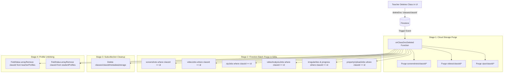

# 🔄 Data Retention & Autonomous Media Lifecycle Architecture

[🏠 Documentation Index](../README.md#documentation-index) | [👨‍🏫 Teacher Manual](./user-manual-teacher.md) | [🧑‍🎓 Student Manual](./user-manual-student.md) | [🛠️ Admin Manual](./user-manual-admin.md) | [📘 UI Catalog](./comprehensive-ui-controls-and-features-catalog.md)

---

This document provides a comprehensive technical reference for the real-time data retention, autonomous Firestore TTL lifecycle, Storage event-driven deletion triggers, and cascading class removal in the Google AI Classroom.

---

## 📑 Table of Contents

1. [System Architecture Overview](#️-system-architecture-overview)
2. [1. Per-Class Dual Retention Configuration](#️-1-per-class-dual-retention-configuration)
3. [2. Real-Time Event-Driven Deletion Triggers](#-2-real-time-event-driven-deletion-triggers-functionsstorage_triggers)
4. [3. Comprehensive Cascading Class Deletion](#️-3-comprehensive-cascading-class-deletion-onclassdocdeleted)
5. [4. Data Safety & Isolation Model](#️-4-data-safety--isolation-model)
6. [5. Firestore Native TTL Policy Setup](#️-5-firestore-native-ttl-policy-setup)

---

## 🏛️ System Architecture Overview

```mermaid
flowchart TD
    UI[Class Management UI: Teacher Configures Retention Days] -->|1. Stamping at Ingestion| Stamping[Asset Ingestion & Expiration Stamping]

    subgraph Ingestion [Ingestion expireAt Stamping]
        Stamping --> S1[Screenshots: expireAt = now + retentionDays]
        Stamping --> S2[VideoJobs: expireAt = now + videoRetentionDays]
        Stamping --> S3[ZipJobs: expireAt = now + 7 Days]
        Stamping --> S4[Audio Chunks: expireAt = now + retentionDays]
    end

    Ingestion -->|2. Background Firestore Expiry| TTL[Firestore Native TTL Engine]
    TTL -->|3. onDocumentDeleted Events| Triggers[Storage Event Triggers]

    subgraph Triggers [Event-Driven Cloud Storage Cleanup]
        Triggers --> T1[onScreenshotDocDeleted: Deletes .jpg from GCS]
        Triggers --> T2[onVideoJobDocDeleted: Deletes .mp4 from GCS]
        Triggers --> T3[onZipJobDocDeleted: Deletes .zip from GCS]
    end

    Triggers -->|4. Cloud Storage Object Deleted Event| Quota[onObjectDeleted: Auto-Decrements Class Storage Quota]
```

---

## ⚙️ 1. Per-Class Dual Retention Configuration

### Data Model (`classes/{classId}`)
* **`retentionDays`** `(number)`: Configurable retention period for **raw screen captures** (Presets: 7, 14, 30, 60, 90, 180, 365 days; Default: 30 days).
* **`videoRetentionDays`** `(number)`: Configurable retention period for **compiled lesson videos** (`.mp4`) (Presets: 14, 30, 60, 90, 180, 365, 730 days; Default: 90 days).

### Ingestion Stamping (`expireAt`)
Every generated document is stamped with a deterministic UTC expiration timestamp at creation time:
* **Screenshots (`StudentView.jsx`)**:
  `expireAt = new Date(Date.now() + retentionDays * 86,400,000 ms)`
* **Video Jobs (`scheduledTasks.js` / `PlaybackView.jsx`)**:
  `expireAt = new Date(Date.now() + videoRetentionDays * 86,400,000 ms)`
* **Zip Export Jobs (`VideoLibrary.jsx`)**:
  `expireAt = new Date(Date.now() + 7 * 86,400,000 ms)` (Standard 7-day export window)

---

## ⚡ 2. Real-Time Event-Driven Deletion Triggers (`functions/storage_triggers/`)

### `onScreenshotDocDeleted`
* **Trigger**: `onDocumentDeleted('screenshots/{screenshotId}')`
* **Behavior**: Extracts `imagePath` and immediately deletes the physical image blob from Cloud Storage (`bucket.file(imagePath).delete({ ignoreNotFound: true })`).
* **Guarantee**: Eliminates orphaned image files when documents are removed by Firestore TTL, teacher manual delete, or class deletion.

### `onVideoJobDocDeleted`
* **Trigger**: `onDocumentDeleted('videoJobs/{jobId}')`
* **Behavior**: Extracts `videoPath` (e.g., `videos/{classId}/{jobId}.mp4`) and deletes the compiled video file from Cloud Storage.

### `onZipJobDocDeleted`
* **Trigger**: `onDocumentDeleted('zipJobs/{jobId}')`
* **Behavior**: Extracts `zipPath` (e.g., `zips/{classId}/{jobId}.zip`) and deletes the temporary ZIP archive from Cloud Storage.

### `onClassRetentionUpdated`
* **Trigger**: `onDocumentUpdated('classes/{classId}')`
* **Timeout**: 300 seconds | **Memory**: 512MiB
* **Behavior**:
  1. Detects changes when a teacher alters `retentionDays` or `videoRetentionDays`.
  2. Queries existing `screenshots` and `videoJobs` for that class in **500-item chunks**.
  3. Computes `newExpireAt = doc.timestamp + (newDays * 86.4M ms)`.
  4. If `newExpireAt <= now`: Deletes the document immediately (cascading to storage deletion).
  5. If `newExpireAt > now`: Updates the `expireAt` field with the new future timestamp.

---

## 🗑️ 3. Comprehensive Cascading Class Deletion (`onClassDocDeleted`)

When a teacher deletes a class in the UI (`ClassManagement.jsx`), only one quick Firestore operation is executed:
```javascript
await deleteDoc(doc(db, 'classes', classId));
```

The Cloud Function **`onClassDocDeleted`** (`functions/storage_triggers/cleanupTriggers.js`) is triggered and executes a **4-stage cascading purge**:



### Stage Details:
1. **Stage 1 (Cloud Storage Purge)**:
   Purges all file prefixes under the class directory (`screenshots/{classId}/`, `videos/{classId}/`, `zips/{classId}/`).
2. **Stage 2 (Firestore Collection Batch Purge)**:
   Queries and batch-deletes all documents linked by `classId` in 500-item chunks across:
   * `screenshots`
   * `videoJobs`
   * `zipJobs`
   * `videoAnalysisJobs`
   * `irregularities`
   * `progress`
   * `propertyUploadJobs`
3. **Stage 3 (Subcollection Purge)**:
   Deletes `classes/{classId}/metadata/storage` tracking doc.
4. **Stage 4 (User Profile Unlinking)**:
   Queries `teacherProfiles` and `studentProfiles` where `classes` array contains `classId` and calls `FieldValue.arrayRemove(classId)`.

---

## 🛡️ 4. Data Safety & Isolation Model

| Entity | Impact on Class Deletion | Why It Is Safe |
| :--- | :--- | :--- |
| **Teacher Accounts** | **Preserved** | Auth accounts & profile documents remain intact. Only the deleted `classId` is removed from their `classes` array. |
| **Student Accounts** | **Preserved** | Students can continue logging in. Other enrolled courses remain active and unaffected. |
| **Other Classes** | **Isolated & Untouched** | Storage folders are strictly scoped (`.../{classId}/`) and queries use exact `.where('classId', '==', classId)` filters. |
| **Quota Metrics** | **Auto-Adjusted** | Storage deletions automatically trigger `onObjectDeleted` to keep system storage calculations accurate. |

---

## ⚙️ 5. Firestore Native TTL Policy Setup

To ensure Firestore automatically prunes expired documents natively, enable TTL on the `expireAt` field for the relevant collections:

```bash
# Enable TTL on screenshots
gcloud firestore fields ttls update expireAt --collection-group=screenshots --enable-ttl

# Enable TTL on videoJobs
gcloud firestore fields ttls update expireAt --collection-group=videoJobs --enable-ttl

# Enable TTL on zipJobs
gcloud firestore fields ttls update expireAt --collection-group=zipJobs --enable-ttl
```

---

## 🎥 6. Teacher Lecture Recording & Telemetry Deletion Lifecycle

Teacher lecture recordings (`classes/{classId}/lectureRecordings/{sessionId}`) and telemetry follow rigorous deletion lifecycle policies:
- **Clean Video, Pure Audio & Multi-CC Artifacts**: Stored at `recordings/{classId}/{sessionId}/` containing:
  - `lecture.webm` (composite screen + mic recording).
  - `lecture_audio.webm` (pure Opus audio track used for low-bandwidth Gemini speech transcription).
  - `subtitles_*.vtt` and `subtitles_*.srt` (multilingual subtitle tracks).
- **Teacher Sovereign Discard & On-Demand Deletion**:
  - Teachers can delete any lecture recording directly from the **Lecture Recordings View** via the **"🗑️ Delete Recording"** button.
  - Deleting the `classes/{classId}/lectureRecordings/{sessionId}` Firestore document fires the `onLectureRecordingDeleted` Cloud Storage trigger, which automatically purges all files under `recordings/{classId}/{sessionId}/` from Google Cloud Storage (`force: true`).
  - Quota is decremented immediately in `classes/{classId}/metadata/storage` via `updateStorageUsageOnDelete`.
- **Date Range Purge (Images & Voices)**:
  - From the **Data Management View**, teachers can trigger **"Delete Session Data (Images & Audio) in Range"**.
  - Calls `deleteScreenshotsByDateRange`, which queries both `screenshots` and `audio` collections across the given time window, deletes the underlying Cloud Storage blobs, and purges the Firestore documents in batches.
- **Cascading Removal on Class Deletion**:
  - When an entire class is deleted via `onClassDocDeleted`, Cloud Storage prefixes (`screenshots/{classId}/`, `videos/{classId}/`, `zips/{classId}/`, `audio/{classId}/`, `recordings/{classId}/`) are automatically wiped.
  - Subcollections including `lectureRecordings`, `screenBroadcast`, and `liveSubtitles` are completely purged from Firestore.

---

[← Back to Documentation Index](../README.md#documentation-index)


