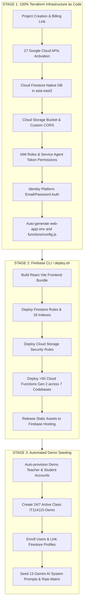

# Deployment & Infrastructure Guide

[🏠 Documentation Index](../README.md#documentation-index) | [👨‍🏫 Teacher Manual](./user-manual-teacher.md) | [🧑‍🎓 Student Manual](./user-manual-student.md) | [🛠️ Admin Manual](./user-manual-admin.md) | [📘 UI Catalog](./comprehensive-ui-controls-and-features-catalog.md)

---

This document provides a comprehensive overview of the automated infrastructure provisioning, multi-codebase deployment pipeline, and environment management workflows for the **Google AI Classroom**. For a step-by-step walkthrough on setting up and customizing the platform for a new school or institution, see the **[Setup & Customization Guide](./setup-instructions.md)**.

---

## 📑 Table of Contents

1. [Architecture & Technology Stack](#️-architecture--technology-stack)
2. [Creating a New Environment (Zero UI Clicks)](#-creating-a-new-environment-zero-ui-clicks)
3. [Default Seeded Accounts & Demo Class](#-default-seeded-accounts--demo-class)
4. [Switching Between Environments (Dev vs Prod)](#-switching-between-environments-dev-vs-prod)
5. [Firestore Composite Index Architecture](#️-firestore-composite-index-architecture-firestoreindexesjson)
6. [Future Project ID & Name Migration (Yearly Rollover)](#-future-project-id--name-migration-yearly-rollover)
7. [Security Audit & Key Exposure Risk Analysis](#-security-audit--key-exposure-risk-analysis)
8. [Email Delivery & Custom SMTP Configuration](#️-email-delivery--custom-smtp-configuration)
9. [Multi-Codebase Cloud Functions Architecture](#-multi-codebase-cloud-functions-architecture)
10. [Genkit AI Modern Integration](#-genkit-ai-modern-integration)
11. [Self-Healing & Resilience Features in deploy.sh](#️-self-healing--resilience-features-in-deploysh)
12. [Institutional Email Domain Configuration (Multi-School Support)](#-institutional-email-domain-configuration-multi-school-support)

---

## 🏗️ Architecture & Technology Stack

The project employs a 3-stage automated provisioning, deployment, and data seeding architecture:



---

## 🚀 Creating a New Environment (Zero UI Clicks)

To provision a brand-new GCP/Firebase project from scratch with all APIs, database, storage, IAM, functions, hosting, and seeded demo accounts in a single command:

```bash
./setup-new-project.sh <PROJECT_ID> [BILLING_ACCOUNT_ID]
```

### Example:
```bash
./setup-new-project.sh it114115-dev-2026 01C74C-667DFE-538DBC
```

### What `setup-new-project.sh` executes:
1. **Terraform Apply (`terraform/`)**:
   - Initializes Terraform with isolated per-project state (`${PROJECT_ID}.tfstate`).
   - Provisions all cloud resources.
   - Generates project-specific `web-app/.env` and `functions/config.js`.
2. **Firebase Context Switch**:
   - Sets `firebase use <PROJECT_ID>`.
3. **Application & Functions Deployment (`deploy.sh`)**:
   - Builds frontend React application.
   - Deploys Firestore and Storage security rules and composite indexes.
   - Deploys all 14 Cloud Functions across the 7 isolated codebases with automatic Day-0 failure recovery.
   - Releases static assets to Firebase Hosting.
4. **Initial Data Seeding (`admin/scripts/seed_initial_data.mjs`)**:
   - Provisions verified demo accounts.
   - Configures `IT114115-Demo` class with 24/7 schedule.
   - Seeds all AI prompts.

---

## 👥 Default Seeded Accounts & Demo Class

When a project is deployed or seeded via `node admin/scripts/seed_initial_data.mjs`, the following assets are ready immediately (see full reference in **[👥 Demo Accounts & Development Sandbox Guide](./demo-accounts-and-sandbox.md)**):

| Role | Email | Password Configuration | Verification Status |
| :--- | :--- | :--- | :--- |
| **Demo Teacher** | `teacher1@vtc.edu.hk` | Set via seeding (`DEMO_PASSWORD`) | ✅ Pre-verified (`emailVerified: true`) |
| **Demo Student** | `student1@stu.vtc.edu.hk` | Set via seeding (`DEMO_PASSWORD`) | ✅ Pre-verified (`emailVerified: true`) |
| **Co-Teacher** | `cywong@vtc.edu.hk` | *(Personal account)* | ✅ Pre-verified (`emailVerified: true`) |

### Pre-enrolled Demo Class:
- **Class ID:** `IT114115-Demo`
- **Class Name:** `IT114115 Demo Class`
- **AI Budget:** `$50.00 USD` (`aiQuota: 50`)
- **Default AI Invigilation Mode:** `hybrid` (`⚡ Client AI + Fallback`)
- **Schedule:** 24/7 (`00:00 - 23:59`, Monday through Sunday) so screen capturing and testing work anytime.

---

## 🔄 Switching Between Environments (Dev vs Prod)

Switching between Development and Production is instantaneous with zero Terraform overhead, backed by build-time safety guardrails that make cross-environment configuration leaks impossible:

### 1. Instant Switcher (`./switch-env.sh`)
```bash
# Switch to Development (it114115-dev-2026)
./switch-env.sh dev

# Switch to Production (it114115-2627)
./switch-env.sh prod
```
*What happens under the hood in <0.5s:*
- Switches Firebase CLI active project (`firebase use dev` / `firebase use prod`).
- Synchronizes `web-app/.env` from isolated environment templates (`web-app/.env.prod` or `web-app/.env.dev`).
- Synchronizes Vite mode-specific environment files (`web-app/.env.production` or `web-app/.env.development`).
- Generates and propagates `functions/config.js` to all 7 Cloud Function codebases.
- Updates Cloud Storage `cors.json` with appropriate origin domain whitelists.

### 2. Build-Time Safety Guardrails (`vite.config.js`)
To guarantee that development Firebase credentials (e.g., `it114115-dev-2026`) are never accidentally bundled into production hosting assets (e.g., `https://it114115-2627.web.app`), `web-app/vite.config.js` executes strict pre-compilation validation:

```javascript
export default defineConfig(({ mode }) => {
  const env = loadEnv(mode, process.cwd(), '');

  // Safety Assertion: If building for production, enforce target project is it114115-2627
  if (mode === 'production') {
    const projectId = env.VITE_PROJECT_ID || env.VITE_FIREBASE_PROJECT_ID;
    if (projectId && projectId !== 'it114115-2627') {
      throw new Error(
        `[CRITICAL BUILD ERROR] Production build aborted!\n` +
        `Expected target projectId: 'it114115-2627'\n` +
        `Found projectId in environment: '${projectId}'\n` +
        `Please ensure you are using the correct production configuration.`
      );
    }
  }
  // ...
});
```

* **Targeted Build Scripts (`web-app/package.json`):**
  - `npm run build:prod`: Runs `vite build --mode production` with hard project ID validation.
  - `npm run build:dev`: Runs `vite build --mode development` for dev staging verification.
  - `npm run build`: Standard Vite build inheriting the active `.env`.

### 3. Single-Command Deployment (`./deploy.sh`)
You can deploy directly to any target environment by specifying it in the command:
```bash
# Deploy entire stack directly to Production
./deploy.sh prod

# Deploy entire stack directly to Development
./deploy.sh dev

# Deploy ONLY hosting to Production
./deploy.sh prod --only hosting

# Deploy ONLY functions to Development
./deploy.sh dev --only functions

# Deploy ONLY Firestore composite indexes
npx -y firebase-tools@latest deploy --only firestore:indexes --project it114115-2627
```

---

## 🗄️ Firestore Composite Index Architecture (`firestore.indexes.json`)

All complex Firestore queries used across the frontend, cloud functions, and analytics engines require composite indexes. These indexes are declared declaratively in [`firestore.indexes.json`](../firestore.indexes.json) and deployed via the Firebase CLI:

| Collection / Group | Indexed Fields | Query Purpose |
| :--- | :--- | :--- |
| **`screenshots`** | `classId ASC, timestamp DESC` | Real-time Session Review & Playback timeline queries |
| **`screenshots`** | `classId ASC, timestamp ASC` | Chronological session scrubbing & video generation |
| **`screenshots`** | `classId ASC, studentUid ASC, timestamp ASC` | Per-student timeline reconstruction & export |
| **`videoJobs`** | `classId ASC, status ASC, createdAt DESC` | Smart Lesson discovery (detecting completed morning/afternoon sessions) & Video Library |
| **`videoJobs`** | `classId ASC, createdAt DESC` | Class-wide video compilation job tracking |
| **`videoJobs`** | `studentUid ASC, createdAt DESC` | Individual student video archives |
| **`aiJobs`** | `classId ASC, createdAt DESC` | AI Cost Report & financial audit summaries |
| **`aiJobs`** | `studentUid ASC, createdAt DESC` | Student AI consumption breakdown |
| **`audio`** | `classId ASC, studentUid ASC, windowStartSec ASC` | Diarization seek player & dialogue playback |
| **`irregularities`**| `classId ASC, timestamp DESC` | Live AI alert feed & Incident Dossier generation |

> [!IMPORTANT]
> If a query is executed without an active composite index in production, Firestore throws a missing index error (with a direct creation link). Maintaining all indexes in `firestore.indexes.json` guarantees immediate Zero-Downtime deployments across new student cohorts and yearly projects.


---

## 📅 Future Project ID & Name Migration (Yearly Rollover)

When you need to create a new project ID for an upcoming academic cohort (e.g. `it114115-2728`):

### Step 1: Provision the New Project (Zero UI Clicks)
```bash
./setup-new-project.sh <NEW_PROJECT_ID> [BILLING_ACCOUNT_ID]
# Example:
./setup-new-project.sh it114115-2728 01C74C-667DFE-538DBC
```
This automatically provisions Terraform infrastructure, saves `web-app/.env.<NEW_PROJECT_ID>`, deploys all functions & hosting, and seeds default teacher accounts.

### Step 2: Update Aliases for Quick Switching
To map the new project as your active `prod` or `dev`:

1. **In [`.firebaserc`](../.firebaserc):**
   ```json
   {
     "projects": {
       "default": "it114115-2728",
       "dev": "it114115-dev-2026",
       "prod": "it114115-2728"
     }
   }
   ```
2. **In [`switch-env.sh`](../switch-env.sh):**
   Update the `PROJECT_ID` variable under the `prod` block:
   ```bash
   prod|production)
     PROJECT_ID="it114115-2728"
     ENV_FILE="web-app/.env.prod"
     ENV_NAME="Production"
     FIREBASE_ALIAS="prod"
     ;;
   ```

### Step 3: Changing Only the Human-Readable Display Name
If you want to modify only the display name of an existing project (e.g. from *"Classroom Assistant"* to *"HKIIT AI Invigilator"*):
- **Terraform:** Update `project_name` in [`terraform/variables.tf`](../terraform/variables.tf) and run `cd terraform && terraform apply -state="<PROJECT_ID>.tfstate" -var="project_id=<PROJECT_ID>"`.
- **GCP Console:** Go to **IAM & Admin > Settings** and edit the **Project Name** field.

---

## 🔒 Security Audit & Key Exposure Risk Analysis

A comprehensive security review was conducted on this architecture regarding sensitive key exposure risks to GitHub:

### 1. File & Secret Tracking Protections (`.gitignore`)
The repository strictly ignores all secrets and environment snapshots:
- **Environment Files:** `.env`, `.env.*` (including `.env.dev`, `.env.prod`).
- **Service Accounts & Private Keys:** `*.pem`, `*.key`, `sp.json`, `serviceAccountKey.json`, `service-account*.json`.
- **Terraform State Files:** `terraform/*.tfstate`, `terraform/*.tfstate.*`, `terraform/*.tfvars`.
- **Function Runtime Config Copies:** `functions/*/config.js`.

### 2. Client-Side Firebase Keys vs. Backend Secrets
- **Firebase Web API Key (`VITE_API_KEY`):**
  - Firebase Web API keys (strings starting with `AIzaSy...`) are **public project identifiers** designed by Google to reside on the client side. They do *not* grant administrative access to GCP services.
  - Security is enforced at the platform boundary via:
    1. **Firestore Security Rules (`firestore.rules`):** Only authenticated users with verified claims (`teacher` / `student`) can read/write authorized paths.
    2. **Cloud Storage Security Rules (`storage.rules`):** Path-based write and read restrictions.
    3. **Firebase App Check (reCAPTCHA v3):** Attests incoming traffic originated from genuine app frontends.
- **Backend Service Credentials:**
  - Cloud Functions Gen 2 run under Google Cloud Default Application Credentials (ADC) and IAM Service Accounts without embedding any service account JSON private keys in the codebase.
- **Git History Integrity:**
  - An audit across all Git commit trees confirms **0 private keys** or sensitive service account credentials have ever been committed.

---

## ✉️ Email Delivery & Custom SMTP Configuration

Because `@vtc.edu.hk` and `@stu.vtc.edu.hk` are hosted on **Microsoft 365 Exchange Online**, Microsoft's email gateway may reject unauthenticated messages from newly created `*.firebaseapp.com` subdomains.

### Configuring Gmail SMTP Relay for 100% Inbox Delivery:
1. Generate an **App Password** from your Google Account: [Google Account > Security > App Passwords](https://myaccount.google.com/apppasswords).
2. Open [Firebase Console > Authentication > Templates](https://console.firebase.google.com).
3. Click the **Edit (pencil)** icon on any email template and configure **SMTP Configuration**:
   - **Sender email:** `it114115@vtc.edu.hk` *(Must match the Google account)*
   - **Username:** `it114115@vtc.edu.hk`
   - **Password:** *(16-character Google App Password)*
   - **Host:** `smtp.gmail.com`
   - **Port:** `465`
   - **Security:** `SSL`
4. Click **Save**.

### Instant Admin CLI Verification (No Email Wait Needed):
```bash
# Instantly verify any email address:
GOOGLE_CLOUD_PROJECT=<PROJECT_ID> node admin/scripts/verifyUser.js <user_email>

# Grant teacher role:
GOOGLE_CLOUD_PROJECT=<PROJECT_ID> node admin/scripts/grantTeacherRole.js <user_email>

# Reseed or reset initial demo data:
GOOGLE_CLOUD_PROJECT=<PROJECT_ID> node admin/scripts/seed_initial_data.mjs
```

---

## 🧩 Multi-Codebase Cloud Functions Architecture

To ensure high availability, prevent circular dependencies, and isolate build failures, Cloud Functions are divided into **7 isolated codebases** in [`firebase.json`](../firebase.json):

| Codebase Directory | Functions | Triggers / Purpose |
| :--- | :--- | :--- |
| **`functions/ai_flows/`** | `analyzeImage`, `analyzeAllImages`, `onAiJobCreated`, `processVideoAnalysisJob`, `triggerAutomaticAnalysis`, `retryVideoAnalysisJob`, `aggregatePerformanceMetrics` | Genkit Gemini AI analysis flows & performance aggregations |
| **`functions/media_processing/`** | `processVideoJob`, `processZipJob`, `cleanupStuckJobs` | Video compilation & ZIP extraction pipelines |
| **`functions/auth_triggers/`** | `beforeusercreated`, `checkipaddress`, `onClassUpdate` | Auth blocking triggers & user class role sync |
| **`functions/storage_triggers/`** | `updateStorageUsageOnUpload`, `updateStorageUsageOnDelete`, `deleteScreenshotsByDateRange` | Storage quota tracking & cleanup |
| **`functions/scheduled_tasks/`** | `handleAutomaticCapture`, `handleAutomaticVideoCombination` | Automated interval captures and video merges |
| **`functions/property_processing/`** | `processPropertyUpload` | Asset property validation |
| **`functions/attendance/`** | `getAttendanceData` | Attendance reporting endpoint |

---

## 🤖 Genkit AI Modern Integration

The AI engine uses Google's latest **`@genkit-ai/google-genai`** SDK (migrated from the deprecated `@genkit-ai/vertexai`):

- **Model:** `gemini-3.5-flash-lite`
- **Location:** `global`
- **Configuration File:** [`functions/ai_flows/ai.js`](../functions/ai_flows/ai.js)

```javascript
import { genkit } from 'genkit';
import { vertexAI } from '@genkit-ai/google-genai';
import { enableFirebaseTelemetry } from '@genkit-ai/firebase';

enableFirebaseTelemetry();

export const ai = genkit({
  plugins: [
    vertexAI({
      projectId: process.env.GCLOUD_PROJECT,
      location: 'global',
    }),
  ],
  model: vertexAI.model('gemini-3.5-flash-lite'),
});
```

---

## 🛡️ Self-Healing & Resilience Features in `deploy.sh`

On brand-new projects (Day 0), Google Cloud Build enforces strict concurrency limits when compiling 14 functions simultaneously. [`deploy.sh`](../deploy.sh) includes built-in automated self-healing:

1. **Pre-warm Step:** Deploys a lightweight function first to initialize the Cloud Functions upload bucket without parallel collision.
2. **Transient Failure Cleanup:** Automatically discovers and removes any transient `FAILED` placeholders before redeployment.
3. **Automatic Second-Pass Retry:** If GCP hits a parallel build ceiling on the first run, the script automatically retries; Firebase skips the already-deployed functions and cleanly finalizes the remaining functions with 0 manual intervention.

---

## 🏫 Institutional Email Domain Configuration (Multi-School Support)

The platform is designed to be fully adaptable by any university, college, or K-12 institution. Role assignment (**teacher** vs **student**) and authentication boundaries are governed dynamically by institutional email domains rather than hardcoded strings.

### Configuration Matrix

| Layer | Environment Variable | Default (VTC Hong Kong) | Description / Example for Another Institution |
| :--- | :--- | :--- | :--- |
| **Backend Functions** | `TEACHER_EMAIL_DOMAINS` | `vtc.edu.hk` | Comma-separated domains for instructors (e.g. `stanford.edu,cs.stanford.edu`) |
| **Backend Functions** | `STUDENT_EMAIL_DOMAINS` | `stu.vtc.edu.hk` | Comma-separated domains for students (e.g. `alumni.stanford.edu`) |
| **Frontend Web App** | `VITE_TEACHER_DOMAINS` | `vtc.edu.hk` | Controls client-side registration validation & role display |
| **Frontend Web App** | `VITE_STUDENT_DOMAINS` | `stu.vtc.edu.hk` | Enforces Google Chrome student browser requirements & placeholder text |
| **Frontend Web App** | `VITE_INSTITUTION_NAME` | `VTC` | Displays institutional branding in authentication error dialogues |

### How It Works:
1. **Dynamic Precedence Engine (`deriveUserRole`)**:
   - In both [`functions/config.js`](../functions/config.js) and [`web-app/src/utils/domainConfig.js`](../web-app/src/utils/domainConfig.js), student domains are evaluated prior to teacher domains. This guarantees that student subdomains (such as `stu.vtc.edu.hk` within `vtc.edu.hk` or `students.uni.edu` within `uni.edu`) are accurately classified as `student`.
2. **Domain-Agnostic Zero-Trust Rules**:
   - [`firestore.rules`](../firestore.rules) and [`storage.rules`](../storage.rules) rely strictly on Firebase Custom Claims (`request.auth.token.role == 'teacher'`), eliminating all hardcoded email regexes and ensuring zero domain lock-in.
3. **Turnkey Setup for Other Schools**:
   To deploy the system for another school (e.g. `school.edu`):
   ```bash
   # In web-app/.env
   VITE_TEACHER_DOMAINS="school.edu"
   VITE_STUDENT_DOMAINS="students.school.edu"
   VITE_INSTITUTION_NAME="My School"

   # In Google Cloud Functions environment
   TEACHER_EMAIL_DOMAINS="school.edu"
   STUDENT_EMAIL_DOMAINS="students.school.edu"
   ```

---

[← Back to Documentation Index](../README.md#documentation-index)


