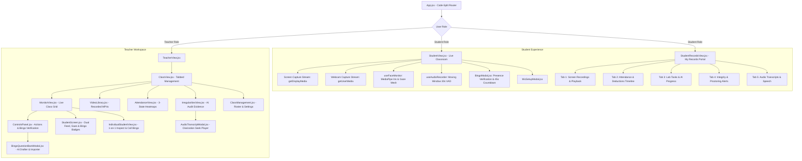

# Frontend Components

[🏠 Documentation Index](../README.md#documentation-index) | [👨‍🏫 Teacher Manual](./user-manual-teacher.md) | [🧑‍🎓 Student Manual](./user-manual-student.md) | [🛠️ Admin Manual](./user-manual-admin.md) | [📘 UI Catalog](./comprehensive-ui-controls-and-features-catalog.md)

---

The `web-app/src/components/` directory contains all the React components that make up the user interface. Below is a breakdown of the main components, component hierarchy, and navigation flows.

> [!TIP]
> For a complete, control-by-control audit of every UI button, modal, slider, and workflow, see the **[Comprehensive UI Controls & Features Catalog](./comprehensive-ui-controls-and-features-catalog.md)**.
> For user-facing guides, see the **[Teacher User Manual](./user-manual-teacher.md)** and **[Student User Manual](./user-manual-student.md)**.

---

## 📑 Table of Contents

1. [Component Hierarchy & State Flow Diagram](#-component-hierarchy--state-flow-diagram)
2. [Class & User Management](#class--user-management)
3. [Real-time & Session Views](#real-time--session-views)
4. [Data & Analysis Views](#data--analysis-views)
5. [Communication](#communication)
6. [Reusable & Utility Components](#reusable--utility-components)

---

## 🧭 Component Hierarchy & State Flow Diagram

---

*   **`App.jsx`**: The root application component configured with **Dynamic Route Code-Splitting** (`React.lazy` and `Suspense`) via a custom `lazyWithRetry` wrapper. This reduces the initial bundle size by over 99% (from 2.5MB down to ~3–17KB for initial view chunks) and features auto-retry for seamless client-side recovery across production deployments.
*   **`Layout.jsx`**: Provides the main application structure, including the header with application title, logo, notification center, profile dropdown (with user email, role badge, Change Password trigger, and logout), and the main content area.
*   **`ChangePasswordModal.jsx` (Modal in `App.jsx`)**: A lightweight dialog allowing authenticated users to securely update their Firebase Auth password with confirmation and validation, without occupying header real estate.
*   **`AuthComponent.jsx`**: Handles user authentication, displaying login and logout interfaces.
*   **`TeacherView.jsx`**: The main dashboard for teachers, showing a list of their classes and high-level statistics like storage and AI usage.
*   **`StudentView.jsx`**: The main view for students. Supports independent dual-channel streaming for screen sharing (`getDisplayMedia`) and webcam streaming (`getUserMedia`), multi-camera enumeration with automatic camera picker dropdown when multiple webcams are available, live camera hot-plugging (`devicechange`), on-device MediaPipe face and gaze tracking via `useFaceMonitor.js`, 1-click Neutral Baseline Calibration (`🎯 Calibrate View` / `🎯 Calibrated`), manual AI preloading (`📥 Preload AI (~3.8 MB)`) with live progress HUD, and schedule-driven automatic class association. For more details on its internal logic, see the [Student View Logic Documentation](./student-view-logic.md).
*   **`StudentRecordsView.jsx`**: The self-service records portal for students (`/student/records`). Allows students to inspect their historical classroom data with strict privacy isolation:
    *   **Class & Lesson Scoping**: Enforces single-class selection (no mixing across classes) and provides a global **Lesson / Date** dropdown selector (including `🌐 All Lessons / Full Semester`) that filters records across all tabs simultaneously using `isRecordInLesson` matching.
    *   **Responsive Tab Bar (No Horizontal Scroll)**: Flex-wrapping navigation tab bar with compact badges and active scope banner displaying current lesson bounds.
    *   **Dynamic KPI Metric Cards**: Displays 6 high-level metric summaries (Class Attendance %, Screen Share Duration, AI Working Duration, Recorded Videos, Lab Tasks Completed, and Proctoring Incident Flags) dynamically scoped to the selected lesson or full semester.
    *   **Tab 1 (Screen Recordings)**: Itemized list of student session recordings (`videoJobs`), recording timestamps, duration, file size, status badges, inline video playback modal (`VideoPlayerModal`), and direct MP4 download links generated via the `getStudentVideoPlaybackUrl` Cloud Function. Screen recordings occurring during instructor-defined **Exam & Test Periods** (`examPeriods`) or flagged with `isExam: true` (or custom metadata `resource.metadata.isExam == 'true'`) are strictly withheld from students to prevent test question extraction, with dedicated assessment integrity notice banners and zero-trust backend enforcement. If backend callable denies access, direct GCS fallback is aborted immediately. Enforces class recording policies (`always_enabled`, `disabled`, `delayed_release`).
    *   **Tab 2 (Attendance & Lessons)**: Teacher-grade attendance analytics featuring the 3 core ratios:
        1. **Attendance Presence Ratio**: Minute-by-minute presence bitmask (`attendedMinutes / duration * 100%`) with status badge (`🟢 Present`, `🟡 Partial / Late`, `🔴 Absent`).
        2. **Screen Sharing Ratio**: Active screen broadcast time (`sharedScreenMinutes / duration * 100%`) with sharing health badge (`🟢 High Sharing`, `🟡 Moderate`, `🔴 Low Sharing`).
        3. **AI Working Minutes Ratio**: Multimodal AI-assessed active lab task engagement (`workingMinutes / duration * 100%`) with focus badge (`🟢 High Focus`, `🟡 Moderate Focus`, `🔴 Low Focus / Idle`).
        Includes minute-by-minute visual grid (`✓` present / `✗` absent), session feedback, and dual inspection modes: **📅 Per Lesson Breakdown** and **📊 All Lessons Summary** comparison table with one-click **"🔍 Inspect Lesson"** jump actions.
    *   **Tab 3 (Tasks & AI Progress)**: Detailed breakdown of lab milestone completions (`performanceMetrics`), class progress achievements (`progress`), and AI job evaluations (`aiJobs`), scoped to the selected lesson.
    *   **Tab 4 (Integrity & Alerts)**: Transparency log of invigilation incidents and AI proctoring flags (`irregularities`), complete with violation category, severity pills (`critical`, `high`, `medium`, `low`), AI confidence rating, evidence transcript quotes, and rationale, scoped to the selected lesson. For exam sessions, raw evidence telemetry and snapshot media paths are automatically shielded to maintain assessment integrity.
    *   **Tab 5 (Audio Transcripts)**: Speech segments captured during sessions (`audio`), complete with language badges (`Cantonese`, `Mandarin`, `English`), timestamps, audio clip duration, speech-to-text transcripts, and an inline HTML5 `<audio controls>` player with on-demand audio URL fetching. During exam sessions or within scheduled `examPeriods`, speech transcripts and audio recordings are withheld behind an assessment confidentiality banner (`🔒 Assessment Confidentiality: Exam Audio Restricted`).
*   **`useFaceMonitor.js` (Hook in `StudentView.jsx`)**: An optimized custom hook managing on-device MediaPipe `FaceLandmarker` with Iris tracking (landmarks 468–477) powered by `faceLandmarker.worker.js` and `webAiModelLoader.js`. Computes head orientation (Yaw, Pitch, Roll), depth-from-iris metric distance (cm), Eye Aspect Ratio (EAR for sleeping/drowsiness detection), and Mouth Aspect Ratio (MAR for talking/whispering detection) in real time with zero cloud quota consumption. Features persistent Cache API caching (`webai-models-v1`), hardware frame synchronization (`requestVideoFrameCallback`), byte-accurate loading percentage telemetry, teacher remote preload trigger handling (`preloadClientAi`), and automatic fallback to Cloud Gemini Vision (`analyzeFaceFallback`) when hardware acceleration is unavailable.
*   **`useClientLiteRTWhisper.js` (Hook in `StudentView.jsx`)**: Custom hook executing client-side Speech-to-Text (STT) via **Google LiteRT.js (`@litertjs/core`)** in background worker `litertWhisper.worker.js`. Supports mixed Cantonese, Mandarin, and English code-switching with decoder prompt biasing, writes spoken phrases directly to `classes/{classId}/status/{studentUid}` for live subtitle streaming, and saves permanent audio transcripts to `classes/{classId}/audio`.
*   **`useClientLiteRTGemma.js` (Hook in `StudentView.jsx`)**: Custom hook executing on-device **Gemma LLM intent analysis** via Google LiteRT runtime (`litertGemma.worker.js`). Evaluates spoken transcripts for academic collusion (`COLLUSION_EXAM`), voice assistant dictation (`EXTERNAL_AI_ASSIST`), and unauthorized whispering (`UNAUTHORIZED_TALK`), while distinguishing legitimate technical questions. Automatically requests persistent browser storage (`navigator.storage.persist()`), persists downloaded model weights in Cache Storage (`litert-gemma-cache-v1`), logs verified violations to `classes/{classId}/irregularities` with `source: 'on_device_gemma'`, and runs dual local + cloud fallback transcript reasoning.
*   **`faceLandmarker.worker.js`, `litertWhisper.worker.js`, `litertGemma.worker.js` (Workers in `web-app/src/workers/`)**: Dedicated background Web Worker threads for MediaPipe vision, LiteRT Whisper STT, and LiteRT Gemma LLM execution, offloading all compute from the main React render loop.
*   **`webAiModelLoader.js` / `webAiLiteRTLoader.js` / `gemmaLiteRTLoader.js` (Utilities)**: Edge AI utilities managing `CacheStorage` persistence (`webai-models-v1`, `webai-litert-whisper-v1`, `litert-gemma-cache-v1`), byte-level streamed progress calculations ($0\% \to 100\%$), and WebGPU/WASM hardware delegate resolution.
*   **`ClassView.jsx`**: The primary view for managing a single class, containing a tabbed interface to navigate between different management functionalities like monitoring, video library, and attendance.

## Class & User Management

*   **`ClassManagement.jsx`**: A comprehensive component that allows teachers to create new classes and manage existing ones. Features configurable **AI Monitoring Modes** (`⚡ Client AI + Fallback`, `💻 Client AI Only`, `☁️ Cloud AI Only`, `🚫 AI Disabled`), customizable gaze sensitivity thresholds (Yaw/Pitch angles and debounce duration), configurable **Bingo Active Presence Retry Grace Delay** (`1m`, `2m`, `3m default`, `5m`, `10m`) controlling the schedule delay before Google Cloud Tasks dispatches a Strike 2 follow-up verification, configurable **Default Capture Mode** (`dual`, `screen`, `webcam`), dedicated **Exam & Test Periods (Restricted from Students)** manager (`examPeriods`) allowing instructors to define specific date and time ranges for 1–2 semester exams where recordings are completely withheld from students while remaining 100% accessible to instructors for auditing, configurable **Student Screen Recording Access Policy** (`always_enabled`, `disabled`, `delayed_release`), one-click **Roster Import (CSV/TXT)** and **Roster Export (CSV)** for both student rosters and co-teaching teams, plus sub-components for handling class schedules and custom student metadata.
*   **`ScheduleManager.jsx`**: A sub-component of `ClassManagement.jsx` for setting up the class schedule, including start/end dates, time zones, and recurring time slots.
*   **`CustomPropertiesManager.jsx`**: A sub-component of `ClassManagement.jsx` for managing class-wide custom metadata and student-specific custom properties. Features one-click **CSV Template Download / Export Existing Properties**, asynchronous **CSV Property Upload** with real-time job processing badges (`completed`, `processing`, `failed`), and custom key-value field editors.
*   **`PromptManagement.jsx`**: A view for creating, editing, and managing AI prompts. It supports different access levels (private, shared, public) and categories (for images or videos).

## Real-time & Session Views

*   **`useClassSchedule.js` (Smart Schedule & Lesson Detection Hook)**: Manages class calendar time slots and performs **Smart Default Lesson Resolution** (`getSmartDefaultLesson`) across multi-slot daily schedules (e.g. classes with both morning `09:30 - 11:30` and afternoon `14:30 - 16:30` blocks):
    1. **Live Lesson Check**: If a lesson is currently ongoing (`now >= lesson.start && now <= lesson.end`), it is immediately selected.
    2. **Completed Video Job Detection**: Queries `videoJobs` for completed student compilations matching a scheduled slot's start time in the past 24 hours. If found, prioritizes that slot over empty later slots.
    3. **Student Heartbeat & Upload Activity**: Queries `classes/{classId}/status` for student heartbeat and screenshot upload timestamps. Matches timestamps within lesson windows (with ±15 min grace period) to detect where real classroom attendance took place.
    4. **Graceful Chronological Fallback**: Falls back to the latest completed lesson or the last defined lesson of the day.
    *This eliminates the "missing data" illusion where opening a class in the afternoon/evening defaulted to an empty second slot rather than the actual morning session containing recordings.*

*   **`MonitorView.jsx`**: Provides a real-time grid view of all students during a live session. Features:
    *   **Single-Stream Listener Architecture**: Subscribes to `classes/{classId}/status` with dual-channel URL resolution and atomic state updates to prevent race conditions.
    *   **High-Concurrency Image Resolution Pipeline**:
        *   **Bounded Parallel Resolution Pool**: Replaces sequential loops with a concurrent chunking pool (`CONCURRENCY = 10` using `Promise.all`), slashing 60–100 student screenshot resolutions from 10–20+ seconds down to <250ms and preventing snapshot effect cancellation thrashing.
        *   **In-Flight URL Promise Deduplication (`inFlightUrlPromisesRef`)**: Coalesces concurrent requests for identical Cloud Storage paths into a single shared Promise, preventing redundant HTTP lookups across dual channels and rapid heartbeat snapshots.
        *   **Clock-Drift Negative Differential Tolerance**: Accommodates student client clocks running up to 60 seconds ahead of the teacher's machine (`secondsDiff >= -60 && secondsDiff <= freshnessWindow`), preventing fresh screenshots from being discarded due to clock skew.
        *   **Decoupled AI Analysis Lifecycle**: Isolates live image URL resolution from per-image Gemini checks, ensuring prompt typing or AI parameter changes never abort in-flight student screen rendering.
    *   **Offline Screen & Webcam Persistence**: Resolves `latestScreenPath` and `latestWebcamPath` through Cloud Storage for all enrolled students who uploaded data, even after they disconnect or close their browsers. Teachers can review the entire class's last-known screens post-session without turning the grid into blank grey boxes.
    *   **Quota-Safe AI Analysis Gating**: Real-time per-image Gemini analysis (`analyzeImage`) is strictly decoupled from screen rendering, running only when students are actively streaming (`isActivelySharing`), preventing runaway cloud API calls on static offline screens.
    *   **Zero-Space Compliance Filter Dropdown**: Real-time filtering by issue category (`👥 All Students`, `⚠️ Problems`, `📷 Missing Cam`, `🎙️ Missing Mic`, `🖥️ Not Sharing`, `🚨 AI Alerts`) with dynamic student counts.
    *   **Inline Targeted Nudge Button**: One-click broadcast trigger (`📢 Nudge (N)`) targeting only currently filtered non-compliant students with pre-formatted reminder messages.
    *   **Quick CSV Audit Export**: Instant one-click export (`📥 Export CSV`) capturing the currently filtered student compliance state, detected irregularities, stream flags, and gaze vector data into a timestamped CSV file.
    *   **Space-Optimized Channel Selector**: Compact dropdown for switching between `🔲 Dual View`, `🖥️ Screen`, and `📷 Webcam`.
    *   **Live Exam Security Mode**: Integrated with `ControlsPanel.jsx` and Firestore `classes/{classId}`. When Exam Mode is active, renders a prominent **PROCTORED EXAM MODE ACTIVE** banner above the student grid, stamps all recorded video jobs with `isExam: true`, and propagates confidentiality rules to all connected students.
    *   **Class Broadcast Channel**: Optimized Firestore write channel (`classes/{classId}/messages`) with pre-defined message templates.
*   **`ControlsPanel.jsx`**: The consolidated sidebar control center for teachers during live monitoring. Reorganized in a logical top-down hierarchy:
  1. **🎬 Session & Stream**: Capture start/stop, stream pause/resume, responsive segmented button groups for fast channel selection (`🖥️+📷 Dual`, `🖥️ Screen`, `📷 Webcam`), audio recording/muted toggling, live **Exam Session Protection** toggle (`🔒 Exam Mode: ACTIVE` / `📝 Exam Mode: OFF`) to instantly lock student access to recorded test questions, and compact interval/resolution grid.
  2. **📢 Class Broadcast**: Predefined template selector with instant send.
  3. **👁️ AI & Invigilation**: Real-time mode indicators, gaze sensitivity summary, **Live AI & Invigilation Suite Configuration Modal** (Tab 1: Vision/Gaze, Tab 2: Voice & Speech with Prompt Library dropdown, category filters, and `{{transcript}}` placeholder chips, Tab 3: Cloud Audio Recording & Diarization), class-wide **"⚡ Preload AI for All Students"** broadcast trigger, and Cloud Gemini Multimodal Analysis controls.
  4. **👥 Attendance & Status**: 1-click "Not Sharing" student counter/modal and Attendance CSV export.
  5. **🎯 Bingo Presence Verification**: Dedicated active presence and attention verification suite:
      * **3 FinOps Mode Selector**: Toggle between **Predefined Question Bank** ($0.00 / 0 AI tokens), **Teacher Screen Broadcast** (1 shared Gemini call per lecture frame, ~$0.00015 for entire class), and **Student Individual Screens** (targeted individual screenshot evaluation).
      * **"🎯 Call Class Bingo"**: 1-click cohort broadcast trigger that dispatches interactive verification challenges to all connected students with live countdown and in-flight spinner.
      * **"Strike 2 Grace Delay" Selector**: Real-time dropdown (`1 min`, `2 mins`, `3 mins Default`, `5 mins`) persisting directly to Firestore `classes/{classId}.bingoRetryDelayMinutes` without leaving the live monitoring dashboard.
      * **"📚 Question Bank"**: Launches `BingoQuestionBankModal.jsx` with active question count badge.
  6. **📊 Storage & AI Quotas**: Space-efficient dual progress bars for storage usage and class AI budget.
*   **`StudentView.jsx`**: The student interface offering a streamlined pre-session **Setup Hero Card** with readiness pills, a hardware-resilient **3-Step Exam Readiness Wizard** (`ExamReadinessWizard.jsx` with mic and webcam skip fallbacks), silent AI preloading, and a clean minimal active top bar during live streaming.
    *   **Automated Bingo Presence Verification**: Real-time subscription to `myProperties.activeBingo`. When an active challenge is detected, synthesizes a dual-tone Web Audio attention chime (659Hz $\to$ 880Hz), dispatches a system desktop notification, and mounts `<BingoModal>`.
    *   **Exam Mode Protections**: When a live exam is active or the current time overlaps an instructor-scheduled `examPeriods` window:
        *   Enforces full-screen sharing (`requireFullScreenOnly: true`).
        *   Displays a persistent top security banner: `🔒 Official Examination in Progress — Proctored Session`.
        *   Restricts generated screencasts, audio transcripts, and irregularity evidence from being shared in the student's self-service portal.
*   **`BingoModal.jsx`**: The student-facing interactive verification dialog mounted automatically during active Bingo checks:
    *   **Audio Chime & Attention Cue**: Synthesizes a non-blocking dual-frequency Web Audio tone (E5 659Hz $\to$ A5 880Hz) to immediately alert students who may have minimized the window or are reading secondary materials.
    *   **45-Second Timer Bar**: Smooth animated CSS progress bar counting down from 45 seconds, shifting into an urgent pulsating red state when under 10 seconds remaining.
    *   **Interactive 4-Option Multiple Choice Grid**: Displays randomized response options. One-click selection immediately locks the UI, computes response time, detects browser window focus state (`document.hasFocus()`), and calls `submitBingoAnswer`.
    *   **Auto-Timeout Submission**: If the 45-second timer expires with no selection, automatically invokes `submitBingoAnswer` with `selectedIndex: null` to register a timeout and initiate Strike 1 grace retry or Strike 2 attendance penalty.
    *   **Live Feedback States**: Displays instantaneous visual status upon submission (`Verified Present!`, `Incorrect (Presence Verified)`, or `Time Expired`).
*   **`BingoQuestionBankModal.jsx`**: The instructor's comprehensive question bank management suite (`ControlsPanel.jsx` $\to$ `📚 Question Bank`):
    *   **Tab 1: AI Question Drafter**: Integrates `gemini-3.5-flash-lite` (`generateQuestionBankAi`) with temperature 0.2 and structured JSON schema to automatically draft 5 topical multiple-choice questions from lecture concepts or course outlines. Features instant question review, option editing, and one-click batch appending to the class question bank.
    *   **Tab 2: Batch Importer (Aiken & JSON)**: Robust text parser supporting standard educational Aiken format (`Question text... A) ... B) ... C) ... D) ... ANSWER: B`) with inline syntax checking, alongside raw JSON array imports.
    *   **Tab 3: Questions Pool & Manual Editor**: Tabular review of all active questions in `classes/{classId}.questionBank` with correct answer highlight badges, topic tags, explanations, and individual delete controls.
*   **`StudentRecordsView.jsx`**: The student learning portal and attendance report view:
    *   **Strict Class Scoping (No Mixing Up)**: Enforces individual class selection (`selectedClassId`) with no cross-class data mixing and no generic "all" classes option.
    *   **Attendance Deductions Alert Card**: Prominently displayed whenever `deductedMinutes > 0`. Outlines total minutes deducted, lists each voided interval (`startMinute` – `endMinute`), and explains the regulatory policy justification (`"Failed consecutive presence checks (Bingo strike 1 & 2 timed out)"`).
    *   **Minute-by-Minute 3-State Timeline**: Interactive visual grid matching the teacher view:
        *   `#2ECC71` (Green): Active and screen verified (`1`).
        *   `#FADBD8` (Red): Inactive / not sharing screen (`0`).
        *   `#F39C12` (Striped Orange with `🎯` badge): Voided attendance due to unacknowledged presence checks (`2`).
    *   **Teacher-Grade Attendance System (3 Core Ratios)**:
        1. **Attendance Presence Ratio**: Minute-by-minute presence telemetry (`attendedMinutes / duration * 100%`) with present/partial/absent status badge. Deducted minutes are strictly excluded from `attendedMinutes`.
        2. **Screen Sharing Ratio**: Desktop/window broadcast time (`sharedScreenMinutes / duration * 100%`) with high/moderate/low badges.
        3. **AI Working Minutes Ratio**: AI-estimated working duration (`workingMinutes / duration * 100%`) from multimodal task engagement analysis.
    *   **Dual View Modes**: Seamless toggle between **Per Lesson Breakdown** (hero stat cards, minute grid, deduction breakdown, AI & teacher summaries/feedback) and **All Lessons Summary** (cumulative class KPIs, comprehensive comparison table, and instant lesson inspection).
    *   **Zero-Trust Assessment Integrity**: Protects assessment integrity by strictly withholding recordings recorded during defined exam periods from students with prominent security banners.
*   **`StudentScreen.jsx`**: A component used within `MonitorView.jsx` to display a single student's status, supporting split-dual viewports (side-by-side feeds) or single channel views with channel badges (🖥️ / 📷), offline frame indicator pills (`🖥️ Screen (Offline)` / `📷 Webcam (Offline)`), hardware absence indicators (📷🚫, 🎙️🚫), live gaze orientation vectors, AI loading progress indicators (`⏳ 65%`), live spoken transcript subtitles with language tag badges (`💬 粵`, `💬 普`, `💬 EN`), Gemma violation alert badges (`🚨 Collusion (Gemma)`), multi-signal face status badges (`normal`, `looking_away`, `eyes_closed`, `talking`, `no_face`, `multiple_faces`, `cloud_fallback`), and **Live Bingo Status Badges** in the top-right corner (`🎯 Pending`, `🎯✓ Verified`, `🎯? Inattentive`, `🎯✕ Timed Out`). Configured with modern image loading attributes (`loading="eager"`, `decoding="async"`, and `fetchPriority="high"`) for non-blocking asynchronous decoding and instantaneous render.
*   **`useAudioRecorder.js` (Hook in `StudentView.jsx`)**: Handles continuous audio capture with sliding window (30s window, 15s stride) segmentation, Web Audio RMS silence suppression (>80% cost savings), and upload synchronization to Firebase Storage and Firestore. Fully decoupled from Vision AI monitoring modes, enabling reliable recording whenever the teacher toggles audio capture on, with automatic Diarization permission gating (`isCloudDiarizationAllowed`).
*   **`IndividualStudentView.jsx`**: A modal overlay for inspecting an individual student's live streams in high detail with:
    *   **1-on-1 "🎯 Call Bingo" Verification Action**: Dedicated button in the top action bar allowing the teacher to dispatch a targeted presence challenge directly to this specific student, with real-time status feedback.
    *   **Multi-Tab Feed Switcher**: `Dual View`, `🖥️ Screen Feed`, and `📷 Webcam Feed`.
    *   **Space-Efficient Voice Recording Bar**: Low-profile horizontal audio control bar (~38px height) with inline HTML5 player, live RMS telemetry, subtitle transcript snippets, and collapsible recording clip history drawer (`📋 Clips (N) ▾`).
    *   **Direct Quick Nudge Chips**: One-click intervention buttons (`🖥️ Screen`, `📷 Cam`, `🎙️ Mic`, `👁️ Face Screen`) that immediately dispatch targeted compliance notices to the student.
    *   **1-to-1 WebRTC Live Peek & Talkback**: Real-time 30 FPS peer-to-peer video streaming and two-way microphone audio talkback without loading cloud storage.
    *   **Private Direct Messaging**: Instant teacher-to-student text channel.
*   **`useTeacherScreenBroadcast.js` / `TeacherScreenBroadcastModal.jsx` (Teacher Screen Sharing)**: Enables teachers to broadcast their screen live in real time to all students in the class using the **Pure Frame Classroom Broadcaster** architecture.
    *   **Classroom Frame Broadcaster Architecture**: Built to completely avoid the browser CPU/memory exhaustion and 6-peer limits of 1-to-N WebRTC star-mesh networks in typical classes of 20–50+ students. Captures screen frames into an offscreen canvas at 1.5s intervals, applies 32x18 thumbnail pixel delta diffing (skipping emissions if visually static unless a 5s heartbeat expires), compresses clamped 720p frames at 0.65 JPEG quality (~35–65 KB, <8% of Firestore doc limit), and publishes directly to `classes/{classId}/screenBroadcast/liveFrame`. Keeps teacher CPU < 2% and memory flat regardless of student viewer count.
    *   **Live Preview & Control Modal**: Displays active screen preview, mode badge (`🌐 Classroom Stream (50+ Students)`), real-time viewer count, published frame counter, and roster of connected students.
*   **`useTeacherScreenBroadcastStudent.js` / `TeacherScreenViewerModal.jsx` (Student Screen Viewer)**: Enables students to watch the teacher's live screen broadcast seamlessly without interfering with background invigilation captures.
    *   **Real-time Frame Receiver**: Subscribes directly to `classes/{classId}/screenBroadcast/liveFrame` doc snapshot and registers student presence in `screenBroadcastViewers`.
    *   **4 Flexible Viewing Modes**: Floating Picture-in-Picture (`🪟 Float`), Standard Docked View with backdrop (`🔲 Standard`), Fullscreen Presentation (`⛶ Max`), and floating minimized pill (`➖ Min`).
    *   **Hardware-Safe Non-Blocking Playback**: Runs independently from student screen/webcam proctoring streams, with connection state indicators and automatic clean unsubscribe on close.
*   **`SessionReviewView.jsx`**: A view for reviewing a student's completed session, including their screen recording and any detected irregularities.
*   **`PlaybackView.jsx`**: A component for replaying a student's session as a sequence of screenshots with channel filtering (`All Channels`, `🖥️ Screen Only`, `📷 Webcam Only`), custom timeline scrubber, and channel-targeted video compilation.
*   **`TimelineSlider.jsx`**: A custom slider used in `PlaybackView.jsx` to navigate the screenshot timeline and show buffered content.

## Data & Analysis Views

*   **`LectureRecordingsView.jsx`**: The dedicated lecture playback and YouTube publishing studio for instructors (`/class/:classId?tab=video&sub=recordings`). Features:
    *   **Native HTML5 Player with Closed Captions**: Renders the clean high-definition lecture video with multi-language `<track>` elements in Original, English (`en`), Traditional Chinese (`zh-Hant`), Simplified Chinese (`zh-Hans`), and Japanese (`ja`). Includes automatic Matroska EBML seek healing for WebM duration recovery.
    *   **Smart Multi-Clip Merge Detection**: Scans class recordings for fragmented clips from the same session or day and displays a prominent 1-click notification banner:
        `💡 N separate recording clips detected from <date> (Total: X mins). [🔗 Merge into Full Lecture]`
    *   **Custom Selection Merge Mode**: Allows teachers to click **"🔗 Custom Merge"**, select arbitrary recording clips using card checkboxes, and concatenate them into a unified master lecture on demand.
    *   **Visual Recording Badges**: Clearly distinguishes master combined recordings (`🌟 Combined Full Lecture`) from individual source fragments (`✂️ Part 1`, `✂️ Part 2 (Merged into master lecture)`).
    *   **YouTube Creator Studio Export**: One-click download of the complete YouTube publish package (`.zip` containing the video, multi-language `.srt` files, and `youtube_metadata.txt`), with instant copy buttons for YouTube Title and timestamped Chapter Description.
*   **`useLectureRecorder.js` (Custom Hook)**: Client-side recording engine executing dual-stream ingestion (hardware-locked screen + microphone Web Audio mixing into WebM VP8/VP9 and parallel pure Opus audio). Handles chunking, resumable Cloud Storage uploads, session metadata stamping with fuzzy `sessionGroupId` and `broadcastSessionId`, and provides `mergeSessionRecordings` to invoke the backend `mergeLectureRecordings` Cloud Function.
*   **`sessionGrouping.js` (Utility)**: Intelligent timetable slot matching and clustering engine. Evaluates recording timestamps against class schedule slots with generous fuzzy margins:
    *   **Early Start Margin**: Up to 45 minutes before scheduled start time.
    *   **Overrun Margin**: Up to 60 minutes after scheduled end time.
    *   **Inactivity Gap**: Clips recorded within 30 minutes of a prior clip are clustered into the same session.
    *   **Broadcast Session Anchoring**: Groups all recordings generated during a synchronized screen broadcast under `bcast_${broadcastSessionId}`.
*   **`VideoLibrary.jsx`**: A gallery of all recorded student sessions, with features for filtering, playback, download, and requesting AI analysis or ZIP archives.
*   **`VideoTable.jsx`**: A table used within `VideoLibrary.jsx` to display the list of videos with details like duration, size, and creation date.
*   **`DataManagementView.jsx`**: Allows teachers to manage class data, including downloading zipped videos and analysis results.
*   **`IrregularitiesView.jsx`**: Displays a list of all irregularities detected by the AI during a class session.
*   **`ProgressView.jsx`**: Shows reports on student progress generated by the AI.
*   **`PerformanceAnalyticsView.jsx`**: Provides analytics and visualizations of student performance data. Features:
  * **Milestone Duration & Bottleneck Analytics**: Visualizes student progress across AI-detected lab coursework milestones with duration charts and completion funnels.
  * **Sortable & Color-Coded Student Milestone Matrix**: Comprehensive tabular matrix tracking individual student completion times per milestone, total lab minutes, and mastery status.
    * **Interactive Sorting**: Clickable column headers (`Student`, each dynamic milestone column, `Total Lab Time`, `Status`) with visual direction indicators (`▲` / `▼` / `↕`) and smart nulls-last sorting.
    * **Duration Heatmap Tinting**: High-contrast, accessibility-tested cell badges highlighting on-track pace (`< 20m`, emerald/green), moderate duration (`20–40m`, amber), bottleneck pace (`> 40m` or outlier `> 1.5x` class average, ruby/red), and incomplete (`—`, slate).
  * **Dual CSV Export Capabilities**: Includes a top-level **`📥 Export CSV`** button for the full class milestone report, plus a dedicated **`📥 Export Matrix CSV ({count})`** button directly in the table header to export the actively sorted and filtered student cohort.
*   **`AttendanceView.jsx`**: Provides a comprehensive view of student attendance and AI analysis for a selected lesson. It displays a unified table showing screen share attendance (total minutes, percentage, and a per-minute heatmap), alongside AI-estimated working minutes and percentage. Features:
    *   **3-State Per-Minute Heatmap Grid**:
        *   `#2ECC71` (Green): Screen active and verified present (`1`).
        *   `#FADBD8` (Red): Offline / not sharing screen (`0`).
        *   `#F39C12` (Striped Orange with `🎯` icon): Presence voided due to consecutive missed/timed-out Bingo verification challenges (`2`).
    *   **Strict Verified Attendance Math**: Screen sharing minutes and attendance ratios strictly aggregate active verified slots (`val === 1`). Deducted/voided slots (`val === 2`) are excluded from attended time.
    *   **Deducted Minutes Column**: Dedicated table column displaying docked time (`deductedMinutes`), providing immediate transparency into who lost attendance due to AFK or unacknowledged presence challenges.
    *   **Live & Pre-Calculated Sync**: On initial load, fetches stored data from `classes/{classId}/lessons/{lessonId}`. A **"Calculate Live Attendance"** button triggers the backend Cloud Function `getAttendanceData` to re-query recent screenshots and `attendanceAdjustments` for live synchronization.
    *   **Export Options**: Exports the full multi-metric roster including attended minutes, deducted minutes, working time, and individual per-minute status codes directly to CSV. Includes student-specific AI summary modal.
*   **`VideoAnalysisJobs.jsx`**: Master dashboard for tracking, retrying, and synthesizing video analysis jobs.
  * Displays master analysis jobs with real-time status (`pending`, `processing`, `completed`, `failed`), timestamps, video counts, and prompt snippets.
  * Provides in-place retry (`Retry Failed Jobs`) with historical audit tracking.
  * **2-Stage Lab Task Synthesis & Dynamic Re-run**: Includes the **"✨ Generate Lab Task Prompt"** action button. Selecting any completed job aggregates all student video observations and invokes Gemini to discover specific lab coursework tasks, cloud platforms, rubrics, and technical blockers. An interactive modal allows teachers to review/edit the synthesized Markdown prompt, select the target Gemini model, choose target video scope, save the prompt to the Prompt Library, and immediately launch a 2nd-stage high-accuracy re-analysis job.
  * **Multi-Stage Animated Progress Stepper**: Real-time 3-stage progress card with an animated gradient progress bar and status cards indicating Stage 1 (`📂 Aggregating summaries...`), Stage 2 (`🧠 Synthesizing tasks with Gemini 3.8 Flash...`), and Stage 3 (`📐 Validating markdown rubric & constraints...`) before auto-transitioning to the prompt review modal.
  * **Multi-Tier Export Capabilities**:
    * **Level 1 Batch Log**: Export full job history to CSV (`Export Jobs Log (CSV)`).
    * **Level 2 Full Batch Export**: Export all student findings to CSV (`📥 Export Findings (CSV)`) or JSON (`📦 Export Batch (JSON)`).
    * **Level 2 Filtered Export**: Export only actively searched/filtered students via header toolbar button (`📥 Export CSV ({count})`).
  * **Full Prompt Inspector**: Streamlined prompt preview with 3-line clamp and dedicated **"🔍 Modal"** prompt viewer (`PromptViewModal.jsx`) with 1-click clipboard copying. Redundant Level 1 action buttons and inline accordion were eliminated for a clean, distraction-free interface where whole-row clicks navigate directly to Level 2.
*   **`VideoAnalysisJobsTable.jsx`**: Modular table sub-component for `VideoAnalysisJobs.jsx` rendering master jobs, model badge, timestamps, video count, status badges, 3-line prompt snippet with modal viewer link, and whole-row click selection to navigate to Level 2 details.
*   **`AiJobsTable.jsx`**: A table used within `VideoAnalysisJobs.jsx` to display individual AI jobs with status, model used, token metrics, multi-attribute media path resolution, and computed cost ($ USD) via `formatAiCost`. Features a dedicated **Actions** column with 1-click **`CSV`**, **`JSON`**, and **`View`** buttons for direct inspection and export per student.
*   **`PromptViewModal.jsx`**: Dedicated prompt viewer modal displaying the full prompt text, job ID, model name, and timestamp, featuring 1-click clipboard copying with visual confirmation.
*   **`JobResultModal.jsx`**: Modal overlay for inspecting completed AI jobs with multi-format downloads (**`📥 CSV`**, **`📥 JSON`**, **`📝 Markdown`**, and **`📄 Text Report`**), one-click clipboard copying, and failed job error traceback inspector.
*   **`exportUtils.js` (Utility)**: Centralized browser export engine implementing RFC 4180 CSV serialization with UTF-8 BOM (`\uFEFF`) for Microsoft Excel compatibility, formatted JSON blob generation, and plain-text file downloads.
*   **`AiCostReportView.jsx`**: An interactive financial and token audit dashboard for teachers and administrators. Features:
  * **KPI Metric Cards**: Total spend vs class budget limit, token breakdown (input vs output), total job volume with reliability percentages, and unit economics (cost per job).
  * **Breakdown by Gemini Model**: Dynamic visual distribution bars for models (`gemini-3.5-flash-lite`, `gemini-3.7-flash`, `gemini-3.7-pro`, `gemini-3.5-transcribe`).
  * **Breakdown by Job Category**: Screenshot analysis, multi-student grid analysis, video inspection, audio STT/diarization, and cloud gaze fallback.
  * **Student AI Consumption Matrix**: Per-student audit table displaying job counts, input/output tokens, total spend, and percentage share of class budget.
  * **Filter Toolbar & CSV Export**: Real-time filtering by student, job category, model, and date range, with RFC 4180 CSV export.
*   **`aiCostAggregator.js` (Utility)**: A pure analytics utility aggregating raw `aiJobs` documents into multi-dimensional summaries, timeline series, and student cost shares.
*   **`aiCostCsvExporter.js` (Utility)**: Converts aggregated AI financial data and itemized job records into formatted CSV reports with automatic browser downloads.
*   **`studentCompliance.js` (Utility)**: Pure domain utility evaluating real-time student stream states, hardware sharing flags, and gaze orientation against class rules (`evaluateStudentCompliance`, `getComplianceSummary`, `filterStudentsByCompliance`, `getNudgeMessageForFilter`, `exportComplianceResultsToCsv`).
*   **`attendanceUtils.js` (Utility)**: Handles lesson duration math, per-minute screenshot bucket mapping, and attendance percentage aggregations for heatmaps.

## Live Subtitles & Multilingual Translation

*   **`useTeacherLiveSubtitles.js` (Custom Hook)**: Comprehensive audio capture and live subtitle broadcast engine for teachers. Captures microphone stream, resamples Web Audio to 16kHz mono Float32, evaluates Voice Activity Detection (VAD) RMS energy thresholds (`rms > 0.008 - 0.015`), manages 3 selectable translation modes (Mode 1: LiteRT Whisper + Chrome Nano; Mode 2: LiteRT Whisper + Cloud Function Gemini 3.5 Flash-Lite; Mode 3: Firebase AI Logic Gemini Live Multimodal WebSocket), applies 350ms debounced Firestore document updates to `classes/{classId}/liveSubtitles/current`, and commits finalized sentences with rolling history buffers. Upon live session termination, automatically records an audit log to Firestore root collection `/aiJobs` (`jobType: 'liveSubtitleStream'`), updating classroom quotas and feeding institutional dashboards.
*   **`useStudentLiveSubtitles.js` (Custom Hook)**: Real-time student subtitle subscription hook. Listens to `classes/{classId}/liveSubtitles/current` via `onSnapshot`, extracts preferred language translations (`preferredLanguage -> classDefault -> 'en'`), maintains dual-line subtitle state (original spoken speech + translated output), and coordinates clean teardown when broadcasts conclude.
*   **`TeacherSubtitleControlModal.jsx` / `.css`**: Teacher-facing control dialog for lecture subtitling. Features a responsive 3-engine selection grid with visual badges (🟢 Client Model / 🟣 Server Model / 🔴 Gemini Live Stream), target language selection chips (English, Traditional Chinese, Simplified Chinese, Japanese, Korean, Spanish, French), live audio VU level indicators, and an interactive dual-line subtitle preview drawer. When Gemini Live mode is active, renders a real-time **AI Costing Telemetry HUD** displaying streaming duration, audio input tokens, subtitle output tokens, estimated USD cost, and Free Tier status.
*   **`LiveSubtitleOverlay.jsx` / `.css`**: High-performance dual-line subtitle HUD component embedded in `StudentView.jsx` and `TeacherScreenViewerModal.jsx`. Displays the teacher's original spoken phrase on top (`#94a3b8`) and translated text below in crisp contrast (`#38bdf8` / `#ffffff`). Supports both **Docked Mode** (anchored beneath the video canvas) and **Floating HUD Mode** (draggable, resizable, glassmorphic overlay with opacity adjustment).
*   **`aiLogic.js` (Utility)**: Firebase AI Logic SDK wrapper module (`firebase/ai`). Manages `GoogleAIBackend` singleton initialization, Float32-to-Int16 Linear PCM Little-Endian Base64 audio encoding (`pcmFloat32ToBase64`), and establishes bidirectional WebSocket sessions via `getLiveGenerativeModel` using official model `gemini-3.1-flash-live-preview`. Features real-time token tracking via server `usageMetadata` interception with deterministic sample counter fallbacks, and enforces defense-in-depth teacher domain authorization assertions before opening live WebSocket connections.

## Communication

*   **`MailboxView.jsx`**: A simple email client interface for viewing messages sent to the user from the system (e.g., download links for ZIP archives).
*   **`EmailDetailView.jsx`**: A view for displaying the full content of a single email.
*   **`MessagesView.jsx`**: Displays a list of notifications and messages sent to the teacher for a specific class.

## Reusable & Utility Components

*   **`Banner.jsx`**: A simple banner component for displaying dismissible messages.
*   **`DateRangeFilter.jsx`**: A reusable component for filtering data by a date and time range.
*   **`Modal.jsx`**: A generic modal component for displaying content in a dialog overlay.
*   **`VideoPlayerModal.jsx`**: A specialized modal for playing back videos.
*   **`VideoPromptSelector.jsx`**: A component that allows a user to select from a list of predefined AI prompts (with `all`, `public`, `private`, `shared` radio filters) or enter custom text.
*   **`MicSetupModal.jsx`**: Microphone selection, live RMS volume VU metering, speech verification challenge (STT), and audio playback test modal for students.
*   **`AudioTranscriptModal.jsx`**: Dialogue playback modal for teachers displaying multi-speaker turns, synchronized webcam snapshots, clickable seek buttons, and CSV/TXT transcript exports.
*   **`IncidentDossierExportModal.jsx`**: Comprehensive export modal allowing teachers to select incident periods (session-specific or custom range), choose target students, select output format (Microsoft Word `.docx`, CSV, or both), and trigger cloud compilation jobs.

---

[← Back to Documentation Index](../README.md#documentation-index)