# Cloud Functions

[🏠 Documentation Index](../README.md#documentation-index) | [👨‍🏫 Teacher Manual](./user-manual-teacher.md) | [🧑‍🎓 Student Manual](./user-manual-student.md) | [🛠️ Admin Manual](./user-manual-admin.md) | [📘 UI Catalog](./comprehensive-ui-controls-and-features-catalog.md)

---

This document provides an overview of all the backend Cloud Functions used in the AI Invigilator application. The functions are organized across 6 isolated Gen 2 runtime modules.

---

## 📑 Table of Contents

1. [Cloud Functions Architecture & Event Matrix](#-cloud-functions-architecture--event-matrix)
2. [AI Flows Module (`ai_flows`)](#functions)
3. [Auth Triggers Module (`auth_triggers`)](#auth-triggers)
4. [Media Processing Module (`media_processing`)](#media-processing)
5. [Property Processing Module (`property_processing`)](#property-processing)
6. [Scheduled Tasks Module (`scheduled_tasks`)](#scheduled-tasks)
7. [Storage Triggers Module (`storage_triggers`)](#storage-triggers)
8. [Attendance Module (`attendance`)](#attendance)

---

## ⚡ Cloud Functions Architecture & Event Matrix

```mermaid
flowchart TD
    subgraph Triggers [Event Ingestion & Triggers]
        T_Auth[Identity Platform Auth Events]
        T_Call[Direct HTTPS onCall Invocations]
        T_Sched[Cloud Scheduler Cron Jobs]
        T_Store[Cloud Storage Object Finalized / Deleted]
        T_Doc[Firestore onDocumentCreated / Deleted]
    end

    subgraph AuthModule [auth_triggers]
        T_Auth -->|beforeUserCreated| BUC[beforeusercreated: Role Provisioning & Auto-Link]
        T_Auth -->|beforeUserSignedIn| BSI[checkipaddress: CIDR & Time-Gated Login]
    end

    subgraph AIModule [ai_flows - Genkit AI Engine]
        T_Call -->|analyzeAudio| AA[Gemini 3.5 Transcribe Diarization]
        T_Call -->|analyzeFaceFallback| AFF[Gemini 3.5 Flash-Lite Gaze Estimation]
        T_Call -->|analyzeImage / analyzeAll| AI[Gemini 3.7 Flash Multimodal Analysis]
        T_Call -->|triggerBingoCheck| TBC[triggerBingoCheck: 3 FinOps Challenge Generator]
        T_Call -->|submitBingoAnswer| SBA[submitBingoAnswer: 2-Strike State Machine & Penalties]
        SBA -.->|Enqueues on Strike 1 Timeout| CT_Bingo[(Cloud Tasks Queue)]
        CT_Bingo -->|onTaskDispatched| DBR[dispatchBingoRetryTask: Strike 2 Grace Dispatcher]
        T_Call -->|generateQuestionBankAi| GQB[generateQuestionBankAi: Gemini 3.5 Flash Lite MCQ Drafter]
        T_Doc -->|videoAnalysisJobs created| PJA[processVideoAnalysisJob Flow]
    end

    subgraph MediaModule [media_processing]
        T_Call -->|getStudentVideoPlaybackUrl| GVP[getStudentVideoPlaybackUrl: Zero-Trust Exam Integrity & Signed URLs]
        T_Call -->|mergeLectureRecordings| MLR[mergeLectureRecordings: Serverless FFmpeg Stream-Copy Concat]
        T_Doc -->|videoJobs created| PVJ[processVideoJob: FFmpeg Screencast Encoding]
        T_Doc -->|zipJobs created| PZJ[processZipJob: Multi-Stream Archive]
        T_Doc -->|reportJobs created| PRJ[processReportJob: DOCX & CSV Dossier Generation]
    end

    subgraph StorageModule [storage_triggers]
        T_Store -->|Object Finalized| SOF[onObjectFinalized: Tracks Byte Usage]
        T_Doc -->|Document Deleted| ODD[onScreenshotDocDeleted / onVideoJobDocDeleted]
        ODD -->|Purges Blob from GCS| SOD[onObjectDeleted: Auto-Decrements Quotas]
        T_Doc -->|classes deleted| CAD[onClassDocDeleted: 4-Stage Cascading Purge]
    end

    subgraph SchedModule [scheduled_tasks]
        T_Sched -->|5,25,35,55 * * * *| HAC[handleAutomaticCapture: Start/Stop Streams]
        T_Sched -->|0 3 * * *| SGP[syncGeminiPricing: Google Cloud Billing Rates]
    end

    subgraph AttendModule [attendance]
        T_Call -->|getAttendanceData| GAD[Lesson Heatmap, Minute Aggregator & Bingo Deduction Math]
    end
```

---

This directory contains all the Cloud Functions related to AI-powered analysis, including image and video analysis, quota management, performance metrics aggregation, and interactive presence verification ("Bingo").

### Functions

#### Callable Functions

-   **`analyzeImage`**: A callable function restricted to users with a 'teacher' role. It triggers the `analyzeImageFlow` Genkit flow to perform AI multimodal analysis on a single image.
-   **`analyzeAllImages`**: A callable function for teachers that triggers the `analyzeAllImagesFlow` Genkit flow, which analyzes all images associated with a specific student within a given context.
-   **`analyzeFaceFallback`**: A high-efficiency callable function triggering `analyzeFaceFallbackFlow` using `gemini-3.5-flash-lite` with structured JSON output and temperature 0.1. Used for cloud-assisted face and gaze invigilation when classes operate in `hybrid` or `cloud_only` modes, or when a student browser cannot execute client-side WebGL/MediaPipe.
-   **`analyzeAudio`**: A callable function for teachers and students triggering `analyzeAudioFlow`. Supports dual input paths: (1) Audio URL path with `gemini-3.5-transcribe-preview` (resilience fallback to `gemini-3.5-flash-lite`) for multi-speaker diarization and word-level timestamps; (2) Direct transcript path for client-side Whisper/WebSpeech STT to run fast `gemini-3.5-flash-lite` proctor reasoning with tools without re-transcription. Performs conversational exam cheating detection, whisper identification, and quota-protected execution.
-   **`triggerBingoCheck`**: A callable function restricted to users with a 'teacher' role that dispatches an active presence and attention verification challenge to one or all students (automated follow-ups are dispatched asynchronously via Google Cloud Tasks `dispatchBingoRetryTask`).
    -   **Parameters**: `classId` (string), `targetStudentUid` (string: `'all'` or specific UID), `questionSource` (`'question_bank'` | `'teacher_screen'` | `'student_screen'`), `triggerType` (`'manual'` | `'scheduled'` | `'retry'`), `strikeNumber` (1 or 2, default 1), `priorBingoId` (optional string).
    -   **3 FinOps Modes**:
        1. `'question_bank'` (**Zero AI Cost / $0.00**): Samples a random or sequential question from the class's predefined question pool (`classes/{classId}.questionBank` or `classes/{classId}/classProperties/config.bingoQuestionBank`).
        2. `'teacher_screen'` (**1 Gemini call per class cohort, ~$0.00015**): Reads `classes/{classId}/screenBroadcast/liveFrame` and invokes Gemini 3.5 Flash Lite to draft an attention question testing whether students are actively watching the teacher's presentation.
        3. `'student_screen'` (**Targeted individual evaluation**): Reads the target student's `latestScreenPath` and invokes Gemini to formulate a personalized question regarding what the student is actively doing.
    -   **Payload Security**: The complete challenge (including `correctIndex`) is saved to `classes/{classId}/bingoRecords/{bingoId}`. A sanitized payload (with `correctIndex` stripped) is pushed to `studentProperties/{studentUid}.activeBingo`.
-   **`submitBingoAnswer`**: A callable function for students to submit their response to an active Bingo presence check.
    -   **Parameters**: `classId`, `bingoId`, `selectedIndex` (0–3 or null), `responseTimeSec`, `windowFocused`.
    -   **Two-Strike State Machine Logic**:
        -   **Correct Answer (`selectedIndex === correctIndex`)**: Marks `status = 'passed'`. Updates `studentProperties/{studentUid}.activeBingo = { status: 'passed' }`.
        -   **Incorrect Answer (`selectedIndex !== correctIndex` and `selectedIndex !== null`)**: Marks `status = 'failed_incorrect'`. Because the student actively interacted, physical human presence is verified; attendance is **NOT** docked.
        -   **Unanswered / Timed Out (`selectedIndex === null` or expired)**: Marks `status = 'missed_timeout'`.
            -   **Strike 1**: Physical presence unconfirmed. Reads `classes/{classId}.bingoRetryDelayMinutes` (configurable between 1 and 15 minutes, default `3` minutes). Computes exact retry schedule delay and stores `pendingRetryBingo = true`, `priorMissedBingoId = bingoId`, `retryDelayMinutes`, and `retryBingoScheduledAtMillis`. Dispatches an asynchronous Cloud Task to `dispatchBingoRetryTask` using regional task queue `locations/asia-east2/functions/dispatchBingoRetryTask`.
            -   **Strike 2**: Consecutive unacknowledged challenge. Marks student as confirmed absence/AFK. Dynamically calculates elapsed minutes between Strike 1 issuance and Strike 2 timeout (`deductedMinutes = Math.max(1, Math.round((endMillis - startMillis) / 60000))`). Creates an `attendanceAdjustments` record voiding all unverified attendance minutes between Strike 1 and Strike 2 with bitmask code `2` (absence deduction). Logs a high-severity incident to `irregularities` and clears `activeBingo`.
-   **`generateQuestionBankAi`**: A callable function for teachers that drafts a batch of 5 multiple-choice questions for the class Question Bank using `gemini-3.5-flash-lite` with structured JSON output schema.
    -   **Parameters**: `topic` (string), `count` (number, default 5).
    -   **Output**: Array of `{ id, question, options: string[4], correctIndex: 0..3, explanation }`.
-   **`cancelActiveBingo`**: A callable function restricted to users with a 'teacher' role that immediately purges and aborts all active Bingo presence challenges and pending retries across a class cohort.
    -   **Parameters**: `classId` (string).
    -   **Actions**:
        1. Queries `classes/{classId}/studentProperties` and finds all students with `activeBingo.status` in `['pending', 'active']` or `pendingRetryBingo === true`.
        2. Batches an atomic Firestore update: sets `activeBingo.status = 'cancelled'`, `activeBingo.result = 'cancelled'`, `pendingRetryBingo = false`, and records `cancelledAt: serverTimestamp()`.
        3. Queries any `bingoJobs` for `classId` with `status == 'pending'` and marks them as `'cancelled'`.
        4. Closes the Bingo modal on all connected student screens instantly without penalizing attendance or registering Strike absences.
    -   **Automatic Invocation**: Automatically called when a teacher clicks "Stop Capture" in `MonitorView` or disables the "Auto-Dispatch Bingo" switch in `ControlsPanel`. Also accessible via a manual "⏹️ Cancel" button in the teacher's controls sidebar.
-   **`processLectureSubtitles`**: A callable function for teachers to process completed lecture recordings for in-browser playback and YouTube publishing.
    -   **Configuration**:
        -   `region`: `asia-east2` (Hong Kong).
        -   `memory`: `2GiB`.
        -   `timeoutSeconds`: `540` (9 minutes).
    -   **Parameters**: `classId` (string), `sessionId` (string), `storagePath` (optional string fallback), `title` (optional string), `topic` (optional string), `targetLanguages` (array of strings, default `['en', 'zh-Hant', 'zh-Hans', 'ja']`), `preferredModel` (optional string).
    -   **Audio Prioritization & Ingestion**:
        -   Invokes `resolveEffectiveStoragePath(sessionData, storagePath)`.
        -   Automatically prioritizes the parallel pure audio stream (`audioStoragePath`: `recordings/{classId}/{sessionId}/lecture_audio.webm`, ~25 MB Opus) over the full composite video (`storagePath`: ~1.2 GB VP9).
        -   Records `transcriptionSource: 'audio_only'` (or `'video'` fallback) into Firestore.
        -   Constructs `gs://${bucket.name}/${effectiveStoragePath}` and passes it directly to Gemini via `generateWithResilience` using `gemini-3.8-flash` (or `gemini-3.5-flash-lite`).
    -   **Generation & Formatting**:
        -   Extracts verbatim speech transcript preserving technical keywords and Cantonese-English code-switching.
        -   Translates into requested target languages (`en`, `zh-Hant`, `zh-Hans`, `ja`).
        -   Extracts timestamped YouTube chapter markers (`00:00 - Introduction`).
        -   Generates WebVTT (`.vtt`, period millisecond delimiter) and SubRip (`.srt`, comma millisecond delimiter) files via integer millisecond arithmetic, preventing floating-point drift.
        -   Uploads all `.vtt` and `.srt` files to Cloud Storage at `recordings/{classId}/{sessionId}/subtitles_{lang}.vtt` and `.srt`.
    -   **Output & State Persistence**:
        -   Updates `classes/{classId}/lectureRecordings/{sessionId}`: sets `status = 'ready'`, `vttUrls`, `srtUrls`, and `youtubeMetadata` (including formatted title, description with chapters, and chapter array).
        -   Logs FinOps token consumption and dollar cost to `classes/{classId}/aiCosts` via `logJob` and `calculateCost`.

#### WebAuthn (FIDO2) Mobile Passkey & Hardware Lock Callables

-   **`requestPasskeyPairingToken`**:
    -   **Trigger**: Callable `onCall` (`functions/ai_flows/passkeyFlows.js`).
    -   **Description**: Invoked on the logged-in student Lab PC to initiate passwordless mobile phone pairing. Issues an ephemeral 10-minute session document in `passkeyPairingTokens/{tokenId}` with UUID `tokenId`. Renders as a QR code on the student desktop for camera scanning.
-   **`getPasskeyRegistrationOptions`**:
    -   **Trigger**: Callable `onCall`.
    -   **Description**: Invoked by the mobile phone upon scanning the pairing QR code. Validates token freshness and unexpired state. Generates WebAuthn platform registration options via `@simplewebauthn/server` (`generateRegistrationOptions`), targeting platform authenticators (Apple Secure Enclave, Android Titan/StrongBox) with `preferred` user verification. Stores cryptographic challenge on the token document.
-   **`verifyPasskeyRegistration`**:
    -   **Trigger**: Callable `onCall`.
    -   **Description**: Verifies the attestation response from the phone's native biometric prompt. **Enforces 1-Phone = 1-Student Hardware Lock**: queries `studentPasskeys` to verify that `credentialID` is not already bound to another student UID. If a hardware collision is detected, registration throws `already-exists` to block human proxy attendance. On success, writes `studentPasskeys/{studentUid}` and consumes the pairing token (`used = true`).
-   **`getPasskeyAuthOptions`**:
    -   **Trigger**: Callable `onCall`.
    -   **Description**: Generates WebAuthn assertion options (`generateAuthenticationOptions`) for routine in-class attendance verification when a student scans the dynamic Bingo passkey QR code.
-   **`verifyPasskeyAuth`**:
    -   **Trigger**: Callable `onCall`.
    -   **Description**: Validates the cryptographic biometric signature from the student's phone. Verifies counter increment, calculates completion latency (typically ~1.8s), updates `classes/{classId}/bingoRecords/{bingoId}` with `result = 'passed'`, `passkeyVerified = true`, and awards full attendance points.
-   **`claimInPersonAttendance`**:
    -   **Trigger**: Callable `onCall`.
    -   **Description**: Student fallback on Lab PC (`🙋 I don't have my phone today`) when phone battery is dead or device is broken. Marks `inPersonClaim = true` on the active Bingo challenge and alerts the instructor's podium view.
-   **`verifyInPersonAttendanceOverride`**:
    -   **Trigger**: Callable `onCall` (Teacher authorized).
    -   **Description**: Instructor physically inspects the student standing at the podium and approves attendance with 1 click. Marks `inPersonVerified = true`, clears pending claim, and sets `verifiedByTeacherEmail`.
-   **`getStudentPasskeyStatus`**:
    -   **Trigger**: Callable `onCall`.
    -   **Description**: Checks if a given student UID has an enrolled passkey hardware credential and returns device model and pairing timestamp.
-   **`resetStudentPasskey`**:
    -   **Trigger**: Callable `onCall` (Teacher authorized).
    -   **Description**: Enables teachers to assist students with phone replacement, device loss, or hardware re-pairing. Unlinks `studentPasskeys/{studentUid}`, invalidates old hardware bindings, and logs an immutable audit entry in `passkeyAuditLogs` with teacher UID, student UID, timestamp, and previous device model.

#### Task Queue Workers (`firebase-functions/v2/tasks`)

-   **`dispatchBingoRetryTask`**: An asynchronous Google Cloud Tasks worker (`onTaskDispatched`) that automatically triggers a Strike 2 follow-up verification challenge when a student fails to acknowledge Strike 1.
    -   **Queue Target**: `locations/asia-east2/functions/dispatchBingoRetryTask`.
    -   **Payload**: `{ classId: string, studentUid: string, priorBingoId: string }`.
    -   **Worker Configuration**:
        -   `region`: `asia-east2` (Hong Kong).
        -   `rateLimits`: `{ maxConcurrentDispatches: 20, maxDispatchesPerSecond: 10 }` — Smooths sudden load spikes and protects Firestore write throughput from concurrent burst dispatches across large lecture cohorts.
        -   `retryConfig`: `{ maxAttempts: 2 }` — Retries once on transient infrastructure failures before aborting cleanly.
        -   `memory`: `512MiB`, `timeoutSeconds`: `60`.
    -   **Task Enqueuing & Deduplication**:
        -   Enqueued via `firebase-admin/functions` `getFunctions().taskQueue('locations/' + FUNCTION_REGION + '/functions/dispatchBingoRetryTask').enqueue(payload, { scheduleDelaySeconds, id: taskId })`.
        -   Task ID schema: `retry-${classId}-${studentUid}-${priorBingoId}` sanitized with regex `[a-zA-Z0-9_-]` and truncated to 100 characters. Cloud Tasks deduplicates identical task IDs for approximately 1 hour, providing an immutable infrastructure guarantee against double-dispatch.
    -   **Pre-Flight Idempotency Guards**:
        -   Before generating Strike 2, the worker checks:
            1. Does `classes/{classId}` still exist? (Aborts if class concluded or deleted).
            2. Is the student still enrolled in `classData.students`? (Aborts if student dropped or transferred).
            3. Is `studentProperties/{studentUid}.pendingRetryBingo === true`? (Aborts immediately if the student already responded, was excused, or already resolved).
            4. Does `priorMissedBingoId === priorBingoId`? (Aborts if another verification cycle superseded this task).
        -   If pre-flight checks pass: invokes `generateBingoChallenge({ strikeNumber: 2, priorBingoId })`, resets `pendingRetryBingo: false`, and records `lastRetryDispatchedAt: serverTimestamp()`.
    -   **FinOps & Scaling Comparison**:
        -   **Zero Idle Cost**: Unlike cron polling functions that run every 60 seconds (accumulating 43,200 invocations and database reads/month regardless of activity), Cloud Tasks incurs **$0.00** when no retries are pending.
        -   **Generous Free Tier**: Google Cloud Tasks includes **1,000,000 free task operations/month**, making serverless presence retries completely free under normal classroom operations.
        -   **Cohort Scaling**: Ingests hundreds of tasks per second without latency degradation, automatically distributing dispatch callbacks evenly across parallel worker instances.
-   **`processBingoJob`**:
    -   **Trigger**: `onDocumentCreated` in `bingoJobs/{jobId}` (`functions/ai_flows/index.mjs`).
    -   **Description**: Processes an automated Bingo job emitted by Cloud Scheduler. Identifies all enrolled or active students. If `jitterMinutes > 0`, calculates randomized staggered delay offsets and enqueues individual tasks to `dispatchScheduledBingoTask` via Google Cloud Tasks to prevent peer/Discord collusion. If `jitterMinutes == 0`, dispatches challenges to all students immediately. Updates job document status to `enqueued` or `completed`.
-   **`dispatchScheduledBingoTask`**:
    -   **Trigger**: Google Cloud Tasks queue target (`locations/asia-east2/functions/dispatchScheduledBingoTask`).
    -   **Description**: Executes staggered student challenge dispatches following individual jitter delays. Verifies that the class session is still active (`isCapturing == true`) before generating the challenge; automatically drops obsolete tasks if the teacher stopped the capture session during the jitter window. Dispatches `generateBingoChallenge` (`triggerType: 'automated_periodic_staggered'`).
-   **`analyzeSingleVideoTask`**:
    -   **Trigger**: Google Cloud Tasks queue target (`locations/asia-east2/functions/analyzeSingleVideoTask`).
    -   **Description**: Serverless worker for individual student video AI multimodal analysis. Eliminates the 540-second Firestore trigger timeout wall for arbitrary cohort sizes by processing each student video in an isolated task container.
    -   **Worker Configuration**:
        -   `region`: `asia-east2` (Hong Kong).
        -   `rateLimits`: `{ maxConcurrentDispatches: 4, maxDispatchesPerSecond: 2 }` — Smooths token consumption and strictly guarantees compliance with Gemini API RPM/TPM concurrency quotas without 429 rate limit errors.
        -   `retryConfig`: `{ maxAttempts: 2 }` — Retries on transient network failures.
        -   `memory`: `2GiB`, `timeoutSeconds`: `300`.
    -   **Atomic Transaction & State Transition**:
        -   Executes an atomic Firestore transaction (`recordTaskResult`) on `videoAnalysisJobs/{masterJobId}` on task completion.
        -   Atomically increments `processedCount` and `successCount` (or `failureCount`). Appends `jobId` to `aiJobIds` (or failed video payload to `failedVideos`).
        -   When `newProcessedCount >= totalVideos`, flips `status` to `'completed'` (if zero failures) or `'partial_failure'` (if any failures) and stamps `finishedAt`.
-   **`retryVideoAnalysisJob`**:
    -   **Trigger**: `onCall` (`functions/ai_flows/retryVideoAnalysisJob.js`).
    -   **Description**: A callable function allowing teachers to retry failed videos in a `videoAnalysisJob`. Enqueues failed videos directly into the `analyzeSingleVideoTask` Cloud Tasks queue, updates `totalVideos` to `existingSuccessCount + retryCount`, and returns immediately without client HTTP timeouts.
-   **`generateLabTaskPrompt`**: A callable function for teachers that synthesizes a tailored lab coursework prompt from a completed `videoAnalysisJobs` execution. Queries all completed child `aiJobs`, extracts student video summaries across the entire cohort, and invokes Gemini 3.8 Flash to discover coursework tasks, cloud platforms, rubrics, milestone checklists, and common student blockers. Outputs a ready-to-run Markdown prompt with strict tool instructions (`recordActualWorkingTime`, `recordTaskDuration`, `recordLessonSummary`).
-   **`translateTeacherSpeech`**:
    -   **Trigger**: `onCall` (`functions/ai_flows/subtitleFlows.js`).
    -   **Authentication & Security**: Protected by Firebase Auth (`context.auth`) and App Check. Enforces teacher authorization in `classes/{classId}` and checks classroom monthly AI quota limits in `classes/{classId}/aiUsage`.
    -   **Description**: Translates spoken Cantonese lecture sentences into multiple target languages simultaneously (`en`, `zh-Hant`, `zh-Hans`, `ja`, `ko`, `es`, `fr`) using Gemini 3.8 Flash (with automatic fallback to Gemini 3.5 Flash-Lite) with structured JSON output schema.
    -   **Technical Lexicon Integrity**: System instructions strictly enforce preservation of English programming terminology, variable names, keywords, and command lines (e.g., `useState`, `Docker`, `git commit`, `npm`, `SQL`, `flexbox`).
    -   **Input Schema**: `{ text: string, sourceLang: string, targetLangs: string[], classId: string, courseContext?: string }`.
    -   **Output Schema**: `{ translations: { [langCode: string]: string } }`.

#### Genkit AI Tools (`aiTools.js`)

The AI engine exposes structured Genkit tools to Gemini during video, audio, and image analysis:

-   **`recordActualWorkingTime`**: Records active concentration/working minutes for a student in `classes/{classId}/lessons/{lessonId}` (`students.{studentUid}.workingMinutes`). Capped by lesson duration to prevent runaway accumulation.
-   **`recordTaskDuration`**: Records time spent on a discrete coursework lab milestone in `performanceMetrics` (`duration: durationMinutes * 60`). Guarded by negative constraints: only invoked when prompts explicitly request coursework task tracking.
-   **`recordLessonSummary`**: Logs qualitative student activity and distraction summaries to the lesson document.
-   **`recordIrregularity` / `recordVideoIrregularity`**: Logs detected deviations (e.g., unauthorized window, external phone use) to the `irregularities` collection.
-   **`recordStudentProgress`**: Logs discrete progress milestones for a student during a session.
-   **`sendMessageToStudent` / `sendMessageToTeacher`**: Dispatches in-app warnings or alerts to private messaging subcollections.

#### Firestore Triggers

-   **`processVideoAnalysisJob`**:
    -   **Trigger**: `onDocumentCreated` in `videoAnalysisJobs/{jobId}`.
    -   **Description**: Lightweight Map-Reduce dispatcher function. When a new job is created in `videoAnalysisJobs`, this function queries matching video records from `videoJobs` (or resolves the provided list), deduplicates video paths, initializes the master document (`totalVideos`, `processedCount: 0`, `status: 'processing'`), and fans out individual analysis tasks to Google Cloud Tasks (`analyzeSingleVideoTask`). Exits in ~2–3 seconds, completely decoupling job orchestration from video cohort execution time.

-   **`triggerAutomaticAnalysis`**:
    -   **Trigger**: `onDocumentUpdated` in `videoJobs/{jobId}`.
    -   **Description**: This function enables automated, session-wide video analysis. When a video processing job (`videoJob`) is updated to a terminal state (`completed` or `failed`), it checks if all videos for that class session have been processed. If the class is configured for automatic analysis and all videos are ready, it creates a new `videoAnalysisJobs` document to analyze all videos from that session using a predefined prompt. This ensures that a comprehensive analysis is performed as soon as all the necessary data is available.

-   **`onAiJobCreated`**:
    -   **Trigger**: `onDocumentCreated` in `aiJobs/{jobId}`.
    -   **Description**: Responsible for atomic, real-time AI financial quota enforcement and accounting. Every AI flow (`analyzeImageFlow`, `analyzeAllImagesFlow`, `analyzeSingleVideoFlow`, `analyzeFaceFallbackFlow`, `analyzeAudioFlow`, and client live broadcasts via `liveSubtitleStream`) writes token usage metadata (`inputTokens` / `promptTokenCount`, `outputTokens` / `candidatesTokenCount`) and calculates the exact USD cost using `calculateCost()`. When the `aiJobs` document is created, `onAiJobCreated` increments the class `aiUsedQuota` field atomically (`FieldValue.increment(cost)`). If the cumulative usage exceeds the class's `aiQuota`, further AI jobs are blocked.

-   **`aggregatePerformanceMetrics`**:
    -   **Trigger**: `onDocumentCreated` in `screenshotAnalyses/{analysisId}`.
    -   **Description**: This function calculates and aggregates student performance metrics. When a new screenshot analysis is saved, it tracks the time a student spends on a particular task. If the task changes, it finalizes the metric for the previous task (calculating the duration) and starts a new one. This provides insights into how students are allocating their time during a session.

### Data Models

-   **`videoAnalysisJobs`**: Stores requests for bulk video analysis. Documents include the requester's UID, the AI prompt, and either a list of videos or a time range.
-   **`aiJobs`**: Represents a single AI analysis task. Contains details about the job, including `jobType`, `modelUsed`, `usage` token map, and exact calculated `cost` in USD.
-   **`screenshotAnalyses`**: Contains the results of an individual screenshot analysis.
-   **`performanceMetrics`**: Stores aggregated data on student task durations.

---

## Auth Triggers

This directory contains Cloud Functions that are triggered by authentication events or that manage user-related data in response to database changes.

### Functions

#### Identity Triggers

-   **`checkipaddress`**:
    -   **Trigger**: `beforeUserSignedIn`.
    -   **Description**: This security function enforces IP-based access control for students. Before a user is signed in, it checks if they are a student attempting to log in during a scheduled class time. If so, it verifies that their IP address is on the allowed list for that class. If the IP is not authorized, the login is blocked. This function does not apply to users with a 'teacher' role.

-   **`beforeusercreated`**:
    -   **Trigger**: `beforeUserCreated`.
    -   **Description**: This function automatically assigns a `role` (`student` or `teacher`) to a new user based on their email domain (`@stu.vtc.edu.hk` for students, `@vtc.edu.hk` for teachers). It also checks for any classes where the user's email was pre-enrolled and automatically links them by updating the relevant class and user profile documents.

#### Callable Functions

-   **`getAllSystemStudentEmails`**:
    -   **Trigger**: `onCall` (`functions/auth_triggers/index.js`).
    -   **Authentication & Authorization**: Requires an authenticated user with verified `teacher` or `admin` claims.
    -   **Description**: Aggregates all registered and pre-enrolled students across the entire institution. Combines records from `/studentDirectory`, Firebase Auth user listings, and all enrolled `classes` documents. Returns `{ studentEmails: string[], studentProfiles: Record<string, StudentProfile>, total: number }`, powering the teacher's institutional autocompletion and roster import workflows.

#### Firestore Triggers

-   **`onClassUpdate`**:
    -   **Trigger**: `onDocumentWritten` in `classes/{classId}`.
    -   **Description**: This function manages the relationship between users and classes and maintains cross-class profile synchronization:
        -   **User Creation**: If a user for an added email does not exist, it creates a new Firebase Auth user and assigns the appropriate role.
        -   **Association**: It links/unlinks the class to/from the user's profile (`studentProfiles` or `teacherProfiles`).
        -   **Denormalization**: It adds/removes the user's UID and email from the `students` or `teachers` map within the class document for efficient lookups.
        -   **Central Institutional Directory Synchronization**: If the class document contains updated `studentProfiles`, syncs them directly into `/studentDirectory/{studentEmail}` with `{ email, studentName, nickname, programme, studentClass, lastUpdatedByClass, updatedAt }`.
        -   **Cross-Class Student Profile Backfill**: When students are newly enrolled into the class without profile metadata, queries `/studentDirectory` for matching entries and automatically backfills their profile data into `classes/{classId}/studentProperties/{uid}` and the class document's own `studentProfiles` map.

### Data Models

-   **`classes`**: Stores class information, including schedules, IP restrictions, rosters, and the `studentProfiles` metadata map.
-   **`studentDirectory`**: Institutional repository storing unified student identity records (`studentName`, `nickname`, `programme`, `studentClass`) indexed by student email.
-   **`studentProfiles`**: A collection where each document represents a student, storing a list of classes they are enrolled in.
-   **`teacherProfiles`**: A collection where each document represents a teacher, storing a list of classes they are assigned to.

---

## Media Processing

This directory contains Cloud Functions responsible for handling media-related tasks, such as video creation, ZIP archiving, and job cleanup.

### Functions

#### Callable Functions

-   **`getStudentVideoPlaybackUrl`**:
    -   **Type**: Callable Function (`onCall`).
    -   **Security & Data Isolation**: Validates caller authentication and enforces strict student isolation (`auth.uid === job.studentUid`). Non-owner students are rejected with `PERMISSION_DENIED`. Users with a verified `teacher` or `admin` role bypass student restrictions to allow pedagogical review.
    -   **Assessment Integrity & Exam Confidentiality**: Evaluates whether the requested recording falls within any instructor-defined `examPeriods` (`startDate` to `endDate`), or has `isExam === true` or `lessonType === 'exam'`. If so, signed URL generation is strictly blocked for students (`PERMISSION_DENIED: Access denied: Screen recordings for exam sessions are restricted for academic integrity.`).
    -   **Class Policy Enforcement**: Enforces `studentRecordingsPolicy` configured on the class document:
        -   `disabled`: Blocks all student screencast access.
        -   `delayed_release`: Blocks student access until the specified `releaseTimestamp` has elapsed.
    -   **Ephemeral Signed URL Broker**: Upon successful authorization, signs a 60-minute Google Cloud Storage v4 signed URL (`getSignedUrl({ action: 'read', expires: Date.now() + 60 * 60 * 1000 })`) pointing directly to the MP4 file in Cloud Storage, preventing public bucket exposure.

-   **`mergeLectureRecordings`**:
    -   **Type**: Callable Function (`onCall`).
    -   **Configuration**: `region: asia-east2`, `memory: 2GiB`, `cpu: 2`, `timeoutSeconds: 540`.
    -   **Security & Authorization**: Requires authenticated caller verified as a teacher in the class (`isTeacherInClass(classId)` or global teacher claim).
    -   **Parameters**: `classId` (string), `sessionGroupId` (optional string), `recordingIds` (optional array of strings), `customTitle` (optional string).
    -   **Fast Stream-Copy Concatenation (`ffmpeg -c copy`)**:
        -   Fetches source clips matching `recordingIds` or `sessionGroupId` from `classes/{classId}/lectureRecordings`.
        -   Filters out existing merged recordings to eliminate infinite concatenation recursion.
        -   Sorts clips chronologically by `startedAt`.
        -   Streams WebM clips into a local temporary directory `/tmp` and executes `ffmpeg -f concat -safe 0 -i list.txt -c copy -y combined.webm`.
        -   Runs in **~2 seconds** with zero re-encoding CPU overhead or video quality degradation.
        -   Synthesizes standard Matroska EBML `Duration` headers and seek indexes (`Cues`), healing the Chromium browser `MediaRecorder` duration bug.
        -   Extracts synchronized pure Opus audio track: `ffmpeg -i combined.webm -vn -c:a copy combined_audio.webm`.
        -   Uploads both combined media artifacts to Cloud Storage (`recordings/{classId}/{combinedSessionId}/`).
        -   Creates a new master Firestore document (`isCombined: true`, `sourceRecordingIds: [...]`) and updates source clips with `isFragment: true`, `fragmentIndex`, and `mergedIntoSessionId: combinedSessionId`.
        -   Automatically triggers the AI subtitle pipeline (`processLectureSubtitles`) on the merged lecture.

#### Firestore Triggers

-   **`processVideoJob`**:
    -   **Trigger**: `onDocumentCreated` in `videoJobs/{jobId}`.
    -   **Description**: This function orchestrates the creation of a video from a series of screenshots. When a new job is created in the `videoJobs` collection, it fetches the corresponding screenshots, adds a timestamp and other metadata to each frame, and then uses `ffmpeg` to compile them into an MP4 video. The resulting video is uploaded to Cloud Storage, and the job document is updated with the video path and status.

-   **`processZipJob`**:
    -   **Trigger**: `onDocumentCreated` in `zipJobs/{jobId}`.
    -   **Configuration**: `memory`: `8GiB`, `cpu`: `2`, `timeoutSeconds`: `540` (9 minutes).
    -   **Description**: This function handles requests for bulk video downloads. When a new job is created in the `zipJobs` collection, it downloads the specified videos from Cloud Storage, archives them into a single ZIP file, and generates a `summary.csv` file with metadata. The final ZIP file is uploaded to a `zips/` directory in Cloud Storage, and an email is sent to the requester with a link to download the archive.
    -   **Architectural Limitations & Scope**:
        -   **Workable Scale**: Strictly limited to small video selections ($\le 5$ short clips, $< 1 \text{ GB}$).
        -   **OOM Risk**: Because `/tmp` is a RAM-disk sharing container memory and video compression in ZIP yields $\approx 0\%$ size reduction, total RAM required is $\approx 2 \times S$. Batches exceeding $3.5 \text{ GB}$ trigger Out-Of-Memory container kills (`SIGKILL 137`).
        -   **540s Timeout**: Large cohorts (20–40 students) easily exceed the 540-second serverless execution ceiling, resulting in aborted executions and orphaned jobs.
        -   **No Image Support**: Only processes `videoJobs`. Does not support batch archiving raw screenshot images.
        -   **Recommended Alternative**: For cohort backups, use the client-side [Google Drive Hierarchical Archival](./google-drive-backup-and-lesson-naming.md). See detailed [Batch Media Export & ZIP Archiving Technical Audit](./batch-media-export-and-zip-audit.md).

-   **`processReportJob`**:
    -   **Trigger**: `onDocumentCreated` in `reportJobs/{jobId}`.
    -   **Description**: Automatically compiles a professional Microsoft Word (`.docx`) Incident Dossier and/or CSV audit export for a class session. Queries irregularities (visual & acoustic), screenshots, and audio recordings, formats executive summaries, student incident breakdown tables, and evidence logs with clickable cloud media URLs. Uploads files to `reports/{classId}/` in Cloud Storage and sends an email notification to the requesting teacher.

#### Scheduled Functions

-   **`cleanupStuckJobs`**:
    -   **Trigger**: Scheduled to run every hour.
    -   **Description**: This maintenance function identifies and handles video processing jobs that have been stuck in the 'processing' state for an extended period (currently 2 hours). It marks these jobs as 'failed' and adds an error message, preventing them from being stuck indefinitely and helping to identify potential issues in the video processing pipeline.

### Data Models

-   **`videoJobs`**: Stores requests to create a video from screenshots. Documents include the class ID, student UID, and the time range for the screenshots.
-   **`zipJobs`**: Stores requests to archive multiple videos into a single ZIP file. Documents include the requester's UID and an array of video objects to be included in the archive.
-   **`reportJobs`**: Stores requests for DOCX Incident Dossiers and CSV exports, including class ID, target student UIDs, custom or session-bound period filters, and output format (`docx`, `csv`, or `both`).
-   **`mails`**: A collection used to queue outgoing emails. Functions create a document here to send download links to teachers.

---

## Property Processing

This directory contains the Cloud Function responsible for handling bulk updates of student properties via CSV uploads.

### Functions

#### Firestore Triggers

-   **`processPropertyUpload`**:
    -   **Trigger**: `onDocumentCreated` in `propertyUploadJobs/{jobId}`.
    -   **Description**: This function provides a powerful way to manage student-specific configurations in bulk. When a CSV file is uploaded and a corresponding job is created in the `propertyUploadJobs` collection, this function is triggered.
    -   It parses the CSV, which must contain a `StudentEmail` column. It then resolves these emails to Firebase Auth UIDs. For each student found, it takes the remaining columns in that student's row and updates their corresponding document in the `classes/{classId}/studentProperties/{studentUid}` subcollection.
    -   This allows administrators to set or override properties (like custom prompts, feature flags, etc.) for many students at once. The function performs these updates in batches to work within Firestore limits and reports the final status (`completed`, `completed_with_errors`, or `failed`) back to the job document.

### Data Models

-   **`propertyUploadJobs`**: Stores requests for bulk property updates. Each document contains the `classId` and the raw `csvData` to be processed.
-   **`classes/{classId}/studentProperties/{studentUid}`**: A subcollection where each document stores key-value property pairs for a specific student within a class. This is the data that the `processPropertyUpload` function modifies.

---

## Scheduled Tasks

This directory contains Cloud Functions that are triggered on a schedule to perform routine, automated tasks for the application.

### Functions

#### Scheduled Functions

-   **`handleAutomaticCapture`**:
    -   **Trigger**: Scheduled to run at 5, 25, 35, and 55 minutes past every hour.
    -   **Description**: This function manages the automatic start and stop of the screen capture feature for classes. It queries for all classes that have the `automaticCapture` flag set to `true`. By checking the class schedules against the current time, it determines if a class session is about to begin or has just ended, and updates the `isCapturing` boolean field on the class document accordingly. This allows the frontend to automatically start or stop capturing without manual intervention from the teacher.

-   **`handleAutomaticVideoCombination`**:
    -   **Trigger**: Scheduled to run at 15 and 45 minutes past every hour.
    -   **Description**: This function automates the process of creating video compilation jobs after a class session ends. It queries for classes with the `automaticCombine` flag enabled and checks if any of their scheduled time slots have recently concluded. If so, it creates a new `videoJobs` document for each student enrolled in that class session. This, in turn, triggers the `processVideoJob` function to begin compiling the screenshots into a video. It also creates a notification for the teachers of the class to inform them that the process has started.

-   **`syncGeminiPricing`**:
    -   **Trigger**: Scheduled to run once every 24 hours (`schedule: 'every 24 hours'`).
    -   **Description**: Automatically synchronizes live model token prices from the Google Cloud Billing Catalog API (`services/C7E2-9256-1C43`) for all Gemini models (Flash, Pro, Transcribe), saving the latest rate matrix to `system_config/pricing` in Firestore for warm in-memory caching.

-   **`handleAutomaticBingo`**:
    -   **Trigger**: Scheduled to run every minute (`schedule: '* * * * *'`).
    -   **Description**: Scans active classroom capture sessions (`isCapturing == true` and `autoBingoEnabled == true`). Verifies elapsed minutes against the class's configurable `autoBingoIntervalMinutes` (default `20m`). When due, creates a new `bingoJobs` document with mode, jitter settings, and student roster metadata, and records `lastAutoBingoAt`. Triggers downstream serverless worker execution (`processBingoJob`) decoupled from the scheduler runtime.
    -   **FinOps & Scaling Profile**:
        -   **Execution Latency**: Runs in ~150ms – 500ms (always < 1 second). Because heavy AI prompt generation and student delivery are offloaded asynchronously to `processBingoJob` and Cloud Tasks, `handleAutomaticBingo` never blocks or times out within the 60-second schedule window.
        -   **Cloud Scheduler Cost**: Flat $0.10/job/month across unlimited invocations ($0.00 within GCP's first 3 free jobs).
        -   **Cloud Functions Invocations**: 43,200 runs/month = 2.16% of Google Cloud's 2,000,000 free monthly tier ($0.00).
        -   **Firestore Reads**: 1 read/min = 1,440 reads/day = 2.88% of Google Cloud's 50,000 free daily tier ($0.00). Total monthly infrastructure cost: **$0.00**.

### Data Models

-   **`classes`**: This function reads class documents to check the `automaticCapture`, `automaticCombine`, and `schedule` properties. It also updates the `isCapturing` flag.
-   **`videoJobs`**: This function creates new documents in this collection to trigger the video processing workflow.
-   **`notifications`**: This function creates documents in this collection to inform teachers that the automatic video combination process has begun.

---

## Storage Triggers

This directory contains Cloud Functions that are triggered by events in Cloud Storage, as well as callable functions and Firestore delete/update triggers for automated data lifecycle and quota management.

### Functions

#### Firestore Triggers

-   **`onScreenshotDocDeleted`**:
    -   **Trigger**: `onDocumentDeleted` in `screenshots/{screenshotId}`.
    -   **Description**: Automatically deletes the physical Cloud Storage file referenced by `imagePath` when a screenshot Firestore document is removed (whether by manual UI action, admin script, or Firestore TTL). Prevents dangling orphaned storage blobs.

-   **`onVideoJobDocDeleted`**:
    -   **Trigger**: `onDocumentDeleted` in `videoJobs/{jobId}`.
    -   **Description**: Automatically deletes the physical `.mp4` video from Cloud Storage (`videos/{classId}/...`) when a video job document is removed.

-   **`onZipJobDocDeleted`**:
    -   **Trigger**: `onDocumentDeleted` in `zipJobs/{jobId}`.
    -   **Description**: Automatically deletes the physical `.zip` archive from Cloud Storage (`zips/{classId}/...`) when a zip export job document is removed.

-   **`onClassDocDeleted`**:
    -   **Trigger**: `onDocumentDeleted` in `classes/{classId}`.
    -   **Description**: Automatically purges all associated Storage folders (`screenshots/{classId}/`, `videos/{classId}/`, `zips/{classId}/`) when an entire class is deleted.

-   **`onClassRetentionUpdated`**:
    -   **Trigger**: `onDocumentUpdated` in `classes/{classId}`.
    -   **Description**: Triggered when a teacher modifies `retentionDays` or `videoRetentionDays` in Class Management. Retroactively recalculates `expireAt` across the class's existing screenshots and videoJobs in 500-item chunks. Immediately deletes records that are now older than the new retention limit.

#### Storage Triggers

-   **`updateStorageUsageOnUpload`**:
    -   **Trigger**: `onObjectFinalized` (file upload).
    -   **Description**: This function is crucial for enforcing storage quotas. When a new file is uploaded to a tracked folder (`screenshots/`, `videos/`, or `zips/`), it increments the storage usage for the corresponding class. It then checks if the class's total usage exceeds its allocated `storageQuota`. If the quota is exceeded, the newly uploaded file is automatically deleted to prevent further usage, and the usage counter is reverted. This ensures that classes stay within their storage limits.

-   **`updateStorageUsageOnDelete`**:
    -   **Trigger**: `onObjectDeleted` (file deletion).
    -   **Description**: This function keeps the storage usage metrics accurate. When a file is deleted from a tracked folder, it decrements the total storage usage for the corresponding class, ensuring the reported usage reflects the actual state of the storage bucket.

#### Callable Functions

-   **`deleteScreenshotsByDateRange`**:
    -   **Trigger**: `onCall` (callable function).
    -   **Description**: This function provides a mechanism for authenticated users (typically teachers or admins) to delete screenshots in bulk. It requires a `classId`, `startDate`, and `endDate`. The function queries all screenshot documents within that range, deletes the corresponding image files from Cloud Storage, and then marks the Firestore documents as `deleted`. This is useful for data management and for freeing up storage space.

### Data Models

-   **`classes/{classId}/metadata/storage`**: A document that stores the aggregated storage usage for a class, broken down by file type (screenshots, videos, zips). This is the primary document read from and written to by the storage trigger functions.
-   **`screenshots`**: This collection is monitored by `onScreenshotDocDeleted` and the daily sweeper to manage file lifecycles and physical blob deletion.

---

## Attendance

This directory contains the Cloud Function for calculating student attendance.

### Functions

#### Callable Functions

-   **`getAttendanceData`**:
    -   **Trigger**: `onCall` (callable function).
    -   **Description**: This function calculates the attendance for a given class and time range. It is called by the `AttendanceView` component to offload heavy computation from the client. It fetches the roster of enrolled students, queries all screenshots within the time range, and constructs a heatmap data structure.
    -   **Bingo Attendance Adjustments & Deduction Math**:
        -   Queries `classes/{classId}/attendanceAdjustments` for any penalty records stamped within the lesson timeframe.
        -   For each adjustment associated with a student, all timeline minute buckets between `startMinute` and `endMinute` are updated with bitmask status code `2` (`voided / unacknowledged presence penalty`).
        -   **Strict Verified Math**: Attended minutes (`totalMinutes` / `sharedScreenMinutes`) strictly counts slots where the student was active and verified (`val === 1`). Slots marked `2` are excluded from attended time.
        -   Calculates `deductedMinutes` (`count(val === 2)`), representing the total penalty time docked.
    -   **Persistence**: Persists the calculated data into `classes/{classId}/lessons/{lessonId}` (`students[uid].attendance`, `students[uid].sharedScreenMinutes`, and `students[uid].deductedMinutes`) and returns the complete payload to the client.

---

[← Back to Documentation Index](../README.md#documentation-index)

