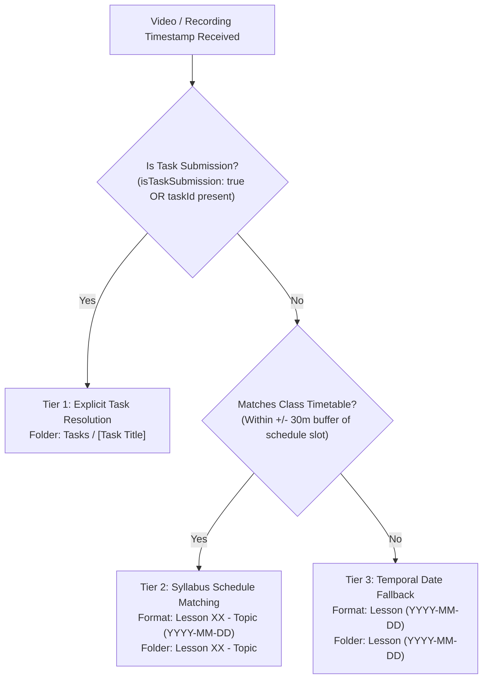
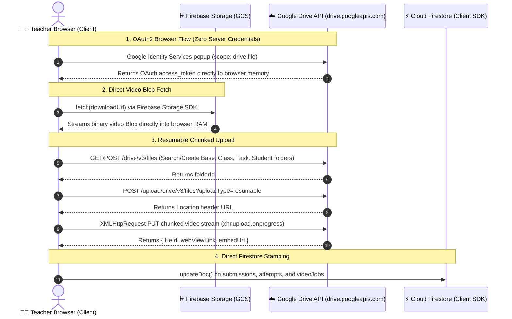
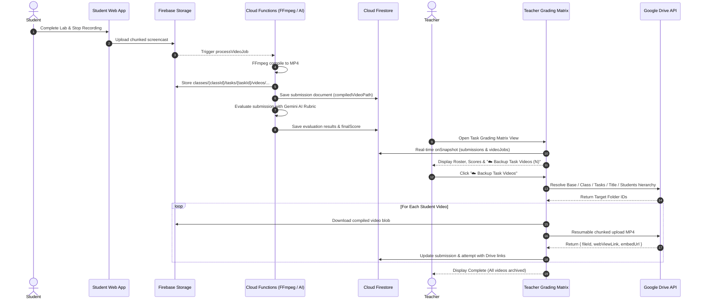

# Google Drive Hierarchical Backup & Lesson Naming Resolution Architecture

[🏠 Documentation Index](../README.md#documentation-index) | [👨‍🏫 Teacher Manual](./user-manual-teacher.md) | [🗄️ Firestore Schema](./firestore-schema.md) | [🧭 Frontend Components](./frontend-components.md) | [📘 UI Catalog](./comprehensive-ui-controls-and-features-catalog.md)

---

## 1. Executive Summary & Design Rationale

In vocational and tertiary technical education, classroom activities generate large volumes of multimodal media, including:
1. **Teacher Lecture Screen Recordings** (composite HD video + microphone audio + multilingual CC).
2. **Student Laboratory Screencasts** (continuous screen and webcam invigilation captures compiled via FFmpeg).
3. **Student Practical Task Submissions** (isolated, milestone-driven lab attempt recordings evaluated by Gemini multimodal AI).

### The Dual Challenges
1. **Ambiguous Media Identification (The "Raw Date" Problem)**:
   Historically, recordings and files were grouped using raw ISO date strings (e.g. `2026-09-23`) or generic fallback strings (`General Recordings`). In semester-long courses, dates do not convey the curriculum context (e.g., *Was September 23rd Lesson 03 on React Hooks, or was it a catch-up lab?*). Teachers and students need structured academic indexing matching course syllabi.
2. **Cloud Storage Silos vs Institutional Portability**:
   While Firebase Cloud Storage (`gs://`) provides low-latency streaming and serverless Cloud Functions triggers, raw storage buckets are inaccessible to non-technical instructors and institutional administrators. Educational institutions mandate archiving student work and instructional media into **Google Drive** for accreditation audits, student accessibility, and long-term retention beyond Firebase storage limits.

### Architectural Solution
The system implements:
- A **Deterministic 3-Tier Lesson Naming Resolution Engine** ([`lessonUtils.js`](file:///home/developer/Documents/Gemini-AI-Classroom-Assistant/web-app/src/utils/lessonUtils.js)) that automatically formats and resolves lesson identifiers across practical tasks, timetable schedules, and ad-hoc sessions.
- An **Institutional Google Drive Hierarchical Backup Pipeline** ([`googleDriveService.js`](file:///home/developer/Documents/Gemini-AI-Classroom-Assistant/web-app/src/utils/googleDriveService.js) & [`useGoogleDrive.js`](file:///home/developer/Documents/Gemini-AI-Classroom-Assistant/web-app/src/hooks/useGoogleDrive.js)) operating under the least-privilege `drive.file` scope. It organizes media into intuitive class/lesson/student directories, enables one-click and batch backups, preserves bidirectional Firestore references, and embeds playback and export capabilities directly into the teacher's grading workspace.

---

## 2. Standardized Lesson Naming Resolution Architecture

### 2.1 The 3-Tier Resolution Strategy
The resolution engine in [`lessonUtils.js`](file:///home/developer/Documents/Gemini-AI-Classroom-Assistant/web-app/src/utils/lessonUtils.js) uses a 3-tier hierarchy:



#### Tier 1: Practical Task Resolution
- **Condition**: Video has `isTaskSubmission: true` or contains an explicit `taskId`.
- **Display Name**: `[Task Title]` (e.g. `Dockerizing Node.js API`).
- **Folder Destination**: `Tasks / [Task Title]` (e.g. `Tasks / Dockerizing Node.js API`).
- **Rationale**: Practical tasks are milestone assessments governed by rubrics, independent of when a student completes them. They must group under the task's title rather than arbitrary class lecture dates.

#### Tier 2: Class Timetable Syllabus Matching
- **Condition**: Timestamp matches an active class schedule timetable slot.
- **Fuzzy Window**: $\pm 30$ minutes configurable buffer around the scheduled class start/end time (`findLessonForTimestamp`). This accounts for teachers starting early or addressing student questions after the bell.
- **Zero-Padded 2-Digit Indexing**: Guarantees lexicographical folder sorting (`Lesson 01`, `Lesson 02`, ..., `Lesson 10`, `Lesson 11`).
- **Display Name**: `Lesson 01 - Topic (YYYY-MM-DD)` (e.g. `Lesson 01 - Docker Architecture (2026-09-23)`).
- **Folder Name**: `Lesson 01 - Topic` (e.g. `Lesson 01 - Docker Architecture`).
- **Fallback when no topic is configured**: `Lesson 01 (YYYY-MM-DD)` and folder `Lesson 01 (YYYY-MM-DD)`.

#### Tier 3: Temporal ISO Date Fallback
- **Condition**: Ad-hoc, tutorial, or emergency sessions conducted outside any scheduled timetable slot.
- **Display Name & Folder**: `Lesson (YYYY-MM-DD)` (e.g. `Lesson (2026-09-23)`).
- **Rationale**: Eliminates cryptic strings like `General Recordings` or raw timestamps while providing clean temporal grouping.

### 2.2 Filesystem & Cloud Drive Sanitization
Filesystems and Google Drive folder queries fail or behave unpredictably when folder names contain illegal path characters. The `sanitizeFolderName` utility strips reserved characters:
```javascript
export const sanitizeFolderName = (name) => {
  if (!name || typeof name !== 'string') return '';
  return name
    .replace(/[/\\:*?"<>|]/g, '-') // Replace illegal chars with hyphen
    .replace(/\s+/g, ' ')          // Collapse multi-spaces
    .trim();
};
```

### 2.3 Key Utility Functions in `lessonUtils.js`

| Function Signature | Description | Return Example |
| :--- | :--- | :--- |
| `padLessonIndex(index)` | Pads single-digit integers to 2-digit strings. | `padLessonIndex(1)` $\rightarrow$ `'01'` |
| `formatLessonTitle(index, topic)` | Formats the clean lesson prefix and optional topic. | `'Lesson 01 - Docker Architecture'` |
| `formatLessonDisplayName(index, topic, dateStr)` | Human-readable label with date for UI dropdowns. | `'Lesson 01 - Docker Architecture (2026-09-23)'` |
| `formatLessonFolderName(index, topic, dateStr)` | Safe filesystem and Drive folder directory name. | `'Lesson 01 - Docker Architecture'` |
| `findLessonForTimestamp(timestamp, lessons, bufferMinutes = 30)` | Matches a JS date/epoch against scheduled lesson slots. | Matched lesson object or `null` |
| `resolveVideoLessonName(video, lessons)` | Master resolution router supporting tasks, timetable, and fallback. | `{ lessonName, folderName, isTask, taskTitle }` |

---

## 3. Google Drive Integration & Security Architecture

### 3.1 Least-Privilege OAuth 2.0 Scope
The Google Drive integration adheres strictly to Google's principle of least privilege:
- **Requested Scope**: `https://www.googleapis.com/auth/drive.file`
- **Security Boundary**: Grants access **ONLY** to files and folders opened or created by the Google AI Classroom Assistant application. The app cannot view, modify, list, or delete the user's personal documents, photos, or existing Google Drive files.
- **Token Management**: The OAuth access token is retained in browser memory (`useGoogleDrive.js`) with proactive token validation before batch uploads.

### 3.2 Configurable Base Folder
To avoid cluttering the teacher's root "My Drive", all classroom materials route into a configurable base folder:
- **Default**: `'Classroom Archives'`.
- **Persistence**: Persisted per browser in `localStorage` under `classroom_gdrive_base_folder`.
- **Customization**: Teachers can customize the base folder name at any time from the UI toolbar.

### 3.3 High-Performance In-Memory Folder Caching
Creating Google Drive folders requires two API operations:
1. `files.list` with query `mimeType='application/vnd.google-apps.folder' and name='...' and 'parent' in parents and trashed=false`.
2. `files.create` if not found.

When backing up a cohort of 40 students with 2 attempts each (80 files), naive folder traversal would make $80 \times 4 = 320$ folder lookup API calls, hitting Google Drive rate limits (`429 RESOURCE_EXHAUSTED`).

**Solution**: `googleDriveService.js` incorporates an in-memory `cache` (`Map<string, folderObj>` keyed by `parentId:folderName`):
```javascript
export const findOrCreateGoogleDriveFolder = async ({ accessToken, folderName, parentFolderId = 'root', cache = null }) => {
  const cacheKey = `${parentFolderId}:${folderName}`;
  if (cache && cache.has(cacheKey)) {
    return cache.get(cacheKey); // Instant cache hit (0 HTTP requests)
  }
  // Otherwise search Drive API and populate cache...
};
```
During batch backups, the base folder, class folder, and task folder are searched or created **exactly once**, dropping folder network roundtrips by over 95%.

### 3.4 Resumable Chunked Upload Protocol
Google Drive uploads are executed via the Resumable Upload protocol:
1. **Initiation**: `POST https://www.googleapis.com/upload/drive/v3/files?uploadType=resumable` with JSON metadata (`name`, `mimeType: video/mp4`, `parents: [folderId]`).
2. **Location Header**: Drive returns a unique session upload URI in the `Location` response header.
3. **Chunk Streaming**: The file blob is streamed via `PUT` with `Content-Range`. Progress callbacks calculate percentage loaded.
4. **Cancellation**: Linked to an `AbortController`. If the teacher clicks "Cancel" in the progress modal, the active HTTP PUT is aborted immediately and cleanup is executed.

### 3.5 Client-Side vs Server-Side Execution Model & Rationale

A foundational architectural design of the Google Drive integration is that **all folder discovery, video streaming, and Google Drive upload operations occur 100% client-side inside the teacher's browser**.

No video payloads pass through Cloud Functions, Google Cloud Run, or any intermediate backend server during Google Drive archival.

#### Client-Side Data Flow Sequence



#### Detailed Architectural Comparison

| Dimension | 🌐 Client-Side Browser Pipeline (Implemented) | ⚙️ Backend Cloud Function Proxy (Rejected Alternative) |
| :--- | :--- | :--- |
| **Security & Token Isolation** | **Strict Least Privilege**: The teacher's OAuth access token is held purely in browser volatile memory (`sessionStorage`) and expires after 1 hour. **The backend server never receives, handles, or stores teacher Google credentials.** | **High Risk Credential Centralization**: Would require sending user OAuth refresh tokens to Cloud Functions or storing them in Firestore, creating an institutional credential attack surface. |
| **Cloud FinOps & Network Egress** | **$0.00 Backend Egress**: Video bytes stream directly: `GCS -> Browser` (standard web download) and `Browser -> Drive API` (user internet). Cloud Functions incur **zero egress costs and zero CPU execution runtime**. | **Double Egress & High Cloud Cost**: A backend proxy downloads from GCS (`$0.12/GB`) and uploads to Drive (`$0.12/GB`), multiplying cloud bandwidth bills and requiring expensive 2GB–4GB function instances. |
| **Timeout Immunity** | **Zero Timeout Constraints**: The client can upload arbitrary batches (e.g. 40 students with multi-gigabyte recordings) over standard broadband without time limits. | **Hard 540s Timeout Limit**: Serverless Cloud Functions Gen 2 have a hard execution cap (9 minutes maximum), causing batch uploads of large cohorts to fail mid-flight. |
| **Real-Time Telemetry & Cancellation** | **Granular Progress & Immediate Abort**: Uses native `XMLHttpRequest.upload.onprogress` to stream real-time byte counters to `DriveBackupProgressModal`, with instantaneous abort via `AbortController`. | **Opaque Progress & Orphaned Streams**: Serverless execution makes granular per-byte client progress tracking complex and costly (requiring frequent Firestore polling). |

> [!NOTE] Legacy Server-Side ZIP Comparison
> For an in-depth technical analysis of why the legacy server-side ZIP export pipeline (`processZipJob.js`) suffers from in-memory `/tmp` OOM crashes and 540-second timeout walls on class cohorts, consult the [Batch Media Export & ZIP Archiving Technical Audit](./batch-media-export-and-zip-audit.md).

### 3.6 Google Drive Sharing Security Architecture: The Capability URL Model

When backing up lecture recordings or student task videos, `googleDriveService.js` automatically assigns the permission:
```javascript
{
  role: 'reader',
  type: 'anyone'
}
```
This enables **"Anyone with the link can view"** (unlisted viewing).

#### Why Single-Student Sharing (`type: 'user'`) Was Rejected
Granting access strictly to a single student email (`type: 'user', emailAddress: studentEmail`) was evaluated and explicitly rejected for real-world pedagogical deployment:

1. **Breaks Whole-Class Lecture Distribution**: Teacher lectures are recorded for the **entire class** (30–40 students). Sharing with a single student email renders lecture recordings inaccessible to the rest of the cohort.
2. **Account Mismatch & "Request Access" Lockouts**: In modern BYOD (Bring Your Own Device) environments, students regularly access classroom web applications while logged into personal Google accounts (e.g. `personal@gmail.com`) rather than their institutional Google Workspace identity. Single-user email grants trigger constant *"You need access / Request access"* permission deadlocks, generating substantial administrative friction.
3. **ACL Fragmentation**: Adding individual user permissions to hundreds of task submission videos fragments Google Drive's Access Control List (ACL), complicating institutional governance and auditing.

#### Mathematical Entropy & Brute-Force Impossibility
A common question in educational cybersecurity is whether an unlisted link can be guessed by unauthorized parties. The answer is **mathematically impossible**.

In computer security, unlisted Google Drive links operate under the **Capability URL** pattern (the same cryptographic paradigm used by password-reset tokens, Zoom meeting links, and Cloud Storage pre-signed URLs):

- **Key Length & Alphabet**: Google Drive File IDs comprise 33 to 44 characters drawn from a 64-character Base64URL character set (`A–Z`, `a–z`, `0–9`, `-`, `_`).
- **Cryptographic State Space**:
  $$64^{33} = (2^6)^{33} = 2^{198} \approx 3.96 \times 10^{59} \text{ unique combinations}$$
  For 44-character IDs, this expands to:
  $$64^{44} = (2^6)^{44} = 2^{264} \approx 2.94 \times 10^{79} \text{ unique combinations}$$
  (For comparison, $2^{198}$ exceeds the cryptographic entropy of 128-bit AES keys and approaches 256-bit military encryption; $10^{79}$ is comparable to the estimated number of atoms in the observable universe).

- **Brute-Force Resistance**:
  Even if a malicious adversary deployed a distributed botnet executing **$1,000,000,000$ (one billion) guesses per second**, discovering a single valid Google Drive ID would require:
  $$\frac{3.96 \times 10^{59}}{10^9 \times 31,536,000 \text{ sec/year}} \approx \mathbf{1.25 \times 10^{43} \text{ years}}$$
  (More than $10^{33}$ times the current age of the universe).

#### Google Infrastructure Edge Defenses
Beyond mathematical entropy, Google's global edge infrastructure enforces active protection layers:
1. **Aggressive Rate-Limiting (`429 Too Many Requests`)**: Rapid successive requests from an IP or subnet are throttled within seconds.
2. **Automated Enumeration Bans & CAPTCHAs**: Repeated `404 Not Found` requests targeting non-existent file IDs trigger automated IP blacklisting.
3. **Zero Search Engine Indexing**: All Google Drive document and video preview pages emit `X-Robots-Tag: noindex, nofollow` HTTP headers. Google Search, Bing, and other web spiders are strictly forbidden from indexing Drive files.
4. **End-to-End Transport Encryption**: All media streams are encrypted in transit over TLS/HTTPS (`https://drive.google.com`), preventing intermediate network sniffing.

#### Application-Tier Access Control via Firestore Security Rules
While the Google Drive link is technically viewable by anyone possessing the URL, **the URL itself is treated as a secret capability token**:
- Stored exclusively in Cloud Firestore under `classes/{classId}/tasks/{taskId}/submissions/{studentUid}` and `videoJobs/{jobId}`.
- **Zero-Trust Firestore Security Rules**: Enforce that only the class instructor (`request.auth.token.role == 'teacher'`) and the authoring student (`request.auth.uid == studentUid`) are permitted to read the document.
- Peer students cannot query or discover each other's submission links inside the application.

---

## 4. Google Drive Hierarchical Folder Topology

The integration maintains two clean hierarchical branches: **Lecture Archives** and **Student Practical Tasks**.

```text
My Drive/
  └── [Base Folder] (default: "Classroom Archives", configurable)
        └── [Class Name / ID] (e.g. "IT114115-A")
              ├── [Lesson Folder] (e.g. "Lesson 01 - Docker Architecture")
              │     ├── Teacher Lectures/
              │     │     └── 2026-09-23_IT114115-A_Lecture_Docker_Architecture.webm
              │     └── Students/
              │           ├── student1@stu.vtc.edu.hk/
              │           │     └── student1@stu.vtc.edu.hk_2026-09-23_10-30_screencast.webm
              │           └── student2@stu.vtc.edu.hk/
              │                 └── ...
              └── Tasks/
                    └── [Task Title] (e.g. "Practical Lab 1 - Docker Compose")
                          └── Students/
                                ├── student1@stu.vtc.edu.hk/
                                │     ├── student1@stu.vtc.edu.hk_Practical_Lab_1_attempt_1.mp4
                                │     └── student1@stu.vtc.edu.hk_Practical_Lab_1_attempt_2.mp4
                                └── student2@stu.vtc.edu.hk/
                                      └── student2@stu.vtc.edu.hk_Practical_Lab_1_attempt_1.mp4
```

### File Naming Conventions
- **Teacher Lectures**: `{Date}_{ClassId}_Lecture_{SanitizedTitle}.webm`
- **Student Session Screencasts**: `{studentEmail}_{Date}_{Time}_screencast.webm`
- **Student Task Submissions**: `{safeStudentEmail}_{safeTaskTitle}_attempt_{attemptNumber}.mp4`

---

## 5. Practical Tasks & Video Backup Data Flow

### 5.1 End-to-End Sequence Diagram



### 5.2 Firestore Schema Specifications

#### 1. Task Submissions Document
Path: `classes/{classId}/tasks/{taskId}/submissions/{studentUid}`
```json
{
  "studentUid": "uid_12345",
  "email": "student@stu.vtc.edu.hk",
  "displayName": "Chan Tai Man",
  "status": "evaluated",
  "attemptsCount": 2,
  "effectiveScore": 95,
  "compiledVideoPath": "classes/it114115/tasks/task_1/videos/uid_12345_attempt_2.mp4",
  "videoJobId": "vjob_abc123",
  "driveFileId": "1a2b3c4d5e6f7g8h9i0j",
  "driveWebViewLink": "https://drive.google.com/file/d/1a2b3c4d5e6f7g8h9i0j/view",
  "driveEmbedUrl": "https://drive.google.com/file/d/1a2b3c4d5e6f7g8h9i0j/preview",
  "driveFolderPath": "Classroom Archives / IT114115-A / Tasks / Docker Lab / Students / student@stu.vtc.edu.hk",
  "driveBackedUpAt": "2026-09-23T12:00:00.000Z",
  "driveBackedUpBy": "teacher@vtc.edu.hk"
}
```

#### 2. Task Attempt Subdocument
Path: `classes/{classId}/tasks/{taskId}/submissions/{studentUid}/attempts/{attemptNumber}`
Stores granular Drive links for historical attempts, enabling teachers to review earlier attempts if an appeal is filed.

#### 3. Video Jobs Document
Path: `videoJobs/{jobId}`
```json
{
  "jobId": "vjob_abc123",
  "classId": "it114115",
  "studentUid": "uid_12345",
  "studentEmail": "student@stu.vtc.edu.hk",
  "isTaskSubmission": true,
  "taskId": "task_docker_1",
  "attemptNumber": 2,
  "status": "completed",
  "videoPath": "classes/it114115/tasks/task_1/videos/uid_12345_attempt_2.mp4",
  "driveFileId": "1a2b3c4d5e6f7g8h9i0j",
  "driveWebViewLink": "https://drive.google.com/file/d/1a2b3c4d5e6f7g8h9i0j/view",
  "driveFolderPath": "Classroom Archives / IT114115-A / Tasks / Docker Lab / Students / student@stu.vtc.edu.hk",
  "driveBackedUpAt": "2026-09-23T12:00:00.000Z",
  "driveBackedUpBy": "teacher@vtc.edu.hk"
}
```

---

## 6. Teacher Grading Matrix View UI & Workflow

Implemented in [`TaskGradingMatrixView.jsx`](file:///home/developer/Documents/Gemini-AI-Classroom-Assistant/web-app/src/components/tasks/TaskGradingMatrixView.jsx):

### 6.1 Real-Time Media Synchronization
The component maintains two synchronized data sources:
1. `classes/{classId}/tasks/{taskId}/submissions` subcollection: Primary grading state, rubric points, and manual score overrides.
2. `videoJobs` root collection: Listens with `query(collection(db, 'videoJobs'), where('classId', '==', classId), where('taskId', '==', task.id))`. Enriches each submission with live video compilation status and Cloud Storage paths.

### 6.2 Workspace Toolbar
- **Backup Action Button**: `☁️ Backup Task Videos (${readyVideosCount})` dynamically reflects how many student recordings exist in Cloud Storage and are eligible for Drive archival.
- **Drive Destination Breadcrumb**: Renders the target path (`📁 [Base] / [Class] / Tasks / [Task Title]`) so instructors always know where files will be archived.

### 6.3 Roster Table Controls
The table features a dedicated **Video / Drive** column (Column 7):
- `📁 Drive ↗`: Styled blue badge with target `_blank` opening the student's video directly in Google Drive.
- `☁️ Backup`: Single-click button allowing immediate archival of an individual student's submission without executing a full batch.
- `▶️ Watch`: Button launching the built-in HTML5 screencast playback modal.

### 6.4 Built-In Video Preview Modal
Allows teachers to review the student's screencast immediately:
- Previews the exact MP4 attempt.
- HTML5 controls with speed adjustment, seeking, and pause/play.
- Closes cleanly without losing table filters, sorting, or pagination state.

### 6.5 Animated Batch Progress Modal
Rendered via [`DriveBackupProgressModal.jsx`](file:///home/developer/Documents/Gemini-AI-Classroom-Assistant/web-app/src/components/DriveBackupProgressModal.jsx):
- **Two-Tier Progress Bars**: Shows Overall Progress (e.g. `12 / 30 files, 40%`) and Current File Streaming Progress (e.g. `78% of student_attempt_1.mp4`).
- **Real-Time Item Status**: Scrollable log displaying each student's name, file size, status, and Drive link.
- **Abort Controller Integration**: A "Cancel" button instantly aborts current HTTP chunk transmissions without leaving orphaned files.

### 6.6 Excel Export Enhancement
The `exportTaskGradingToExcel` utility in [`exportUtils.js`](file:///home/developer/Documents/Gemini-AI-Classroom-Assistant/web-app/src/utils/exportUtils.js) generates complete gradebooks including:
- Student Name, Student Email, Cohort, Programme
- Submission Status, Attempt Count, Duration
- Individual Rubric Milestone Scores & Statuses
- **Google Drive Link**: Clickable hyperlink directly linking each student's row to their archived Drive screencast.

---

## 7. Verification, Testing & Governance

### 7.1 Automated Unit & Integration Tests

| Test Suite File | Tests | Coverage Scope | Status |
| :--- | :--- | :--- | :--- |
| [`lessonUtils.test.js`](file:///home/developer/Documents/Gemini-AI-Classroom-Assistant/web-app/src/utils/lessonUtils.test.js) | 15 | Pad index, formatting, schedule matching, task resolution, sanitization | **15 / 15 Passed** |
| [`googleDriveService.test.js`](file:///home/developer/Documents/Gemini-AI-Classroom-Assistant/web-app/src/utils/googleDriveService.test.js) | 24 | Folder creation, cache lookup, task hierarchy traversal, resumable upload | **24 / 24 Passed** |
| [`useGoogleDrive.test.js`](file:///home/developer/Documents/Gemini-AI-Classroom-Assistant/web-app/src/hooks/useGoogleDrive.test.js) | 10 | Batch backup, task backup, Firestore document updates, progress tracking | **10 / 10 Passed** |
| [`useClassSchedule.test.js`](file:///home/developer/Documents/Gemini-AI-Classroom-Assistant/web-app/src/hooks/useClassSchedule.test.js) | 3 | Schedule enrichment with `folderName` and `displayName` | **3 / 3 Passed** |
| [`exportUtils.test.js`](file:///home/developer/Documents/Gemini-AI-Classroom-Assistant/web-app/src/utils/exportUtils.test.js) | 10 | Excel export, Google Drive Link column verification | **10 / 10 Passed** |
| [`tasks.test.jsx`](file:///home/developer/Documents/Gemini-AI-Classroom-Assistant/web-app/src/components/tasks/tasks.test.jsx) | 20 | Task editor, rubric milestones, Drive backup button, watch screencast modal | **20 / 20 Passed** |

- **Complete Frontend Test Suite**: **118 test files, 1,061 tests passing (0 failures)**.
- **Cloud Functions Test Suite**: **All 6 microservice test suites passing (0 failures)**.

### 7.2 Governance Invariants
- **Global Google Cloud Project**: Invariant verified as `pytest-runner-2627` (`gcloud config get-value project`).
- **Production Hosting**: Live at `https://it114115-2627.web.app` on Firebase project `it114115-2627`.
