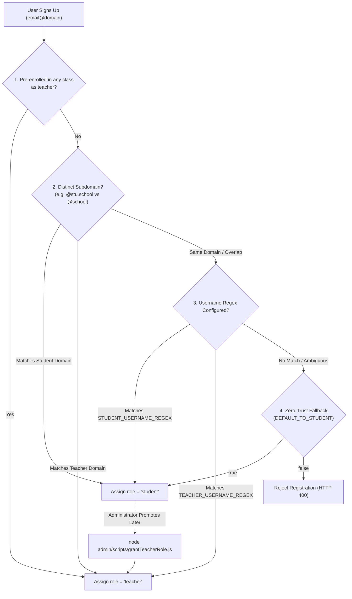
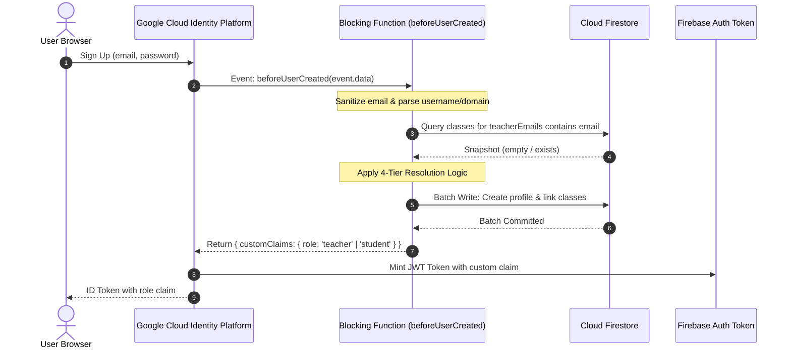
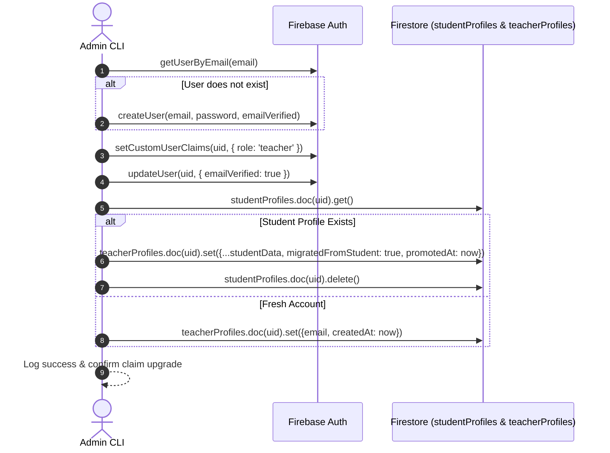

# Hybrid Role Resolution & Identity Architecture

[🏠 Documentation Index](../README.md#documentation-index) | [👨‍🏫 Teacher Manual](./user-manual-teacher.md) | [🧑‍🎓 Student Manual](./user-manual-student.md) | [🛠️ Admin Manual](./user-manual-admin.md) | [📘 UI Catalog](./comprehensive-ui-controls-and-features-catalog.md)

---

This document details the technical design, lifecycle events, and security mechanics behind the **Hybrid Role Resolution Architecture** in the Google AI Classroom.

---

## 📑 Table of Contents

1. [1. Executive Summary & Problem Space](#1-executive-summary--problem-space)
2. [2. 4-Tier Role Resolution Pipeline](#2-4-tier-role-resolution-pipeline)
3. [3. Google Cloud Identity Platform (GCIP) Lifecycle](#3-google-cloud-identity-platform-gcip-lifecycle)
4. [4. Two-Phase Admin Role Elevation & Profile Migration](#4-two-phase-admin-role-elevation--profile-migration)
5. [5. Security Rules Integration](#5-security-rules-integration)
6. [6. Frontend Client-Side UX & Enforcement](#6-frontend-client-side-ux--enforcement)
7. [7. Configuration Matrix Reference](#7-configuration-matrix-reference)
8. [8. Verification & Test Suite](#8-verification--test-suite)

---

## 1. Executive Summary & Problem Space

Educational institutions employ varied email domain strategies:
1. **Dedicated Subdomains**: Students use `@stu.school.edu` while faculty use `@school.edu`.
2. **Shared Same Domain**: Both students and faculty share the exact same root domain (e.g. `@school.edu`).
3. **Open / Any Domain**: Training academies, hackathons, or multi-campus consortia where students and mentors register from arbitrary or public domains (`*`).

### The FinOps & Security Trilemma:
In an AI-powered proctoring platform:
- **Teachers** trigger high-quota Google GenAI/Gemini Enterprise Agent Platform operations (e.g. Gemini 3.7 Pro reasoning, multi-student video batch analysis, dynamic lab task synthesis, and audio diarization).
- **Students** only stream sensor telemetry (screen captures, audio chunks, and presence heartbeats) and must **never** have permission to initiate expensive AI jobs or access other students' recordings.
- If an unknown or malicious user registers on a shared domain, granting teacher privileges by default would expose the institution's cloud budget to severe depletion and compromise exam confidentiality.

**The Solution:** An integrated **4-Tier Priority Resolution Hierarchy** combining:
- Class pre-enrollment checks
- Subdomain isolation
- Username regex pattern matching
- Zero-trust default-to-student fallback
- Out-of-band administrative elevation with two-phase Firestore profile migration

---

## 2. 4-Tier Role Resolution Pipeline

When a user signs up or signs in, their role is resolved deterministically:



### Detailed Tier Breakdown:

| Tier | Mechanism | Priority | Behavior & Edge Cases |
| :--- | :--- | :--- | :--- |
| **Tier 1** | **Class Pre-Enrollment** | Highest | Queries Firestore `classes.where('teacherEmails', 'array-contains', email)`. If a class coordinator already added the instructor's email to a class roster, the user is immediately granted `teacher` upon signup—even if their username format looks like a student ID. |
| **Tier 2** | **Subdomain Hierarchy** | High | Student domains are evaluated **before** teacher domains. If teacher domain is `vtc.edu.hk` and student domain is `stu.vtc.edu.hk`, `user@stu.vtc.edu.hk` matches the student rule first, preventing accidental promotion by domain substring containment. |
| **Tier 3** | **Username Regex Matching** | Medium | If domains are identical (e.g. both `@school.edu`) or set to wildcard (`*`), regex rules match username prefixes or structures (e.g. student ID patterns `^[0-9]{8}$` vs teacher names `^[a-zA-Z]+\.[a-zA-Z]+$`). |
| **Tier 4** | **Zero-Trust Fallback** | Baseline | If regex does not match or is unconfigured on a shared domain, the system safely assigns `{ role: 'student' }`. This prevents quota abuse while allowing valid students to onboard immediately. Ambiguous faculty can be elevated later. |

---

## 3. Google Cloud Identity Platform (GCIP) Lifecycle

The architecture leverages GCIP **Blocking Cloud Functions** to intercept user creation before authentication tokens are issued:



### Key Implementation: `handleBeforeUserCreatedLogic`
Located in [`functions/auth_triggers/userManagement.js`](file:///home/developer/Documents/Gemini-AI-Classroom-Assistant/functions/auth_triggers/userManagement.js):

```javascript
export async function handleBeforeUserCreatedLogic(event, customDeps = {}) {
  const { uid, email } = event?.data || {};
  if (!email) {
    throw new HttpsError('invalid-argument', 'Email is required to sign up.');
  }

  // 1. Check pre-enrolled teacher roster
  const teacherPreEnrollSnapshot = await classesRef
    .where('teacherEmails', 'array-contains', email)
    .limit(1)
    .get();
  const isPreEnrolledTeacher = !teacherPreEnrollSnapshot.empty;

  // 2. Derive role from domain / regex / fallback
  let derivedRole = isPreEnrolledTeacher ? 'teacher' : currentDeriveRole(email);
  if (!derivedRole) {
    throw new HttpsError('invalid-argument', `Please use a valid institutional email address (${currentGetAllowed()}).`);
  }

  const isTeacher = (derivedRole === 'teacher');
  const profileCollection = isTeacher ? 'teacherProfiles' : 'studentProfiles';
  const emailField = isTeacher ? 'teacherEmails' : 'studentEmails';

  // 3. Link pre-enrolled classes atomically in Firestore batch
  const querySnapshot = await classesRef.where(emailField, 'array-contains', email).get();
  const batch = currentDb.batch();
  const userProfileRef = currentDb.collection(profileCollection).doc(uid);
  const classIds = [];

  querySnapshot.forEach(doc => {
    classIds.push(doc.id);
    batch.update(doc.ref, { [`${isTeacher ? 'teachers' : 'students'}.${uid}`]: email });
  });

  const profileData = {};
  if (classIds.length > 0) {
    profileData.classes = currentFieldValue.arrayUnion(...classIds);
  }
  batch.set(userProfileRef, profileData, { merge: true });
  await batch.commit();

  // 4. Inject immutable custom claims into Firebase Auth token
  return {
    customClaims: { role: derivedRole }
  };
}
```

---

## 4. Two-Phase Admin Role Elevation & Profile Migration

When a teacher accidentally signs up as a student (or is onboarded under zero-trust fallback), administrators can elevate their account using [`admin/scripts/grantTeacherRole.js`](file:///home/developer/Documents/Gemini-AI-Classroom-Assistant/admin/scripts/grantTeacherRole.js).

A naive claims update is insufficient because the student document would remain in `studentProfiles/${uid}` while `teacherProfiles/${uid}` would be missing.

The script executes a **Two-Phase Atomic Migration**:



### Profile Migration Code (`grantTeacherRoleToEmail`):
```javascript
// 1. Upgrade custom claims in Auth
await auth.setCustomUserClaims(userRecord.uid, { role: 'teacher' });
await auth.updateUser(userRecord.uid, { emailVerified: true });

// 2. Migrate Firestore profile documents
const uid = userRecord.uid;
const studentProfileRef = db.collection('studentProfiles').doc(uid);
const teacherProfileRef = db.collection('teacherProfiles').doc(uid);

const studentDoc = await studentProfileRef.get();
if (studentDoc.exists) {
  const studentData = studentDoc.data() || {};
  await teacherProfileRef.set({
    ...studentData,
    migratedFromStudent: true,
    promotedAt: new Date().toISOString()
  }, { merge: true });
  await studentProfileRef.delete();
} else {
  await teacherProfileRef.set({
    email,
    createdAt: new Date().toISOString()
  }, { merge: true });
}
```

---

## 5. Security Rules Integration

Both `firestore.rules` and `storage.rules` rely exclusively on the verified custom claim:

```javascript
function isTeacher() {
  return request.auth != null && request.auth.token.role == 'teacher';
}

function isStudent() {
  return request.auth != null && request.auth.token.role == 'student';
}
```

### Architectural Guarantees:
1. **Zero Hardcoded Whitelists**: No email addresses or institutional domains are hardcoded inside security rules. Domain changes do not require redeploying security rules.
2. **Client Tamper Proofing**: Custom claims cannot be modified by client SDKs. Only Cloud Functions running with admin privileges or Admin CLI scripts can issue or alter claims.
3. **Assessment Isolation**: Confidential exam recordings and AI incident dossiers are completely shielded from student reads via `resource.metadata.isExam == 'true'` and `isTeacher()` assertions.

---

## 6. Frontend Client-Side UX & Enforcement

Located in [`web-app/src/utils/domainConfig.js`](file:///home/developer/Documents/Gemini-AI-Classroom-Assistant/web-app/src/utils/domainConfig.js) and [`web-app/src/components/AuthComponent.jsx`](file:///home/developer/Documents/Gemini-AI-Classroom-Assistant/web-app/src/components/AuthComponent.jsx):

### Real-Time Keystroke Feedback:
As the user types into the registration email field, `deriveRoleFromEmail(email)` executes client-side to render intuitive visual indicators:
- 🎓 **Recognized as Student account** (`role === 'student'`)
- 👨‍🏫 **Recognized as Teacher account** (`role === 'teacher'`)
- ⚠️ **Domain not recognized** (`role === null`)

### Strict Browser Policy:
- **Students**: Google Chrome is strictly required on desktop. If a student attempts to register or log in using Firefox, Safari, or mobile browsers, the app blocks the action:
  ```text
  "Google Chrome is strictly required for students. Detected: Firefox"
  ```
  This guarantees hardware acceleration, Web Workers, LiteRT Whisper/Gemma STT, and screen-sharing capture APIs work without failure.
- **Instructors**: Permitted to access the dashboard from any modern web browser.

---

## 7. Configuration Matrix Reference

All environment variables used by the hybrid system:

| Variable | Environment | Type | Default | Description |
| :--- | :--- | :--- | :--- | :--- |
| `VITE_STUDENT_DOMAINS` | Frontend | String | `stu.vtc.edu.hk` | Comma-separated allowed student domains (or `*`). |
| `VITE_TEACHER_DOMAINS` | Frontend | String | `vtc.edu.hk` | Comma-separated allowed teacher domains (or `*`). |
| `VITE_STUDENT_USERNAME_REGEX` | Frontend | String | `""` | Regex pattern matching student usernames. |
| `VITE_TEACHER_USERNAME_REGEX` | Frontend | String | `""` | Regex pattern matching teacher usernames. |
| `VITE_DEFAULT_TO_STUDENT` | Frontend | Boolean | `"true"` | When true, ambiguous domains/usernames default to student. |
| `STUDENT_EMAIL_DOMAINS` | Functions | Array/CSV | `stu.vtc.edu.hk` | Backend list of student domains. |
| `TEACHER_EMAIL_DOMAINS` | Functions | Array/CSV | `vtc.edu.hk` | Backend list of teacher domains. |
| `STUDENT_USERNAME_REGEX` | Functions | String | `""` | Backend regex for student usernames. |
| `TEACHER_USERNAME_REGEX` | Functions | String | `""` | Backend regex for teacher usernames. |
| `DEFAULT_TO_STUDENT` | Functions | Boolean | `true` | Backend zero-trust fallback flag. |

---

## 8. Verification & Test Suite

The entire hybrid architecture is verified across 5 test suites (774 automated tests):

1. **Admin Elevation Suite** (`tests/grantTeacherRole.test.mjs`):
   - New user provisioning
   - Student profile data migration and cleanup
2. **GCIP Trigger Suite** (`functions/auth_triggers/userManagement.test.js`):
   - Pre-enrolled teacher override
   - Subdomain hierarchy precedence
   - Zero-trust student fallback
   - Malformed email resilience
3. **Frontend Domain Resolution Suite** (`web-app/src/utils/domainConfig.test.js`):
   - Wildcard matching
   - Regex extraction
   - Whitespace and casing normalization
4. **Security Rules Suite** (`tests/security_rules.test.mjs`):
   - Verified with real Firebase Auth tokens on Firestore emulator
5. **End-to-End Cloud Smoke Suite** (`admin/scripts/smoke_test.mjs`):
   - Live cloud pipeline verification on active GCP project

---

[← Back to Documentation Index](../README.md#documentation-index)

