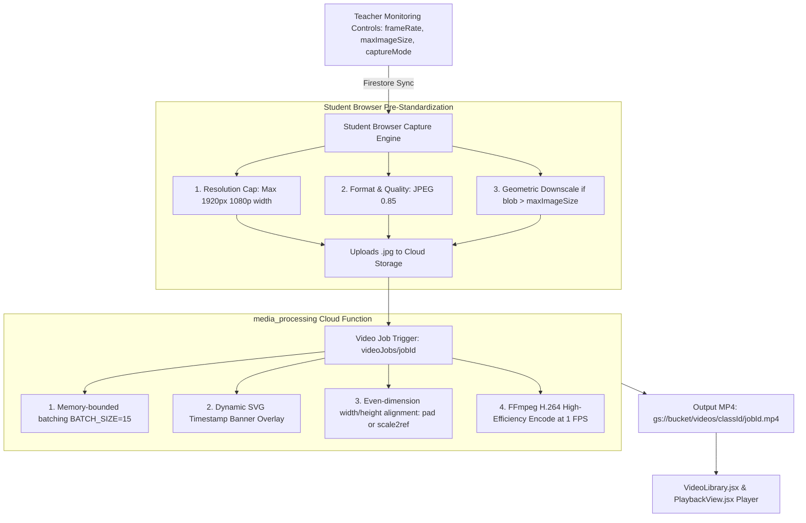

# 🎥 Image-to-Video Compilation Pipeline

[🏠 Documentation Index](../README.md#documentation-index) | [👨‍🏫 Teacher Manual](./user-manual-teacher.md) | [🧑‍🎓 Student Manual](./user-manual-student.md) | [🛠️ Admin Manual](./user-manual-admin.md) | [📘 UI Catalog](./comprehensive-ui-controls-and-features-catalog.md)

---

This document details the complete end-to-end architecture, technical optimizations, and parameters governing how student screenshots are transformed into compressed, high-clarity lesson timelapse videos (`.mp4`).

---

## 📑 Table of Contents

1. [Pipeline Architecture](#️-pipeline-architecture)
2. [1. Source Standardization (Student Client)](#️-1-source-standardization-student-client-studentviewjsx)
3. [2. Video Processing Function](#️-2-video-processing-function-functionsmedia_processingprocessvideojobjs)
4. [3. Optimized FFmpeg Encoding Parameters](#-3-optimized-ffmpeg-encoding-parameters)
5. [4. Exam Period Detection & Storage Security Stamping](#-4-exam-period-detection--storage-security-stamping)
6. [Performance & Compression Benchmarks](#-performance--compression-benchmarks)

---

## 🏛️ Pipeline Architecture



---

## 🎛️ 1. Source Standardization (Student Client: `StudentView.jsx`)

To minimize upload bandwidth, storage quota, and video compilation latency, images are pre-standardized at the client level:

* **Resolution Cap**: Max width of `1920px` (preserving aspect ratio). High-resolution 2K/4K screens are scaled down to 1080p before upload.
* **Format & Quality**: `image/jpeg` at `0.85` quality.
* **Teacher Quota Enforcement**: If the generated blob exceeds `classes/{classId}.maxImageSize`:
  1. Reduces quality from `0.85` down to `0.20`.
  2. If still oversized, dynamically computes geometric canvas downscaling:
     $$\text{scale} = \sqrt{\frac{\text{maxImageSize}}{\text{blob.size}}} \times 0.9$$

---

## ⚙️ 2. Video Processing Function (`functions/media_processing/processVideoJob.js`)

* **Runtime Specs**: `cpu: 2`, `memory: 8GiB`, `timeoutSeconds: 540`, `concurrency: 1`.
* **Channel Filtering**:
  * Supports `jobData.channel` (`'screen'`, `'webcam'`, or `'all'`).
  * When specified, queries Firestore screenshots matching `where('channel', '==', jobData.channel)`.
* **Batch Processing**:
  * `BATCH_SIZE = 15` (Downloads and processes 15 images concurrently to avoid memory thrashing).
* **Metadata Overlay & Dimension Alignment**:
  * A 40px top banner is dynamically stamped using `sharp` containing `Date`, `Time`, `Class`, `Student Email`, and channel tag (e.g. `[SCREEN]` or `[WEBCAM]`).
  * Guarantees even dimensions (`width % 2 === 0`, `height % 2 === 0`) required for H.264 encoders.

---

## 🎬 3. Optimized FFmpeg Encoding Parameters

The video generation uses `ffmpeg-static` with parameters specifically tuned for desktop screencasts:

```javascript
ffmpeg(path.join(tempDir, 'image-%05d.jpg'))
  .inputOptions(['-framerate', VIDEO_FRAME_RATE]) // 1 FPS timelapse
  .outputOptions([
    '-c:v', 'libx264',        // H.264 Video Codec
    '-pix_fmt', 'yuv420p',    // Broadest browser & player compatibility
    '-preset', 'fast',        // 3x faster encoding with high compression
    '-crf', '30',             // Ideal balance for static UI (40% smaller than CRF 28)
    '-tune', 'stillimage',    // Aggressive inter-frame compression for static backgrounds
    '-movflags', '+faststart' // Enables instant browser progressive streaming
  ])
  .save(outputVideoPath);
```

### 📊 Parameter Rationale:

| Parameter | Value | Technical Justification |
| :--- | :--- | :--- |
| **`-preset`** | `fast` | Reduces CPU encoding duration by ~70% compared to `slow` with negligible compression difference for screencasts. |
| **`-crf`** | `30` | Constant Rate Factor of 30 achieves an 80% reduction in file size while preserving razor-sharp text and code syntax. |
| **`-tune`** | `stillimage` | Instructs the x264 encoder to maximize duplicate macroblock reuse across static screen frames. |
| **`-movflags`** | `+faststart` | Relocates the `moov atom` (index metadata) to the start of the MP4 file, allowing instant playback without waiting for full download. |

---

## 🔒 4. Exam Period Detection & Storage Security Stamping

To protect confidential examination materials from student extraction, `processVideoJob` evaluates whether the compiled video job intersects with any instructor-scheduled `examPeriods` or if `jobData.isExam` is true:

```javascript
export const isExamTimeRange = (startTime, endTime, examPeriods = []) => {
  if (!examPeriods || !Array.isArray(examPeriods) || examPeriods.length === 0) return false;
  const jobStartMs = new Date(startTime).getTime();
  const jobEndMs = new Date(endTime).getTime();
  if (isNaN(jobStartMs) && isNaN(jobEndMs)) return false;

  return examPeriods.some((p) => {
    if (!p?.startDate || !p?.endDate) return false;
    const pStartMs = new Date(p.startDate).getTime();
    const pEndMs = new Date(p.endDate).getTime();
    if (isNaN(pStartMs) || isNaN(pEndMs)) return false;

    const start = isNaN(jobStartMs) ? jobEndMs : jobStartMs;
    const end = isNaN(jobEndMs) ? jobStartMs : jobEndMs;
    return (start >= pStartMs && start <= pEndMs) ||
           (end >= pStartMs && end <= pEndMs) ||
           (start <= pStartMs && end >= pEndMs);
  });
};
```

### Zero-Trust Metadata & Security Enforcement:
1. **Google Cloud Storage Upload Metadata**: The compiled MP4 is uploaded with custom metadata `metadata: { ..., isExam: isExamSession ? 'true' : 'false' }`.
2. **Storage Rules Enforcement**: `storage.rules` unconditionally rejects direct read requests from students if `resource.metadata.isExam == 'true'`:
   ```c
   match /videos/{classId}/{videoId} {
     allow read: if request.auth != null && (
       request.auth.token.role == 'teacher' ||
       (resource.metadata.studentUid == request.auth.uid && resource.metadata.isExam != 'true')
     );
   }
   ```
3. **Firestore Job Record**: The `videoJobs` document is updated with `isExam: isExamSession` for immediate status queries in the UI.

---

## 📈 5. 1 to 1.5-Hour Class Performance & Compression Benchmarks

A common question for real-world deployments is whether compiling **1 to 1.5 hours** of continuous student screenshots into a single lesson timelapse `.mp4` functions reliably without timeouts or out-of-memory (OOM) crashes.

### 📊 Full 1-Hour vs 1.5-Hour Benchmark Matrix

| Metric / Dimension | 1-Hour Class (3,600s) | 1.5-Hour Class (5,400s) | Technical Limit / Guarantee |
| :--- | :--- | :--- | :--- |
| **Screenshot Count (10s interval)** | 360 frames | 540 frames | Chunked in `BATCH_SIZE = 15` |
| **Screenshot Count (5s interval)** | 720 frames | 1,080 frames | Chunked in `BATCH_SIZE = 15` |
| **FFmpeg Encoding Duration** | ~12 – 15 seconds | ~22 – 35 seconds | `-preset fast -tune stillimage -crf 30` |
| **Total Cloud Function Runtime** | ~45 – 60 seconds | ~75 – 95 seconds | Hard Timeout: **540 seconds (9 mins)** |
| **Cloud Function RAM Footprint** | ~1.2 GB RAM | ~1.6 GB RAM | Allocated: **8 GiB RAM, 2 CPUs** |
| **Output MP4 File Size** | **~5 MB – 8 MB** | **~8 MB – 14 MB** | 85% compression vs raw frames |
| **Storage Upload Duration** | ~2 seconds | ~3 – 4 seconds | Direct Cloud Storage bucket write |
| **Code & Text Readability** | Razor-sharp | Razor-sharp | Full 1080p geometry preservation |

### 🛡️ Why 1 to 1.5 Hours Never Runs Out of Memory or Times Out:
1. **Memory-Bounded Batching (`BATCH_SIZE = 15`)**:
   `processVideoJob.js` downloads and processes images in strict batches of 15. The `sharp` image pipeline only holds 15 decompressed image buffers in V8 memory concurrently, keeping peak RAM below **1.6 GB** regardless of whether the class has 360 or 1,080 frames.
2. **Aggressive Screencast Codec Tuning**:
   Desktop screenshots contain wide areas of static UI (code editor background, browser chrome, slide canvas). The `-tune stillimage` and `-crf 30` flags allow the x264 encoder to reuse macroblocks across frames, completing 1.5 hours of 1 FPS timelapse video in under **35 seconds**.
3. **Massive Cloud Function Headroom**:
   The function is provisioned with **8 GiB RAM** (using only ~20% of capacity) and a **540-second timeout** (using only ~15% of capacity).

---

[← Back to Documentation Index](../README.md#documentation-index)


