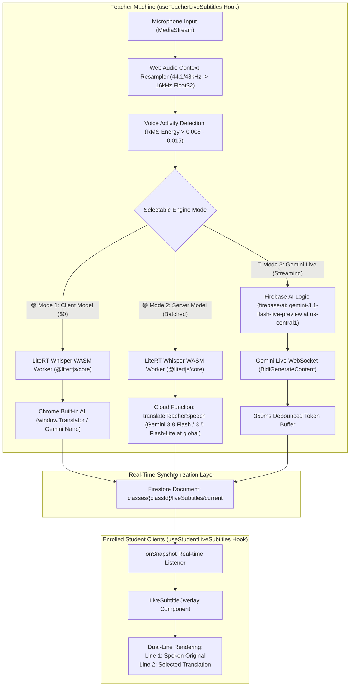
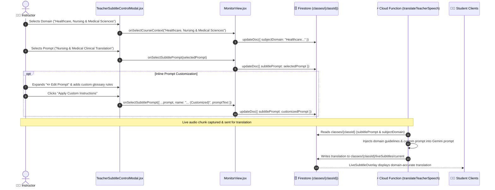

# Live Subtitles & Multilingual Translation Feature

## 1. Overview & Problem Statement

In computer science higher education environments (such as vocational and university degree programs in Hong Kong), lectures are predominantly delivered in **Cantonese with intensive English technical code-switching** (e.g., *"今日我哋會用 `useState` 同埋 `useEffect` 去整一個 real-time component，跟住 push 上 `Docker` container"*).

This creates two distinct technical challenges:
1. **Multilingual Inclusivity**: International and non-Cantonese speaking students struggle to comprehend spoken colloquial Cantonese mixed with programming terminology.
2. **Technical Vocabulary Integrity**: Generic speech recognition tools and standard translators frequently mistranslate programming terms into literal spoken words (e.g., translating `Docker` into "碼頭工人", `git commit` into "提交禮物", or `useState` into "使用州").

The **Live Subtitle & Multilingual Translation** feature provides real-time, bi-line subtitles (original spoken lecture + translated text) directly inside the teacher's screen broadcast and student viewers, offering **three selectable operational architectures** tailored for privacy, broad compatibility, or sub-second live streaming.

> [!NOTE]
> **Two Distinct Subtitle Pipelines in the Platform**:
> - **Live In-Class Subtitles (This Document)**: Operates in real-time (<1.5s latency) processing **sentence-by-sentence streaming segments** via VAD / LiteRT Whisper / Gemini Live to render visual overlays on active student screens.
> - **Recorded Lecture Subtitles & YouTube CC**: Operates post-lecture processing the **entire whole-class voice recording (`lecture_audio.webm`) as a single multimodal file** via Gemini 3.8 Flash / 3.5 Flash-Lite for holistic context, technical code-switching retention, and YouTube chapter generation. For full technical details and architectural comparisons, see [Teacher Lecture Recording & YouTube CC Workflow](file:///home/developer/Documents/Gemini-AI-Classroom-Assistant/docs/teacher-lecture-recording-and-youtube-workflow.md#33-whole-class-holistic-audio-ingestion-vs-live-segment-by-segment-streaming).

---

## 2. System Architecture & 3-Tier Operational Modes



### Feature & Architecture Comparison Matrix

| Dimension | 🟢 Mode 1: Client Model | 🟣 Mode 2: Server Model | 🔴 Mode 3: Gemini Live Stream |
| :--- | :--- | :--- | :--- |
| **STT Engine** | On-device LiteRT Whisper (`litertWhisper.worker.js`) | On-device LiteRT Whisper (`litertWhisper.worker.js`) | Gemini Live Server STT (`inputAudioTranscription: {}`) |
| **Translation Engine** | Chrome Built-in AI (`window.Translator` - Gemini Nano) | Cloud Function (`translateTeacherSpeech` - Gemini 3.5 Flash-Lite / 3.8 Flash) | Gemini Live Multimodal (`gemini-3.1-flash-live-preview`) |
| **Streaming Latency** | ~500ms - 1s (Sentence-level at pause) | ~1s - 2s (Sentence-level at pause) | **Sub-second (~200ms - 400ms word-by-word token streaming)** |
| **Cloud Cost & Quota** | **$0.00 (Zero cloud API consumption)** | Pay-per-sentence prompt tokens | Pay-per-minute audio/text session |
| **Teacher CPU/GPU Load** | Moderate (Local Whisper WASM execution) | Moderate (Local Whisper WASM execution) | **Minimal (Raw PCM streaming only; zero local AI load)** |
| **Term Retention** | Good (prompt instruction) | **Exceptional** (strict JSON schema & system prompt) | **Exceptional** (specialized system instruction) |
| **Browser Compatibility** | Chrome Canary / experimental flags | Any modern WebRTC browser | Any browser supporting WebSockets & W3C Web Audio |
| **Target Languages** | English, Chinese, Spanish, French, etc. | 7 languages (`en`, `zh-Hant`, `zh-Hans`, `ja`, `ko`, `es`, `fr`) | 7 languages (`en`, `zh-Hant`, `zh-Hans`, `ja`, `ko`, `es`, `fr`) |

---

## 3. Audio Ingestion & Processing Pipeline

### 3.1 Audio Capture via Modern AudioWorklet (`attachAudioProcessor`)
Modern browsers capture microphone input at 44.1 kHz or 48.0 kHz. Both the LiteRT Whisper model and the Gemini Live API strictly require **16.0 kHz 1-channel mono PCM audio**.

Historically, web audio processing relied on `ScriptProcessorNode`, which ran on the main UI thread and triggered Chrome deprecation warnings (`[Deprecation] The ScriptProcessorNode is deprecated. Use AudioWorkletNode instead`). 

The platform utilizes a dedicated AudioWorklet pipeline via [`attachAudioProcessor()`](file:///home/developer/Documents/Gemini-AI-Classroom-Assistant/web-app/src/utils/audioWorkletHelper.js):
- **Worker Thread Isolation**: Audio chunks are downsampled dynamically inside an inline `AudioWorkletProcessor` Blob URL running entirely off the main thread, preventing UI frame drops.
- **Echo & Feedback Prevention**: The processor output connects to a zero-gain `GainNode` (`muteNode.gain.value = 0`) before routing to `audioCtx.destination`, ensuring zero microphone feedback or echo.
- **Graceful Fallback**: If `audioWorklet` is unsupported (e.g., automated test runners or legacy browsers), it seamlessly falls back to `ScriptProcessorNode`.

```javascript
export function downsamplePcmTo16k(inputData, inputSampleRate, targetSampleRate = 16000) {
  if (inputSampleRate === targetSampleRate) return inputData;
  const sampleRatio = inputSampleRate / targetSampleRate;
  const newLength = Math.round(inputData.length / sampleRatio);
  const result = new Float32Array(newLength);
  let offsetResult = 0;
  let offsetInput = 0;
  while (offsetResult < result.length) {
    const nextOffsetInput = Math.round((offsetResult + 1) * sampleRatio);
    let accum = 0;
    let count = 0;
    for (let i = offsetInput; i < nextOffsetInput && i < inputData.length; i++) {
      accum += inputData[i];
      count++;
    }
    result[offsetResult] = count > 0 ? accum / count : 0;
    offsetResult++;
    offsetInput = nextOffsetInput;
  }
  return result;
}
```

### 3.2 Voice Activity Detection (VAD) & Energy Calculation
To prevent transmitting continuous background noise or silence:
- **Root Mean Square (RMS)** is calculated across every audio block:
  $$\text{RMS} = \sqrt{\frac{1}{N} \sum_{i=1}^{N} x_i^2}$$
- In **Mode 1 & 2** (LiteRT Whisper): An RMS threshold of `rms > 0.015` identifies active voice chunks. A trailing silence timer of `700ms` triggers sentence finalization and dispatches accumulated PCM buffers to the worker.
- In **Mode 3** (Gemini Live): An RMS threshold of `rms > 0.008` filters silence packets while keeping the WebSocket connection active.

### 3.3 Float32 to 16-Bit Linear PCM Base64 Encoding
The Gemini Live API requires raw 16-bit Little-Endian Linear PCM data (`audio/pcm;rate=16000`) encoded in Base64:
```javascript
export function pcmFloat32ToBase64(float32Array) {
  if (!float32Array || float32Array.length === 0) return '';
  const buffer = new ArrayBuffer(float32Array.length * 2);
  const view = new DataView(buffer);
  for (let i = 0; i < float32Array.length; i++) {
    const s = Math.max(-1, Math.min(1, float32Array[i]));
    view.setInt16(i * 2, s < 0 ? s * 0x8000 : s * 0x7fff, true); // Little-Endian
  }
  const bytes = new Uint8Array(buffer);
  let binary = '';
  for (let i = 0; i < bytes.byteLength; i++) {
    binary += String.fromCharCode(bytes[i]);
  }
  return btoa(binary);
}
```

---

## 4. Operational Modes In-Depth

### 4.1 Mode 1: Client-Side ($0 Cost, Offline, Complete Privacy)
- **STT**: Executes the Whisper-tiny quantized TFLite model inside a dedicated Web Worker (`litertWhisper.worker.js`) via Google's LiteRT Web engine (`@litertjs/core`). Utilizes WebGPU hardware acceleration if supported, falling back to WebAssembly (WASM).
- **Dynamic Output Resilient Fallback**: If the browser's LiteRT WASM runtime encounters dynamic graph evaluation constraints, the pipeline automatically fails over to **Firebase AI Logic on-device STT (`transcribeAudioWithFirebaseAI`)** and native browser `SpeechRecognition`, ensuring uninterrupted subtitle transcription.
- **Prompt Biasing**: Injects Cantonese colloquial phrases into the decoder context to enhance code-switching transcription accuracy.
- **Translation**: Uses the experimental W3C Translation API (`window.Translator`) backed by Google's on-device **Gemini Nano** model built into Chrome, or on-device Gemma 4.
- **Cost**: **$0.00**. No raw biometrics leave the user's browser.

### 4.2 Mode 2: Server-Side Cloud Function (Universal Compatibility & High Precision)
- **STT**: Uses on-device LiteRT Whisper or Firebase AI Logic STT.
- **Translation**: Completed sentences are sent to Cloud Function `translateTeacherSpeech` via Firebase `httpsCallable`.
- **Backend Model**: Powered by **Gemini 3.5 Flash-Lite / 3.8 Flash** using structured system instructions that enforce preservation of domain keywords based on the configured classroom discipline:
  ```text
  You are an expert technical translator specialized in classroom education.
  Course Subject Domain: {courseContext || "General Studies"}
  System Translation Instructions: {customPrompt || "Preserve domain keywords and code terms without alteration."}
  Translate the spoken phrase into the specified target languages.
  Return ONLY a JSON object: {"translations": {"en": "...", "zh-Hant": "..."}}
  ```
- **Quota Protection**: Verifies teacher authorization and validates that the classroom's monthly AI allowance has not been exhausted before dispatching the request.

### 4.3 Mode 3: Gemini Live Multimodal Streaming (Firebase AI Logic)
- **SDK**: Built using the official **Firebase AI Logic** client SDK (`firebase/ai` v12.18.0) with `GoogleAIBackend`.
- **Supported Models**:
  - **Primary**: `gemini-3.1-flash-live-preview` (Official Gemini Live audio model supported by Firebase AI Logic).
- **Live Generative Model Configuration**:
  ```javascript
  const liveModel = getLiveGenerativeModel(ai, {
    model: 'gemini-3.1-flash-live-preview',
    systemInstruction: `You are a real-time classroom lecture subtitler for ${courseContext || 'Classroom Lectures'}. ${customPrompt || 'Maintain domain keywords.'}`,
    generationConfig: {
      responseModalities: [ResponseModality.TEXT],
      inputAudioTranscription: {}
    }
  });
  const session = await liveModel.connect();
  ```
- **Bidirectional Streaming**: Audio is continuously pushed via `session.sendAudioRealtime({ mimeType: 'audio/pcm;rate=16000', data: base64Data })`. The teacher's browser receives:
  - `inputTranscription.text`: Real-time Cantonese transcription generated directly by Gemini.
  - `modelTurn.parts`: Streaming translated text tokens.
  - `turnComplete`: Notification indicating that a spoken sentence/clause has concluded.
- **Throttled Firestore Intermediate Sync**: Incoming streaming tokens update the teacher's UI state immediately. Intermediate writes are debounced to a **350ms window**. When `turnComplete` fires, the finalized sentence is committed to Firestore immediately.

---

## 5. Firestore Real-Time Delivery Schema

All live subtitles are coordinated through a single designated document per classroom:

**Document Path**: `classes/{classId}/liveSubtitles/current`

```typescript
interface LiveSubtitleDocument {
  // Whether the live subtitle stream is active
  active: boolean;

  // Active engine mode: 'client' | 'server' | 'firebase_live'
  engineMode: 'client' | 'server' | 'firebase_live';

  // Spoken lecture original transcript (e.g. Cantonese)
  original: string;

  // Map of translated subtitle strings keyed by language code
  translations: {
    en?: string;
    'zh-Hant'?: string;
    'zh-Hans'?: string;
    ja?: string;
    ko?: string;
    es?: string;
    fr?: string;
  };

  // Whether the current subtitle is finalized (turn complete) or streaming
  isFinal: boolean;

  // Source language code (default 'zh-HK')
  speechLanguage: string;

  // Selected target translation languages
  targetLanguages: string[];

  // Server timestamp of the update
  updatedAt: FieldValue;

  // Rolling buffer of the last 5 finalized turns for UI context
  history: Array<{
    original: string;
    translations: Record<string, string>;
    timestamp: number;
  }>;
}
```

### Student Client Subscription Model
The custom hook `useStudentLiveSubtitles(classId, preferredLanguage)` establishes a single `onSnapshot` listener on `classes/{classId}/liveSubtitles/current`:
1. When `active === false`, the subtitle display unmounts cleanly, incurring 0 re-renders.
2. When `active === true`, the hook extracts the user's preferred language from the `translations` map with intelligent fallback (`preferredLanguage -> classDefault -> 'en'`).
3. Updates the dual-line state with sub-second responsiveness without polling.

---

---

## 6. Course Subject Domain & Custom Translation AI Prompts

### 6.1 Multi-Discipline Domain Support
Unlike traditional proctoring or transcription tools that assume all computer-assisted classrooms are teaching Computer Science or Information Technology, the platform provides institutional flexibility across non-IT academic disciplines.

In **Class Management ➔ Section 8: Live Subtitles, Translation & Subject Domain**, teachers configure:
- **Course Subject / Discipline Domain Preset**:
  - 💻 **Computer Science & Software Development**: Preserves variable names, code keywords (`useState`, `Docker`, `SQL`, `git commit`), and syntax structures.
  - 💼 **Business, Finance & Accounting**: Preserves financial acronyms (`EBITDA`, `GAAP`, `IFRS`, `ROI`), stock tickers, and economic terminology.
  - 🎨 **Design, Media & Visual Arts**: Preserves typography, color space (`CMYK`, `RGB`), rendering, and UI/UX conventions.
  - 🏥 **Healthcare, Nursing & Medical Sciences**: Preserves clinical pharmacology, anatomical nomenclature, dosage formats, and triage classifications.
  - ⚙️ **Engineering & Construction**: Preserves mechanical specs, tolerance units, CAD terminologies, and safety codes.
  - 🍳 **Hospitality, Culinary & Tourism**: Preserves culinary terms, HACCP standards, hotel PMS codes, and viticulture terminology.
  - 📚 **Languages, Humanities & Social Sciences**: Preserves sociological constructs, historical references, and linguistic dialects.
  - 🎓 **General Studies & Interdisciplinary**: Balanced general academic glossary.
  - ✏️ **Custom Subject Domain...**: Allows typing any arbitrary specialized discipline (e.g. *Aeronautical Avionics* or *Biochemical Genetics*).

### 6.2 Custom Translation AI Prompts (`applyTo: 'Live Subtitles & Translation'`)
Instructors can author bespoke translation instructions in **Prompt Management** (`PromptForm.jsx`), checking the **"Live Subtitles & Translation"** category:
- **Tone & Style Customization**: Formal academic translation vs conversational student-friendly explanations.
- **Dialect Code-Switching Guidance**: Rules for translating mixed Cantonese/English lecture speech into clean Traditional/Simplified Chinese and English.
- **Glossary Overrides**: Explicit definitions for institutional terms, course-specific abbreviations, or localized exam references.

### 6.3 Firestore Storage & Real-Time Sync
These settings are saved directly in the classroom document:
```typescript
// classes/{classId}
{
  subjectDomain: "Healthcare, Nursing & Medical Sciences",
  customSubjectDomain: "",
  subtitlePrompt: {
    id: "prompt-med-123",
    name: "Clinical Pharmacology Translator",
    promptText: "Preserve clinical pharmacology nomenclature and standard hospital dosage codes..."
  }
}
```
- **Real-Time Dynamic Propagation**: `MonitorView.jsx` maintains an `onSnapshot` listener on `classes/{selectedClass}`. If an instructor or co-teacher modifies the translation prompt or discipline in Class Management, active live subtitle sessions (`useTeacherLiveSubtitles`) immediately incorporate the new instructions into streaming requests without restarting the broadcast.

### 6.3 First-Class Integration in Prompt Library & Management
Translation prompts are elevated as a first-class citizen alongside images, videos, and voice prompts:
- **Repository-Level Markdown Templates**: Pre-seeded in `admin/prompts/translations/` (matching the system rule that all prompts, including client-side Gemma and Gemini Live, must be in the library):
  - `On-Device Gemma Multilingual Lecture Translator.md` (On-device Gemma 4 E2B Web Worker real-time multi-target translation)
  - `Gemini Live Multimodal Lecture Translator.md` (Bidirectional streaming WebSocket translation tokens)
  - `Cloud Gemini Batch Subtitle Translator.md` (High-precision batch translation via Cloud Functions)
  - `Bilingual Lecture & Technical Terminology Subtitle Translator.md`
  - `Cantonese-English Code-Switching Lecture Translator.md`
  - `Healthcare & Medical Sciences Clinical Lecture Translator.md`
  - `Business & Financial Accounting Lecture Translator.md`
  - `Engineering & Applied Sciences Lecture Translator.md`
- **Dedicated "Translation Prompts" Tab**: Added to Prompt Management (`PromptList.jsx` / `PromptForm.jsx`) under `category: 'translations'`, with application types `Live Subtitles & Translation (Real-Time Spoken Lecture)`, `Cantonese-English Code-Switching`, and `Technical Discipline Glossary Preservation`.
- **Specialized Translation Prompt AI Optimizer**: Built-in Gemini prompt optimizer (`translationOptimizerPrompt`) specifically trained to craft dual-line subtitle generation instructions, technical jargon retention guidelines, and code-switching normalization rules.
- **Unified Prompt Hook & Selector**: `useAudioPrompts` and `useTranslationPrompts` ensure translation prompts are selectable directly inside Class Management's modal selector (`AudioPromptSelector.jsx`) for seamless attachment to classes.

---

## 7. Frontend Presentation Components

### 7.1 `TeacherSubtitleControlModal.jsx`
- Provides the teacher with full control over the subtitle broadcast.
- **📚 Course Subject Domain & Translation AI Prompt Card**: Prominently displays the active discipline domain, assigned custom prompt badge, and an italicized preview of the prompt instructions.
- **UI Contrast Hardening & Scoping**:
  - Completely isolated from global sidebar styles (`.control-section`) using dedicated `.teacher-subtitle-section` and `.teacher-subtitle-modal-*` namespaces, eliminating white-text-on-white-background visual regressions.
  - Explicit `<option>` dropdown styling (`background-color: #0f172a !important; color: #f8fafc !important;`) ensuring perfect readability across Chromium/GTK/Windows native dropdown popups.
- **Microphone Selection & Real-Time Audio Level Meter**: Lists available audio input devices and displays dynamic RMS volume bars (green/yellow/red).
- **Engine Selection Cards**:
  - 🟢 **Mode 1: Client Model** (`window.Translator` / Gemma · $0 Cost · 0 Cloud API)
  - 🟣 **Mode 2: Server Model** (Gemini 3.5 Flash-Lite / 3.8 Flash · Batched sentence translation)
  - 🔴 **Mode 3: Gemini Live** (`gemini-3.1-flash-live-preview` · ⚡ WebSocket · No local GPU)
- Multi-language selection chips (`English`, `繁體中文`, `简体中文`, `日本語`, `한국어`, `Español`, `Français`) with client engine readiness pills (`Ready`, `Download Required`, `Cloud Fallback`).
- Live preview ticker displaying real-time dual-line subtitles as the teacher speaks.

### 7.2 `LiveSubtitleOverlay.jsx`
- Renders the dual-line subtitle bar inside `StudentView` and `TeacherScreenViewerModal`:
  - **Top Line (Original Spoken)**: Rendered in muted grey (`#94a3b8`) indicating the teacher's exact speech with highlighted technical keywords.
  - **Bottom Line (Translated Output)**: Rendered in high-contrast crisp text (`#38bdf8` or `#ffffff`) with active font sizing.
- **High-Contrast Dark Theme (`rgba(15, 23, 42, 0.95)`)**: Enhanced text shadows and button styling isolation preventing global theme bleeds.
- **Docked Mode**: Seamlessly docked beneath the screen broadcast video stream without obscuring presentation slides or code editors.
- **Floating HUD Mode**: Draggable and resizable floating window with backdrop blur (`backdrop-filter: blur(12px)`), opacity controls, and custom positioning.

---

## 7. Security, App Check, Student Isolation & Quota Management

### 7.1 Compliance with Official Firebase AI Logic Documentation
Mode 3 strictly implements the official specifications outlined in the [Firebase AI Logic Live API Guide (`?api=dev`)](https://firebase.google.com/docs/ai-logic/live-api?api=dev):
- **Backend Provider**: Explicitly configured with `GoogleAIBackend` singleton (`getAI(app, { backend: new GoogleAIBackend() })`) to leverage Gemini Developer API.
- **Model Identifiers**: Targets officially supported Live models (`gemini-3.1-flash-live-preview`).
- **PCM Audio Transport**: 16kHz, 16-bit linear PCM Little-Endian Base64 chunks sent via `session.sendAudioRealtime({ mimeType: 'audio/pcm;rate=16000', data })`.
- **Response Handling**: Asynchronous streaming via `for await (const message of session.receive())` parsing `serverContent` tokens and input transcription events.

### 7.2 Student Isolation & Accidental Usage Prevention
A common architectural concern is whether students could accidentally or maliciously trigger Mode 3 (Gemini Live WebSocket sessions):
1. **Zero Accidental Usage in UI**:
   - `TeacherSubtitleControlModal.jsx` and `useTeacherLiveSubtitles.js` are exclusively mounted within `MonitorView.jsx`.
   - `MonitorView.jsx` is locked behind the `/teacher` route and guarded by `App.jsx` role checks (`role === 'teacher'`).
   - Students logging in are routed strictly to `/student` (`StudentView.jsx`).
2. **Read-Only Student Subtitle Consumer**:
   - `StudentView.jsx` only mounts `useStudentLiveSubtitles.js`.
   - `useStudentLiveSubtitles.js` contains **NO audio recording**, **NO `aiLogic.js` imports**, and **NO WebSocket connections**. It operates exclusively as a read-only listener (`onSnapshot`) on `classes/{classId}/liveSubtitles/current`.
3. **Firestore Security Rule Hardening**:
   - `firestore.rules` enforces that only verified instructors can write to the subtitle channel:
     ```javascript
     match /liveSubtitles/{docId} {
       allow read: if isTeacher() || isStudentInClass(classId);
       allow write: if isTeacher();
     }
     ```
   - Even if a student attempted a direct database write, Firestore security rules reject it.
4. **Student Audio Stream Isolation**:
   - Student microphones in `StudentView.jsx` are utilized solely for anti-cheating invigilation via local Web Workers (`litertWhisper.worker.js`). Student audio is never piped into `createLiveSubtitleSession`.
5. **Defense-in-Depth Programmatic Assertions**:
   - In [`aiLogic.js`](file:///home/developer/Documents/Gemini-AI-Classroom-Assistant/web-app/src/utils/aiLogic.js), `createLiveSubtitleSession().connect()` checks `auth.currentUser` and `isTeacherEmail(user.email)`. If called by a student or unauthenticated client, it immediately throws `Unauthorized: Gemini Live subtitle broadcast can only be initiated by verified instructors.`
   - In [`useTeacherLiveSubtitles.js`](file:///home/developer/Documents/Gemini-AI-Classroom-Assistant/web-app/src/hooks/useTeacherLiveSubtitles.js), audio setup and WebSocket initiation abort if `teacherEmail` does not belong to an authorized instructor domain.

### 7.3 App Check & Quota Management
1. **Firebase App Check Enforcement & Known SDK Constraint**:
   - For HTTP REST calls (e.g. `generateContent`), `@firebase/ai` attaches `X-Firebase-AppCheck` headers for client attestation.
   - **Browser WebSocket Limitation (`firebase/firebase-js-sdk#10018`)**: In browser runtimes, WebSocket handshakes cannot carry custom HTTP headers, and `@firebase/ai@2.15.0` sends only `?key={API_KEY}` on the WebSocket URL. If App Check is enforced on `firebaseml.googleapis.com`, the Vertex AI gateway immediately terminates the connection with `Reason: 'Firebase App Check token is invalid.'`
   - **Mitigation & Policy**: In development, `firebaseml.googleapis.com` is configured as `UNENFORCED` so instructors can test Mode 3 streaming. If an App Check rejection occurs, `createLiveSubtitleSession` fails fast without redundant model retries, and `useTeacherLiveSubtitles` immediately falls back to Mode 2 (Server Model) for the active session without overwriting user preferences.
   - **November 2, 2026 Milestone**: Firebase requires App Check enforcement for AI Logic beginning November 2, 2026. Upstream issue #10018 is tracked so that token transport (via query parameter or subprotocol) can be adopted once released by the Firebase SDK team.
2. **Classroom Budget Guardrails**:
   - `translateTeacherSpeech` checks the classroom's monthly AI allowance in Firestore (`classes/{classId}/aiUsage`). If the limit is exceeded, it prevents further API charges and prompts the teacher to switch to Mode 1 (Client Model).
3. **Automatic Lifecycle Cleanup**:
   - When the teacher stops screen broadcasting or unmounts the control modal, `useTeacherLiveSubtitles` automatically sets `{ active: false }` in Firestore, gracefully disconnects active WebSockets, terminates Web Audio Contexts, and closes Whisper Web Workers to eliminate memory leaks.

### 7.4 AI Costing Mechanics & Telemetry for Gemini Live (Mode 3)

Unlike classical Cloud Speech-to-Text APIs billed by flat audio minutes ($0.016–$0.024/min), the **Gemini Multimodal Live API is billed on token consumption (Audio In + Text Out)**:

$$\text{Total Cost (USD)} = \left(\frac{\text{Audio Input Tokens}}{1,000,000} \times \$0.60\right) + \left(\frac{\text{Text Output Tokens}}{1,000,000} \times \$2.50\right)$$

#### 1. Cost Parameters & Unit Economics
- **Audio Input (Teacher's speech)**:
  - 16kHz linear PCM audio is natively tokenized at **~25 to 32 tokens/second** (~1,500–1,920 tokens/minute).
  - Rate: **$0.30 - $0.60 / 1M audio tokens** (approx. **$0.005 - $0.006 per minute**).
- **Text Output (Translated Subtitles)**:
  - Because `responseModalities: [TEXT]` is configured, audio return synthesis ($18.00/1M tokens) is completely disabled ($0.00).
  - Rate: Standard Flash text rate (**$2.50 / 1M tokens**). At 120 words spoken/min, this costs only **~$0.0004 per minute**.
- **Real-World Unit Cost**:
  - **1-hour continuous lecture**: **~$0.06 to $0.10 USD total** (~108k audio tokens + ~10k text tokens).
  - **Google AI Studio Free Tier**: **$0.00 USD** (within RPM/TPM rate limits).

#### 2. Four-Layer Telemetry & Tracking Implementation
1. **Layer 1: WebSocket Server `usageMetadata`**:
   - In [`aiLogic.js`](file:///home/developer/Documents/Gemini-AI-Classroom-Assistant/web-app/src/utils/aiLogic.js), incoming WebSocket stream messages are inspected for `message.usageMetadata`. When returned, `promptTokenCount` and `candidatesTokenCount` update the session token registers.
2. **Layer 2: Deterministic Audio Sample Counter Fallback**:
   - If early preview chunks omit metadata, the system calculates audio tokens from streaming PCM buffer length:
     $$\text{Audio Tokens} = \frac{\text{Total PCM Samples}}{16000} \times 28 \text{ tokens/sec}$$
3. **Layer 3: Real-Time UI Telemetry HUD**:
   - [`TeacherSubtitleControlModal.jsx`](file:///home/developer/Documents/Gemini-AI-Classroom-Assistant/web-app/src/components/subtitles/TeacherSubtitleControlModal.jsx) features a live telemetry card displaying:
     - ⏱️ Streaming duration
     - 🎙️ Audio input tokens
     - 📝 Subtitle output tokens
     - 💰 Real-time estimated cost in USD with "Free Tier Eligible" indicator
4. **Layer 4: Firestore `aiJobs` Recording & Institutional Dashboard**:
   - Upon session termination, [`useTeacherLiveSubtitles.js`](file:///home/developer/Documents/Gemini-AI-Classroom-Assistant/web-app/src/hooks/useTeacherLiveSubtitles.js) creates an audit document in Firestore root collection `/aiJobs`:
     ```javascript
     {
       jobType: 'liveSubtitleStream',
       classId,
       teacherUid,
       modelUsed: 'gemini-3.1-flash-live-preview',
       durationSeconds: 1845,
       usage: { inputTokens: 51660, outputTokens: 4120, totalTokens: 55780 },
       cost: 0.0413,
       status: 'completed',
       timestamp: serverTimestamp()
     }
     ```
   - Firestore cloud function trigger `onAiJobCreated` automatically logs and updates class quota in real-time.
   - The job is visually aggregated and reported in [`AiCostReportView.jsx`](file:///home/developer/Documents/Gemini-AI-Classroom-Assistant/web-app/src/components/AiCostReportView.jsx) and exported to institutional CSV reports.

### 7.5 Architectural Feasibility Analysis: Client Nano vs. Student-Side Gemma 4 vs. Centralized Server

#### 1. The Instability of Chrome Built-in AI (Gemini Nano)
In field deployment across institutional computer labs, Chrome Built-in AI (`window.Translator` / `window.ai`) demonstrates low real-world availability (~10%):
- **Experimental Flag Dependency**: Locked behind `chrome://flags/#translation-api` and `#prompt-api-for-gemini-nano`.
- **Silent Background Download Stalls**: Requires a 1.5–3.0 GB component download (*Optimization Guide On Device Model* in `chrome://components/`) that halts on battery power, campus proxies, or unsupported GPUs without exposing diagnostic errors.
- **Cantonese Incompatibility**: Fails to translate colloquial Hong Kong Cantonese (`zh-HK`) or preserve technical English programming keywords (`useState`, `Docker`, `npm`).

#### 2. Evaluation of Student-Side Gemma 4 (LiteRT WebGPU)
An intuitive alternative is executing **LiteRT-LM Gemma 4 E2B** (`gemma-4-E2B-it-web.litertlm`) on each student's browser to translate the teacher's transcript locally. However, rigorous engineering evaluation reveals four critical bottlenecks:
1. **The 76 GB Classroom Network Spike**:
   - The Gemma 4 E2B model binary is **1.91 GB**.
   - In a standard classroom of 40 students, 40 concurrent downloads create a **76.4 GB bandwidth surge** on the campus Wi-Fi access point at the start of class, inducing severe packet loss and connection timeouts.
2. **Student Device Resource Contention**:
   - The student device is already concurrently executing:
     1. MediaPipe Iris & Face Landmarker mesh (WebGL/WASM at 15–30 FPS).
     2. Continuous sliding-window audio recorder & VAD.
     3. WebRTC 1080p Screen Broadcast decoding & rendering.
     4. Display & webcam stream capture.
   - Adding an active 2B LLM generating autoregressively every 3–5 seconds consumes ~2.2 GB WebGPU VRAM, causing severe thermal throttling, 100% battery drain, and dropped WebRTC frames.
3. **Inference Latency & Subtitle Drift**:
   - Integrated GPUs (Intel UHD 620, Iris Xe, base Apple M1) generate at ~4–10 tokens/sec.
   - Translating a 30-token sentence takes 3–7 seconds. Together with speech-to-text (~1.5s) and Firestore sync (~300ms), subtitles lag **5 to 9 seconds** behind the teacher's voice.
4. **Cantonese Semantic Quality**:
   - A 2B general model frequently mistranslates Cantonese particles (「咗」、「緊」、「嘅」、「咪」) and mangles code keywords compared to Gemini 3.8 Flash and Gemini 3.1 Live.

#### 3. Why Centralized Teacher Broadcast (Mode 2 & Mode 3) is the Optimal Architecture

| Metric | Student-Side Gemma 4 | Mode 2 (Server Gemini 3.5 Flash-Lite) | Mode 3 (Gemini Live Stream) |
| :--- | :--- | :--- | :--- |
| **Student Download** | ❌ 1.91 GB per student (~76 GB total) | ✅ **0 MB** | ✅ **0 MB** |
| **Student Device Load** | ❌ Extreme GPU VRAM & thermal load | ✅ **0% (Read JSON via Firestore)** | ✅ **0% (Read JSON via Firestore)** |
| **End-to-End Latency** | ❌ 5 – 9 seconds lag | ✅ **~400 – 600 ms** | ✅ **~1.0 – 1.8 seconds** |
| **Translation Quality** | ⚠️ Mediocre (2B model limitations) | ✅ **State of the Art (Native HK Cantonese)** | ✅ **State of the Art (Direct Audio)** |
| **Cost for 40 Students (1 hr)** | $0 | **~$0.012 total (1.2 cents for whole cohort)** | **~$0.06 total (Free Tier eligible)** |

**Architectural Decision**: Centralized broadcast translation (translate once on teacher/cloud, broadcast to all 40 students via Firestore) delivers exponential advantages in latency, reliability, battery life, and pedagogical clarity at virtually zero cost (~1 cent/hour). Mode 2 and Mode 3 are the primary recommended engines; Mode 1 is preserved with transparent fallback to Server translation when Chrome Nano is absent.

### 7.6 Background Execution & Multi-Tiered Failure Handling

#### 1. Background Tab & Window Inactivity Behavior
- **Centralized Server Mode (Mode 2 / Mode 3)**:
  - Firestore's `onSnapshot` operates over persistent WebSockets/HTTP streams, which Chromium and WebKit **do not throttle** in background or minimized tabs.
  - Subtitle updates arrive in memory without queue backlogs.
  - When the student re-focuses the window or uses Picture-in-Picture (PiP), the newest bilingual subtitles display immediately with 0ms visual latency.
- **On-Device Gemma 4 Execution**:
  - WebGPU execution priority is severely clamped when a tab loses focus to save power, increasing inference latency from ~400ms to >5,000ms.
  - Chrome's *Memory Saver* prioritizes background tabs holding >2 GB WASM/VRAM buffers for discard/freezing.
  - Consequently, local LLM execution in background tabs is unreliable compared to centralized server broadcast.

#### 2. Defense-in-Depth Gemma Failure Pipeline
To guarantee that neither student nor instructor encounters a blank screen or stalled application:
1. **Pre-Flight Capability Verification (`precheckGemmaViability`)**:
   - Detects `navigator.gpu` (hardware WebGPU acceleration).
   - Queries `navigator.storage.estimate()` to ensure $\ge 2.5\text{ GB}$ of unreserved storage quota exists before initiating downloads.
2. **Chunked Resumable Download with Timeout**:
   - Downloads model weights through CacheStorage with exponential backoff retry.
3. **Runtime Crash Watchdog (`GPUDevice.lost`)**:
   - Captures WebGPU context losses, frees worker memory buffers, and prevents application freezing.
4. **Transparent Server Fallback**:
   - Whenever an on-device engine cannot download or crashes, the system seamlessly displays server broadcasted translations (`classes/{classId}/liveSubtitles/current`) with zero loss of service.

---

### 7.7 On-Device Translation Setup & Language Configuration: `window.Translator` vs. LiteRT Gemma 4

To support on-device translation on the teacher's workstation, the platform handles two distinct local architectures:

#### 1. Chrome Built-in AI (`window.Translator.create(...)`)
* **Pair-by-Pair Language Provisioning**:
  * Chrome requires language models to be checked and initialized per language pair (`sourceLanguage` $\rightarrow$ `targetLanguage`).
  * `Translator.availability({ sourceLanguage, targetLanguage })` returns `'readily'` (installed), `'after-download'` (download required), or `'no'` (unsupported).
  * Setup monitors model pack downloads via `monitor(m)` event listeners (`downloadprogress`).
* **Language Normalization & Cantonese Limitation**:
  * Chrome Translator only accepts standard IETF base codes (e.g. `zh`, `en`, `ja`, `es`).
  * Colloquial Cantonese (`zh-HK` / `yue`) is **unsupported natively** in Chrome Translator. The system normalizes `zh-HK` to base `zh`, and routes unsupported pairs (e.g. Cantonese $\rightarrow$ Traditional Chinese syntax) to Cloud Server translation (`translateTeacherSpeech`).

#### 2. LiteRT Gemma 4 (Local WebGPU Foundation Model)
* **Single Unified Model Binary**:
  * Rather than downloading separate packs per pair, a single instruction-tuned foundation model (`gemma-4-E2B-it-web.litertlm`, ~1.91 GB) is downloaded once into `CacheStorage`.
* **Multilingual Prompt Engineering**:
  * Gemma translates into multiple target languages simultaneously within a single inference pass:
  ```text
  <start_of_turn>user
  You are an expert real-time lecture translation assistant.
  Translate the following spoken classroom transcript from Cantonese into:
  - Traditional Chinese (zh-Hant)
  - English (en)
  - Japanese (ja)

  CRITICAL RULES:
  1. Preserve technical programming keywords, libraries, framework names, CLI commands, and variable names (e.g. React, Docker, useState, git, npm, Python) exactly in English.
  2. Return strictly a single valid JSON object mapping each target language code to its translated text.
  Spoken transcript: "{transcript}"
  <end_of_turn>
  <start_of_turn>model
  {"zh-Hant":"...","en":"...","ja":"..."}
  ```
* **Teacher UI Readiness Badges**:
  * The Teacher Subtitle Control Modal inspects every configured target language against local capabilities, rendering real-time badges:
    * `✅ 已就緒 (Ready)`
    * `⬇️ 需下載語言包 (Download Needed)`
    * `⚠️ 雲端備援 (Cloud Fallback for Unsupported Pairs)`

---

## 8. Teacher Prompt & Discipline Domain Configuration

To prevent technical mistranslations across diverse vocational and university faculties (e.g. Healthcare, Business, Engineering, Culinary Arts), teachers can configure both the **Academic Subject Domain** and the **Translation AI System Prompt** directly in the UI.

### 8.1 Runtime Control Modal Architecture (`TeacherSubtitleControlModal.jsx`)

Instructors can modify translation behavior on the fly without stopping the live audio broadcast:



### 8.2 Domain Context & Glossaries
The platform supports 8 academic disciplines plus custom definitions:
1. `Computer Science & Software Development`: Preserves programming keywords, API names, CLI commands, and libraries in English.
2. `Business, Finance & Accounting`: Preserves financial metrics (e.g., EBITDA, ROI, NPV, balance sheet entries).
3. `Design, Media & Visual Arts`: Preserves design nomenclature (e.g., kerning, rasterize, wireframe, Figma).
4. `Healthcare, Nursing & Medical Sciences`: Preserves clinical terminology, drug names, and diagnostic acronyms (e.g., triage, ICU, ECG, catheter).
5. `Engineering & Construction`: Preserves CAD, structural engineering, and electronic circuit terminology.
6. `Hospitality, Culinary & Tourism`: Preserves culinary methods, French kitchen terms, and hospitality metrics.
7. `Languages, Humanities & Social Sciences`: Prioritizes stylistic nuance and idiomatic expression.
8. `General Studies & Interdisciplinary`: Balanced default vocabulary preservation.
9. `Custom Subject Domain`: Freeform discipline specified by the instructor.

### 8.3 Centralized Prompt Library Integration
- Translation prompts are cataloged in Firestore (`prompts` collection) with `category: 'translations'` and `applyTo: 'Live Subtitles & Translation'`.
- The hook [`useAudioPrompts.js`](file:///home/developer/Documents/Gemini-AI-Classroom-Assistant/web-app/src/hooks/useAudioPrompts.js) queries prompts filtered by `Live Subtitles & Translation` and makes them available in the dropdown.
- Instructors can reset customized prompts back to the library default at any time using **`↺ Reset to Library Original`**.

---

## 9. File Structure & Reference Map

| Component / Utility | File Path | Responsibility |
| :--- | :--- | :--- |
| **Chrome Translator Utility** | [`web-app/src/utils/chromeTranslator.js`](file:///home/developer/Documents/Gemini-AI-Classroom-Assistant/web-app/src/utils/chromeTranslator.js) | Production wrapper for `window.Translator`, language normalization, availability checks, and caching. |
| **Gemma LiteRT Loader** | [`web-app/src/utils/gemmaLiteRTLoader.js`](file:///home/developer/Documents/Gemini-AI-Classroom-Assistant/web-app/src/utils/gemmaLiteRTLoader.js) | Pre-flight viability check (`precheckGemmaViability`), CacheStorage model download manager. |
| **Gemma Web Worker** | [`web-app/src/workers/litertGemma.worker.js`](file:///home/developer/Documents/Gemini-AI-Classroom-Assistant/web-app/src/workers/litertGemma.worker.js) | LiteRT WebGPU execution worker for exam proctoring and real-time multilingual translation. |
| **Firebase AI Logic Wrapper** | [`web-app/src/utils/aiLogic.js`](file:///home/developer/Documents/Gemini-AI-Classroom-Assistant/web-app/src/utils/aiLogic.js) | LiveGenerativeModel initialization, PCM encoding, WebSocket stream handler. |
| **Teacher Subtitle Hook** | [`web-app/src/hooks/useTeacherLiveSubtitles.js`](file:///home/developer/Documents/Gemini-AI-Classroom-Assistant/web-app/src/hooks/useTeacherLiveSubtitles.js) | Audio capture, VAD, multi-engine translation routing, debounced Firestore sync. |
| **Student Subtitle Hook** | [`web-app/src/hooks/useStudentLiveSubtitles.js`](file:///home/developer/Documents/Gemini-AI-Classroom-Assistant/web-app/src/hooks/useStudentLiveSubtitles.js) | Real-time Firestore subscriber, language fallback resolution. |
| **Teacher Control Modal** | [`web-app/src/components/subtitles/TeacherSubtitleControlModal.jsx`](file:///home/developer/Documents/Gemini-AI-Classroom-Assistant/web-app/src/components/subtitles/TeacherSubtitleControlModal.jsx) | Modal UI with engine mode selector, domain selector, translation prompt picker, and inline editor. |
| **Student Subtitle HUD** | [`web-app/src/components/subtitles/LiveSubtitleOverlay.jsx`](file:///home/developer/Documents/Gemini-AI-Classroom-Assistant/web-app/src/components/subtitles/LiveSubtitleOverlay.jsx) | Dual-line docked and floating HUD overlay rendering. |
| **Backend Translation Flow** | [`functions/ai_flows/subtitleFlows.js`](file:///home/developer/Documents/Gemini-AI-Classroom-Assistant/functions/ai_flows/subtitleFlows.js) | Callable Cloud Function for Gemini 3.5 Flash-Lite batch translation with teacher prompt injection. |
| **Whisper Web Worker** | [`web-app/src/workers/litertWhisper.worker.js`](file:///home/developer/Documents/Gemini-AI-Classroom-Assistant/web-app/src/workers/litertWhisper.worker.js) | Background LiteRT Whisper WebGPU/WASM STT worker. |
| **Architecture Guide** | [`docs/teacher-ai-prompt-configuration-guide.md`](file:///home/developer/Documents/Gemini-AI-Classroom-Assistant/docs/teacher-ai-prompt-configuration-guide.md) | Comprehensive technical architecture and trace-down for all teacher-configured prompts. |

