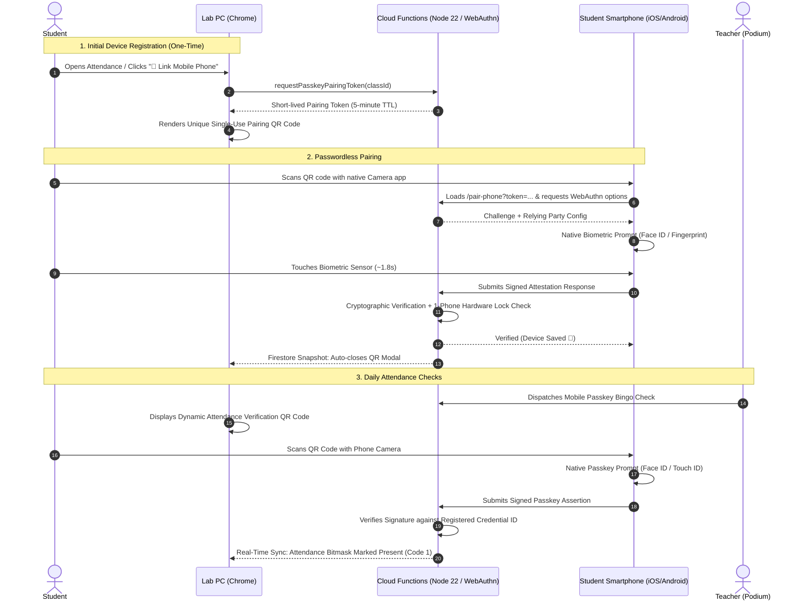
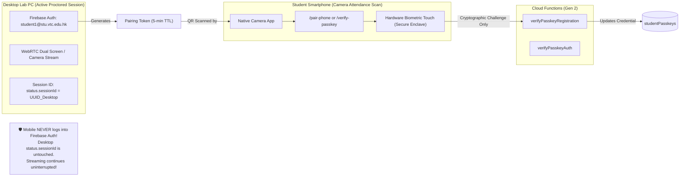

# 📱 Mobile Passkey Device Registration & Attendance Guide

[🏠 Documentation Index](../README.md#documentation-index) | [🧑‍🎓 Student User Manual](./user-manual-student.md) | [👨‍🏫 Teacher User Manual](./user-manual-teacher.md) | [🏛️ System Architecture](./system-architecture.md)

---

## 🎯 Executive Overview

In academic computer labs without webcams or hardware biometric readers on desktop PCs, students often share login credentials or remotely log into each other's accounts. 

To eliminate proxy attendance without requiring expensive lab hardware upgrades or invasive software installs, the **Google AI Classroom Platform** incorporates **Mobile Passkey Biometric Verification (FIDO2 / WebAuthn)**.

### Key Architectural Guarantees:
- **Zero Passwords on Mobile**: Students never type emails or passwords on their smartphones. Pairing is authorized via an encrypted, single-use token on their already-authenticated lab PC.
- **1-Phone = 1-Student Hardware Lock**: The platform authenticator's public credential ID is bound directly to the student's UID. The server cryptographically rejects attempts to register the same physical smartphone to multiple student accounts.
- **Fast Attendance (< 2 Seconds)**: Routine in-class attendance requires only pointing the phone camera at the PC screen and touching the biometric sensor (Face ID, Touch ID, or Android Fingerprint).
- **Teacher-Assisted Failsafes**: Built-in 1-click in-person verification for dead/broken phones and instant passkey resets for student phone replacements with full immutable audit logging.

---

## 🔄 End-to-End Visual Sequence



---

## 🧑‍🎓 Student Walkthrough: Device Registration & Daily Attendance

### Step 1: Initial Device Registration (One-Time Only)

When you first join a lab session or click **`📱 Link Phone`** on your Lab PC:

```
  ╔══════════════════════════════════════════════════════════╗
  ║  📱 Link Your Mobile Phone for Lab Attendance            ║
  ║                                                          ║
  ║  Scan this QR code with your phone camera to pair your   ║
  ║  device for biometric passkey attendance.                ║
  ║                                                          ║
  ║                  ┌──────────────────┐                    ║
  ║                  │  ██████  ██████  │                    ║
  ║                  │  ██  ██  ██  ██  │                    ║
  ║                  │      ██████      │                    ║
  ║                  │  ██  ██  ██  ██  │                    ║
  ║                  │  ██████  ██████  │                    ║
  ║                  └──────────────────┘                    ║
  ║                                                          ║
  ║  ⏱️ Single-use token expires in 5:00                     ║
  ║  🔒 No password required on mobile                       ║
  ╚══════════════════════════════════════════════════════════╝
```

1. **On your Lab PC:**
   - Log in to your student account on Google Chrome.
   - Click **`📱 Link Mobile Phone`** (or open the attendance prompt).
   - A single-use QR code is displayed on your monitor.

2. **On your Smartphone:**
   - Open your smartphone's built-in **Camera app** (iOS Camera or Android Camera/Google Lens).
   - Point your camera at the QR code on your PC monitor.
   - Tap the link notification that appears (`/pair-phone?token=...`).

3. **Complete Biometric Touch:**
   - On the mobile screen, tap **`[ 📱 Pair This Phone ]`**.
   - Your smartphone displays its native biometric security dialog:
     - **Apple iOS**: *"Do you want to save a passkey for this account?"* ➔ Confirm with **Face ID** or **Touch ID**.
     - **Android**: *"Create a passkey with screen lock"* ➔ Confirm with **Fingerprint** or **Biometrics**.
   - The phone screen turns green: **"Device Paired Successfully!"** (e.g., *Linked: Apple iPhone*).

4. **Instant PC Feedback:**
   - Your Lab PC monitor automatically detects the completed registration via real-time Firestore sync and dismisses the pairing modal.

---

### Step 2: Daily Lab Attendance Verification (< 2 Seconds)

Once your phone is paired, taking attendance during lectures or labs is fast and effortless:

1. **Teacher Launches Attendance Check:**
   - A dynamic attendance QR code appears on your Lab PC monitor.
2. **Scan with Phone:**
   - Point your phone camera at the PC screen.
3. **Biometric Confirmation:**
   - Your phone immediately triggers Face ID / Fingerprint prompt.
4. **Attendance Recorded:**
   - Mobile displays: **"✅ Attendance Verified!"**
   - Lab PC display updates to **"📱 Passkey Verified!"** with a green checkmark.

---

## 👨‍🏫 Teacher Administration & Edge-Case Management

### 1. In-Person Teacher Podium Override (Dead / Broken Phone)

If a student's phone battery is depleted, their screen is damaged, or they forgot their device:

```
  Student Clicks: [🙋 I don't have my phone today]
                         │
                         ▼
  Teacher Podium Alert Banner:
  ┌────────────────────────────────────────────────────────┐
  │ ⚠️ In-Person Podium Claims (1 Pending)                 │
  │ • student1@stu.vtc.edu.hk (Claimed 14:15)             │
  │   [ ✅ Verify In-Person ]   [ 🔄 Reset Passkey ]      │
  └────────────────────────────────────────────────────────┘
```

1. **Student Action:** Student clicks **`🙋 I don't have my phone today`** on their Lab PC screen.
2. **Podium Alert:** The teacher's live monitor instantly surfaces an alert banner showing the student's name, seat, and timestamp.
3. **Verification:** The student approaches the teacher's podium. The teacher confirms their physical presence and clicks **`[ ✅ Verify In-Person ]`**.
4. **Result:** The student's attendance bitmask is immediately marked present with verification type `in_person_teacher_override`.

---

### 2. Replacing or Upgrading a Smartphone (Passkey Reset)

Because each student account is locked 1-to-1 to a physical device, a student who buys a new phone or gets a replacement cannot simply pair a second phone without resetting the previous registration.

#### Method A: Reset from Live Attendance / Podium View
1. When the student approaches the podium, the teacher locates the student in the **Active Attendance Table**.
2. Click the **`[ 🔄 Reset Passkey ]`** button in the *Podium Actions* column.
3. Confirm the modal: *"Reset passkey registration for student1@stu.vtc.edu.hk? This will unlink their existing smartphone."*
4. The previous credential ID is unlinked, and an entry is written to `passkeyAuditLogs`.
5. The student can immediately scan the pairing QR code with their new phone.

#### Method B: Reset from Class Management Roster
1. Navigate to **`👥 Class Management`** ➔ Select the class.
2. Under the **Enrolled Students Roster**, locate the student.
3. In the **Phone Passkey** column:
   - If paired: Displays `📱 Apple iPhone` (or Android model) with a **`[ 🔄 Reset ]`** button.
   - If unlinked: Displays `⚪ Not Paired`.
4. Click **`[ 🔄 Reset ]`** and confirm.

---

## 💻 Desktop Registration & Verification Block Policy

A core architectural principle of the Mobile Passkey subsystem is that **shared desktop computers must never be registered as passkey hardware authenticators**.

### Why Desktop Registration is Blocked:
1. **Shared Public Hardware**: Lab PCs are used by hundreds of students across multiple classes. Registering a lab PC's browser or TPM would anchor attendance to the shared classroom desk rather than the student's personal physical possession.
2. **Absence of Dedicated Personal Biometrics**: Desktop computers in university and school labs rarely feature individual Touch ID or Windows Hello face recognition for each student profile.
3. **Hardware Anti-Proxy Guarantee**: Enforcing mobile-only registration ensures the cryptographic credential ID is generated inside the student's personal smartphone hardware security module (Apple Secure Enclave or Android Titan M2).

### UI Enforcement:
- **Direct Desktop Route Access**: If a student opens `/pair-phone` or `/verify-passkey` on a desktop browser (Windows, macOS Chrome, or Linux), `isMobileDevice()` detects the desktop environment and immediately renders the **`🚫 Mobile Phone Required`** barrier:
  > *"Passkey device registration is restricted to personal mobile phones. Shared desktop computers in the lab cannot be registered as mobile passkeys. Please scan the QR code displayed on your PC screen using your phone camera."*
- **Desktop Modal (`PasskeyPairModal.jsx`)**: When viewed on a desktop monitor, the pairing dialog strictly renders the **QR Code** and instructions to open the native smartphone camera. Direct registration links are suppressed on desktop viewports.

---

## 🔒 Single-Session Integrity vs. Passwordless Mobile Passkey (No Dual Session Needed)

A common question when designing companion mobile flows is whether the system must support "Dual Sessions" (1 mobile session + 1 desktop session) and whether opening the phone will displace the student's active desktop stream.

### Architectural Guarantee: Zero Session Interference


### Why Dual Session Support is Unnecessary & Intentionally Avoided:
1. **Passwordless & Sessionless on Mobile**:
   - The mobile pairing and attendance pages **do not create an interactive Firebase Auth user session**.
   - Pairing is authorized solely through the short-lived, encrypted `pairingToken` issued by the student's already-authenticated Lab PC.
   - Attendance verification is authorized via the signed WebAuthn challenge payload.
   - Consequently, the student's mobile phone does not write to `classes/{classId}/students/{studentUid}/status.sessionId`.
2. **Preserving Strict Account Anti-Sharing (Single-Session Displacement)**:
   - The platform's single-session lock (`status.sessionId`) remains **100% active and uncompromised on desktop**.
   - If Student A gives their institutional password to Student B to log in on a second lab PC or from home, the second desktop login instantly displaces the first with the warning:
     > ⚠️ **Classroom session active in another tab or device.**  
     > *Streaming in this tab is paused to prevent dual-streaming conflicts.*
3. **Zero FinOps Overhead**:
   - Because mobile passkeys operate completely sessionless via lightweight Cloud Functions callables, there are no idle Firestore listener connections or duplicated WebRTC peer connections on mobile.

---

## 🛡️ Anti-Cheating & Security Analysis

| Threat / Cheating Vector | Vulnerability in Standard Systems | Platform Passkey Defense |
| :--- | :--- | :--- |
| **Password Sharing** | Students give credentials to friends who log in on mobile or desktop off-campus. | **Blocked**: Passkeys require the physical hardware security chip (Secure Enclave / Android Keystore) and biometric presence. Passwords are not accepted on mobile. |
| **Multiple PC Logins (Proxy Sitting)** | One student logs into multiple PCs in the lab. | **Blocked**: Desktop single-session displacement (`sessionId`) immediately boots older tabs when a new login occurs. |
| **Device Sharing (1 Phone for 2 Students)** | One present student brings 2 accounts on their phone. | **Blocked**: Server verifies public `credentialID`. If the phone's chip has already been registered to Student A, Student B's pairing request is rejected with `ALREADY_REGISTERED`. |
| **Attempting to Register Lab PC as Passkey** | Student tries to register the shared PC browser to automate passkey prompts. | **Blocked**: `isMobileDevice()` detects desktop environments on `/pair-phone` and halts execution with `status: 'desktop_blocked'`. |
| **QR Code Forwarding / Screenshots** | Absent student asks present friend to take a photo of the QR code and message it. | **Blocked**: The QR code encodes a single-use nonce paired with the PC session origin and expires in short order. Furthermore, WebAuthn requires the physical biometric touch on the registered authenticator. |
| **Simulated WebAuthn Extensions** | Malicious desktop browser extensions spoofing passkeys. | **Blocked**: Registration mandates `authenticatorAttachment: 'platform'` and hardware-backed user verification (`userVerification: 'required'`). |

---

## 🗄️ Firestore Data Schema Reference

### `studentPasskeys/{uid}`
```json
{
  "uid": "student_uid_123",
  "studentEmail": "student1@stu.vtc.edu.hk",
  "credentialID": "base64url_encoded_public_id",
  "credentialPublicKey": "base64url_encoded_public_key",
  "counter": 14,
  "deviceModel": "Apple iPhone",
  "createdAt": "2026-09-26T06:00:00.000Z",
  "lastUsedAt": "2026-09-26T06:15:00.000Z"
}
```

### `passkeyAuditLogs/{logId}`
```json
{
  "studentUid": "student_uid_123",
  "studentEmail": "student1@stu.vtc.edu.hk",
  "action": "passkey_reset",
  "performedBy": "teacher1@vtc.edu.hk",
  "reason": "phone_replacement",
  "timestamp": "2026-09-26T06:15:00.000Z"
}
```
