<!-- _class: lead -->
# Google AI Classroom
### Architecting Edge-to-Cloud Multimodal AI with Google Cloud, Firebase & Gemini
**Google Cloud Tech Talk & Developer Conference Series**  
**Presenter:** **Cyrus Wong (黃俊彥)** — Google Developer Expert (GCP & AI/ML)  
Senior Lecturer, Hong Kong Institute of Information Technology (HKIIT), VTC Hong Kong


---

## About the Speaker: Cyrus Wong (黃俊彥)
### Senior Lecturer, HKIIT / VTC Hong Kong & Google Developer Expert


- **Institution:** Hong Kong Institute of Information Technology (HKIIT), Vocational Training Council (VTC)
- **Academic Focus:** Cloud & Data Centre Administration, Edge AI Systems Architecture
- **Developer Community Recognitions:**
  - <span class="highlight-google">Google Developer Expert (GDE)</span> in **Google Cloud Platform (GCP)** & **AI/ML**
  - **AWS AI Hero** (since 2016; 1st AWS Academy Instructor globally)
  - **Microsoft MVP** in Azure AI
- **Email:** `cywong@vtc.edu.hk`
- **GitHub:** `github.com/wongcyrus/Gemini-Multimodal-Classroom-Agent`

---

## 01 | The Real-Time Invigilation & Assessment Challenge
### Why Traditional Proctoring and Commercial Surveillance Fail at Scale


1. **Academic Integrity:**
   - LLMs & AI Copilots make unsupervised coding exams unreliable.
   - Screen swapping, second monitors, unauthorized tabs, and peer collusion.
2. **Student Privacy & Trust:**
   - Hostile kernel surveillance drivers cause student backlash and severe privacy violations.
3. **Institutional Cost Barrier:**
   - Commercial SaaS costs $15–$25 per student per exam—unsustainable for university and polytechnic budgets.

---

## Paradigm Shift: Surveillance Spyware vs. Edge-AI Assistant
### Moving from Punitive Surveillance to Privacy-Preserving Pedagogy


- **Legacy Surveillance Proctoring:**
  - Kernel-level drivers (risk of OS compromise and crashes).
  - 100% continuous video streaming (classroom Wi-Fi saturation).
  - High false-positive flags with zero pedagogical context.
  - $15–$25/student institutional licensing fees.
- **Google AI Classroom:**
  - **100% Browser-Native** (Zero software installation).
  - **95%+ Local Edge Compute** (Zero raw biometrics leave student laptop).
  - Real-time teacher command center with 1-click targeted nudges.
  - <span class="highlight-green">Sub-$0.02 per student total cloud cost (99.8% reduction).</span>

---

## 02 | High-Level 4-Tier Hybrid Architecture on GCP
### Balancing Extreme Low Bandwidth at the Edge with Hyperscale Cloud Reasoning


1. **Student Browser Edge:** MediaPipe FaceLandmarker, LiteRT Whisper STT, LiteRT Gemma 4 E2B Web Workers.
2. **Realtime Signaling & Data:** Firestore single-stream status channel + Cloud Storage chunks.
3. **Cloud Intelligence & Serverless:** Cloud Run Functions Gen 2, Gemini Enterprise Agent Platform (Gemini 3.8 & 3.5).
4. **Teacher Command Center:** Live compliance matrix, WebRTC live peek, and broadcast nudges.

---

## Google Cloud Run & Cloud Functions Gen 2 Topology
### 7 Isolated Domain Micro-Codebases Deployed in `asia-east2` (Hong Kong)


- **Modular Domain Boundaries:**
  1. `ai_flows`: Genkit & Gemini Enterprise Agent Platform reasoning
  2. `attendance`: Aggregated status rollups & screen-time heatmaps
  3. `auth_triggers`: Domain auto-provisioning & IP CIDR gating
  4. `media_processing`: Containerized FFmpeg workers
  5. `property_processing`: Realtime telemetry ingestion
  6. `scheduled_tasks`: Declarative TTL cleanup & SKU pricing sync
  7. `storage_triggers`: Upload quotas & cascading lifecycle
- **Zero Cold-Start Cascades:** Independent scaling and deployment isolation.

---

## Cloud Data Optimization: Firestore Single-Stream Channel
### 98% Read Operation Reduction in High-Density Computer Labs

```javascript
// web-app/src/hooks/useMonitorClass.js: Atomic Single Listener
const statusDocRef = doc(db, 'classes', classId, 'status', 'current');

const unsubscribe = onSnapshot(statusDocRef, (snapshot) => {
  if (!snapshot.exists()) return;
  
  // Single atomic payload containing all 50 students
  const { activeStudents, lastUpdated } = snapshot.data();
  updateStudentGrid(activeStudents);
});
```

- **The Naive Flaw:** 50 students $\times$ 50 dashboard listeners = 2,500 reads every 5 seconds.
- **The Single-Stream Solution:** Background aggregator combines student heartbeats into 1 single document.
- **Teacher Dashboard:** 1 read per polling interval. Quota exhaustion eliminated!

---

## 4-Tier Hybrid Role Resolution & GCIP Blocking Functions
### Zero-Trust Institutional Identity, Subdomain Isolation & Atomic Token Minting

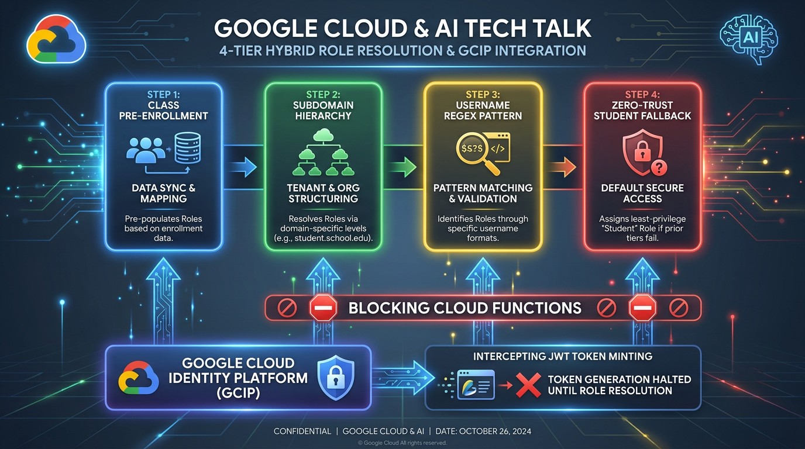

- **The Enterprise Security & FinOps Trilemma:**
  - Teachers trigger high-quota Gemini 3 reasoning; students only stream telemetry.
  - On shared school domains (`@school.edu`), accidental teacher grant risks budget drain and exam leaks.
- **4-Tier Deterministic Resolution Hierarchy:**
  1. **Tier 1 (Pre-Enrollment):** Matches `classes.where('teacherEmails', 'array-contains', email)` $\to$ `teacher`.
  2. **Tier 2 (Subdomain Priority):** `@stu.vtc.edu.hk` evaluated **before** `@vtc.edu.hk` (no substring bleed).
  3. **Tier 3 (Regex Pattern):** Evaluates `STUDENT_USERNAME_REGEX` (e.g. `^[0-9]{8}$`) on shared domains.
  4. **Tier 4 (Zero-Trust Fallback):** Unmatched or ambiguous registrations default safely to `student`.
- **GCIP Blocking Cloud Functions (`beforeUserCreated`):**
  - Intercepts token minting $\to$ writes Firestore profile $\to$ bakes `{ customClaims: { role } }` into JWT.
  - Two-phase admin elevation CLI (`node admin/scripts/grantTeacherRole.js`) with atomic profile migration.

---

## Frontend Architecture & Reactive Stream Engine
### React 19 Component Hierarchy, Dynamic Code-Splitting & Edge AI Data Mesh

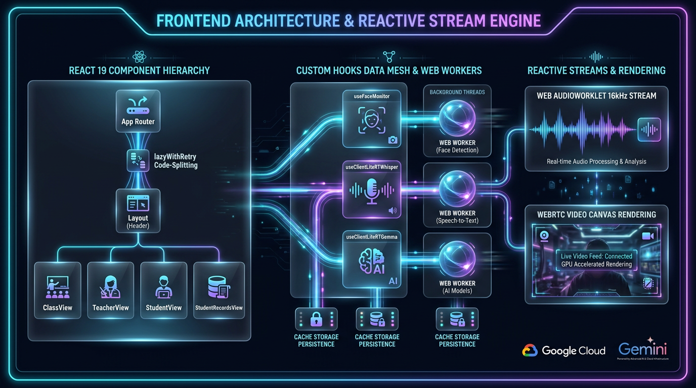

- **Dynamic Route Code-Splitting (`App.jsx`):**
  - Custom `lazyWithRetry` wrapper cuts initial bundle by **99%** (from ~2.4MB to 3–17KB initial chunks).
  - Auto-retries chunk loading on deployment updates to eliminate stale caching crashes.
- **Custom Hooks Data Mesh & Dedicated Web Workers:**
  - `useFaceMonitor`: 468-point Iris mesh running in `faceLandmarker.worker.js`.
  - `useClientLiteRTWhisper`: Browser STT running in `litertWhisper.worker.js`.
  - `useClientLiteRTGemma`: On-device LLM intent evaluation in `litertGemma.worker.js`.
  - Offloads 100% of AI inference from the main React render loop (steady 60 FPS).
- **Persistent Cache Storage & Reactive Streaming:**
  - `CacheStorage` stores model weights (`webai-models-v1`, `litert-gemma-cache-v1`) with byte-accurate progress HUD.
  - `AudioWorkletNode` 16 kHz background downsampler + WebRTC / Canvas live compositing.
  - **Student Records Self-Service Portal (`StudentRecordsView.jsx`):** 5-tab learning dashboard with 3 core attendance ratios.

---

## 03 | Gemini Enterprise Agent Platform: Gemini 3 Constellation & Model Routing
### Matching Model Capabilities, Latency Profiles, and Cost Parameters (100% Gemini 3)


- **`gemini-3.8-flash` (Deep Multimodal Reasoning & Full Lectures):**
  - High-throughput cross-student rubric synthesis, whole-class lecture subtitles & chapter markers.
- **`gemini-3.5-flash-lite` (Ultra-Low Latency Workhorse & Fallback):**
  - Rapid single-frame inspection, serverless subtitle translation, resilient fallback target.
- **`gemini-3.1-flash-live-preview` (Live Bidirectional Audio Streaming):**
  - WebSocket streaming via regional endpoint (`us-central1`), debounced 350ms HUD sync.
- **`gemini-3.5-transcribe-preview` (Long Audio Reasoning & Diarization):**
  - Native multi-speaker separation, ambient noise suppression, word-level timestamps.
- **`LiteRT Gemma 4 E2B & Whisper` (On-Device Edge Proctors):**
  - WebGPU/WASM in browser Web Workers at **$0 cloud cost** and zero cloud egress.
- <span class="highlight-green">**100% Gemini 3 Standardized:** Pure modern constellation; zero legacy model dependencies.</span>

---

## Google Genkit Resilience & Autonomous Tool Calling
### Self-Healing Failover, Exponential Backoff, and Deterministic Zod Validation


```javascript
// functions/ai_flows/analysisFlows.js: Resilience Interceptor
async function generateWithResilience(prompt, context, retryCount = 0) {
  try {
    return await ai.generate({ model: 'gemini-3.8-flash', prompt });
  } catch (err) {
    if ((err.status === 503 || err.status === 429) && retryCount < 3) {
      await sleep(Math.pow(2, retryCount) * 1000 + Math.random() * 500);
      return generateWithResilience(prompt, context, retryCount + 1);
    }
    // Dynamic fallback to lightweight model
    return await ai.generate({ model: 'gemini-3.5-flash-lite', prompt });
  }
}
```

---

## Teacher AI Prompt Studio & Multi-Domain AI Prompt Optimizers
### 4 Modal Categories, Modality-Specific AI Optimizers ('✨ Optimize') & In-App FinOps Sandbox

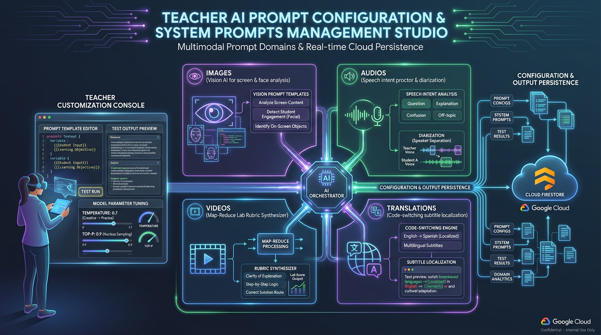

- **4 Core Multimodal Prompt Domains:**
  - **Images:** Vision AI for dual-screen analysis, off-screen gaze diversion & attentiveness.
  - **Videos:** Two-Stage Map-Reduce Coursework Rubric Synthesizer.
  - **Audios:** Speech intent classification (collusion, unauthorized talk, teacher inquiry) & diarization.
  - **Translations:** Code-switching subtitle engine preserving programming terms (`useState`, `Docker`).
- **Modality-Specific AI Prompt Optimizers (`✨ Optimize`):**
  - Built-in Gemini meta-prompts specifically tuned for each modality (e.g. `translationOptimizerPrompt`, `visionOptimizerPrompt`).
  - Automatically converts brief teacher notes into production-ready prompts with strict JSON schemas, few-shot edge cases, and anti-hallucination guardrails.
- **In-App FinOps Testing Sandbox:**
  - Real-time test runs against Gemini models with live execution latency (ms), token usage counters, and dollar cost estimations before classroom deployment.
- **Strict Repository-Level Prompt Governance:**
  - System rule: ALL platform prompts (client-side Gemma Web Workers, Gemini Live WebSockets, Cloud Run Genkit flows) are version-controlled in `admin/prompts/` and dynamically resolved with Firestore persistence.

---

## Production Prompt Engineering: Strict Schemas & Tools

```markdown
<!-- admin/prompts/audios/AI Speech Intent Proctor (Gemma On-Device).md -->
You are an AI exam proctor. Classify a student's spoken transcript by meaning and context.
Use exactly one category:
- COLLUSION_EXAM: discussing exam questions, answers, options, code snippets
- EXTERNAL_AI_ASSIST: querying Siri, Alexa, phone AI, ChatGPT via voice
- UNAUTHORIZED_TALK: casual conversation with peers
- LEGITIMATE_INQUIRY: technical question addressed to teacher/proctor
- BENIGN: self-talk, thinking aloud, reading code, background noise

Respond with ONLY one valid JSON object:
{
  "isViolation": boolean,
  "category": "COLLUSION_EXAM" | "EXTERNAL_AI_ASSIST" | "UNAUTHORIZED_TALK" | "LEGITIMATE_INQUIRY" | "BENIGN",
  "severity": "critical" | "high" | "medium" | "low" | "none",
  "confidence": 0.95,
  "evidence": "quoted speech snippet",
  "rationale": "one-sentence explanation"
}
```

---

## 04 | On-Device Vision AI: 468-Point Mesh & Iris Geometry
### MediaPipe Landmarker in Web Workers (Zero UI Thread Jank)


- **3D Head Pose Matrix:**
  - Real-time Yaw, Pitch, Roll calculation.
  - Yaw $\pm 25^\circ$ = Looking Away.
  - Pitch $\pm 20^\circ$ = Looking Down at Phone.
- **Metric Iris Distance:**
  $$D = \frac{11.7\text{ mm} \times f_x}{\Delta\text{Iris}_{\text{pixels}}}$$
- **Facial Ratios:**
  - **EAR (Eye Aspect Ratio):** Drowsiness & blink duration (`calculateEAR`).
  - **MAR (Mouth Aspect Ratio):** Whispering & talking detection (`calculateMAR`).
- **1-Click Baseline Calibration HUD:** Neutral view offset zeroing.

---

## Vision Code Deep Dive: Hardware-Synchronized Loop

```javascript
// web-app/src/hooks/useFaceMonitor.js
const processFrame = async (now, metadata) => {
  if (!workerRef.current || !isDetecting) return;

  // Zero-copy Transferable ImageBitmap transferred to Web Worker
  const bitmap = await createImageBitmap(videoEl);
  workerRef.current.postMessage(
    { type: 'DETECT_FRAME', bitmap, timestamp: now },
    [bitmap] // Instant zero-copy memory ownership transfer
  );

  // Synchronized directly with GPU hardware refresh rate
  videoEl.requestVideoFrameCallback(processFrame);
};
```

- Zero dropped frames on budget Chromebooks and student laptops.
- Web Worker isolates MediaPipe WASM computation from React rendering.

---

## Browser-Native Edge Speech AI: LiteRT Whisper & Gemma 4
### Bilingual Cantonese & English Code-Switching with Zero Cloud Egress


- **16kHz Float32 Audio Stream:** Captured via Web Audio API.
- **LiteRT Whisper STT Worker:** Real-time bilingual transcription.
- **LiteRT Gemma 4 E2B Worker:** Real-time intent classification.
- **Browser Cache Storage Persistence:**
  - `caches.open('litert-gemma-cache-v1')` caches ~1.5 GB model locally.
  - `navigator.storage.persist()` prevents browser disk eviction.
- **Sub-$0.00 Cloud Incurrence:** Total privacy-by-design.

---

## Cloud Audio Diarization & Moving Window Timeline
### RMS Silence Suppression Drops >80% Audio Locally; Gemini Diarizes


- **Rolling 30-Second Window:** 15-second overlapping stride ensures continuous context across boundaries.
- **Web Audio RMS Silence Detection:** Silent audio chunks are dropped right in the browser. Quota saved: >80%!
- **Google Cloud Gemini Enterprise Agent Platform (Gemini 3.5 Transcribe):** Multi-speaker separation (`Student` vs `External Voice`).
- **Synchronized Waveform Seek:** Teachers click any word to jump audio directly to that exact millisecond.

---

## 05 | Zero-Trust Assessment Security & Live Exam Mode
### Protecting Exam Confidentiality Across Storage Rules, Cloud Run & Student Portal


- **Zero-Trust Cloud Storage Rules:**
  - `storage.rules`: Student read access to `/videos/{classId}/{videoId}` rejected if `resource.metadata.isExam == 'true'`.
- **Scheduled Exam Periods & Metadata Stamping:**
  - Class-level scheduled `examPeriods: [{ name, startTime, endTime, requireFullScreenOnly }]`.
  - Cloud Run FFmpeg container evaluates `isExamTimeRange` and stamps `isExam: 'true'` onto GCS objects & Firestore jobs.
- **Mandatory Full-Screen Enforcement (`requireFullScreenOnly: true`):**
  - Reject window/tab sharing to prevent students hiding unauthorized AI windows.
- **Student Records Portal Shielding (`StudentRecordsView.jsx`):**
  - Confidentially shields exam videos, transcripts, and irregularity evidence during exam windows.

---

## Bingo Active Presence: AI Generation & 2-Strike Verification
### Automated 1-Minute FinOps Cadence, Gemini Question Synthesis & Cloud Tasks Retries


- **AI Question Bank Generator (`generateQuestionBankAi`):**
  - Gemini 3.5 Flash-Lite / 3.8 Flash autonomously drafts batches of domain-tailored multiple choice questions with 4 options, answer keys, and pedagogical rationales.
  - Teachers bulk import via Aiken format (`ANSWER: X`) or generate on the fly from lecture topics.
- **3 Sourced FinOps Verification Modes:**
  - **Question Bank ($0.00 zero-AI):** Instant local dispatch from class question pool.
  - **Teacher Screen Broadcast:** 1 single Gemini multimodal call on the active screen frame generates attention questions for 50+ students (~$0.00015).
  - **Student Screen Inspection:** On-demand individual verification analyzing active student windows.
- **Pedagogical Evaluation vs 2-Strike State Machine:**
  - **Active Wrong Answer (`failed_incorrect`):** Confirms physical presence; **no strike or attendance penalty**.
  - **Strike 1 Timeout:** Cloud Tasks (`dispatchBingoRetryTask`) schedules delayed retry with teacher grace.
  - **Strike 2 Consecutive Miss:** Confirmed AFK; dynamically voids unverified elapsed minutes (Bitmask Code `2`).

---

## 06 | Real-Time Classroom Media Pipelines
### 1-to-1 WebRTC Live Peek & Pure Frame Classroom Broadcaster


- **1-to-1 WebRTC Live Peek & Talkback:**
  - Direct P2P connection between teacher and student via Firestore signaling.
  - 30 FPS smooth video verification & two-way talkback without loading cloud storage.
- **1-to-Many Classroom Frame Broadcaster (Scales to 50+ Students):**
  - Eliminates the 6-peer limit & CPU exhaustion of WebRTC star-mesh networks.
  - Screen captured into offscreen canvas, clamped to **720p**, and diffed via **32x18 thumbnail pixel delta engine**.
  - Emits compressed JPEG (~35–65 KB, <8% doc limit) to Firestore `screenBroadcast/liveFrame`.
  - Keeps teacher CPU <2% and renders in student Picture-in-Picture (PiP) window.

---

## Anonymous Public Presentation Mode: Projector QR & 4-Digit PIN
### Zero-Friction Conference Spectator Viewing, Instant Teardown & Hard Firestore Rules

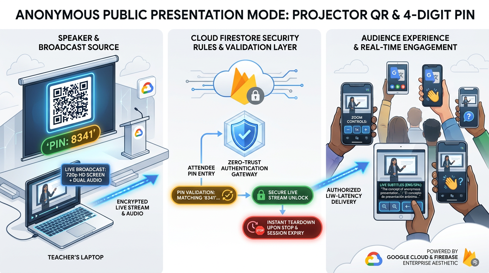

- **Instant Audience Access via Projector QR Code:**
  - High-contrast SVG QR code on the auditorium projector screen pointing to `/live/:classId?pin=XXXX`.
  - Attendees scan with any mobile browser; auto-authenticates via Firebase Anonymous Auth (`signInAnonymously`).
  - Seamless mobile viewing with **1x, 1.5x, 2x zoom** and real-time dual-line multilingual subtitles.
- **Strict Server-Side PIN Guardrails (`firestore.rules`):**
  - Session document hides PIN from unauthenticated snooping; access to `screenBroadcast` and `liveSubtitles` is locked.
  - Spectator must write to `screenBroadcastViewers/{uid}` with matching `request.resource.data.pin == session.publicPin`.
  - Only valid PIN writes unlock real-time streaming reads (`isAuthorizedPublicViewer`).
- **Hybrid Classroom & Ephemeral Lifecycle:**
  - Works with existing classes with enrolled students—students watch via their normal portal, guests watch via QR.
  - Controlled directly in the Screen Broadcast modal (Step 2) & Live HUD, **not** Class Management.
  - Clicking **"Stop Sharing"** immediately revokes all public tokens (`isPublic: false`, `publicPin: null`), restoring complete classroom privacy.

---

## Real-Time Live Subtitles & Multilingual Translation Engine
### 3-Tier Multi-Engine: Edge Gemini Nano, Serverless Genkit & Live WebSockets

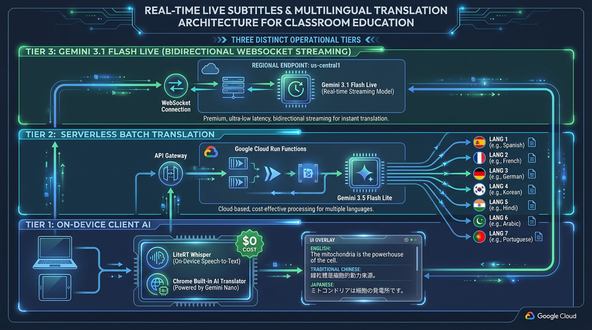

- **Tier 1: On-Device Client AI ($0.00 Cloud Cost):**
  - LiteRT Whisper Web Worker (WebGPU/WASM) for local real-time STT.
  - Chrome Built-in AI (`window.Translator` powered by Gemini Nano).
  - 100% privacy-compliant, zero cloud egress, and zero token billing.
- **Tier 2: Serverless Batch Translation (High Precision):**
  - Local LiteRT Whisper + Cloud Function `translateTeacherSpeech`.
  - Powered by **Gemini 3.5 Flash-Lite** (with 3.8 Flash fallback) translating to **7 languages**.
  - Preserves Cantonese-English technical code-switching (`useState`, `Docker`).
- **Tier 3: Gemini 3.1 Flash Live (Bidirectional WebSocket):**
  - Regional streaming endpoint (`us-central1`) via Firebase AI Logic WebSocket.
  - 350ms debounced Firestore synchronization buffer.
  - Responsive docked bottom-bar & floating draggable HUD overlay for students.

---

## Course Subject Domains & Domain-Specific AI Translation
### Preserving Discipline Glossaries, Hong Kong Code-Switching & Real-Time Dynamic Prompt Propagation

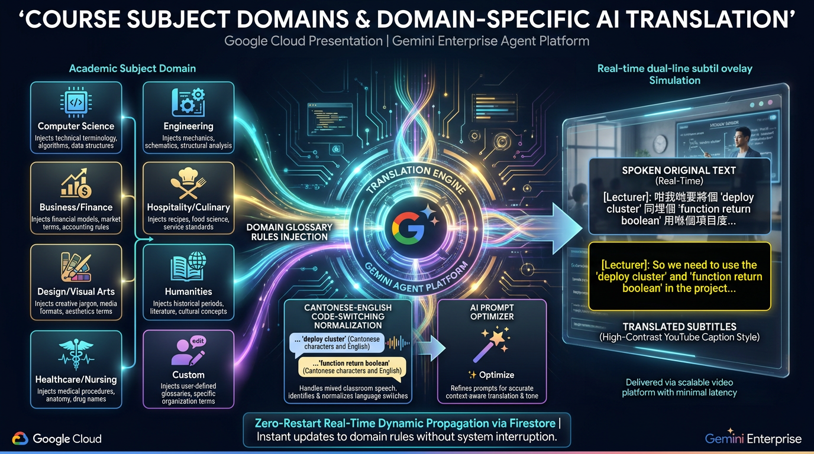

- **8 Academic Discipline Domains (+ Custom Freeform):**
  - 💻 **Computer Science:** Preserves code syntax, APIs & terms (`useState`, `Docker`, `SQL`, `git commit`).
  - 💼 **Business & Finance:** Preserves financial acronyms (`EBITDA`, `GAAP`, `IFRS`, `ROI`) & market terms.
  - 🎨 **Design & Visual Arts:** Preserves color space (`CMYK`, `RGB`), UI/UX, typography & rendering specs.
  - 🏥 **Healthcare & Nursing:** Preserves clinical pharmacology, anatomical terms, dosages & triage codes.
  - ⚙️ **Engineering & Construction:** Preserves mechanical specs, tolerance units, CAD & structural analysis.
  - 🍳 **Hospitality & Culinary:** Preserves culinary terms, HACCP standards, hotel PMS & viticulture.
  - 📚 **Languages & Humanities:** Preserves sociological constructs, historical references & dialects.
  - ✏️ **Custom Subject Domain:** Arbitrary typing (e.g., *Aeronautical Avionics*, *Biochemical Genetics*).
- **Domain Context Injection & Specialized Translation AI Prompts:**
  - Injected directly into live subtitle & translation prompts to prevent naive literal translations.
  - Dedicated **Translation Prompt AI Optimizer (`✨ Optimize`)** tunes glossary locks and pedagogical tone.
- **Hong Kong Cantonese-English Code-Switching Normalization:**
  - Intelligently parses mixed colloquial classroom speech (*"呢個 function return 個 boolean"*, *"deploy 個 cluster"*) into pristine bilingual subtitles.
- **Zero-Restart Real-Time Dynamic Propagation:**
  - Modifying domain or prompt in Class Management updates active `useTeacherLiveSubtitles` broadcasts via Firestore `onSnapshot` with **zero broadcast restart**!

---

## Teacher Lecture Recording & Multilingual YouTube CC Workflow
### Hardware-Locked Web Audio, Whole-Class Voice Gemini & YouTube Ingestion

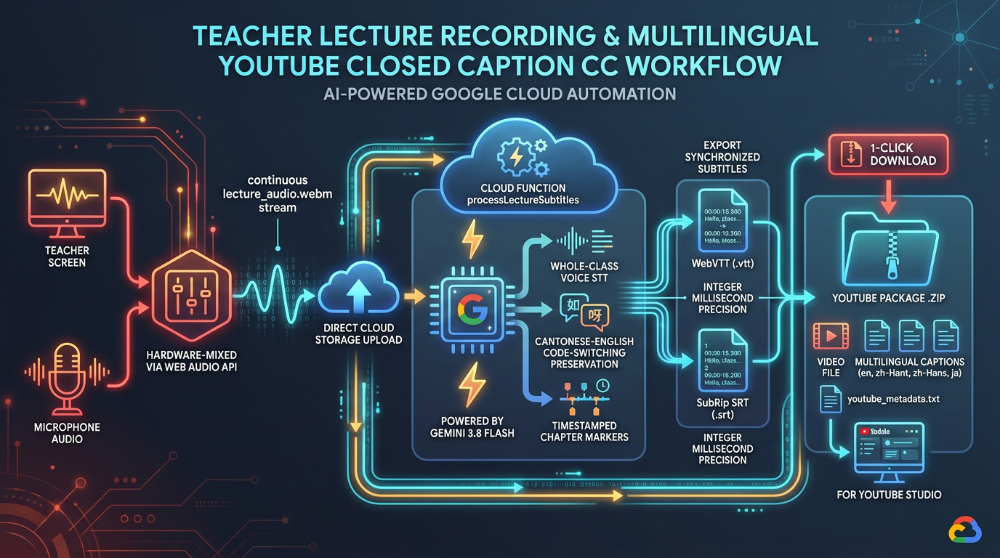

- **Continuous A/V Hardware-Mixed Recording:**
  - Web Audio API mixes screen audio and microphone into continuous `lecture_audio.webm`.
  - Eliminates VAD cutoffs and fragmentation; uploaded via resumable Cloud Storage chunks.
- **Whole-Class Voice Ingestion in Gemini 3.8 Flash:**
  - Passes entire 60–90 minute audio stream into 1M context window in Cloud Function `processLectureSubtitles`.
  - Automatically structures lecture chapters (`00:00 - Intro`, `14:20 - Kubernetes Architecture`).
- **Dual Caption Standards (Integer Millisecond Precision):**
  - Generates WebVTT (`.vtt`, period millisecond separator) for in-app HTML5 `<track>`.
  - Generates SubRip (`.srt`, comma millisecond separator) for YouTube Studio.
- **1-Click YouTube Studio Package:**
  - One-click **"📥 Download YouTube Package (.zip)"** bundling MP4 video, multilingual `.srt` files (`en`, `zh-Hant`, `zh-Hans`, `ja`), and `youtube_metadata.txt`.
- **5-Minute Overlap Protection:** Isolated session subcollections prevent back-to-back class bleed.

---

## YouTube-Style Desktop Student Hub & Screen Modes
### Cinematic Player Stage, Yellow CC Cues, Auto-Transcript & Ironclad Bingo

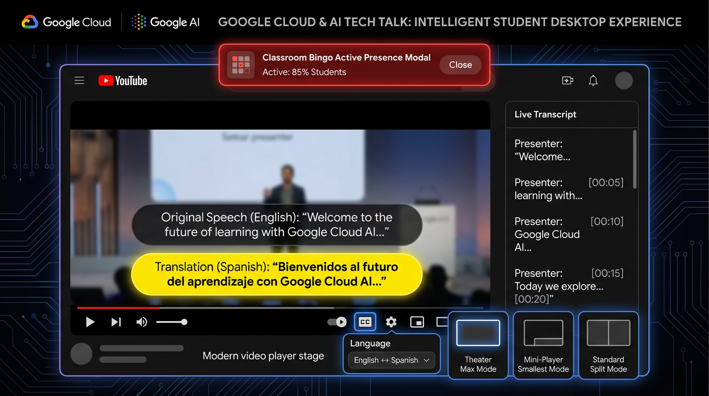

- **YouTube-Style Cinematic Player Stage:**
  - Embedded teacher stream (`🔴 LIVE`, `1080P`, zoom toggle); proctoring feeds dock into PiP.
  - Dual CC Overlay: original speech in dark pill, live translation in high-contrast **YouTube yellow** (`#ffe600`).
  - Bottom Bar: `[CC]` toggle, live target language selector, settings gear popover, native fullscreen.
- **3 Flexible Desktop Screen Modes (Zero Video Re-Mounting):**
  - **🗖 Max Mode (Theater / Full-Width):** Spans 100% width via CSS `display: contents;` with zero stream flicker.
  - **🗗 Smallest Mode (Corner Mini-Player):** Compact widget (380x220px, `z-index: 100`), opening **100% of workspace** for student IDE, coursework, and lecture notes.
  - **🔲 Standard Mode:** Classic 70/30 player and sidebar split.
- **YouTube-Style Live Transcript in Sidebar:** Auto-scrolling chronological lecture history.
- **Bulletproof Classroom Bingo Integrity ("Don't Break the Bingo"):**
  - Top pulsing banner with "Answer Challenge ➔" callout; React Portal at `z-index: 2147483647 !important`.
  - Proactive auto-exit of native browser fullscreen when challenge arrives; zero state reset on mode toggle.

---

## 3-Step Exam Readiness Wizard & Schedule Automation
### Guided Pre-Flight Diagnostics, Timezone Scheduling & Multi-Class Buffers

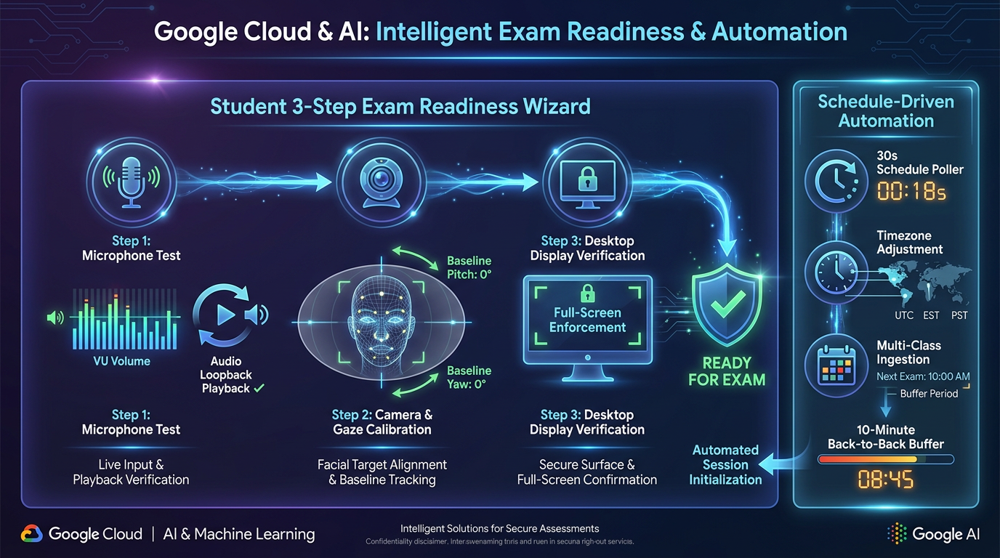

- **3-Step Exam Readiness Wizard (`ExamReadinessWizard.jsx`):**
  - **Step 1: 🎙️ Microphone Test:** VU volume bar (15%–65%), spoken challenge, 3s loopback playback.
  - **Step 2: 📷 Camera & Gaze:** Oval alignment guide, 1-click neutral baseline pitch/yaw calibration.
  - **Step 3: 🖥️ Display Surface:** Mandatory entire-screen sharing; window/tab sharing rejected.
- **Schedule-Driven Engine (`useStudentClassSchedule.js`):**
  - Poller evaluates enrolled class timetables every 30s with automatic timezone adjustment.
  - Auto-selects active course with visual **"(Live)"** tag; manual override with 1-click **"Follow Schedule"** restore.
- **Concurrent Classes & 10-Minute Back-to-Back Buffer:**
  - Automated Live Capture (5m before/after) & Session Video Compilation default checked.
  - **Zero-Waste Single Storage Upload:** One image blob upload mapped to multi-class Firestore records (`targetClasses`).
- **Student Self-Service Records Portal (`StudentRecordsView.jsx`):**
  - 5 tabbed views (Videos, Attendance, Tasks, Irregularities, Audio) with exam confidentiality shields.

---

## Teacher Command Center: Solving Cognitive Overload
### Zero-Space Compliance Filtering & 1-Click Targeted Nudge ('N')


- **Zero-Space Compliance Filter:** Instantly isolate students flagged with `Problems` or `Critical Alerts`.
- **1-Click Targeted Nudge:** Press `N` keyboard shortcut to display a gentle focus alert on the student's screen.
- **Offline Resilience:** If a student disconnects, their tile caches the last known frame and displays `(Offline)`.
- **Integrated Video Peek:** Instant one-click jump to full-screen peer-to-peer live stream.

---

## Serverless Cloud FFmpeg: Image-to-Video Compilation Pipeline
### Client Geometric Scaling, Sharp 40px Security Overlay & H.264 High-Efficiency Timelapse

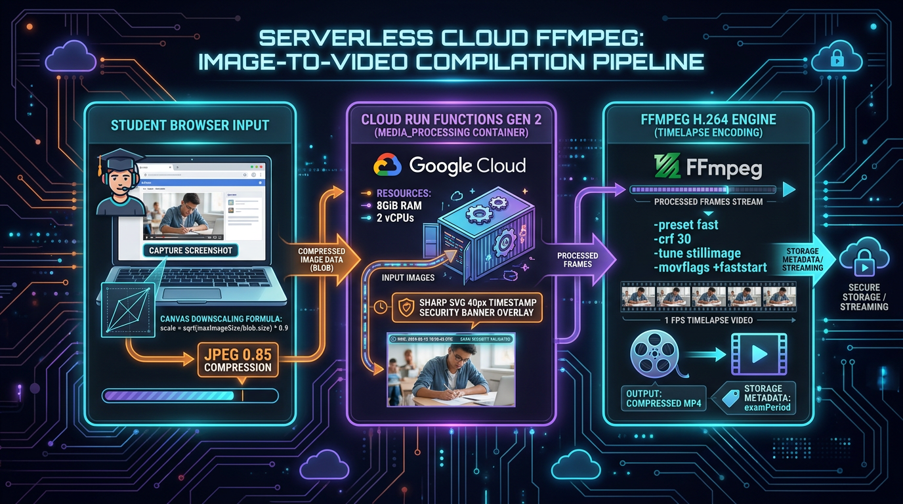

- **Client Source Standardization (`StudentView.jsx`):**
  - Max width cap: 1920px (1080p), `image/jpeg` at 0.85 quality.
  - Dynamic canvas downscale formula if blob exceeds quota:
    $$\text{scale} = \sqrt{\frac{\text{maxImageSize}}{\text{blob.size}}} \times 0.9$$
- **High-Performance Cloud Run Worker (`processVideoJob.js`):**
  - Dedicated container specs: `2 vCPU`, `8GiB RAM`, memory-bounded batching `BATCH_SIZE = 15`.
  - **Sharp SVG Security Banner:** 40px overlay with UTC timestamp, class ID, student email, and `[SCREEN]`/`[WEBCAM]` channel tag. Enforces even dimensions (`w%2=0, h%2=0`).
- **FFmpeg H.264 Timelapse Encoding Parameters:**
  - `-preset fast`: 70% CPU time reduction vs slow with identical visual clarity for code.
  - `-crf 30`: Constant Rate Factor achieving **80% smaller file size** while preserving razor-sharp text.
  - `-tune stillimage` & `-movflags +faststart`: Aggressive inter-frame compression + instant progressive streaming.
- **Zero-Trust Exam Security Stamping:**
  - Automatically tags Cloud Storage MP4s with `customMetadata: { examPeriod: 'true' }` to block unauthorized student downloads during tests.

---

## Cloud Media Lifecycle & Automated Storage Governance
### Per-Class Dual Retention, 4-Stage Cascading Class Purge & Storage Quotas


- **Per-Class Dual Retention Policies (`classes/{classId}`):**
  - `retentionDays`: Raw screenshots TTL (default: 30 days, configurable 7–365 days).
  - `videoRetentionDays`: Compiled MP4 lesson videos TTL (default: 90 days, configurable 14–730 days).
  - Ephemeral ZIP export archives: 7-day automated purge window.
- **Deterministic UTC Expiration Stamping (`expireAt`):**
  - Stamped at ingestion time across screenshots, video jobs, and audio segments.
  - Handled autonomously by **Firestore Native TTL Engine** at $0 maintenance overhead.
- **Event-Driven Cloud Storage Cleanup (`storage_triggers/`):**
  - `onScreenshotDocDeleted`, `onVideoJobDocDeleted`, `onZipJobDocDeleted` purge GCS blobs immediately.
- **4-Stage Cascading Class Deletion (`onClassDocDeleted`):**
  - Single teacher delete action cascades across screenshots, videos, zip archives, subcollections (`properties`, `status`, `broadcast`), and records. Auto-decrements class storage quotas.

---

## 07 | Serverless Map-Reduce-Map Video Intelligence Pipeline
### Fan-Out Discovery $\to$ Prompt Synthesis $\to$ Sortable Milestone Matrix


- **Phase 1: Map (Cloud Tasks Serverless Push Fan-Out):**
  - Master dispatcher initializes progress counters and fans out tasks to Google Cloud Tasks (`analyzeSingleVideoTask`) in ~2s.
  - Concurrency throttled to 4 workers (`maxDispatchesPerSecond: 2`) with dedicated 300s/2GiB containers, eliminating timeout walls and Gemini 429 spikes.
- **Phase 2: Reduce (Coursework Rubric Synthesis & Atomic Reducer):**
  - Atomic transactions update master progress (`processedCount`, `totalVideos`).
  - Cross-student aggregator combines findings into Gemini 3.8 Flash, generating a unified coursework rubric.
  - UI displays real-time progress counters (`Progress: X / Y`) and an animated multi-stage progress stepper.
- **Phase 3: Map (Milestone Evaluation & Subjob Inspection):**
  - Evaluates student videos against synthesized rubric; autonomous tool calls log milestones into `StudentMilestoneMatrix.jsx`.
  - Color-coded heatmap duration badges with RFC 4180 CSV export and `JobResultModal` featuring default word wrapping (`Wrap: ON/OFF`).
- **Dynamic AI Lab Task Generator & Cloud Fallbacks:**
  - **`generateLabTaskPrompt`:** Aggregates child `aiJobs` via Gemini 3.8 Flash 1M context to synthesize objective hands-on lab tasks with step-by-step scoring.
  - **`analyzeFaceFallback`:** High-efficiency multimodal cloud fallback (`gemini-3.5-flash-lite`, temp 0.1) when edge MediaPipe face landmarks are occluded.

---

## 08 | Green AI & Cloud FinOps: Institutional Cost Sustainability
### 99.8% Cost Reduction: $0.85 per 50-Student Exam vs. $750.00 Commercial SaaS


| Resource Layer | Commercial Surveillance SaaS | Google AI Classroom | Savings |
| :--- | :--- | :--- | :--- |
| **Compute Location** | 100% Cloud Servers | 95%+ Local Student Edge | **-95% Server Load** |
| **Audio Processing** | Continuous 100% Streaming | Local Whisper + RMS Silence Cut | **-80% Ingestion** |
| **Video Storage** | Uncompressed Continuous Video | Discrete Frames $\to$ MP4 FFmpeg | **-90% Storage** |
| **Active Presence** | High-Egress Polling Streams | $0.00 Question Bank / Tasks | **-100% Idle Load** |
| **Total Cost / Student** | **$15.00 – $25.00** | **<$0.02** | **99.8% Reduction** |

- **Live Google Cloud Billing Catalog API:** Ingests dynamic SKU rates into `system_config/pricing`.
- **Bingo FinOps:** $0.00 local Question Bank mode vs $0.000075/check 1-to-many Teacher Broadcast.

---

## Academic Integrity Incident Dossier Pipeline
### Automated 1-Click Export to Verifiable Microsoft Word (.docx) & RFC 4180 CSV


- **Step 1:** Flag raised for gaze diversion, unauthorized speech, or collusion.
- **Step 2:** Multimodal aggregator bundles screenshots, 3D head poses, transcripts, and LLM reasoning chain.
- **Step 3:** Automated generation of formal Microsoft Word (`.docx`) report with institutional header and verifiable raw CSV logs.
- **Step 4:** Ready for immediate submission to Academic Integrity Disciplinary Boards. Zero-tamper evidence!

---

## Multi-Persona Operations & 23 UI Control Domains
### Role-Based Manuals, Student Mobile Portal & Granular UI Control Domains


- **Instructor & TA Command Center (17 Chapters):**
  - Live invigilation grid with zero-space filters, 1-to-1 WebRTC Live Peek & Talkback, Pure Frame Broadcaster, 1-min Bingo, YouTube CC studio & Word incident dossiers.
- **Student & Examinee Portal (12 Chapters):**
  - 3-step hardware readiness wizard, dual-stream capture, on-device LiteRT Whisper/Gemma proctor, docked & floating live subtitles HUD, and **Student Mobile View** (`StudentMobileView.jsx`) for portable attendance.
- **Admin & DevOps Governance (11 Chapters):**
  - GCIP domain auto-provisioning, zero-trust exam storage rules, 7 Cloud Run Functions codebases & daily FinOps Gemini pricing sync.
- **23 Audited UI Control Domains & 15 Mermaid Diagrams:**
  - Complete operational transparency with zero guesswork across all platform features.

---

## Institutional Admin Console & System Governance Hub
### Identity Privilege CLI, Storage Quota Overrides & Automated Prompt Seeding

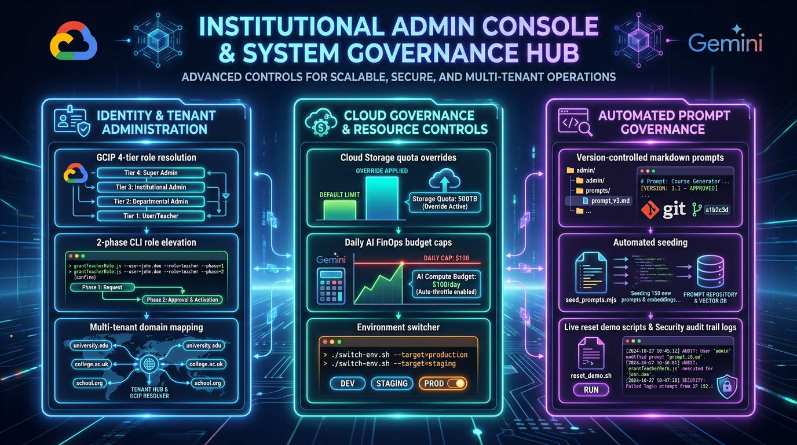

- **Identity & Tenant Administration (`admin/scripts/`):**
  - GCIP 4-tier role resolution with zero-trust default to student.
  - Two-phase admin elevation CLI (`node admin/scripts/grantTeacherRole.js`) with atomic Firestore teacher profile migration.
  - Dedicated admin creation utility (`createAdminUser.js`) with deterministic claims.
- **Cloud Governance & Resource Controls:**
  - Per-class Cloud Storage quota overrides preventing resource abuse.
  - Daily AI FinOps budget caps & automated Gemini model pricing sync.
  - Dual-environment switcher (`./switch-env.sh dev` / `prod`) syncing configuration across 7 function codebases.
- **Automated Prompt Governance & Maintenance:**
  - Version-controlled markdown prompts in `admin/prompts/` (Images, Videos, Audios, Translations).
  - Automated seeding CLI (`node admin/scripts/seed_prompts.mjs`) updates Firestore system prompts with zero downtime.
  - Automated demo sandbox reset (`reset_demo_env.sh`) & live security audit trail logging.

---

## 1-Command Terraform IaC & Automated Demo Sandbox
### Zero-Click Cloud Provisioning, 24/7 Demo Course & Instant Credential Access

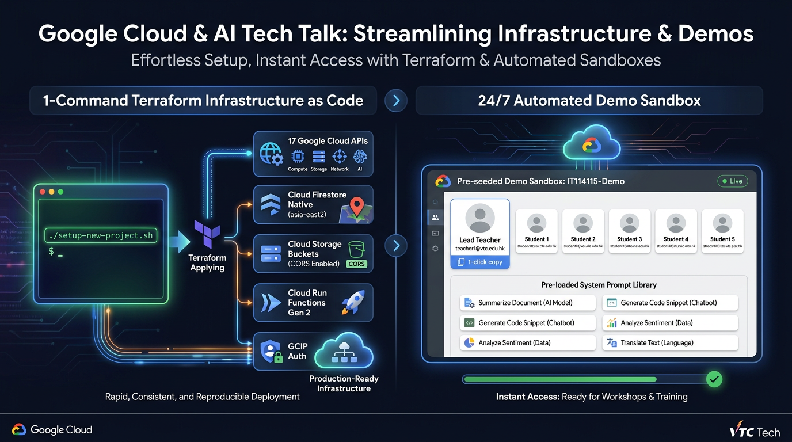

- **1-Command Zero-Click Provisioning (`setup-new-project.sh`):**
  - Single command: `./setup-new-project.sh <PROJECT_ID> <BILLING_ACCOUNT_ID>`.
  - 100% Terraform Infrastructure as Code (`terraform/`) provisions 17 Google Cloud APIs, Cloud Firestore Native in `asia-east2`, Cloud Storage with custom CORS, GCIP Identity Platform, IAM service agent tokens.
  - Automatically generates `web-app/.env` and `functions/config.js` with zero manual copy-pasting.
- **24/7 Pre-Seeded Development Sandbox (`IT114115-Demo`):**
  - Pre-seeded lead instructor: `teacher1@vtc.edu.hk` (`teacherProfiles` document & custom claims).
  - 5 pre-enrolled demo students: `student1`..`student5@stu.vtc.edu.hk` with 1-click clipboard copy buttons.
  - Pre-loaded multimodal prompt library across images, videos, audios, and multilingual translations.
- **Automated Dual-Environment Management:**
  - Rapid environment switching (`./switch-env.sh [dev|prod]`) with build-time environment verification.

---

## 09 | DevSecOps & Production Reliability Engineering
### Multi-Tier Automated Testing Pyramid (>1,100 Tests) & 100% Gemini 3 Standard


- **1,100+ Automated Tests & Assertions (Zero Flaky Tests):**
  - **Level 1 (Frontend):** 890 unit tests across 108 suites in Vitest (>80% code coverage across all core modules).
  - **Level 2 (Backend Cloud Functions):** 151 tests in `functions/ai_flows` + dozens across attendance, auth, media, and scheduled tasks.
  - **Level 3 (Security Rules):** 42 real-token isolation test scenarios (student self-read, exam shielding & attendance adjustment isolation).
  - **Level 4 (Live Smoke Tests):** 28 live end-to-end cloud assertions.
- **100% Gemini 3 Family Standardization:**
  - 100% standardized on Gemini 3 architecture in compliance with Google Cloud 2026 platform standards.
- **Automated Dual-Environment CI/CD:**
  - Development (`it114115-dev-2026`) & Production (`it114115-2627`) via `./deploy.sh [dev|prod]`.

---

## Live System Demonstration: 5-Stage Verification Flow


1. **Student Onboarding:** 3-step hardware readiness wizard (Screen share + Dual webcam + 1-Click calibration).
2. **Teacher Live Grid:** Multi-camera invigilation grid with zero-space problem filters.
3. **Active Presence Check:** Teacher triggers Bingo check; student responds with focus detection or triggers Cloud Tasks 2-strike retry.
4. **Targeted Intervention:** 1-click broadcast nudge (`N`) & 30 FPS WebRTC Live Peek.
5. **Instant Verification:** Audio waveform seek player, attendance adjustment audit & 1-click Word dossier export.

---

<!-- _class: lead -->
## 10 | Empowering Education with Google Cloud & Edge AI
### Live System & Open-Source Repository


- **Live Application:** [https://it114115-2627.web.app](https://it114115-2627.web.app)
- **Open-Source Repository:** [github.com/wongcyrus/Gemini-AI-Classroom-Assistant](https://github.com/wongcyrus/Gemini-AI-Classroom-Assistant)
- **Enterprise Documentation:** Comprehensive User Manuals (Teacher, Student, Admin) & 23 UI Control Domains Catalog with 15 Mermaid interaction diagrams.
- **Presenter:** **Cyrus Wong (黃俊彥)**
  - Google Developer Expert in GCP & AI/ML
  - Senior Lecturer, HKIIT / VTC Hong Kong
  - `cywong@vtc.edu.hk`
- **Questions & Discussion:** Edge AI, Google Genkit & Gemini 3 Architecture
