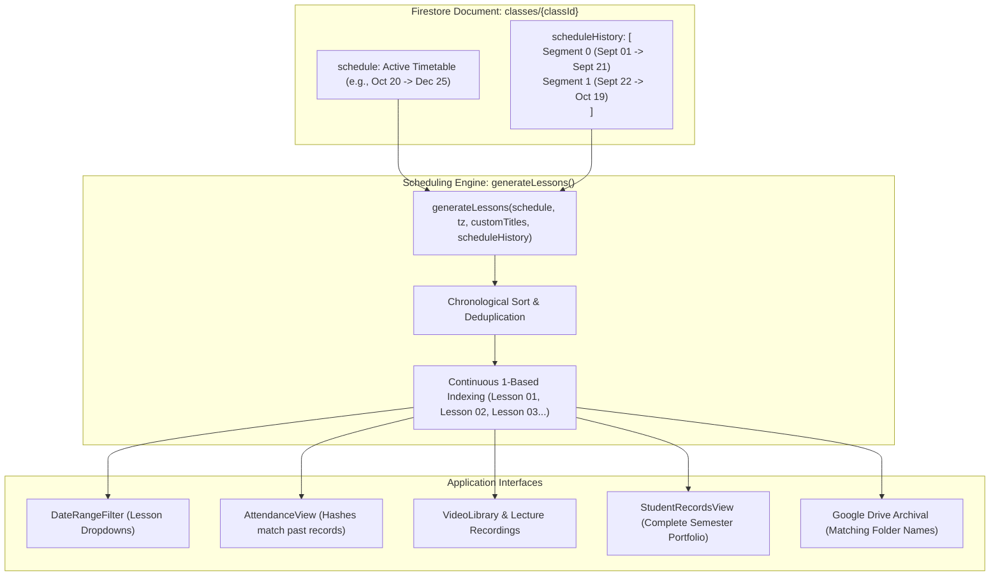
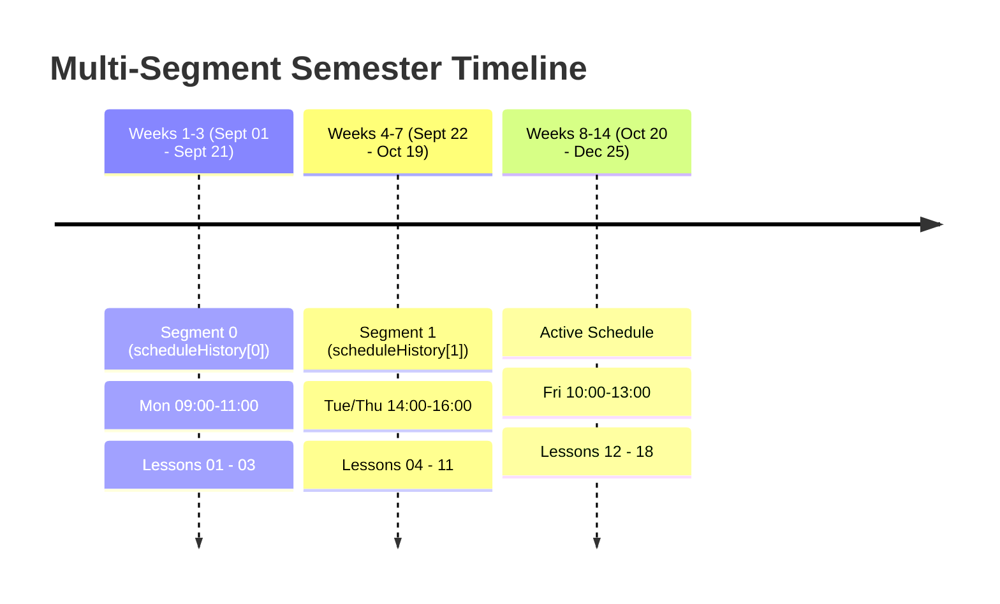

# Schedule Segments (`scheduleHistory`) & Past Lesson Preservation Architecture

## 1. Executive Summary & Problem Statement

In academic institutions, class timetables occasionally need to change mid-semester due to room reallocations, public holiday adjustments, lab equipment maintenance, or department schedule adjustments.

Previously, each class document in Firestore stored only a single active `schedule` object:
```json
{
  "startDate": "2026-09-01",
  "endDate": "2026-12-31",
  "timeSlots": [{ "days": ["Mon"], "startTime": "09:00", "endTime": "11:00" }]
}
```

### The Logical Bug
If an instructor edited the timetable mid-semester (for example, on September 25 moving the class from Mondays to Thursdays), the scheduling engine (`generateLessons`) recalculated all lesson slots starting from the original `startDate` (`2026-09-01`). 

This recalculation shifted the dates and timestamps of lessons that had **already taken place**. Because Firestore attendance records (`classes/{classId}/attendance/{lessonId}`), compiled lesson videos, and custom lesson titles are strictly indexed by lesson start timestamps (`ISOString`), all previous class data became **orphaned and invisible** in the user interface.

---

## 2. The Solution: Schedule Segments (`scheduleHistory`)

To eliminate this vulnerability without introducing complex separate collections, the system introduces a **non-destructive segmented schedule architecture**:



### Data Schema (`classes/{classId}`)

```json
{
  "name": "Introduction to Programming",
  "scheduleHistory": [
    {
      "startDate": "2026-09-01",
      "endDate": "2026-09-24",
      "timeZone": "Asia/Hong_Kong",
      "timeSlots": [
        { "days": ["Mon", "Wed"], "startTime": "09:00", "endTime": "11:00" }
      ],
      "archivedAt": "2026-09-24T23:07:17.126Z"
    }
  ],
  "schedule": {
    "startDate": "2026-09-25",
    "endDate": "2026-12-31",
    "timeZone": "Asia/Hong_Kong",
    "timeSlots": [
      { "days": ["Tue", "Thu"], "startTime": "14:00", "endTime": "16:00" }
    ]
  }
}
```

---

## 3. When is a History Item Added vs NOT Added?

### Clarification on Automatic Logging
> [!IMPORTANT]
> **A new history item is NEVER automatically created just because a class session finishes.**
> 
> When a lesson concludes normally:
> - Student attendance is recorded in `classes/{classId}/attendance/{lessonId}`.
> - Video compilation processes recordings and saves them to Cloud Storage.
> - The timetable itself has not changed.
> - **`scheduleHistory` remains completely untouched.**
> 
> If a class never changes its timetable during the entire semester, **`scheduleHistory` remains empty (`[]`) for the whole semester**.

### Trigger Criteria for Adding a History Item
A new item is pushed to `scheduleHistory` **if and only if** both of the following conditions occur:
1. **The instructor edits the timetable** in Class Management (modifying `startDate`, `endDate`, `timeZone`, or `timeSlots`).
2. **Completed past lessons already exist** in the class (verified by `new Date(lesson.end) < new Date()`).

When both conditions are detected, the system intercepts the save and displays the **Schedule Change Safeguard Modal** (`ScheduleChangeModal`).

---

## 4. Handling Multiple Timetable Changes

If an instructor modifies the timetable multiple times during a semester (e.g., Week 3, Week 7, and Week 11), the system gracefully chains segments chronologically:

### Semester Timeline Example



1. **Segment 0**: Archived at the end of Week 3 (`startDate: 2026-09-01`, `endDate: 2026-09-21`).
2. **Segment 1**: Archived at the end of Week 7 (`startDate: 2026-09-22`, `endDate: 2026-10-19`).
3. **Active Schedule**: Currently governing from Week 8 onwards (`startDate: 2026-10-20`, `endDate: 2026-12-25`).

### Continuous 1-Based Lesson Numbering
The scheduling engine iterates through all segments:
`segments = [...scheduleHistory, activeSchedule]`

- Segment 0 generates `Lesson 01` through `Lesson 03`.
- Segment 1 generates `Lesson 04` through `Lesson 11`.
- Active Schedule generates `Lesson 12` through `Lesson 18`.

All lessons are sorted chronologically and assigned sequential 1-based indices. 
In the UI dropdowns (`DateRangeFilter`):
- Both teachers and students see an unbroken dropdown list: `Lesson 01` to `Lesson 18`.
- Selecting `Lesson 02` displays the exact attendance doc and recording from September 8.
- Selecting `Lesson 06` displays the exact attendance doc and recording from September 29.
- Future lessons automatically reflect the latest Friday slots.

---

## 5. Safeguard Modal User Experience (`ScheduleChangeModal`)

When an instructor saves a modified timetable on a class with existing past lessons, the modal provides two distinct options:

```
+-------------------------------------------------------------------+
|  [!] Class Timetable Change Safeguard                             |
|                                                                   |
|  3 completed lessons already took place between 01/09 and 21/09.  |
|  Modifying timetable without segmenting will orphan past records. |
|                                                                   |
|  (o) [RECOMMENDED] Archive Past Lessons & Apply New Timetable     |
|      From Today                                                   |
|      Preserves all 3 completed lessons and their exact attendance |
|      and recordings in scheduleHistory. New timetable applies     |
|      from today onwards.                                          |
|                                                                   |
|  ( ) [OVERWRITE] Overwrite Entire Schedule (Recalculate Past)     |
|      Retroactively applies the new schedule from the semester     |
|      start date. Past lesson timestamps will be recalculated.     |
|                                                                   |
|              [ Cancel ]   [ Apply & Preserve History ]            |
+-------------------------------------------------------------------+
```

### Date Boundary Calculation Logic
When **Option 1 (Recommended)** is confirmed:
1. The system checks if a completed lesson finished earlier **today**:
   - If a lesson finished today: `archiveEndDate = today`, `newStartDate = tomorrow`.
   - If no lesson took place today: `archiveEndDate = yesterday`, `newStartDate = today`.
2. If the instructor explicitly typed a future start date (e.g., `2026-11-01`), the system honors that future date and archives up to the day before.
3. The previous timetable is pushed to `scheduleHistory`, and the active `schedule.startDate` is set to `newStartDate`.

---

## 6. Production Migration & Backup Tooling

### CLI Script: `admin/scripts/migrate_class_schedules.mjs`
To ensure all existing classes across environments support `scheduleHistory` without runtime errors, an idempotent CLI migration tool was built and executed.

```bash
# 1. Test in dry-run mode (creates pre-flight backup, writes 0 changes)
GOOGLE_CLOUD_PROJECT=it114115-2627 node admin/scripts/migrate_class_schedules.mjs --project=it114115-2627 --dry-run

# 2. Execute live migration
GOOGLE_CLOUD_PROJECT=it114115-2627 node admin/scripts/migrate_class_schedules.mjs --project=it114115-2627
```

### Safety & Invariants
1. **Automated Pre-Flight JSON Backups**:
   Before modifying any database document, the script extracts every class document and all its subcollections (`lessons`, `attendance`, `bingoRecords`, etc.) into `admin/backups/classes_backup_<project>_<timestamp>.json`.
2. **Git Security**:
   `admin/backups/` is added to `.gitignore` to guarantee sensitive production data snapshots are never committed to version control.
3. **Idempotence**:
   Classes that already have `scheduleHistory` initialized as an array are skipped. Subsequent runs report `0 classes requiring migration`.

---

## 7. Downstream Contract Verifications

| Component | How it interacts with `scheduleHistory` | Verification Status |
| :--- | :--- | :---: |
| [`useClassSchedule.js`](file:///home/developer/Documents/Gemini-AI-Classroom-Assistant/web-app/src/hooks/useClassSchedule.js) | Generates merged, continuous chronological lessons across all segments | Passed (6/6 tests) |
| [`ClassManagement.jsx`](file:///home/developer/Documents/Gemini-AI-Classroom-Assistant/web-app/src/components/ClassManagement.jsx) | Detects timetable changes, computes past lessons, intercepts save, writes `scheduleHistory` | Passed (28/28 tests) |
| [`ScheduleManager.jsx`](file:///home/developer/Documents/Gemini-AI-Classroom-Assistant/web-app/src/components/ScheduleManager.jsx) | Displays real-time banner when class has completed lessons | Passed (1/1 test) |
| [`StudentRecordsView.jsx`](file:///home/developer/Documents/Gemini-AI-Classroom-Assistant/web-app/src/components/StudentRecordsView.jsx) | Passes `classObj.scheduleHistory` into `generateLessons` for full student portfolio | Verified |
| [`DateRangeFilter.jsx`](file:///home/developer/Documents/Gemini-AI-Classroom-Assistant/web-app/src/components/common/DateRangeFilter.jsx) | Renders unbroken lesson dropdowns (`Lesson 01`, `Lesson 02`...) | Verified |
| **Attendance & Video Jobs** | Exact start timestamps preserved; Firestore hash keys match 100% | Verified |
