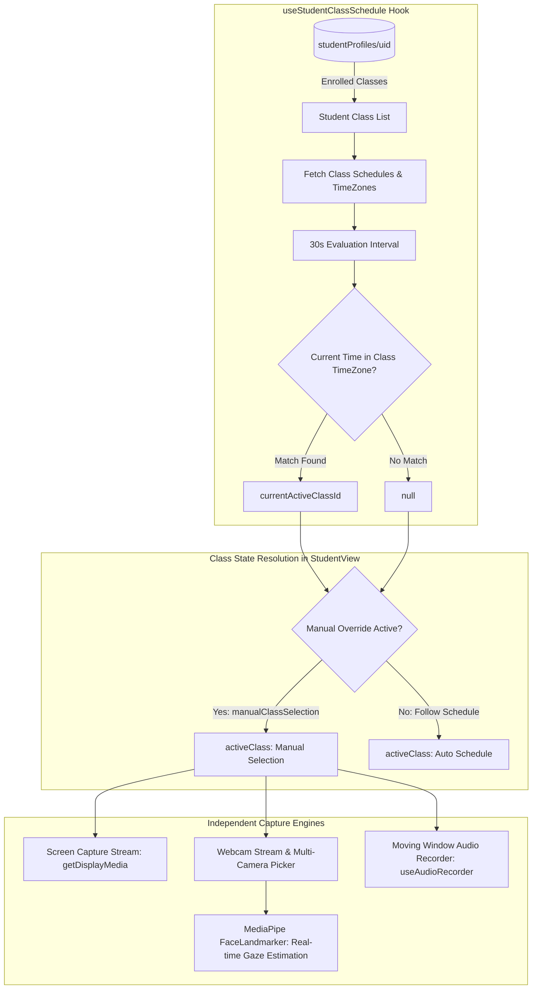

# Student View: Schedule-Driven Logic

[🏠 Documentation Index](../README.md#documentation-index) | [👨‍🏫 Teacher Manual](./user-manual-teacher.md) | [🧑‍🎓 Student Manual](./user-manual-student.md) | [🛠️ Admin Manual](./user-manual-admin.md) | [📘 UI Catalog](./comprehensive-ui-controls-and-features-catalog.md)

---

This document outlines the automated, schedule-driven logic implemented in the `StudentView.jsx` component. The primary goal of this architecture is to ensure that a student's screen capture data is always associated with the correct, currently active class, especially in scenarios with back-to-back lessons.

---

## 📑 Table of Contents

1. [Core Architecture & State Flow](#core-architecture--state-flow)
2. [Handling Overlap in Back-to-Back Classes](#handling-overlap-in-back-to-back-classes)
3. [Dual Stream & Split-Channel Capture](#dual-stream--split-channel-capture)
4. [Real-Time On-Device Face & Gaze Tracking (`useFaceMonitor.js`)](#real-time-on-device-face--gaze-tracking-usefacemonitorjs)
5. [Microphone Input Selection & Moving Window Audio (`useAudioSetup.js` & `useAudioRecorder.js`)](#microphone-input-selection--moving-window-audio-useaudiosetupjs--useaudiorecorderjs)
6. [Independent Multi-Stream Architecture & Robust Hardware Handling](#independent-multi-stream-architecture--robust-hardware-handling)
7. [Live Exam Mode Synchronization & Proctoring Enforcement](#live-exam-mode-synchronization--proctoring-enforcement)
8. [Automated Active Presence & Attention Verification ("Bingo") Lifecycle](#automated-active-presence--attention-verification-bingo-lifecycle)
9. [Mobile Student Companion View (3 Core Features)](#9-mobile-student-companion-view-3-core-features)

---

## Core Architecture & State Flow



### 1. The `useStudentClassSchedule` Hook

This hook is the brain of the operation and works in three stages:

1.  **Fetch Student's Class List:** The hook subscribes to the logged-in student's profile document at `studentProfiles/{user.uid}`. It maintains a real-time list of all classes the student is enrolled in. When instructors create a school-wide or special class using the **"🎓 Input All Students"** button in Class Management, all system student accounts are populated into the roster; the `onClassUpdate` cloud function automatically syncs the new class into every student's `studentProfiles/{uid}` record, immediately exposing the class to all students without manual enrollment codes.

2.  **Fetch All Schedules:** Whenever the student's list of classes changes, the hook fetches the `schedule` object from each corresponding class document (`classes/{classId}`). This object contains the `timeSlots` and, crucially, the `timeZone` for that class.

3.  **Determine the Active Class:** Every 30 seconds, the hook performs the following check:
    *   It gets the current time.
    *   It iterates through each of the student's class schedules.
    *   For each schedule, it converts the current time into that class's specific timezone.
    *   It checks if the current, timezone-adjusted time falls within any of the defined `timeSlots` for the current day.
    *   The first class that matches becomes the `currentActiveClassId`.
    *   If no class is currently scheduled, `currentActiveClassId` is `null`.

### 2. `StudentView.jsx` Integration

The `StudentView.jsx` component consumes the `useStudentClassSchedule` hook and implements the following logic:

#### Automatic Class Selection

- The component gets the `currentActiveClassId` from the hook.
- A new variable, `activeClass`, is used as the source of truth for all data subscriptions and actions (e.g., listening for capture signals, uploading screenshots, fetching messages).

#### Manual Override

To handle edge cases or provide user flexibility, a manual override system is in place:

- The `activeClass` is determined by the formula: `manualClassSelection || currentActiveClassId`.
- The class selection dropdown in the UI now sets the `manualClassSelection` state, which takes precedence over the schedule-driven `currentActiveClassId`.
- When a class is manually selected, a **"Follow Schedule"** button appears. Clicking this button resets `manualClassSelection` to `null`, immediately returning the component to the automatic, schedule-driven mode.

#### UI Indicators

- The class dropdown now visually indicates which class is currently **"(Live)"** according to the schedule, guiding the user to the correct class without requiring them to think about it.

## Handling Overlap in Back-to-Back Classes & Concurrent Class Enrollment

When a student is enrolled in classes that have concurrent or overlapping scheduled slots (or during the 10-minute back-to-back buffer period where `handleAutomaticCapture` sets `isCapturing: true` with a 5-minute look-ahead/look-behind), the system handles ingestion across **all** overlapping classes simultaneously:

### 1. Multi-Class Schedule Detection (`activeClassIds`)
- The hook `useStudentClassSchedule` examines all enrolled class schedules concurrently without terminating early.
- It returns both `currentActiveClassId` (the primary active class) and `activeClassIds: string[]` (an array of all classes whose schedule is active right now).

### 2. Multi-Class Media Ingestion (Screen, Webcam, Video, Voice)
- **Zero-Waste Single Storage Upload**: When capturing screen or webcam frames, the image blob is uploaded **once** to Cloud Storage (`screenshots/{primaryClass}/{studentUid}/{channel}_{timestamp}.jpg`).
- **Multi-Class Firestore Records (`targetClasses`)**: Firestore `screenshots` metadata records and status telemetry documents (`classes/{classId}/status/{studentUid}`) are created for **all** overlapping active classes (`targetClasses`). Neither teacher's live monitor misses student activity.
- **Asynchronous Video Generation**: In the backend, `processVideoJob` compiles MP4 videos from the `screenshots` collection where `classId == job.classId`. Because screenshots exist with valid metadata for all overlapping classes, video compilation succeeds cleanly for both classes without any redundant video encoding on the client.
- **Audio Presence & Live Transcripts**: Real-time microphone status (`isSpeaking`, `audioLevel`) and Whisper transcripts are mirrored to `classes/{classId}/status/{studentUid}` across all overlapping classes.

### 3. Student Dropdown Manual Override Precedence
To ensure students can switch between teachers (e.g. to view **Teacher Live Screen Broadcast** or read **Live Subtitles** from a specific teacher):
- When a student picks a class from the dropdown, `isManualScheduleOverride` is set to `true` (and persisted to `localStorage`).
- Manual student choice takes **strict precedence** over schedule-driven `currentActiveClassId`, eliminating the previous bug where the dropdown would immediately snap back to the scheduled class.
- A **"↩ Follow Schedule"** button appears next to the dropdown whenever an override is active, allowing the student to revert to automated scheduling with a single click.
- An **Active Session HUD Class Switcher** is also present in the streaming top bar (`isSharing: true`), enabling seamless switching between teacher feeds during active streaming sessions without stopping screen or webcam capture.

---

## Dual Stream & Split-Channel Capture

The student interface supports independent screen sharing (`getDisplayMedia`) and webcam streaming (`getUserMedia`):

1. **Independent Control:** Students can start or stop their screen and webcam streams individually.
2. **Dual-Channel Ingestion:** When both streams are active, `captureAndUploadAllChannels` periodically captures frames from each stream, compresses them according to the class settings, and stores them under distinct paths:
   - Screen: `screenshots/{classId}/{studentUid}/screen_{timestamp}.jpg` (stamped with `channel: 'screen'`)
   - Webcam: `screenshots/{classId}/{studentUid}/webcam_{timestamp}.jpg` (stamped with `channel: 'webcam'`)
3. **Status Aggregation:** The real-time status document `classes/{classId}/status/{studentUid}` tracks `isScreenSharing`, `isWebcamSharing`, `latestScreenPath`, and `latestWebcamPath`, allowing teachers to monitor dual feeds simultaneously or switch views per channel seamlessly.
4. **Multi-Camera Selection:** When multiple webcams/video input devices are detected (`navigator.mediaDevices.enumerateDevices`), a camera selector dropdown dynamically appears next to the webcam button, allowing the student to pick their desired camera or switch seamlessly during an active session. Live device changes (`navigator.mediaDevices.ondevicechange`) are automatically detected.
5. **Stream Swapping:** When dual streams are active, students can toggle feed placement via a Swap Feeds control to switch primary and secondary picture-in-picture viewports.
6. **In-Flight Upload Concurrency Guards:** To prevent latency stacking over slow or fluctuating network connections, `StudentView` maintains channel-specific in-flight upload locks (`isUploadingScreenRef`, `isUploadingWebcamRef`). If an upload is still in progress when a scheduled tick fires, that frame is safely dropped rather than queued, guaranteeing immediate real-time sync once network bandwidth frees up.
7. **Background Capture & Occlusion Resilience (Edge / Chromium):**
   - **`ImageCapture` API (`grabFrame()`):** Grabs video frames directly from the hardware `MediaStreamTrack` buffer, preventing canvas blackouts/freezes when Edge or Chrome runs behind other windows or in minimized states.
   - **Inline Web Worker Timer:** Drives frame capture ticks using an isolated Web Worker thread, immune to Chromium's background timer throttling (which would otherwise throttle `setInterval` down to 1 minute or suspend tabs via Edge Sleeping Tabs).
   - **Screen Wake Lock API:** Automatically acquires a `screen` wake lock (`navigator.wakeLock.request('screen')`) during active capture sessions to prevent OS/browser power-saving suspension.

---

## Real-Time On-Device Face & Gaze Tracking (`useFaceMonitor.js`)

The student client embeds an on-device AI invigilation pipeline powered by **MediaPipe FaceLandmarker with Iris Tracking**:

### 1. 4 AI Monitoring Modes
- **`hybrid` (⚡ Client AI + Fallback)**: Real-time on-device MediaPipe inference on the student's browser at ~15-30 FPS with zero cloud cost. If detection confidence is low or irregularities persist, it triggers periodic Cloud Gemini Vision fallbacks (`analyzeFaceFallback`).
- **`cloud_only` (☁️ Cloud AI Only)**: Deactivates client-side MediaPipe WASM. The teacher receives periodic Cloud Gemini Vision inspections directly.
- **`client_only` (💻 Client AI Only)**: 100% on-device MediaPipe processing. Zero Cloud Gemini quota consumed.
- **`disabled` (🚫 AI Disabled)**: Completely turns off face and gaze tracking.

### 2. Iris Tracking & Depth Estimation
- Utilizes MediaPipe Iris landmarks (Landmarks `468–472` for left eye, `473–477` for right eye).
- **Metric Distance:** Computes accurate metric distance in cm using the known anatomical human iris diameter (~11.7 mm).
- **Pupil Gaze Ratio:** Evaluates horizontal and vertical iris displacement within eye contours to detect subtle looking-away gestures before head rotation occurs.

### 3. Head Pose & Angle Calibration
- Extracts 3D facial landmarks to calculate head rotation angles:
  - **Yaw** (Left / Right turn)
  - **Pitch** (Look Up / Down)
- **Adaptive Neutral Baseline Calibration (`🎯 Calibrate View`)**:
  - Allows students to baseline their natural gaze and physical camera mounting angle by capturing a snapshot of raw yaw/pitch offsets (`baselineOffsetRef`).
  - Calibrated angles subtract this baseline offset (`calculatedYaw = rawYaw - baselineYaw`), preventing false positives caused by off-center monitors or angled laptop webcams.
  - Can be toggled or reset instantly from the student toolbar.

### 4. Multi-Signal Anomaly Detection & Debounce Gate
- **Multi-Signal Telemetry**:
  - `eyes_closed`: Eye Aspect Ratio ($\text{EAR} < 0.18$) detects drowsiness, sleeping, or prolonged eye closure.
  - `talking`: Mouth Aspect Ratio ($\text{MAR} > 0.58$) detects mouth movement, whispering, or talking.
  - `looking_away`: Sustained head yaw/pitch angles exceeding sensitivity thresholds or lateral iris shift.
  - `no_face`: Zero facial landmark detections.
  - `multiple_faces`: Multiple individuals detected in frame.
- **Hardware Frame Sync (`requestVideoFrameCallback`)**:
  - Uses native `video.requestVideoFrameCallback` to execute inference precisely when a new camera frame is decoded by the GPU, eliminating wasted CPU cycles and frame drops.
- **Debounce & Anomaly Gate**:
  - Deviations must be sustained for the teacher-configured debounce threshold (e.g., 3 consecutive seconds) before triggering an incident, eliminating transient glance false positives.
- State telemetry is mirrored atomically to `classes/{classId}/status/{studentUid}`:
  - `faceStatus`: `normal` | `looking_away` | `eyes_closed` | `talking` | `no_face` | `multiple_faces` | `loading` | `disabled`
  - `yawAngle`, `pitchAngle`, `ear`, `mar`, `isCalibrated`, `metricDistance`, `activeViolation`.

### 5. On-Device AI Model Preloading, Cache API Storage & Worker Architecture (`webAiModelLoader.js` & `faceLandmarker.worker.js`)

To eliminate network bandwidth bottlenecks, prevent exam start latency, and avoid running multi-gigabyte models locally on student devices, the client uses a streamlined edge loading pipeline:

* **Lightweight Edge Footprint (~3.8 MB)**: Utilizes the highly optimized MediaPipe `FaceLandmarker` with Iris binary weights (~3.8 MB total) for in-browser real-time tracking, avoiding large local LLM downloads (e.g. 2.5GB Gemma).
* **Dedicated Web Worker Engine (`faceLandmarker.worker.js`)**: Runs vision tasks and geometric processing in a background Web Worker thread using `ImageBitmap` zero-copy transfers, keeping the React UI thread completely fluid (zero input lag or typing jank).
* **Persistent Cache API Storage (`webai-models-v1`)**: Checks `window.caches` before making any network requests. On the first download, model weights are stored in the browser's Cache Storage for instant $(<500\text{ms})$ subsequent loads without consuming student bandwidth.
* **Streamed Progress Tracking**: Uses `fetch()` with `ReadableStream` chunk counting to compute and report byte-level progress ($0\% \to 100\%$) directly to the student UI (`⏳ Loading AI (45%)`) and teacher dashboard.
* **Student-Side Preload Button**: Students can pre-download the model ahead of time via the **"📥 Preload AI (~3.8 MB)"** button in the dashboard controls.
* **Teacher Remote Preload Trigger**: Teachers can broadcast a preload command (`preloadClientAi`) from `ControlsPanel.jsx`, triggering simultaneous background caching across all connected student devices before starting the exam.
* **Hardware Delegate Fallback**: Automatically requests the `GPU` delegate (WebGL / WebGPU); if initialization fails or shaders are unsupported on the student's hardware, it gracefully falls back to the `CPU` WASM delegate, and finally transitions to Cloud Gemini Fallback (`analyzeFaceFallback`) if local execution is completely unavailable.
* **Real-Time Telemetry Sync**: Syncs `clientAiStatus` (`ready`, `initializing`, `cloud_fallback`, `unsupported`), `loadingProgress`, `isModelCached`, `delegateUsed`, `ear`, `mar`, `isCalibrated`, and `fallbackReason` directly to `classes/{classId}/status/{studentUid}`.

---

## Microphone Input Selection & Moving Window Audio (`useAudioSetup.js` & `useAudioRecorder.js`)

In addition to screen and webcam video streams, the student interface integrates microphone capture, hardware verification, and sliding window audio recording:

### 1. Microphone UI Elements & Controls Breakdown
The student interface provides 3 clear, distinct controls for microphone interaction:

| UI Component | Role / Purpose | Interaction / Behavior |
| :--- | :--- | :--- |
| **`🎙️ Mic Active` / `🔇 Mic Muted` Toolbar Button** | **Runtime Mute Switch** | Toggles live audio capture (`isAudioUserEnabled`) on and off without opening dialogs. Shows `🔊 Speaking` dynamically when volume is detected. |
| **Live VU Volume Meter `[24%]`** | **Visual Sound Feedback** | Inline volume level bar ($0–100\%$) indicating real-time microphone pickup when unmuted. |
| **`⚙️ Mic Test` Toolbar Button** | **Hardware Diagnostics & Switcher** | Opens [`MicSetupModal.jsx`](file:///home/developer/Documents/Gemini-AI-Classroom-Assistant/web-app/src/components/MicSetupModal.jsx) where students can switch physical USB/Bluetooth inputs, test loopback playback, and run voice verification. |
| **`ExamReadinessWizard.jsx`** | **Pre-Exam Guided Self-Calibration** | Step-by-step modal displayed before exam entry to verify Camera, Microphone, and Screen Sharing. |

### 2. Two-Stage Hardware Acquisition (`acquireInputDeviceStream` in `mediaDeviceCapture.js`)
To prevent Chrome from throwing `OverconstrainedError` before native permission is granted while ensuring the application never silently falls back to the wrong default device:
1. **Phase 1 (Generic Permission Prompt):** Invokes `navigator.mediaDevices.getUserMedia({ audio: true })` without strict device constraints. This allows Chrome to show its standard permission prompt cleanly.
2. **Phase 2 (Exact Device Binding):** Once permission is acquired, if a custom `deviceId` is chosen (e.g. USB headset), it requests `{ audio: { deviceId: { exact: deviceId } } }` and terminates the initial default stream.
3. **Fail-Fast Error Handling:** If the selected device is disconnected or hardware-locked, the error is caught and displayed to the student rather than secretly recording from an unintended microphone.

### 3. Selected Microphone Stream Routing & On-Device Whisper + Gemma AI (`useClientLiteRTWhisper.js`, `useClientLiteRTGemma.js` & `useAudioRecorder.js`)
- Audio recording is completely **decoupled from Vision AI modes**. Even if Vision AI is set to `disabled` (`aiMonitoringMode === 'disabled'`), audio capture operates independently whenever the teacher enables the class audio toggle (`enableAudioCapture: true`).
- **Direct Audio Stream Attachment**: `useAudioRecorder` opens the media stream using the student's selected microphone and supplies `audioStream` directly to `useClientLiteRTWhisper`.
- `useClientLiteRTWhisper` attaches a real-time Web Audio `ScriptProcessorNode` to `audioStream`, downsampling to 16kHz PCM Float32Array and performing local Voice Activity Detection (VAD).
- This ensures on-device LiteRT Whisper STT transcribes speech directly from whichever microphone the student selected (USB headset, external podcast mic, webcam mic, or internal default).
- **On-Device Gemma Intent Analysis & Cloud Fallback (`useClientLiteRTGemma.js`)**: Spoken transcripts are fed to on-device Gemma 4 E2B (`litertGemma.worker.js`) running in WebGPU/WASM for instant cheating/whispering classification. Downloaded model weights are saved in Cache Storage (`litert-gemma-cache-v1`) with `navigator.storage.persist()`. In hybrid modes or when Gemma is loading, transcripts are simultaneously routed directly to Cloud Genkit (`analyzeAudio`) for immediate reasoning without re-transcribing raw audio.
- Audio from the selected microphone is also recorded in continuous 1-second slices into a rolling circular memory buffer.
- Every 15 seconds (stride), the previous 30-second window is packaged and uploaded to Firebase Cloud Storage under `audio/{classId}/{studentUid}/audio_{start}_{end}.webm`.
- **Silence Suppression**: Chunks with average volume $<4\%$ and peak $<8\%$ are dropped on the client, reducing bandwidth and storage quotas by $>80\%$.
- **Automatic Diarization Gating**: Cloud Gemini 3.5 Transcribe Preview triggers only when cloud diarization is explicitly allowed by the teacher (`isCloudDiarizationAllowed`), ensuring cost control while maintaining complete raw audio logs for teacher review.
- Live telemetry (`isAudioSharing`, `audioStatus`, `audioLevel`, `liveTranscript`, `transcriptLanguage`, `gemmaAlert`) is synchronized in real time to `classes/{classId}/status/{studentUid}` for instant teacher dashboard visibility.

---

## Independent Multi-Stream Architecture & Robust Hardware Handling

To support diverse student environments (e.g., desktops without webcams or microphones), the client implements fully independent, asynchronous stream lifecycles:

1. **Zero Stream Coupling (`StudentView.jsx`)**:
   - Screen capture (`getDisplayMedia`), webcam (`getUserMedia`), and microphone pipelines operate as completely isolated asynchronous subsystems.
   - If a student lacks a webcam or mic, or denies camera permissions, the system logs a non-fatal warning and continues screen recording and live exam invigilation without interruption.
2. **Exam Readiness Wizard "Skip" Workflow (`ExamReadinessWizard.jsx`)**:
   - The 3-step calibration wizard offers explicit **"Skip"** options for camera and microphone steps when hardware is unavailable or in non-mandatory modes.
   - Completing the wizard with skipped hardware safely launches all available streams in parallel via `Promise.allSettled`.
3. **Hardware-Direct Screen Capture (`captureVideoElement`)**:
   - Screen frame snapshots utilize the browser `ImageCapture.grabFrame()` API directly on the active `MediaStreamTrack`, eliminating background-tab frame throttling.
   - Direct fallback to HTML5 `<video>` canvas rendering ensures captures remain reliable across all browser engines.
   - Synchronizes the DOM `<video ref={screenVideoRef}>` element's `srcObject` via an active React lifecycle listener to prevent blank stream detached states.
   - Solid-frame filtering ensures no legitimate single-color app windows (e.g., dark-mode IDEs or full-screen documents) are discarded.

---

## Live Exam Mode Synchronization & Proctoring Enforcement

`StudentView.jsx` integrates real-time exam state detection and strict proctoring enforcement:

1. **Dual Exam Detection Triggers**:
   - **Instructor Live Toggle (`isExamActive`)**: Subscribes to the class document snapshot in Firestore (`classes/{classId}`). When the teacher activates `🔒 Exam Mode: ACTIVE` in `ControlsPanel.jsx`, the student client responds immediately.
   - **Scheduled Exam Window (`examPeriods`)**: Dynamically checks whether the current timestamp falls within any instructor-scheduled `examPeriods` array defined in class settings:
     ```javascript
     const isNowInExamPeriod = useMemo(() => {
       if (isClassExamActive) return true;
       if (!classExamPeriods || !Array.isArray(classExamPeriods)) return false;
       const nowMs = Date.now();
       return classExamPeriods.some(p => {
         if (!p?.startDate || !p?.endDate) return false;
         const s = new Date(p.startDate).getTime();
         const e = new Date(p.endDate).getTime();
         return !isNaN(s) && !isNaN(e) && nowMs >= s && nowMs <= e;
       });
     }, [isClassExamActive, classExamPeriods]);
     ```
2. **Mandatory Full-Screen Sharing (`requireFullScreenOnly`)**:
   - When an exam is active (`isExamActive: true`), `setRequireFullScreenOnly(true)` is activated, requiring the student to share their entire desktop rather than a single application window or browser tab to prevent off-screen cheating.
3. **Persistent Proctored Session Security Banner**:
   - Renders a prominent security banner at the top of the interface:
     ```
     🔒 Official Examination in Progress — Proctored Session
     Full screen sharing and continuous proctoring are mandatory. Screen recordings and audio transcripts are protected under exam confidentiality policies and will not be shared.
     ```
4. **Zero-Leakage Assessment Confidentiality**:
   - All session screencasts, audio transcripts, and irregularity details recorded during active exam mode or scheduled exam periods are marked confidential and shielded from student viewing or downloading in `StudentRecordsView.jsx`.

---

## Automated Active Presence & Attention Verification ("Bingo") Lifecycle

`StudentView.jsx` integrates real-time presence challenge interception and student interaction workflows to distinguish between active human engagement, passive tab inactivity, and complete student absence.

### 1. Challenge Dispatch & Non-Blocking Audio Alert
1. **Real-time Document Subscription**: `StudentView.jsx` listens to changes on the student's property document at `classes/{classId}/studentProperties/{studentUid}` (as well as class-level broadcast alerts).
2. **Detection of `activeBingo`**: When `myProperties.activeBingo` contains an unresolved challenge (`{ bingoId, question, options, timeLimitSeconds, expiresAtMillis, strikeNumber }`), the student view initiates the challenge workflow:
   - **Synthesized Dual-Tone Web Audio Chime**: An `AudioContext` synthesizes a non-blocking ascending dual-tone chime (E5 659.25Hz for 150ms $\to$ A5 880.00Hz for 300ms) with an exponential decay envelope. This audible cue alerts the student even if they are focused on secondary monitors, physical textbooks, or full-screen IDEs.
   - **Desktop Notification**: If permitted by the browser, dispatches a native desktop notification (`🎯 Classroom Attendance Check: Please answer the verification prompt on your screen`).
   - **Dialog Presentation**: Mounts `<BingoModal>` directly over the student interface with a dimmed backdrop.

### 2. 45-Second Countdown & Anti-Tamper Interaction
1. **Countdown Timer Bar**: Renders an animated SVG/CSS timer bar spanning 45 seconds (or configured `timeLimitSeconds`). When less than 10 seconds remain, the progress bar transitions to an urgent pulsing red state (`#E74C3C`).
2. **Focus & Environmental Telemetry**: When the student selects one of the 4 multiple-choice options:
   - Evaluates `document.hasFocus()` to log whether the classroom browser window had active operating system focus.
   - Calculates elapsed response time (`responseTimeSec = (Date.now() - receivedAt) / 1000`).
   - Disables all option buttons immediately to prevent duplicate submissions.
3. **Callable Function Execution**: Invokes the secure Cloud Function `submitBingoAnswer` passing `{ classId, bingoId, selectedIndex, responseTimeSec, windowFocused }`.

### 3. Two-Strike Presence Rule & Absenteeism Handling
The backend and frontend collaboratively enforce the fair two-strike presence policy:
1. **Case A: Correct Choice (`passed`)**:
   - `submitBingoAnswer` flags the record as `passed`.
   - `BingoModal` displays a green confirmation (`🎯 Verified Present!`) and auto-closes after 2 seconds.
   - No attendance impact.
2. **Case B: Incorrect Choice (`failed_incorrect`)**:
   - The student answered before timeout, proving they are physically seated at their computer, but selected the wrong option.
   - Marked as `failed_incorrect`.
   - `BingoModal` displays an informative notice (`🎯 Incorrect Choice — Presence Verified`).
   - **Attendance is NOT deducted**: Physical attendance is honored; academic comprehension notes may be logged for teacher review.
3. **Case C: Timeout / AFK (`missed_timeout`)**:
   - If the 45-second timer reaches zero without user interaction, the modal automatically submits with `selectedIndex: null`.
   - **Strike 1 (First Timeout)**:
     - Physical presence unverified (student may be AFK, running unattended video loops, or stepped away).
     - The modal closes with a warning: `⚠️ Presence check missed. A retry challenge will be issued shortly.`
     - Backend queries class configuration (`classes/{classId}.bingoRetryDelayMinutes`, 1–15 mins, default 3 mins).
     - Enqueues a serverless **Google Cloud Task** to `dispatchBingoRetryTask` (`locations/asia-east2/functions/dispatchBingoRetryTask`) with scheduled delay `scheduleDelaySeconds = retryDelayMinutes * 60` and deterministic deduplication ID `retry-${classId}-${studentUid}-${priorBingoId}`.
     - Saves `pendingRetryBingo: true`, `priorMissedBingoId: bingoId`, `retryBingoScheduledAtMillis`, and `retryDelayMinutes` to `studentProperties/{studentUid}`.
   - **Strike 2 (Consecutive Timeout)**:
     - Dispatched automatically by Google Cloud Tasks when the scheduled grace delay elapses (guarded by pre-flight checks ensuring student is still enrolled and did not already clear the check).
     - If the follow-up retry is also missed/timed out:
       - Confirms student is absent from their workstation.
       - Backend dynamically calculates the exact elapsed minutes between Strike 1 issuance and Strike 2 timeout (`deductedMinutes = Math.max(1, Math.round((endMillis - startMillis) / 60000))`).
       - Creates an `attendanceAdjustments` record voiding all attendance minutes between Strike 1 and Strike 2 with attendance bitmask `2`.
       - Emits a high-severity incident to `irregularities` for instructor auditing and clears `activeBingo`.

### 4. Transparent Attendance Deduction UI Reflection
Students are provided with complete transparency regarding any attendance deductions in their portal (`StudentRecordsView.jsx`):
1. **Deductions Warning Banner**: When viewing a lesson where `deductedMinutes > 0`, an amber/red warning card displays:
   - Total minutes deducted from their attendance calculation.
   - Explicit reason: `"Failed consecutive presence checks (Bingo strike 1 & 2 timed out)"`.
   - Precise lesson timestamp intervals voided.
2. **Timeline Heatmap Cells**: In the minute-by-minute timeline grid, minutes deducted due to missed presence checks are clearly rendered with diagonal orange stripes (`#F39C12`) and marked with a target icon (`🎯`), clearly distinguishing unacknowledged periods from offline periods (`#FADBD8`) or verified presence (`#2ECC71`).

### 5. Multi-Class Bingo Challenge Ingestion & Class Badge Routing
To support students enrolled in multiple classes where an instructor in an off-schedule or inactive class issues an attention or presence check:
1. **Universal Enrolled Class Subscription**:
   - In addition to subscribing to the scheduled `activeClass`, `StudentView.jsx` and `StudentMobileView.jsx` maintain real-time `onSnapshot` listeners across every class in `userClasses` at `classes/${classId}/studentProperties/${user.uid}`.
   - Incoming active challenges are stored in an `enrolledBingoChallenges` map keyed by `classId`.
2. **Challenge Resolver & Precedence**:
   - `currentBingoChallenge` dynamically resolves pending challenges (`status === 'pending' || status === 'active'`) that have not expired.
   - If a challenge is active in the currently selected `activeClass`, it is prioritized.
   - If no challenge is active in `activeClass` but an enrolled off-schedule class (e.g. `itp4120-l`) issues a challenge, the resolver yields that challenge.
3. **Class Identifier Badge (`.bingo-class-pill`)**:
   - When a challenge originates from a class other than the student's current view (or for general clarity), the modal renders a high-visibility badge in the header displaying the class name (e.g., `DevOps & CI/CD` or `Data Centre Technologies`), clearly informing the student which course issued the check.
4. **Targeted Submission Routing**:
   - When the student clicks an answer or times out, `handleBingoSubmit` extracts `classId = currentBingoChallenge.classId || activeClass`, ensuring that Cloud Function `submitBingoAnswer` validates against the correct class's `bingoRecords` collection.

### 6. High-Contrast Typography & CSS Scoping Architecture
To guarantee immediate readability under any ambient lighting, dark mode, or mobile viewport:
1. **Vite Bundle CSS Scoping**:
   - Mobile sheet rules in `StudentMobileView.css` were fully scoped under `.mobile-bingo-sheet` to eliminate CSS cascade pollution into the global modal styles.
2. **Dark Slate Typography Guarantee (`#0f172a`)**:
   - `BingoModal.css` enforces high-contrast text rules using `!important` declarations:
     - `.bingo-modal-container .bingo-question-box`: `#f8fafc` background with `#cbd5e1` borders and `#0f172a` text.
     - `.bingo-modal-container .bingo-question-text`: `#0f172a` primary question text.
     - `.bingo-modal-container .bingo-option-btn`: `#f1f5f9` button surface with `#0f172a` dark text and `#475569` subtext.
3. **Defensive Inline Styles**:
   - `BingoModal.jsx` sets explicit inline style attributes (`style={{ color: '#0f172a' }}`) directly on the question container, preventing any external CSS from rendering white text on white backgrounds.

### 7. Snapshot Normalization Safeguards (Flat-Key Quarantine)
A critical defensive mechanism ensures student document snapshots in Firestore cannot accidentally suppress incoming challenges:
1. **The Issue of Dot-Notation Flat Keys**:
   - In Firestore, writing with field paths like `'activeBingo.status': 'passed'` creates a literal field whose key name contains a period, rather than a nested map.
   - Subsequent `set(..., { merge: true })` calls updating the nested map `activeBingo` leave the flat field intact.
2. **Strict Fallback Scoping**:
   - Legacy normalization routines in `StudentView.jsx` and `StudentMobileView.jsx` were hardened:
     ```javascript
     // Fallback to legacy flat keys ONLY if structured activeBingo map does not exist
     if (!data.activeBingo && data['activeBingo.status']) {
       data.activeBingo = {
         status: data['activeBingo.status'],
         result: data['activeBingo.result'] || data['activeBingo.status'],
         responseTimeSec: data['activeBingo.responseTimeSec'] || null,
       };
     }
     ```
   - If `data.activeBingo` map exists, its own `.status` (`'pending'`) is the single canonical source of truth and is **never** overwritten by stale flat keys.

### 8. Case Study: Diagnostic Trace of `student1@stu.vtc.edu.hk`
- **Identity**: `student1@stu.vtc.edu.hk` (`UID: 0UkmjdeNXXcYax9iEfn0wMi4nEA2`).
- **Enrolled Classes**:
  1. `IT114115-Demo` (Active schedule: Mon–Sun `00:00–23:59`, capturing enabled).
  2. `itp4120-l` (Active schedule: Thu `08:30–09:30`, capturing disabled).
- **Observed Failure**: When the instructor launched Bingo, `student1` never saw the challenge modal in either class.
- **Root Cause Discovered via Live Tracing**:
  - `classes/IT114115-Demo/studentProperties/0UkmjdeNXXcYax9iEfn0wMi4nEA2` contained stale literal keys:
    `activeBingo.status = "passed"`
    `activeBingo.result = "passed"`
  - When a new challenge was dispatched, `activeBingo.status` was created as `"pending"`.
  - However, client code previously executed:
    ```javascript
    if (data['activeBingo.status'] && data.activeBingo && data.activeBingo.status === 'pending') {
      data.activeBingo.status = data['activeBingo.status']; // Overwrote 'pending' to 'passed'!
    }
    ```
  - This immediately altered the client state from `"pending"` to `"passed"`, silencing the modal and audio chime completely.
- **Resolution**:
  - Executed a Firestore admin update using `new FieldPath('activeBingo.status')` to purge the corrupted flat keys.
  - Refactored `StudentView.jsx` and `StudentMobileView.jsx` so flat keys are ignored whenever `data.activeBingo` is present.
  - Deployed verified build to production hosting and Cloud Functions.

---

## 9. Mobile Student Companion View (Mobile-First Experience)

To support students participating via smartphones or tablets (iOS Safari, Android Chrome, mobile Firefox, etc.), the student portal provides a lightweight, focused mobile companion mode (`StudentMobileView.jsx`) with 3 dedicated mobile viewing modes:

### 1. Scope & Device Auto-Detection
- **Auto-Detection**: `isMobileDevice()` detects mobile user agents (`/Android|webOS|iPhone|iPad|iPod|BlackBerry|IEMobile|Opera Mini|Mobile/i`) or viewport width $\le 768\text{px}$.
- **Exempt from Desktop Chrome Guards**: Mobile devices are exempted from desktop-only Chrome enforcement guards in `App.jsx`, allowing iOS Safari and standard mobile browsers to log in seamlessly without being signed out.
- **Selective Lightweight Footprint**: Heavy desktop invigilation features (such as `getDisplayMedia` full desktop capture, MediaPipe FaceLandmarker WASM, local Whisper transcribers, or WebRTC peer streaming) are omitted to conserve mobile battery and adhere to mobile platform restrictions.

### 2. The 3 Mobile-First Viewing Modes (Bottom Segmented Dock)
Students can switch between 3 native viewing modes at any time using the thumb-accessible bottom dock:
1. **🖥️+💬 Screen & CC (`'overlay'` - Default)**:
   - Fullscreen 100% viewport teacher screen / slide presentation broadcast.
   - **YouTube-Style Closed Captions (CC)**:
     - Captions appear as native translucent cue pills (`background: rgba(8, 8, 8, 0.82)`) overlaid directly near the bottom center of the video frame, hugging only the active text.
     - Dual-line bilingual cues: Original speech in dimmer crisp text (`#e2e8f0`) + Translated speech in YouTube caption yellow (`#ffe600` / `#ffffff`).
     - Zero slide occlusion: When no speech is occurring or during silence, caption cues disappear completely—leaving 100% of the teacher's screen visible.
   - **YouTube-Style Slim Player Control Bar**:
     - A 36px translucent control bar at the bottom with iconic YouTube `[ CC ]` button (active red underline indicator).
     - Quick dynamic language pills (`[ 简体中文 ] [ English ]`), earphone read-aloud toggle (`🎧 Listen`), caption mode (`[ 双语 / 译文 / 原文 ]`), and font scale (`A- / A / A+`).
2. **🖥️ Screen Only (`'screen'`)**:
   - Pure distraction-free, edge-to-edge teacher screen viewing.
   - Zero caption overlap.
   - Touch pinch-to-zoom (up to 3x), double-tap zoom toggle (1x / 2x), drag-to-pan when magnified, and fullscreen toggle (⛶).
   - Live resolution badge (`SCREEN LIVE 1080P`).
3. **💬 CC Only (`'cc'`)**:
   - Dedicated full-page live subtitle and translation reader.
   - Dynamic language chips derived directly from the teacher's active target languages and translations (defaulting to Simplified Chinese `[ 简体中文 ]` and English `[ English ]`).
   - Large typography font scale controls (`A-`, `A`, `A+`).
   - Earphone audio read-aloud (`SpeechSynthesisUtterance`).
   - Active prominent live utterance box + full scrollable lecture transcript history.
   - Quick jump alert banner if the teacher is sharing their screen (`"🖥️ Teacher is sharing screen live! View Screen →"`).

### 3. Dynamic Language Alignment & Simplified Chinese Default
- **Teacher-Driven Language List**: Available student subtitle languages are derived strictly from the teacher's active `targetLanguages` and emitted `translations`. Students only see language chips that the teacher is actually providing.
- **Default Language Pair**: The default configuration across teacher subtitle broadcasting and student reception is **Simplified Chinese (`zh-Hans` / 简体中文)** and **English (`en` / English)**.
- **Auto-Fallback**: If a student's previously persisted language preference is not being provided by the current teacher session, the student view automatically falls back to Simplified Chinese (`zh-Hans`) or English (`en`).

### 4. Interactive Classroom Bingo (`<BingoModal>`)
- Regardless of whether the student is in `Screen & CC`, `Screen Only`, or `CC Only` mode, when an active comprehension/presence check arrives from the teacher (`status: 'pending'` or `'active'`), it immediately slides up as a high-priority responsive bottom-sheet modal (`z-index: 9999`).
- Reuses the canonical `BingoModal` component with audio chime (`playBingoChime`), device vibration pattern (`navigator.vibrate([100, 50, 100])`), 45s animated countdown progress bar, and 4 touch-friendly option buttons ($A, B, C, D$).
- Submits answers through callable `submitBingoAnswer` Cloud Function.

---

[← Back to Documentation Index](../README.md#documentation-index)

