# 🏛️ End-to-End System Architecture & Design

[🏠 Documentation Index](../README.md#documentation-index) | [👨‍🏫 Teacher Manual](./user-manual-teacher.md) | [🧑‍🎓 Student Manual](./user-manual-student.md) | [🛠️ Admin Manual](./user-manual-admin.md) | [📘 UI Catalog](./comprehensive-ui-controls-and-features-catalog.md)

---

This document outlines the architectural blueprint, data-flow topology, and technology stack powering the **Google AI Classroom Assistant**.

---

## 📑 Table of Contents

1. [Executive Architectural Vision](#executive-architectural-vision)
2. [End-to-End System Architecture Diagram](#end-to-end-system-architecture-diagram)
3. [Core Subsystems Topology](#core-subsystems-topology)
4. [Google Cloud & Firebase Platform Matrix](#google-cloud--firebase-platform-matrix)
5. [Edge AI vs Cloud AI Hybrid Partitioning](#edge-ai-vs-cloud-ai-hybrid-partitioning)
6. [Zero-Egress Privacy & FinOps Governance](#zero-egress-privacy--finops-governance)
7. [Related Architectural Documentation](#related-architectural-documentation)

---

## Executive Architectural Vision

The Google AI Classroom Assistant is engineered as a **100% serverless, zero-maintenance, hybrid Edge/Cloud AI platform**. Rather than streaming continuous, multi-gigabyte video feeds to expensive cloud GPUs, the architecture implements a **privacy-first, edge-computing paradigm**:

1. **Edge Intelligence First**: Lightweight machine learning models (MediaPipe Iris/Face Mesh, LiteRT Whisper STT, and LiteRT Gemma 4 E2B) execute directly in student browser Web Workers on the client's local CPU/GPU.
2. **Event-Driven Cloud Backplane**: Google Cloud Functions Gen 2 (running on Google Cloud Run) ingest asynchronous signals, manage multi-speaker transcription healing, execute two-strike active presence checks via Google Cloud Tasks, and orchestrate map-reduce-map video synthesis.
3. **Multimodal Frontier Reasoning**: Google Gemini Enterprise Agent Platform (formerly Vertex AI) and the Gemini 3 suite (`gemini-3.7-pro`, `gemini-3.7-flash`, `gemini-3.8-flash`, and `gemini-3.5-transcribe-preview`) provide deep multimodal reasoning and rubric synthesis only when targeted intervention or assessment auditing is required.

---

## End-to-End System Architecture Diagram

```mermaid
graph TD
    subgraph "Client Tier (Browser Web Workers)"
        WebApp["Web App (React + MediaPipe + LiteRT Whisper/Gemma)"]
    end

    subgraph "Firebase Platform Tier"
        Auth["Firebase Authentication (GCIP)"]
        Firestore["Firestore Database"]
        Storage["Cloud Storage"]
        Scheduler["Cloud Scheduler"]
    end

    subgraph "Google Cloud AI Tier"
        VertexAI["Gemini Enterprise Agent Platform (Gemini 3 Suite)"]
    end

    subgraph "Serverless Backend Tier (Cloud Functions Gen 2)"
        subgraph "AI Flows (`ai_flows`)"
            F_analyzeImage["analyzeImage (onCall)"]
            F_analyzeAllImages["analyzeAllImages (onCall)"]
            F_analyzeFaceFallback["analyzeFaceFallback (onCall)"]
            F_analyzeAudio["analyzeAudio (onCall: gemini-3.5-transcribe-preview)"]
            F_triggerBingoCheck["triggerBingoCheck (onCall: 3 FinOps modes)"]
            F_submitBingoAnswer["submitBingoAnswer (onCall: 2-Strike presence)"]
            F_dispatchBingoRetryTask["dispatchBingoRetryTask (onTaskDispatched: Cloud Tasks)"]
            F_generateQuestionBankAi["generateQuestionBankAi (onCall: Gemini 3.5 Flash Lite)"]
            F_translateTeacherSpeech["translateTeacherSpeech (onCall: Gemini 3.5 Flash Lite)"]
            F_onAiJobCreated["onAiJobCreated (onWrite aiJobs)"]
            F_processVideoAnalysisJob["processVideoAnalysisJob (onCreate videoAnalysisJobs)"]
            F_triggerAutomaticAnalysis["triggerAutomaticAnalysis (onUpdate videoJobs)"]
        end

        subgraph "Auth Triggers (`auth_triggers`)"
            F_beforeUserCreated["beforeUserCreated (beforeUserCreated)"]
            F_checkIpAddress["checkipaddress (beforeUserSignedIn)"]
            F_onClassUpdate["onClassUpdate (onWrite classes)"]
        end

        subgraph "Media Processing (`media_processing`)"
            F_getStudentVideoPlaybackUrl["getStudentVideoPlaybackUrl (onCall)"]
            F_processVideoJob["processVideoJob (onCreate videoJobs)"]
            F_processZipJob["processZipJob (onCreate zipJobs)"]
            F_processReportJob["processReportJob (onCreate reportJobs)"]
            F_cleanupStuckJobs["cleanupStuckJobs (onSchedule)"]
        end

        subgraph "Scheduled Tasks (`scheduled_tasks`)"
            F_handleAutoCapture["handleAutomaticCapture (onSchedule)"]
            F_handleAutoVideoCombine["handleAutomaticVideoCombination (onSchedule)"]
            F_syncGeminiPricing["syncGeminiPricing (onSchedule)"]
        end

        subgraph "Storage Triggers (`storage_triggers`)"
            F_updateStorageUpload["updateStorageUsageOnUpload (onFinalize)"]
            F_updateStorageDelete["updateStorageUsageOnDelete (onDelete)"]
            F_deleteScreenshots["deleteScreenshotsByDateRange (onCall)"]
            F_cleanupDeletedTriggers["onScreenshotDocDeleted / onVideoJobDocDeleted (onDelete)"]
            F_onClassRetentionUpdated["onClassRetentionUpdated / onClassDocDeleted (onWrite)"]
        end

        subgraph "Attendance (`attendance`)"
            F_getAttendanceData["getAttendanceData (onCall: includes Bingo deductions)"]
        end
    end

    %% Client to Firebase
    WebApp -- "HTTPS Calls" --> F_analyzeImage
    WebApp -- "HTTPS Calls" --> F_analyzeAllImages
    WebApp -- "HTTPS Calls" --> F_triggerBingoCheck
    WebApp -- "HTTPS Calls" --> F_submitBingoAnswer
    WebApp -- "HTTPS Calls" --> F_generateQuestionBankAi
    WebApp -- "HTTPS Calls" --> F_deleteScreenshots
    WebApp -- "HTTPS Calls" --> F_getAttendanceData
    WebApp -- "HTTPS Calls" --> F_getStudentVideoPlaybackUrl
    WebApp -- "Reads/Writes" --> Firestore
    WebApp -- "Uploads" --> Storage
    WebApp -- "Authenticates with" --> Auth

    %% Auth Triggers
    Auth -- "Triggers" --> F_beforeUserCreated
    Auth -- "Triggers" --> F_checkIpAddress

    %% Firestore Triggers
    Firestore -- "classes write" --> F_onClassUpdate
    Firestore -- "videoJobs create" --> F_processVideoJob
    Firestore -- "videoJobs update" --> F_triggerAutomaticAnalysis
    Firestore -- "zipJobs create" --> F_processZipJob
    Firestore -- "reportJobs create" --> F_processReportJob
    Firestore -- "videoAnalysisJobs create" --> F_processVideoAnalysisJob
    Firestore -- "aiJobs write" --> F_onAiJobCreated

    %% Storage Triggers
    Storage -- "onFinalize" --> F_updateStorageUpload
    Storage -- "onDelete" --> F_updateStorageDelete

    %% Scheduled Triggers
    Scheduler -- "Triggers" --> F_cleanupStuckJobs
    Scheduler -- "Triggers" --> F_handleAutoCapture
    Scheduler -- "Triggers" --> F_handleAutoVideoCombine

    %% Function to Firestore Interactions
    F_beforeUserCreated -- "Reads/Writes" --> Firestore
    F_checkIpAddress -- "Reads" --> Firestore
    F_onClassUpdate -- "Writes" --> Firestore
    F_processVideoJob -- "Reads/Writes" --> Firestore
    F_processVideoJob -- "Reads" --> Storage
    F_processVideoJob -- "Writes" --> Storage
    F_processZipJob -- "Reads/Writes" --> Firestore
    F_processZipJob -- "Reads" --> Storage
    F_processZipJob -- "Writes" --> Storage
    F_cleanupStuckJobs -- "Reads/Writes" --> Firestore
    F_handleAutoCapture -- "Reads/Writes" --> Firestore
    F_handleAutoVideoCombine -- "Reads/Writes" --> Firestore
    F_updateStorageUpload -- "Reads/Writes" --> Firestore
    F_updateStorageDelete -- "Reads/Writes" --> Firestore
    F_deleteScreenshots -- "Reads/Writes" --> Firestore
    F_deleteScreenshots -- "Deletes from" --> Storage
    F_getAttendanceData -- "Writes" --> Firestore
    F_analyzeImage -- "Calls" --> VertexAI
    F_analyzeImage -- "Writes" --> Firestore
    F_analyzeAllImages -- "Calls" --> VertexAI
    F_analyzeAllImages -- "Writes" --> Firestore
    F_processVideoAnalysisJob -- "Calls" --> F_analyzeImage
    F_processVideoAnalysisJob -- "Writes" --> Firestore
    F_onAiJobCreated -- "Writes" --> Firestore
    F_triggerAutomaticAnalysis -- "Writes" --> Firestore
```



---

## Core Subsystems Topology

The repository is structured as a modular monorepo composed of three decoupled functional tiers:

### 1. Frontend Client (`web-app/`)
* **Framework**: React 18 SPA bundled with Vite, leveraging route-level code-splitting (`React.lazy`).
* **Edge Workers**:
  - `faceLandmarker.worker.js`: MediaPipe 468-point 3D facial landmark mesh calculation running at 15–30 FPS on an isolated Web Worker thread.
  - `litertWhisper.worker.js`: In-browser Speech-to-Text inference via LiteRT (TFLite) Whisper-tiny.
  - `litertGemma.worker.js`: On-device intent classification via quantized LiteRT Gemma 4 E2B.
* **Real-Time Data Engine**: Direct, low-latency Firestore listeners (`onSnapshot`) with offline screen frame caching and positive clock-drift tolerances.
* **Low-Bandwidth Screen Broadcaster**: Lightweight, delta-compressed JPEG canvas streaming for 1-to-many teacher screen sharing without WebRTC server strain.
* **Live Lecture Subtitles & Translation**: 3-tier selectable pipeline (Client Mode: LiteRT Whisper + Chrome Nano; Server Mode: LiteRT Whisper + Cloud Function Gemini 3.5 Flash-Lite; Gemini Live Mode: Firebase AI Logic WebSocket streaming `gemini-3.1-flash-live-preview`) with 350ms debounced Firestore synchronization to `classes/{classId}/liveSubtitles/current`.

### 2. Serverless Backend (`functions/`)
* **Runtime**: Google Cloud Functions Gen 2 running on Google Cloud Run container instances.
* **Micro-Codebase Isolation**: 7 isolated packages (`ai_flows`, `media_processing`, `auth_triggers`, `storage_triggers`, `scheduled_tasks`, `property_processing`, `attendance`) guaranteeing separate memory configurations (up to 4 GiB for FFmpeg and 2 GiB for Genkit), independent failure domains, and rapid parallel deployments.
* **Asynchronous Queue Workers**: Cloud Tasks integration via `dispatchBingoRetryTask` providing zero-idle-cost scheduling for 2-strike active presence timeouts.
* **Multilingual Lecture Translation & Subtitling**: Serverless `translateTeacherSpeech` and `processLectureSubtitles` onCall functions using Gemini 3.8 Flash and Gemini 3.5 Flash-Lite with strict technical term preservation for computer science education.
* **Serverless Lecture Video Concatenation**: High-speed stream-copy FFmpeg remuxing via `mergeLectureRecordings` assembling fragmented lecture recordings into unified master lectures in ~2s, repairing Matroska EBML duration headers and extracting pure Opus audio tracks.

### 3. Infrastructure & Administration (`terraform/` & `admin/`)
* **Infrastructure as Code**: Pure Terraform automation provisioning all 15 GCP services, Firestore native databases, storage buckets, and IAM roles with zero manual console interaction.
* **Admin Automation**: CLI scripts for bulk user elevation, profile migrations, mock data generation, environment wipes, and live cloud smoke verification.

---

## Google Cloud & Firebase Platform Matrix

| Google Technology | Role in System Architecture | Operational Benefit |
| :--- | :--- | :--- |
| **Gemini Enterprise Agent Platform & Gemini 3** | Multimodal video understanding, audio diarization, and lab rubric synthesis | State-of-the-art reasoning across text, code, audio, and visual timelines. |
| **Firebase AI Logic (`firebase/ai`)** | Gemini Live Multimodal WebSocket bidirectional audio streaming | Sub-second real-time lecture translation with zero teacher client GPU/CPU load. |
| **Google Cloud Identity Platform** | Blocking authentication triggers (`beforeUserCreated`, `beforeUserSignedIn`) | 4-tier domain hierarchy security, time-gated IP CIDR checks, and role immutability. |
| **Cloud Firestore** | Real-time NoSQL state database with subcollection hierarchy | Reactive client UI updates, granular security rules, and automatic TTL document expiration. |
| **Cloud Storage for Firebase** | Scalable object storage for raw screenshots, compressed MP4s, and dossiers | Fine-grained metadata security rules (`resource.metadata.isExam`) and event triggers. |
| **Cloud Functions Gen 2** | Microservice execution platform on Google Cloud Run | Fast cold starts, automatic scaling down to zero instances, and high concurrency. |
| **Google Cloud Tasks** | Serverless task scheduling for presence grace retries | Reliable, zero-idle polling queue with exponential backoff and deduplication keys. |
| **Google Cloud Scheduler** | Automated cron orchestration for storage lifecycle and quota resets | Predictable, automated maintenance of system health and cost budgeting. |
| **Firebase Hosting** | Global CDN static delivery with HTTP/2 and SSL termination | Sub-second initial page loads and seamless production release promotions. |

---

## Edge AI vs Cloud AI Hybrid Partitioning

To optimize cost, privacy, and responsiveness, computational workloads are partitioned into two tiers:

```
┌────────────────────────────────────────────────────────┐
│                   EDGE TIER (Client)                   │
│  - MediaPipe 3D Mesh (Eye/Mouth Aspect Ratios)         │
│  - LiteRT Whisper (Acoustic Silence Detection & STT)   │
│  - LiteRT Gemma (Prompt-based intent filtering)        │
│  - Screen capture downscaling (1920x1080p, 0.85 JPEG)  │
│  - Delta compression diffing for teacher broadcast     │
│  - Google Drive Media Archival (Client-side streaming) │
└──────────────────────────┬─────────────────────────────┘
                           │ Fallback or Escalation Only
                           ▼
┌────────────────────────────────────────────────────────┐
│                   CLOUD TIER (Server)                  │
│  - Gemini 3.5 Transcribe Preview (Cloud Diarization)   │
│  - Gemini 3.7 Pro / Flash (Multi-modal Video Analysis) │
│  - Gemini 3.8 Flash (Lab Rubric & Milestone Synthesis) │
│  - FFmpeg H.264 MP4 Compilation (Serverless Containers)│
│  - Cloud Tasks (Two-Strike Grace Retries)              │
└────────────────────────────────────────────────────────┘
```

---

## Zero-Egress Privacy & FinOps Governance

1. **Biometric Privacy by Design**: Raw webcam feeds, facial landmark vectors, and continuous audio waveforms **never leave the student's browser**. Only aggregated numerical telemetry (e.g., Eye Aspect Ratio, Mouth Aspect Ratio) or teacher-verified audio anomalies are transmitted.
2. **FinOps Quota Governance**:
   - Class-level AI spending caps (default: $10.00/class) prevent runaway expenditures.
   - Per-student daily budget alerts and token consumption metrics logged to Firestore.
3. **Zero-Server-Egress Google Drive Archival**:
   - Video backups to Google Drive execute **100% client-side** directly in the instructor's browser using Google Identity Services (least-privilege `drive.file` scope) and browser `XMLHttpRequest` resumable streaming.
   - Video payloads stream directly between Firebase Cloud Storage, browser memory, and the Google Drive API, bypassing backend Cloud Functions.
   - **Benefits**: Completely eliminates backend double-egress network fees, prevents 540-second serverless execution timeouts during large batch archives, and guarantees instructor Google OAuth credentials are never handled or stored by the backend.
   - Client-side acoustic silence suppression discards >80% of audio clips before cloud transmission.
   - Two-stage Map-Reduce-Map prompt synthesis eliminates repeated whole-video multimodal reprocessing.

---

## Related Architectural Documentation

- 🗄️ **[Firestore Schema & Database Design](./firestore-schema.md)**
- ⚡ **[Cloud Functions Gen 2 Architecture](./functions.md)**
- 🧭 **[Frontend React Components & State Flows](./frontend-components.md)**
- ⏱️ **[Student View Logic & Timetable Engine](./student-view-logic.md)**
- 🎙️ **[Audio Invigilation & Voice AI Architecture](./audio-invigilation-and-transcription.md)**
- 🎥 **[Image-to-Video Compilation Pipeline](./image-to-video-compilation.md)**
- 🎬 **[Video Analysis & Map-Reduce Prompt Synthesis](./video-analysis-workflow.md)**
- 🔑 **[Hybrid Role Resolution & Identity](./hybrid-role-resolution-and-auth.md)**
- 🔄 **[Data Retention & Media Lifecycle](./data-retention-and-storage-lifecycle.md)**
- 🏗️ **[Deployment & Infrastructure Guide](./deployment-and-infrastructure.md)**

---

[← Back to Documentation Index](../README.md#documentation-index)
