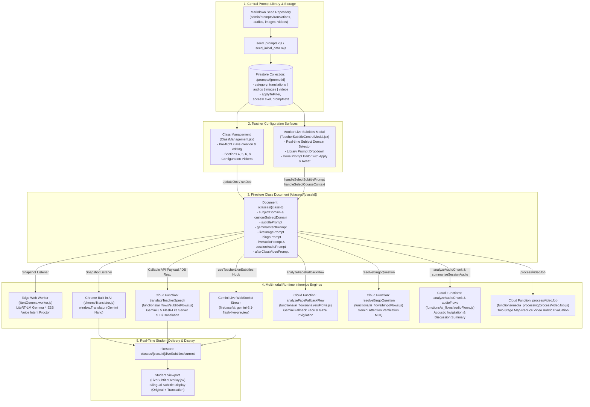
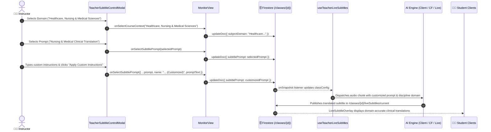
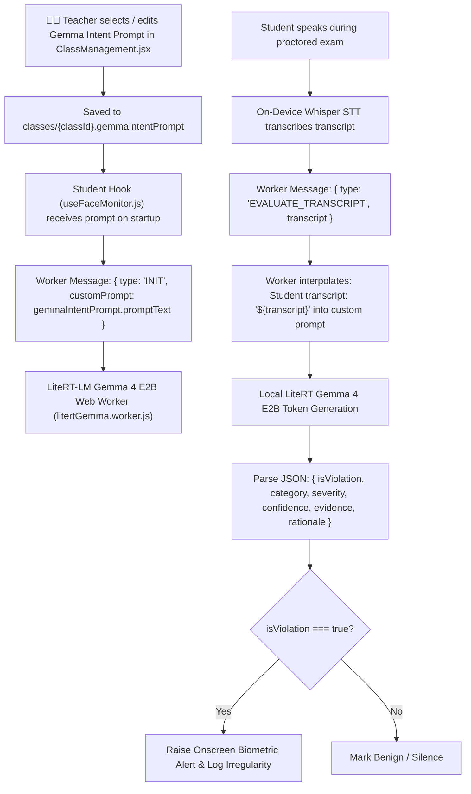
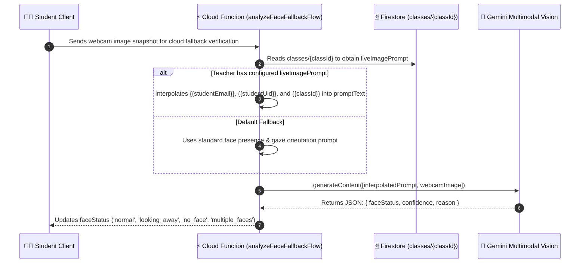
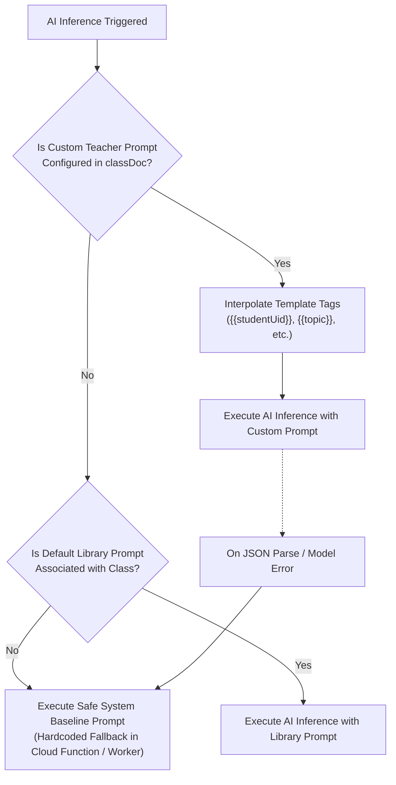

# 🧠 Teacher AI Prompt & Discipline Domain Configuration Architecture

[🏠 Documentation Index](../README.md#documentation-index) | [👨‍🏫 Instructor Manual](./user-manual-teacher.md) | [🌐 Live Subtitles & Translation](./live-subtitles-and-translation.md) | [🗄️ Firestore Schema](./firestore-schema.md)

---

## 1. Executive Summary & Design Principles

The **Gemini Multimodal Classroom Agent** is built around three core architectural tenets governing AI execution:
1. **Universal Prompt Library**: Every AI system prompt across every sensory modality (Live Subtitle Translation, On-Device Gemma Voice Intent, Acoustic Invigilation, Discussion Diarization, Image/Screen Invigilation, Bingo Active Presence, and After-Class Video Analysis) is cataloged as a reusable, versioned asset in the central prompt library (`prompts` collection and `admin/prompts/`).
2. **Zero Hardcoding & Full Instructor Agency**: Instructors are never locked into rigid, one-size-fits-all prompts. Teachers can select, preview, tweak, inline-edit, or reset prompts for any class, ensuring terminology is tailored to the specific course curriculum.
3. **Dual-Surface Configuration**:
   - **Pre-Flight Class Setup (`ClassManagement.jsx`)**: Persistent configuration of default prompts stored in `classes/{classId}`.
   - **In-Flight Live Control (`TeacherSubtitleControlModal.jsx` & `MonitorView.jsx`)**: Real-time dropdown selection, subject domain switching, and inline prompt editing during live lectures, synchronizing instantly across all connected students and backend inference workers.

---

## 2. End-to-End System Architecture & Data Flow

The following diagram illustrates how prompts flow from the centralized catalog into teacher configuration surfaces, persist in Cloud Firestore, and drive inference across edge workers, browser AI, serverless Cloud Functions, and Gemini Live streaming sockets:



---

## 3. Detailed Logic Trace-Down by Modality

### Modality 1: Live Subtitles & Multilingual Translation

- **Configurable Fields**: `subjectDomain`, `customSubjectDomain`, `subtitlePrompt` (`{ id, name, promptText }`).
- **Configuration Surfaces**:
  1. [`ClassManagement.jsx`](file:///home/developer/Documents/Gemini-AI-Classroom-Assistant/web-app/src/components/ClassManagement.jsx) Section 8: Dropdown for `subjectDomain` and button triggering `AudioPromptSelector` (`applyToFilter='Live Subtitles & Translation'`).
  2. [`TeacherSubtitleControlModal.jsx`](file:///home/developer/Documents/Gemini-AI-Classroom-Assistant/web-app/src/components/subtitles/TeacherSubtitleControlModal.jsx): Accessible anytime during live monitoring from the toolbar in [`MonitorView.jsx`](file:///home/developer/Documents/Gemini-AI-Classroom-Assistant/web-app/src/components/MonitorView.jsx).



#### Code Execution Paths:
1. **Server Model Mode ([`functions/ai_flows/subtitleFlows.js`](file:///home/developer/Documents/Gemini-AI-Classroom-Assistant/functions/ai_flows/subtitleFlows.js))**:
   - `translateTeacherSpeech` extracts `classData.subtitlePrompt?.promptText` and `classData.subjectDomain`.
   - If a custom prompt is set, it injects the custom instructions directly into the Gemini prompt while maintaining strict JSON schema output:
     ```javascript
     const domainContext = classData.subjectDomain || 'General Studies & Interdisciplinary';
     const basePrompt = classData.subtitlePrompt?.promptText 
       ? `${classData.subtitlePrompt.promptText}\n\nAcademic Subject Domain Context: "${domainContext}".`
       : `You are an expert real-time classroom lecture translator specializing in: "${domainContext}".`;
     ```
2. **Client Model Mode ([`web-app/src/utils/chromeTranslator.js`](file:///home/developer/Documents/Gemini-AI-Classroom-Assistant/web-app/src/utils/chromeTranslator.js) & [`useClientLiteRTWhisper.js`](file:///home/developer/Documents/Gemini-AI-Classroom-Assistant/web-app/src/hooks/useClientLiteRTWhisper.js))**:
   - STT is performed entirely on device by LiteRT Whisper WASM.
   - Translation is executed via `window.Translator` (Chrome Built-in AI / Gemini Nano). Domain context and glossaries are prefixed to the prompt context to prevent programming terms from being translated into literal colloquial words.
3. **Gemini Live Stream Mode ([`web-app/src/utils/aiLogic.js`](file:///home/developer/Documents/Gemini-AI-Classroom-Assistant/web-app/src/utils/aiLogic.js))**:
   - Uses Firebase AI Logic (`gemini-3.1-flash-live-preview`).
   - The system instructions configured for the WebSocket session include the teacher's selected domain and subtitle prompt, guaranteeing low-latency (~200ms) token streaming with accurate domain vocabulary.

---

### Modality 2: On-Device Gemma Voice Intent Proctoring

- **Configurable Field**: `gemmaIntentPrompt` (`{ id, name, promptText }`).
- **Configuration Surface**: [`ClassManagement.jsx`](file:///home/developer/Documents/Gemini-AI-Classroom-Assistant/web-app/src/components/ClassManagement.jsx) Section 6 (Screenshot & Recording Settings).
- **Execution Runtime**: Client-Side Web Worker ([`web-app/src/workers/litertGemma.worker.js`](file:///home/developer/Documents/Gemini-AI-Classroom-Assistant/web-app/src/workers/litertGemma.worker.js)).



- **Prompt Template Guidelines**:
  - The prompt guides categorization across: `COLLUSION_EXAM`, `EXTERNAL_AI_ASSIST`, `UNAUTHORIZED_TALK`, `LEGITIMATE_INQUIRY`, and `BENIGN`.
  - Teachers can tweak strictness (e.g. allowing students to read exam questions out loud or strictly forbidding all vocalization).

---

### Modality 3: Live Image & Screen Invigilation

- **Configurable Field**: `liveImagePrompt` (`{ id, name, promptText }`).
- **Configuration Surface**: [`ClassManagement.jsx`](file:///home/developer/Documents/Gemini-AI-Classroom-Assistant/web-app/src/components/ClassManagement.jsx) Section 6 via [`ImagePromptSelector.jsx`](file:///home/developer/Documents/Gemini-AI-Classroom-Assistant/web-app/src/components/ImagePromptSelector.jsx).
- **Execution Runtime**: Cloud Function `analyzeFaceFallbackFlow` in [`functions/ai_flows/analysisFlows.js`](file:///home/developer/Documents/Gemini-AI-Classroom-Assistant/functions/ai_flows/analysisFlows.js).



---

### Modality 4: Bingo Active Presence Challenge Verification

- **Configurable Field**: `bingoPrompt` (`{ id, name, promptText }`).
- **Configuration Surface**: [`ClassManagement.jsx`](file:///home/developer/Documents/Gemini-AI-Classroom-Assistant/web-app/src/components/ClassManagement.jsx) Section 5 (Bingo Active Presence).
- **Execution Runtimes**: [`functions/ai_flows/bingoFlows.js`](file:///home/developer/Documents/Gemini-AI-Classroom-Assistant/functions/ai_flows/bingoFlows.js) (`resolveBingoQuestion` and `generateBingoQuestionBank`).

#### Operational Modes & Custom Prompt Interpolation:
1. **Teacher Screen Attention Mode (`questionSource === 'teacher_screen'`)**:
   - Gemini analyzes the teacher's current live shared screen frame (`classes/{classId}/screenBroadcast/liveFrame`).
   - If the teacher configured a `bingoPrompt`, it replaces the default attention question instructions.
2. **Student Screen Activity Mode (`questionSource === 'student_screen'`)**:
   - Gemini inspects the student's latest desktop screenshot (`classes/{classId}/livePeeks/{studentUid}`).
   - Interpolates `{{studentUid}}` into the prompt, asking Gemini to verify whether the student is working on the assigned programming task rather than watching videos or idling.
3. **AI Question Bank Generator (`generateBingoQuestionBank`)**:
   - Interpolates `{{topic}}` and `{{count}}`.
   - Used by teachers in the Question Bank Studio (`BingoQuestionBankModal.jsx`) to auto-generate multiple-choice questions aligned with specific course rubrics.

---

### Modality 5: Acoustic Invigilation & Discussion Diarization

- **Configurable Fields**:
  - `liveAudioPrompt`: Short-window audio invigilation prompt (for real-time acoustic threat analysis).
  - `sessionAudioPrompt`: Full-session discussion diarization and summary prompt.
- **Configuration Surface**: [`ClassManagement.jsx`](file:///home/developer/Documents/Gemini-AI-Classroom-Assistant/web-app/src/components/ClassManagement.jsx) Section 6 via [`AudioPromptSelector.jsx`](file:///home/developer/Documents/Gemini-AI-Classroom-Assistant/web-app/src/components/AudioPromptSelector.jsx).
- **Execution Runtimes**:
  - `analyzeAudioChunk` (`functions/ai_flows/index.mjs`): Evaluates 30-second audio segments for unauthorized voices or collusive discussions.
  - `summarizeSessionAudio` (`functions/ai_flows/audioFlows.js`): Synthesizes student group discussion transcripts, identifying key contributors, technical debate quality, and unauthorized external assistance.

---

### Modality 6: After-Class Video Analysis & Rubric Synthesis Studio

- **Configurable Field**: `afterClassVideoPrompt` (`{ id, name, promptText }`).
- **Configuration Surface**: [`ClassManagement.jsx`](file:///home/developer/Documents/Gemini-AI-Classroom-Assistant/web-app/src/components/ClassManagement.jsx) Section 6 via `VideoPromptSelector` and [`SessionReviewView.jsx`](file:///home/developer/Documents/Gemini-AI-Classroom-Assistant/web-app/src/components/SessionReviewView.jsx).
- **Execution Runtime**: Cloud Function `processVideoJob` in [`functions/media_processing/processVideoJob.js`](file:///home/developer/Documents/Gemini-AI-Classroom-Assistant/functions/media_processing/processVideoJob.js) and [`functions/ai_flows/analysisFlows.js`](file:///home/developer/Documents/Gemini-AI-Classroom-Assistant/functions/ai_flows/analysisFlows.js).
- **Two-Stage Map-Reduce Flow**:
  - **Stage 1 (Video Observations)**: Gemini scans student compiled MP4 screencasts and extracts timecoded milestone observations.
  - **Stage 2 (Cohort Rubric Synthesis)**: Gemini aggregates observations across all students and applies `afterClassVideoPrompt` to generate a standardized lab evaluation rubric, complete with canonical milestones, common bottlenecks, and point values.

---

## 4. Prompt Template Variable Interpolation Matrix

When authoring custom prompts in the Prompt Studio or inline editors, teachers can embed template placeholders that are dynamically resolved at runtime:

| Variable Tag | Applicable Modalities | Runtime Source | Example Injected Value |
| :--- | :--- | :--- | :--- |
| `{{studentEmail}}` | Image Invigilation, Audio Chunks, Video Jobs | Authenticated User Profile | `s1234567@stu.vtc.edu.hk` |
| `{{studentUid}}` | Image Invigilation, Student Screen Bingo | Firebase Auth Token | `uid_abc123xyz` |
| `{{classId}}` | All Modalities | Active Classroom Context | `IT114115-2026-A` |
| `{{topic}}` | Bingo Question Bank Generator | Teacher Input Field | `Docker Container Networking` |
| `{{count}}` | Bingo Question Bank Generator | Teacher Input Field | `5` |
| `{{transcript}}` | On-Device Gemma Voice Intent | Whisper STT Output | `hey give me the answer for question 3` |

---

## 5. Fallback Hierarchy & FinOps Safety Net

To prevent lecture disruptions if a prompt is deleted or improperly formatted, the system enforces a strict 3-tier fallback hierarchy:



1. **Tier 1 (Custom Teacher Prompt)**: Uses the instructor's configured prompt from `classes/{classId}` with custom parameters.
2. **Tier 2 (Library Standard Prompt)**: If no custom text is present, uses the pre-seeded institutional prompt from the `/prompts` collection.
3. **Tier 3 (Hardcoded System Baseline)**: If Firestore is unreachable or prompt text is invalid, the backend automatically defaults to the safe, hardcoded baseline prompt with strict JSON schema validation, ensuring zero proctoring downtime.
