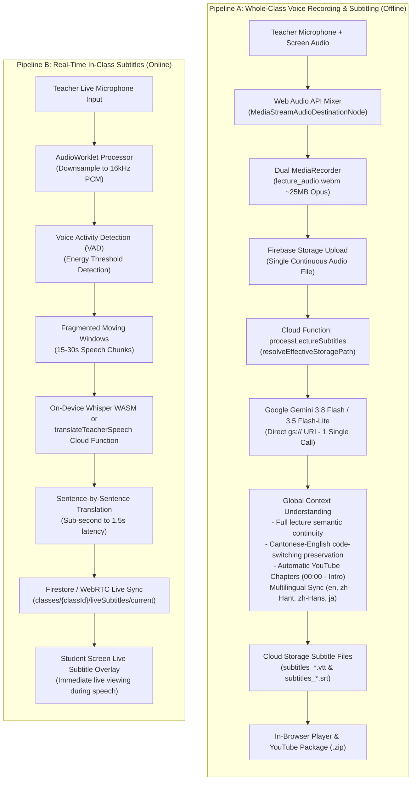
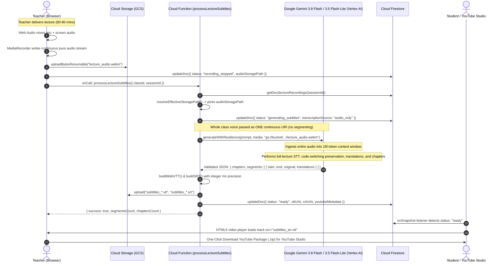
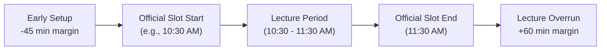
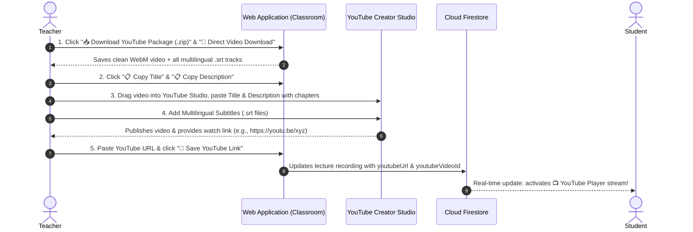
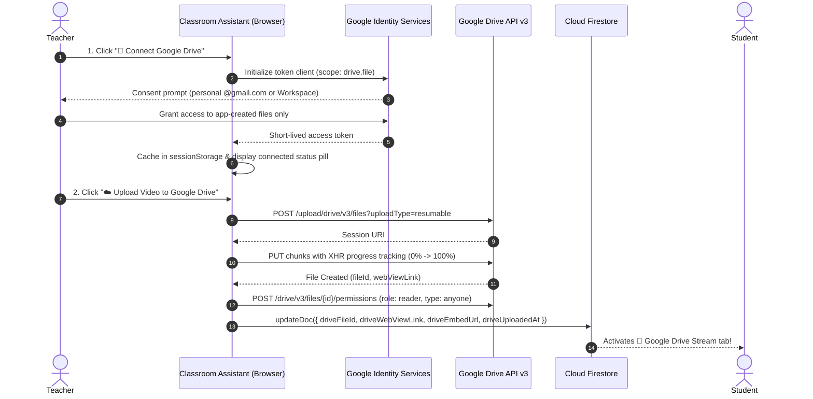

# Teacher Lecture Recording & YouTube Multilingual CC Workflow

## 1. Executive Summary & Design Rationale

In classroom instruction—especially technical engineering and software development courses conducted in Hong Kong—instructors frequently use Cantonese-English code-switching (e.g., *"We use `useState` to store state, and then call `useEffect`..."*).

### Why Real-Time Subtitles Are NOT Reused for Lecture Recordings
Real-time live subtitles operate under extreme latency constraints (<1.5s per chunk). Consequently:
- Subtitles are produced from 15–30 second moving-window chunks with Voice Activity Detection (VAD) cutoffs.
- Chunks lack global discourse context, leading to sentence fragmentation, mistranslated technical terminology, and incomplete clauses.
- Minor network fluctuations or packet jitter during live broadcast can cause dropped or desynchronized lines.

For high-stakes archive recordings and public/unlisted **YouTube publishing**, the system employs **Full-Context Offline Gemini Transcription & Translation**:
1. The teacher records the complete lecture (clean video + mixed high-fidelity microphone and desktop audio).
2. The entire recording is uploaded to Cloud Storage (`raw_recording.webm`).
3. An offline Cloud Function passes the audio/video directly to Google Gemini via `gs://` URI.
4. Gemini transcribes the complete lecture with global context, preserving verbatim technical keywords (`Docker`, `Kubernetes`, `React`), translating into 4 languages (`en`, `zh-Hant`, `zh-Hans`, `ja`), and extracting chapter markers (`00:00 - Introduction`).
5. The video remains clean (unburned pixels), while standalone standard `.vtt` (in-browser HTML5 playback) and `.srt` (YouTube Creator Studio upload) files are generated.

---

## 2. Key Operational Principles: Teacher Sovereignty & Class Overlap Handling

### Teacher Full Sovereignty (No Forced Auto-Recording)
Class schedules are unpredictable:
- Teachers may arrive late due to office hours or previous commitments.
- Teachers may spend the first 5 minutes setting up equipment or answering private administrative questions.
- Teachers frequently pause for student lab exercises, quizzes, or bio breaks.

**Core Rule**: Lecture recording **NEVER** starts automatically based solely on calendar time. Timetable data only provides contextual metadata (class title, room, default topic). The teacher retains full sovereign control to **Start**, **Pause**, **Resume**, **Stop & Save**, or **Discard** recording at any moment.

### 5-Minute Class Buffer & Overlap Protection
Many educational institutions schedule consecutive classes with a 5-minute buffer or back-to-back room handovers (e.g., Class A ends at 10:55, Class B starts at 11:00).
- Automatic calendar recording would bleed Class A's ending questions into Class B's recording.
- In our system, recording sessions are strictly bound to individual session IDs (`classes/{classId}/lectureRecordings/{sessionId}`).
- When a class window ends, the teacher is gently prompted to finalize or discard the active recording. A recording from one class cannot write into another class's collection or overwrite existing video blobs.

### Class-Level Default Recording Policy & Studio Mode Selector
To prevent teachers from accidentally forgetting to record lecture archives, the classroom configuration provides a class-level recording default:
1. **Class-Wide Default (`classes/{classId}.defaultLectureRecording`)**:
   - `true` (**Record & Stream by Default - Recommended**): Every time the teacher opens the Teacher Screen Broadcast Studio, HD recording is automatically pre-armed.
   - `false` (**Live Stream Only by Default**): Broadcaster defaults to real-time ephemeral screen delivery without saving storage files unless manually toggled.
2. **Prominent 2-Card Studio Broadcast Mode Selector**:
   - In Step 2 of the Teacher Broadcast Setup Wizard, instructors are presented with two interactive mode cards:
     - **Option 1: 🎥 Stream & Record (YouTube & CC)**: Transmits live frames to students and records full composite HD WebM video + pure audio to Cloud Storage for YouTube packaging and Gemini CC. Action button: `🔴 Start Live Stream & Record`.
     - **Option 2: 📡 Live Stream Only (0 Storage / Ephemeral)**: Streams real-time screen frames and voice subtitles directly to student monitors with zero files saved to Cloud Storage. Action button: `🚀 Start Live Stream Only (No Saving)`.
   - Teachers retain complete per-session override freedom: selecting a different card immediately flips the mode and dynamically updates the start action button.

### Asymmetric Data Nature: Teacher Sovereign Deletion vs. Student Telemetry TTL
Student data and teacher data serve fundamentally different educational purposes and are governed by distinct lifecycles:
- **Student Proctoring Telemetry (Strict Automated TTL)**: Student screenshots, webcam stills, audio slices, and presence logs are sensitive invigilation records. They are subjected to strict automated Time-To-Live (TTL) policies (14–90 days configured in Class Settings) and automatic bucket lifecycle rules, guaranteeing student privacy.
- **Teacher Lecture Archives (Permanent Teacher Sovereignty)**: Lecture recordings and AI transcripts are instructional intellectual property belonging to the course. They do **not** auto-expire on a 14-day timer. Instead, lecture recordings are permanently preserved until the teacher explicitly clicks **Delete Recording** in the Lecture Recordings Studio, triggering atomic deletion across Firestore documents, video WebM blobs, pure audio files, and all multilingual `.vtt` / `.srt` subtitle assets.

---

## 3. Architecture & Data Flow (Dual-Stream Ingestion)

```
[Teacher Screen + Mic] 
         │ (Web Audio API Destination Node)
         ├──► [Browser Video MediaRecorder] ──────► [Storage: lecture.webm (~1.2GB)]
         │                                               │ (Archive / Playback)
         └──► [Browser Audio MediaRecorder (Opus)] ──► [Storage: lecture_audio.webm (~25MB)]
                                                         │ (AI Ingestion Stream)
                                                         ▼
                                       [Cloud Function: processLectureSubtitles]
                                                         │ (Direct gs:// Audio Ingestion)
                                                         ▼
                                       [Gemini 3.8 Flash / 3.5 Flash-Lite via gs:// URI]
                                         ├── Verbatim Cantonese/English Transcript
                                         ├── Multi-language Translations (en, zh-Hant, zh-Hans, ja)
                                         └── YouTube Chapter Markers & Metadata
                                                         │
                                                         ▼ (Cloud Storage write)
                                       [Storage: subtitles_{lang}.vtt & .srt]
                                                         │
                                                         ▼ (Firestore update: classes/{classId}/lectureRecordings/{sessionId})
                                       [LectureRecordingsView (Web App)]
                                         ├── Native HTML5 Video Player with Multilingual <track>
                                         ├── One-Click Copy YouTube Title & Description
                                         └── One-Click Download YouTube Package (.zip)
```

### 3.1 Client-Side Dual-Stream Architecture (`useLectureRecorder.js`)

To decouple massive display screencast bandwidth from AI audio speech processing, the recording hook [`web-app/src/hooks/useLectureRecorder.js`](file:///home/developer/Documents/Gemini-AI-Classroom-Assistant/web-app/src/hooks/useLectureRecorder.js) operates a synchronized dual-recorder pipeline:

1. **Hardware-Locked Audio Mixing (`Web Audio API`)**:
   - The teacher's microphone (`navigator.mediaDevices.getUserMedia`) and screen audio (`navigator.mediaDevices.getDisplayMedia`) are routed into a single browser `AudioContext`.
   - Both audio sources pass through gain stages into a `MediaStreamAudioDestinationNode`. This hardware-locks microphone and system audio without clock drift.
   - The composite video stream combines `displayStream.getVideoTracks()` with `mixedAudioDestination.stream.getAudioTracks()`.
   - A dedicated `pureAudioStreamRef` is extracted and preserved exclusively for speech transcription.

2. **Audio MIME Type Dynamic Negotiation**:
   Different client operating systems and browsers (macOS Safari vs. Windows Chrome vs. Linux Chromium) implement varying audio codec support. The hook evaluates codecs in priority order via `MediaRecorder.isTypeSupported()`:
   ```javascript
   function getSupportedAudioMimeType() {
     const types = [
       'audio/webm; codecs=opus',
       'audio/webm',
       'audio/ogg; codecs=opus',
       'audio/mp4'
     ];
     for (const type of types) {
       if (typeof MediaRecorder !== 'undefined' && MediaRecorder.isTypeSupported(type)) {
         return type;
       }
     }
     return ''; // Fall back to browser default
   }
   ```

3. **Synchronous Multi-Recorder Lifecycle**:
   - **`videoRecorderRef`**: Captures screen video at native resolution (1080p/1440p) using `video/webm; codecs=vp9,opus` (or `video/mp4`).
   - **`audioRecorderRef`**: Captures pure voice + system sound using the negotiated audio MIME type.
   - **10-Second Timeslice Chunking**: Both recorders invoke `.start(10000)`, emitting discrete 10-second blobs via `dataavailable` event listeners. This eliminates browser tab crashes when recording 90-minute lectures.
   - **State Mirroring**: All lifecycle operations (`start`, `pause`, `resume`, `stop`, `discard`, and unmount cleanups) operate atomically across both recorders in lockstep.

4. **Concurrent Cloud Storage Uploads**:
   Upon recording termination, the hook issues parallel uploads via Firebase Storage SDK (`uploadBytesResumable`):
   - Video File: `recordings/{classId}/{sessionId}/lecture.webm` (~750 MB – 1.25 GB for 90 mins).
   - Audio Track: `recordings/{classId}/{sessionId}/lecture_audio.webm` (~20 MB – 30 MB for 90 mins).
   - Writes `videoUrl`, `storagePath`, `audioUrl`, `audioStoragePath`, and `audioFileSize` to the Firestore session document.

---

### 3.2 Backend Ingestion Prioritization & Fallback (`processLectureSubtitles.js`)

When the teacher initiates subtitle and chapter generation, the Cloud Function [`functions/ai_flows/processLectureSubtitles.js`](file:///home/developer/Documents/Gemini-AI-Classroom-Assistant/functions/ai_flows/processLectureSubtitles.js) executes the following path resolution:

```javascript
export function resolveEffectiveStoragePath(sessionData, requestedStoragePath) {
  if (sessionData && sessionData.audioStoragePath && typeof sessionData.audioStoragePath === 'string') {
    return {
      storagePath: sessionData.audioStoragePath,
      source: 'audio_only'
    };
  }
  const fallbackPath = (sessionData && sessionData.storagePath) || requestedStoragePath || '';
  return {
    storagePath: fallbackPath,
    source: fallbackPath ? 'video' : 'none'
  };
}
```

#### Why Prioritizing `audioStoragePath` is Transformative:
- **97% Bandwidth & Payload Reduction**: Ingesting pure Opus audio (~25 MB) instead of composite VP9 video (~1.2 GB) prevents network saturation between Cloud Storage and Gemini inference endpoints.
- **Elimination of Container OOM Risks**: Google Cloud Functions Gen 2 instances have a 2 GiB memory ceiling. Ingesting or buffering large composite video blobs risks container crashes. Pure audio remains safely beneath 100 MB.
- **5x Faster Ingestion**: Gemini begins decoding audio tokens immediately without having to demux, decode, and discard millions of unneeded video frames.
- **FinOps & Audit Transparency**: The Cloud Function explicitly stamps `transcriptionSource: 'audio_only'` (or `'video'` fallback for legacy recordings) onto the session document in Firestore, enabling institutional billing audits.

---

### 3.3 Whole-Class Holistic Audio Ingestion vs. Live Segment-by-Segment Streaming

The platform intentionally maintains **two separate subtitle pipelines** engineered for completely different objectives:



#### Detailed Sequence: Whole-Class Voice STT & Translation Workflow



#### Architectural Deep Dive: Why Whole-Class Voice is Used

1. **Holistic Discourse Understanding**:
   - In technical programming lectures, an instructor frequently introduces a concept, writes code, pauses, and explains the outcome minutes later (e.g., *"We configure the route here... and later in line 45 we call the controller"*).
   - A segment-by-segment system processes each 15-second snippet in isolation. It cannot resolve anaphoric references (what *"it"*, *"the hook"*, or *"that parameter"* refers to).
   - In the whole-class voice pipeline, Gemini ingests the entire lecture from $00:00$ to the end. It understands the full narrative arc, producing coherent, professionally punctuated transcripts.

2. **Accurate Code-Switching & Technical Term Retention**:
   - Spoken Cantonese in Hong Kong higher education is heavily interspersed with English software engineering jargon (e.g., `useState`, `Docker`, `Kubernetes`, `async/await`, `reducer`).
   - Fragmented speech chunks lack context, causing generic STT engines to mistranslate English terms into phonetic Cantonese/Mandarin homophones.
   - Whole-class audio ingestion gives Gemini the macro context of the entire technical lecture, ensuring that English programming keywords, variable names, and terminal commands are retained verbatim in code blocks and subtitles.

3. **Macro-Structure & YouTube Chapter Extraction**:
   - Generating timestamped chapter markers (e.g., `00:00 - Introduction`, `14:20 - React Hooks Demo`, `38:15 - Q&A`) requires analyzing the macro structure of the entire lecture.
   - A segment-by-segment engine cannot determine when a major topic begins or ends. Only full-audio reasoning allows Gemini to identify topic transitions and summarize milestones accurately.

4. **Zero Segment-Stitching Drift**:
   - Segment-based chunking introduces cumulative boundary drift when individual chunks are concatenated together.
   - The whole-class audio track runs on a single continuous hardware clock. Gemini generates timestamps relative to the continuous recording timeline, ensuring sub-second alignment with the video track across the entire lecture.

---

#### Technical Comparison Matrix: Whole-Class vs. Segment-by-Segment

| Dimension | 🎙️ Whole-Class Voice Subtitle Pipeline (Offline) | ⚡ Live In-Class Subtitle Pipeline (Real-Time) |
| :--- | :--- | :--- |
| **Primary Objective** | Archival recording, high-fidelity transcription, YouTube publishing | Instant visual assistance during live class broadcast |
| **Input Source** | Single continuous `lecture_audio.webm` (~25 MB Opus) | Streaming 16 kHz PCM audio via AudioWorklet |
| **Processing Paradigm** | **Holistic single-pass multimodal inference** via Gemini | **Streaming sentence-by-sentence** via VAD / LiteRT Whisper |
| **Ingestion Mechanism** | Direct Cloud Storage URI (`gs://bucket/.../lecture_audio.webm`) | Local Web Audio buffer / WebSocket stream |
| **Discourse Context Horizon** | **Global (Entire lecture: 60 to 90 minutes)** | **Local (Current 15–30 second window only)** |
| **Latency** | ~60 – 120 seconds (run once after lecture ends) | **Sub-second to 1.5 seconds (word-by-word / sentence live)** |
| **YouTube Chapter Markers** | **Yes**: Automatically synthesized with timestamps | **No**: Impossible from isolated segments |
| **Code-Switching Accuracy** | **Highest**: Full technical domain context retained | Good: Dependent on short-window prompt hinting |
| **File Artifacts Produced** | `subtitles_*.vtt`, `subtitles_*.srt`, `youtube_metadata.txt` | Temporary Firestore live documents (`liveSubtitles/current`) |
| **Underlying Engine** | Google Gemini 3.8 Flash / 3.5 Flash-Lite (Vertex AI) | LiteRT Whisper WASM / Chrome Built-in AI / `translateTeacherSpeech` |
| **FinOps Cost Model** | 1 multimodal API invocation per lecture (~$0.01 – $0.03) | Real-time sentence calls ($0.00 for client model) |

---

## 4. Subtitle Timestamp Precision Standards

YouTube and HTML5 video players require strict timestamp formatting:
- **WebVTT (`.vtt`)**: Uses periods for millisecond separation: `HH:MM:SS.mmm` (e.g., `00:01:24.500`).
- **SubRip (`.srt`)**: Strictly requires commas for millisecond separation: `HH:MM:SS,mmm` (e.g., `00:01:24,500`).

### Eliminating Floating-Point Calculation Drift
Floating-point subtraction (e.g., `s - Math.floor(s)`) in JavaScript introduces precision drift (e.g., `0.7999999999999` rendered as `00:00:04.799` instead of `00:00:04.800`).
All timestamp formatters in [`processLectureSubtitles.js`](file:///home/developer/Documents/Gemini-AI-Classroom-Assistant/functions/ai_flows/processLectureSubtitles.js) convert input seconds to integer milliseconds first:
```javascript
const totalMs = Math.round(Number(seconds) * 1000);
const hours = Math.floor(totalMs / 3600000);
const minutes = Math.floor((totalMs % 3600000) / 60000);
const secs = Math.floor((totalMs % 60000) / 1000);
const ms = totalMs % 1000;
```

---

## 5. YouTube Creator Studio Upload Workflow

The web application packages everything needed for YouTube publishing into a single `.zip` file:
1. **Clean Video File**: Native WebM (`video/webm; codecs=vp9,opus`) or MP4.
2. **Multilingual SubRip Files (`.srt`)**:
   - `subtitles_en.srt` (English)
   - `subtitles_zh-Hant.srt` (Traditional Chinese)
   - `subtitles_zh-Hans.srt` (Simplified Chinese)
   - `subtitles_ja.srt` (Japanese)
   - `subtitles_original.srt` (Original Cantonese/English transcript)
3. **`youtube_metadata.txt`**: Contains the pre-formatted Title and Description including clickable YouTube chapters:
   ```
   00:00 - Introduction & Course Overview
   05:14 - Setting Up Vite & React Project
   14:20 - Explaining State & Lifecycle
   32:10 - Hands-on Lab Walkthrough
   45:00 - Q&A and Wrap-up
   ```

### Step-by-Step Teacher Guide:
1. In the Monitor View top bar, click **"🎥 Lecture Recordings & YouTube CC"**.
2. Select the completed recording from the list.
3. Click **"📥 Download YouTube Package (.zip)"**.
4. Open [YouTube Studio](https://studio.youtube.com) and click **Create -> Upload videos**.
5. Upload the downloaded video file.
6. Click **📋 Copy Title** and **📋 Copy Description** in the web app and paste them into YouTube Studio.
7. Under the **Subtitles** tab in YouTube Studio:
   - Click **Add Language** (e.g., Chinese Traditional / English).
   - Choose **Upload File -> With timing**.
   - Select the respective `subtitles_*.srt` file from the unzipped folder.
8. Set Visibility to **Unlisted** (accessible to students with the link) and click **Publish**.

---

## 6. Firestore Data Model Reference

Recordings are stored under `classes/{classId}/lectureRecordings/{sessionId}`:

| Field | Type | Description |
|---|---|---|
| `sessionId` | `string` | Unique recording identifier (`rec_...`) |
| `classId` | `string` | Class identifier (e.g., `IT114115`) |
| `teacherUid` | `string` | UID of the teacher who recorded the lecture |
| `teacherEmail` | `string` | Email of the teacher |
| `title` | `string` | Display title of the lecture |
| `topic` | `string` | Subject topic (e.g., React Hooks) |
| `status` | `string` | `recording` \| `paused` \| `generating_subtitles` \| `ready` \| `subtitles_failed` \| `discarded` |
| `videoUrl` | `string` | Public/signed download URL of the clean video |
| `storagePath` | `string` | Cloud Storage path (`classes/{classId}/lectureRecordings/{sessionId}/raw_recording.webm` or `recordings/.../lecture.webm`) |
| `audioUrl` | `string` | Public/signed download URL of the pure audio stream (`.webm`, `.ogg`, `.mp4`) |
| `audioStoragePath` | `string` | Cloud Storage path for the pure audio stream (`recordings/{classId}/{sessionId}/lecture_audio.webm`) |
| `audioFileSize` | `number` | Size in bytes of the pure audio file (~20 MB – 30 MB) |
| `transcriptionSource` | `string` | Ingestion mode used by Gemini (`'audio_only'` or `'video'`) |
| `durationSeconds` | `number` | Total net active recorded duration in seconds |
| `startedAt` | `Timestamp` | Recording initiation timestamp |
| `endedAt` | `Timestamp` | Recording completion timestamp |
| `vttUrls` | `map` | Map of ISO language codes to `.vtt` file download URLs |
| `srtUrls` | `map` | Map of ISO language codes to `.srt` file download URLs |
| `youtubeMetadata` | `map` | Formatted YouTube `title`, `description`, and `chapters` array |

---

## 7. 1 to 1.5-Hour Long Lecture Performance & Scaling Analysis

When conducting standard university or vocational lectures lasting **60 to 90 minutes (1 – 1.5 hours)**, the system encounters specific physical and architectural constraints across client-side recording, Cloud Storage transfer, and Gemini LLM token ceilings:

### 📊 Performance & Resource Matrix (1h vs 1.5h Continuous Recording)

| Metric / Dimension | 1-Hour Lecture (3,600s) | 1.5-Hour Lecture (5,400s) | Technical Limit / Guarantee |
| :--- | :--- | :--- | :--- |
| **Recorded Video Size (WebM VP9/Opus)** | ~500 MB – 800 MB | ~750 MB – 1.25 GB | Based on ~1.8 – 2.2 Mbps desktop screen sharing |
| **Browser Tab Memory Footprint** | ~550 MB RAM | ~850 MB – 1.3 GB RAM | Chunked in 10s timeslices; safe in 64-bit Chrome/Edge (2–4 GB tab ceiling) |
| **Upload Duration (100 Mbps broadband)** | ~40 – 65 seconds | ~60 – 100 seconds | Handled by Firebase `uploadBytesResumable` with retry |
| **Gemini Input Token Load (Audio)** | ~115,200 tokens | ~172,800 tokens | **17.3%** of Gemini 1,000,000 token input window |
| **Estimated Speech Segments** | ~250 – 400 turns | ~400 – 600 turns | Dependent on lecture density |
| **Single-Call Output Tokens (4 languages)** | ~14,000 – 18,000 tokens | ~22,000 – 30,000 tokens | **EXCEEDS** Gemini 8,192 max output limit |
| **Single-Call Output Tokens (Original + English)** | ~4,200 – 5,500 tokens | ~6,500 – 7,800 tokens | **SAFE** (under 8,192 max output limit) |
| **Cloud Function Execution Time** | ~75 – 120 seconds | ~120 – 210 seconds | Hard Cloud Function Gen 2 limit: **540s (9 mins)** |

---

### ⚠️ The Gemini 8,192 Max Output Token Bottleneck

While Gemini's **1,000,000 input context window** can ingest up to 8.5 hours of continuous audio with ease, Gemini has a hard single-turn **maximum output limit of 8,192 tokens**.

#### The Token Math:
1. In a 90-minute lecture, an instructor typically utters between 400 and 600 discrete speech phrases.
2. Each JSON segment contains:
   ```json
   {
     "start": 12.4,
     "end": 17.8,
     "original": "我哋可以用 React Hook 嘅 useEffect 去 handle side effects...",
     "translations": {
       "en": "We can use React Hook's useEffect to handle side effects...",
       "zh-Hant": "我們可以使用 React Hook 的 useEffect 來處理副作用...",
       "zh-Hans": "我们可以使用 React Hook 的 useEffect 来处理副作用...",
       "ja": "React Hook の useEffect を使って副作用を処理できます..."
     }
   }
   ```
3. A single 4-language segment requires approximately **50 to 65 output tokens**.
4. $450 \text{ segments} \times 55 \text{ tokens/segment} = \mathbf{24,750 \text{ tokens}}$.
5. If requested in a single API call, **Gemini will abruptly truncate output at token 8,192**, breaking JSON syntax and causing subtitle generation to fail.

---

### 🛠️ Production Recommendations for 1 to 1.5-Hour Lectures

#### Strategy 1: The YouTube Master Subtitle Approach (Recommended)
1. **Primary Master Generation**: Request Gemini to generate the **Verbatim Original Transcript + English (`en`) Translation** alongside YouTube Chapter Markers.
   - Total output tokens for 1.5h: **~6,800 tokens** (well below the 8,192 ceiling).
   - Generates perfectly synchronized `subtitles_original.srt` and `subtitles_en.srt`.
2. **YouTube Studio Zero-Cost Auto-Translation**:
   - Ingest `subtitles_en.srt` into YouTube Creator Studio.
   - YouTube's native subtitle engine provides automatic, zero-latency, free translation into Traditional Chinese, Simplified Chinese, Japanese, and 50+ other languages with full timing synchronization.
   - **Cost to institution: $0.00**; **Token overflow risk: 0%**.

#### Strategy 2: Partitioned / Segmented Generation (For Multi-Language In-App Video Player)
If in-app playback strictly requires all 4 language tracks embedded directly inside the browser before YouTube export:
1. Divide the 90-minute lecture audio into two 45-minute or three 30-minute processing intervals.
2. Dispatch parallel sub-tasks or use Google Cloud Tasks (mirroring the architecture of `videoAnalysisJobs`).
3. Concatenate the resulting WebVTT/SRT cue lists sequentially with calculated timestamp offsets (`offsetSeconds = chunkIndex * 1800`).

---

## 8. Automated Multi-Clip Merging & Fuzzy Schedule Grouping

### 8.1 The Fragmented Lecture Problem
During everyday teaching, a single lecture period often produces multiple separate recording clips:
- The teacher briefly pauses or stops and restarts screen sharing (e.g., to answer a student question privately or switch windows).
- A brief network hiccup causes the browser's `MediaRecorder` stream to finalize.
- The teacher records an initial 1-minute test clip before beginning the 50-minute main lecture.

Without automated merging, teachers and students are presented with fragmented clips (`Part 1 (1m)`, `Part 2 (52m)`), forcing instructors to manually download, splice, and re-upload files before publishing to YouTube.

### 8.2 Fuzzy Timetable Slot Matching (`sessionGrouping.js`)
Class timetables provide predefined slots (e.g., `Monday 10:30–11:30`). However, real-world classroom sessions rarely adhere strictly to calendar boundaries:
- Teachers frequently arrive 5–15 minutes early to test their microphone, set up presentation slides, and verify screen broadcast.
- Lectures frequently run overtime by 15–30 minutes for student Q&A and lab wrap-up.

To group all relevant clips without manual configuration, the system implements **Fuzzy Schedule Slot Grouping**:



1. **Early Start Tolerance (-45 Minutes)**:
   - A clip started up to 45 minutes before the official class start time (e.g., 10:28 AM for a 10:30 AM class) is automatically matched to the scheduled slot.
2. **Overrun Tolerance (+60 Minutes)**:
   - A clip continuing or started up to 60 minutes after the official class end time (e.g., 11:45 AM or 12:15 PM for an 11:30 AM class) remains bound to the same session group.
3. **Inactivity Gap Tolerance (<30 Minutes)**:
   - If an instructor stops recording and starts a new recording within 30 minutes, the consecutive clips are clustered together into the same group.
4. **Broadcast Session Anchoring (`broadcastSessionId`)**:
   - When recording via the Teacher Screen Broadcast Studio, all recordings inherit the active `broadcastSessionId`, generating an explicit anchor `bcast_${broadcastSessionId}`.

### 8.3 Serverless Stream-Copy Concatenation (`mergeLectureRecordings`)
When merging is triggered, the `mergeLectureRecordings` Cloud Function (`functions/media_processing`, 2nd Gen, `asia-east2`, 2GiB RAM, 2 vCPUs) executes:

1. **Zero-Transcoding Stream Copy**:
   - Constructs an FFmpeg concat manifest:
     ```text
     file '/tmp/clip1.webm'
     file '/tmp/clip2.webm'
     ```
   - Executes:
     ```bash
     ffmpeg -f concat -safe 0 -i list.txt -c copy -y combined.webm
     ```
   - **Performance**: Completes in **~2 seconds** for a 1-hour 1080p WebM recording because it copies compressed VP8/VP9 and Opus bitstreams directly without CPU-intensive decoding or re-encoding.
2. **WebM Duration & Seek Index Healing**:
   - Native browser `MediaRecorder` omits the Matroska EBML `Duration` header and seek cues. FFmpeg remuxing automatically injects standard headers and cues, enabling HTML5 `<video>` players to seek immediately without player freezes.
3. **Pure Audio Extraction**:
   - Executes `ffmpeg -i combined.webm -vn -c:a copy combined_audio.webm` in ~0.5s, producing a compact Opus audio track for Gemini AI ingestion.
4. **Document Hierarchy & Traceability**:
   - Creates a master document `classes/{classId}/lectureRecordings/{combinedSessionId}` stamped with:
     - `isCombined: true`
     - `sourceRecordingIds: ['rec_1...', 'rec_2...']`
     - `durationSeconds`: Total combined duration verified by `ffprobe`
   - Updates source clips:
     - `isFragment: true`
     - `fragmentIndex`: `1`, `2`, ...
     - `mergedIntoSessionId: combinedSessionId`
5. **Automated Subtitle Pipeline Trigger**:
   - Upon completion, the function automatically invokes `processLectureSubtitles`, generating full multilingual `.vtt` / `.srt` subtitle files and YouTube chapters for the unified lecture.

### 8.4 User Experience & Workflow

#### Automatic Merging on Broadcast Stop
When a teacher finishes broadcasting in `MonitorView` and clicks **"Stop Sharing"**, the system checks if multiple recordings were generated during that broadcast. If so, `mergeSessionRecordings` is automatically dispatched in the background after a 2.5-second buffer (ensuring all chunk uploads have completed).

#### Smart Detection Banner in Lecture Recordings View
When visiting **🎬 Recordings & Sessions -> 🎥 Teacher Lecture Recordings**:
1. If unmerged clips from the same session or day are detected, a prominent blue alert banner appears:
   > 💡 **2 separate recording clips detected from 9/21/2026** (53m 5s total). Would you like to merge them into a single continuous full lecture?  
   > `[ 🔗 Merge into Full Lecture ]`
2. Clicking **Merge into Full Lecture** triggers the serverless merge pipeline with real-time spinner feedback.
3. Once merged, the banner automatically clears.

#### Custom Selection Merging
Teachers can click **"🔗 Custom Merge"** to enter manual selection mode:
- Checkboxes appear on each recording card.
- The teacher selects 2 or more clips and clicks **"🔗 Merge Selected (N clips)"**.
- An optional custom title can be specified.

#### Visual Hierarchy & Badges
- **Master Combined Lecture**: Marked with a distinctive teal badge: `🌟 Combined Full Lecture`.
- **Source Fragments**: Marked with a gold badge: `✂️ Part 1`, `✂️ Part 2 (Merged into master lecture)`.
- **YouTube Published**: Marked with a red pill badge: `📺 YouTube`.

---

## 9. Phase 1: YouTube Studio Export & Dual-Player Integration

### 9.1 Design Philosophy: Why Phase 1 Completes the Loop Without API Pitfalls
Direct automated YouTube API uploads face severe technical, legal, and operational hurdles:
1. **No Service Account Support**: Google Cloud Service Accounts cannot own YouTube channels.
2. **Private-by-Default Audit Lock**: Since July 2020, videos uploaded via unverified OAuth applications are irrevocably forced into `private` mode until the developer completes a formal YouTube API Compliance Audit and Google CASA Tier 2 Cloud Application Security Assessment.
3. **Workspace vs. Personal Friction**: School Workspace accounts frequently disable YouTube channel creation or restrict external third-party API apps via Google Admin Console policies.

Phase 1 provides a friction-free, robust, and permanent solution that works with **any Google account** (institutional Workspace or personal `@gmail.com`):



### 9.2 Key Features in Phase 1 Implementation

1. **3-Step Guided Studio Workflow Card**:
   - **Step 1: Download Media & Subtitles**: One-click download of `.zip` containing all multilingual subtitle files (`.srt`), metadata, and instructions, alongside a reliable client-side video file downloader with progress feedback.
   - **Step 2: Upload to YouTube Studio**: Dedicated launcher button (`🚀 Open YouTube Studio Upload ↗`) that navigates directly to YouTube channel upload. Prominent 1-click clipboard copy buttons for YouTube Title and Description with timestamps.
   - **Step 3: Link YouTube Video to Classroom**: Input field accepting any YouTube link (`youtu.be`, `youtube.com/watch?v=...`, `youtube.com/embed/...`, or raw 11-char ID). Updates Firestore with `youtubeUrl`, `youtubeVideoId`, and `youtubeLinkedAt`.
2. **Dual-Player Switcher (`activePlayerMode`)**:
   - Once a lecture recording is linked to YouTube, the video player automatically defaults to **📺 YouTube Stream (Fast & Adaptive)**, embedding `https://www.youtube-nocookie.com/embed/${youtubeVideoId}` with full screen and responsive 16:9 layout.
   - Users can seamlessly switch back to **🎞️ Cloud Storage HTML5 Player** at any time to verify raw video and in-app WebVTT subtitles.
   - An external launcher **▶️ Open on YouTube ↗** allows instant playback in YouTube's native application.
3. **Sidebar Indicators**:
   - Recordings linked to YouTube display a prominent `📺 YouTube` badge in the left-hand recordings list, giving teachers instantaneous visibility over their published curriculum.

---

## 10. Google Drive Direct Cloud Archiving & Multi-Player Streaming

### 10.1 Why Google Drive Integration Works Across Personal & Workspace Accounts

While direct automated YouTube uploads encounter strict verification barriers (Private-by-default lock and mandatory CASA Tier 2 Cloud Application Security Assessments), **Google Drive API v3** offers a frictionless, compliant solution for video distribution:

| Metric / Dimension | Automated YouTube API Upload | Direct Google Drive API Integration |
| :--- | :--- | :--- |
| **GCP Project Requirement** | Standard GCP project | Standard GCP project (even a free personal Gmail GCP project) |
| **Account Type Support** | Often blocked on Workspace if channel creation is disabled | **Works equally on personal `@gmail.com` and Workspace accounts** |
| **OAuth Scope Classification** | Restricted (`youtube.upload`) | **Sensitive** (`https://www.googleapis.com/auth/drive.file`) |
| **Google CASA Tier 2 Audit** | **Mandatory** for public/unlisted videos | **Bypassed completely** in Testing mode (up to 100 users) and standard verification |
| **Least-Privilege Security** | Broad channel management | **Least-privilege**: can only access/modify files created by this application |
| **Personal Account Quota** | Quota units consumed (1600/upload) | Uses teacher's own Drive quota (15 GB personal / 30 GB - Unlimited Workspace) |
| **Instant Playback** | Transcoding delays & copyright scan delays | **Instant preview streaming** via `/file/d/{id}/preview` iframe |

### 10.2 Architectural Implementation



### 10.3 Core Capabilities

1. **Least-Privilege OAuth 2.0**:
   - Requests exclusively `https://www.googleapis.com/auth/drive.file`.
   - The application has zero permission to view or modify any existing private documents or files in the teacher's Google Drive.
2. **Resumable Chunky Uploads with Real-Time Progress**:
   - Uses standard XMLHttpRequest-based resumable uploads to Google Drive's chunk endpoint (`/upload/drive/v3/files?uploadType=resumable`).
   - Reports byte-accurate progress (0% to 100%) in the UI.
3. **Automatic Link-Sharing Permissions**:
   - Immediately following upload, sets permission `type: 'anyone'`, `role: 'reader'`, enabling seamless streaming for enrolled students without permission request dialogues.
4. **Tri-Mode Player Switcher**:
   - Instructors and students can toggle between:
     - `📺 YouTube Stream (Fast & Adaptive)` (when linked to YouTube)
     - `📁 Google Drive Stream (Direct Preview)` (when linked to Google Drive)
     - `🎞️ Cloud Storage HTML5 Player (Multilingual CC)` (always accessible for offline/raw playback)
5. **Direct Configuration & Portability**:
   - Configured via environment variable (`VITE_GOOGLE_CLIENT_ID`) in `web-app/.env.prod` (or `web-app/.env.dev`).

### 10.4 Setting Up `VITE_GOOGLE_CLIENT_ID` (Step-by-Step Instructions & Warning)

> [!WARNING]
> If `VITE_GOOGLE_CLIENT_ID` is not configured or left empty, direct browser-to-Drive cloud upload in Teacher Lecture Recordings is disabled by default. Teachers will see:
> `🔒 Google Drive direct cloud upload is disabled (not configured for this system).`
> Teachers can still link already-uploaded videos via Step B (Link Existing Google Drive Video), but 1-click cloud upload requires this configuration key.

#### How to Configure `VITE_GOOGLE_CLIENT_ID`
1. **Google Cloud Console Credentials**:
   - Open **APIs & Services > Credentials** in your GCP project.
   - Click **+ Create Credentials > OAuth client ID**.
   - Application type: **Web application**.
   - Name: `Classroom Assistant Web Client`.
2. **Authorized JavaScript Origins**:
   - Add your application hosting URLs:
     - Production: `https://it114115-2627.web.app` and `https://it114115-2627.firebaseapp.com`
     - Development: `https://it114115-dev-2026.web.app` and `https://it114115-dev-2026.firebaseapp.com`
     - Local Dev: `http://localhost:5173`
3. **OAuth Consent Screen Scope**:
   - Ensure the scope `https://www.googleapis.com/auth/drive.file` is selected.
4. **Set Environment File**:
   - In `web-app/.env.prod` (for production) or `web-app/.env.dev` (for development), add:
     ```bash
     VITE_GOOGLE_CLIENT_ID=xxxxxxxxxxxx-xxxxxxxxxxxxxxxxxxxxxxxx.apps.googleusercontent.com
     ```
   *(Note: You only need to edit `.env.prod`. Scripts will automatically copy it to `.env.production` during deployment).*
5. **Deploy**:
   - Run `./deploy.sh prod` (or `./deploy.sh dev`).

---

### 10.5 Troubleshooting: "Access blocked / Error 403: access_denied"

If you see:
> *"Access blocked: it114115-2627.web.app has not completed the Google verification process. The app is currently being tested, and can only be accessed by developer-approved testers. Error 403: access_denied"*

This occurs because your OAuth Consent Screen in Google Cloud Console is in **Testing** mode (the default for newly created credentials).

#### Solution Option 1: Add Authorized Test Users (Instant Fix)
1. Open the [Google Cloud Console OAuth Consent Screen](https://console.cloud.google.com/apis/credentials/consent).
2. Select your project (e.g. `it114115-2627`).
3. Scroll down to the **Test users** section.
4. Click **+ ADD USERS**.
5. Enter your email (e.g. `cy.gdoc@gmail.com` and any colleagues' emails).
6. Click **SAVE**.
7. Refresh `https://it114115-2627.web.app` and click **📁 Connect Google Drive**. Sign-in will succeed immediately!

#### Solution Option 2: Publish the App (All Google Users)
1. On the same **OAuth consent screen** page, under **Publishing status**, click **PUBLISH APP**.
2. Confirm the prompt to push the app to production.
3. *Note*: Since the requested scope `https://www.googleapis.com/auth/drive.file` is restricted to only files created by this application, you can use the app without requiring an exhaustive Google verification audit (users may see an "Advanced > Proceed" prompt on first consent).

#### Solution Option 3: Internal Organization (Workspace for Education)
If your Google Cloud Project belongs to your school's Google Workspace organization, set the **User Type** to **Internal**. All teachers within `@vtc.edu.hk` can then sign in directly with zero test-user limits and zero verification screens.


