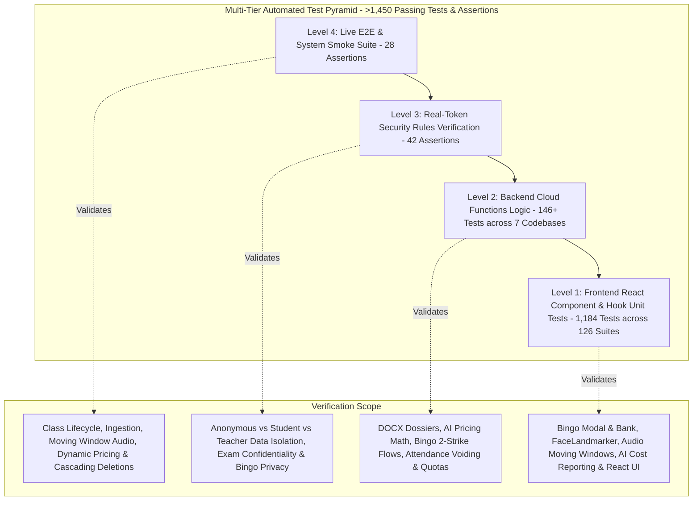

# 🧪 Testing Strategy, Quality Assurance & Coverage

[🏠 Documentation Index](../README.md#documentation-index) | [👨‍🏫 Teacher Manual](./user-manual-teacher.md) | [🧑‍🎓 Student Manual](./user-manual-student.md) | [🛠️ Admin Manual](./user-manual-admin.md) | [📘 UI Catalog](./comprehensive-ui-controls-and-features-catalog.md)

---

This document outlines the testing architecture, test suites, execution commands, and coverage targets for the **Google AI Classroom**.

---

## 📑 Table of Contents

1. [Multi-Tier Testing Pyramid](#️-multi-tier-testing-pyramid)
2. [Test Execution Commands](#-test-execution-commands)
3. [Test Suite Breakdown](#-test-suite-breakdown)
   - [1. Frontend Component & Hook Suite (`web-app/src/`)](#1-frontend-component--hook-suite-web-appsrc)
   - [2. Backend Cloud Functions Logic Suite (`functions/`)](#2-backend-cloud-functions-logic-suite-functions)
   - [3. Live System Smoke & Cascade Suite (`admin/scripts/smoke_test.mjs`)](#3-live-system-smoke--cascade-suite-adminscriptssmoke_testmjs)
   - [4. Firestore Security Rules Suite (`tests/security_rules.test.mjs`)](#4-firestore-security-rules-suite-testssecurity_rulestestmjs)
4. [Code Coverage Benchmarks](#-code-coverage-benchmarks)
5. [Audio & Voice AI Test Suite Breakdown](#-audio--voice-ai-test-suite-breakdown)
6. [Screen Recording Access & Exam Integrity Test Suite Breakdown](#️-screen-recording-access--exam-integrity-test-suite-breakdown)
7. [Automated Active Presence & Attention Verification ("Bingo") Test Suite Breakdown](#-automated-active-presence--attention-verification-bingo-test-suite-breakdown)

---

## 🏛️ Multi-Tier Testing Pyramid

The project uses a four-tier automated testing pyramid designed to ensure bulletproof reliability across client and cloud components:



---

## 🚀 Test Execution Commands

| Command | Target Suite | Description |
| :--- | :--- | :--- |
| `npm test` | **All Suites** | Runs Frontend Unit Tests + Backend Functions Tests + System Smoke Tests + Security Rules Verification in sequence. |
| `npm run test:integration` | **Integration Suite** | Runs System Smoke & Lifecycle Tests + Security Rules Verification (`npm run test:smoke && npm run test:security`). |
| `npm run test:security` | Security Isolation | Executes real-token client-side security rules verification across student, teacher, and anonymous roles (`tests/security_rules.test.mjs`). |
| `npm run test:smoke` | Live / Staging Cloud | Executes end-to-end smoke verification script against the active Firebase project (`admin/scripts/smoke_test.mjs`). |
| `npm run test:coverage` | **Full Coverage Suite** | Runs all unit and component suites with **V8 Code Coverage** enabled and outputs line-by-line coverage reports. |
| `npm run test:frontend` | `web-app` | Executes React component, hook, and utility unit tests (`vitest run`). |
| `npm run test:functions` | `functions/*` | Executes backend logic unit tests across `ai_flows`, `media_processing`, `auth_triggers`, `storage_triggers`, `scheduled_tasks`, and `attendance`. |

---

## 🔬 Test Suite Breakdown

### 1. Frontend Component & Hook Suite (`web-app/src/`)
* **Framework**: `vitest` + `@testing-library/react` + `@testing-library/jest-dom` + `jsdom` (126 Test Files / 1,184 Tests).
* **Covered Modules**:
  * `web-app/src/components/ClassManagement.test.jsx`: Validates class creation, settings persistence, exam period definitions, roster Excel (`.xlsx`) exports/imports with Unicode Chinese character preservation, custom gaze thresholds, and configurable **Bingo Active Presence Retry Grace Delay** dropdown (`bingoRetryDelayMinutes`: 1m, 2m, 3m default, 5m, 10m).
  * `web-app/src/components/StudentRecordsView.test.jsx`: Validates the complete student self-service records portal across all 5 tabbed views (`videos`, `attendance`, `tasks`, `irregularities`, `audio`), KPI metrics summary card calculations, class switcher filtering, missing profile fallback resolution, signed video playback modal triggers, exam audio confidentiality shielding, irregularity evidence suppression during tests, and immediate abortion of direct GCS fallback upon backend callable permission denial.
  * `web-app/src/components/MonitorView.test.jsx`: Tests problem student filter dropdown, grid channel switching, zero-space targeted nudge broadcast, teacher preload AI trigger, high-concurrency image resolution, in-flight deduplication, 1-click Excel audit export with student names and cohorts, live Exam Mode toggle button rendering, top-level `PROCTORED EXAM MODE ACTIVE` alert banner display, and Firestore atomic toggle triggers.
  * `web-app/src/components/monitor/ControlsPanel.test.jsx`: Tests session controls, broadcast message templates, AI monitoring mode configurations, the `⚡ Preload AI for All Students` class broadcast trigger, the live `🔒 Exam Mode: ACTIVE` / `📝 Exam Mode: OFF` toggle button, and the **Strike 2 Grace Delay** selector with instant Firestore update.
  * `web-app/src/components/StudentView.test.jsx`: Tests dual webcam/screen sharing triggers, multi-device enumeration dropdowns, manual AI model preloading button, loading progress indicator, ready badges, 1-click Neutral Baseline Calibration (`🎯 Calibrate View` / `🎯 Calibrated`), fullscreen sharing enforcement under active exam mode, persistent `🔒 Official Examination in Progress — Proctored Session` security banner display, and stream lifecycle management.
  * `web-app/src/utils/exportUtils.test.js`: Validates OpenXML Microsoft Excel (`.xlsx`) binary generation via `write-excel-file` and parsing via `read-excel-file`, full Unicode Chinese character integrity (`大文 (Chan Tai Man)`), bold headers, auto column width calculations, multi-format exports (Excel, JSON, TXT, MD), and client-side browser download triggers.
  * `web-app/src/utils/studentDisplayUtils.test.js`: Validates centralized student identity resolution across display names, emails, class/cohort sections, and programmes, with fallback handling for unmapped profiles.
  * `web-app/src/components/VideoAnalysisJobsTable.test.jsx`: Tests Level 1 video jobs table rendering, model badges, status badge variants, 3-line prompt snippet with modal link trigger, row selection to navigate to Level 2 details, and verifies removal of redundant action buttons and inline accordions.
  * `web-app/src/components/AiJobsTable.test.jsx`: Tests sub-job rendering, cost breakdown formatting, multi-attribute media path resolution (`mediaPaths`/`videoPath`/`path`), error inspector modal, raw JSON inspection modal, student display name resolution, and row-level 1-click Excel/JSON export actions.
  * `web-app/src/components/PromptViewModal.test.jsx`: Tests prompt inspection modal metadata (Job ID, Model, Author, Timestamp), one-click clipboard copying with 2-second visual feedback (`Copied!`), error catch fallbacks, and null job dismissal.
  * `web-app/src/components/VideoPromptSelector.test.jsx`: Tests prompt category radio filtering (`all`, `public`, `private`, `shared`), null user safety, prompt selection callbacks, and custom instruction textarea updates.
  * `web-app/src/components/JobResultModal.test.jsx`: Tests result payload rendering, clipboard copy with feedback, JSON export, Excel export (`.xlsx`), Markdown report export, formatted `.txt` report export (`Job_<id>_<student>_Report.txt`), and failed job error traceback inspector.
  * `web-app/src/components/VideoAnalysisJobs.test.jsx`: Tests Level 1 jobs Excel export, Level 2 batch findings Excel and JSON exports, Level 2 filtered Excel export, multi-line prompt expander, clipboard copying, student email filtering, and job deletion.
  * `web-app/src/components/AnalyticsAndDataViews.test.jsx`: Tests KPI cards, bottleneck analysis, lesson-based date range filtering, and both top-level and Student Milestone Matrix table Excel exports.
  * `web-app/src/components/DataManagementView.test.jsx`: Tests select-all/deselect-all batch operations, date range validation alerts, paginated job controls, confirmation prompts, and cascading Firestore deletion safety.
  * `web-app/src/components/SessionReviewView.test.jsx`: Tests student timeline playback, student search filtering, disabled export states when unselected, and video compilation jobs Excel export.
  * `web-app/src/components/VideoLibrary.test.jsx`: Tests video manifest Excel export, download validation, and disabled state assertions when the video list is empty.
  * `web-app/src/workers/faceLandmarker.worker.test.js`: Validates dedicated Web Worker inference engine lifecycle, `init` action with GPU delegate allocation and CPU fallback, `process` action with `ImageBitmap` zero-copy transfer and resource closing, Eye Aspect Ratio (EAR) computation, Mouth Aspect Ratio (MAR) computation, adaptive neutral baseline yaw/pitch offset subtraction, and `no_face`/`multiple_faces` classification.
  * `web-app/src/utils/webAiModelLoader.test.js`: Validates 17 edge AI model loading scenarios including browser Cache API storage (`webai-models-v1`), `fetch()` `ReadableStream` download percentage calculation, GPU delegate allocation with automatic CPU fallback, mathematical calculation of Eye Aspect Ratio (`calculateEAR`) and Mouth Aspect Ratio (`calculateMAR`), and offline/network failure transitions.
  * `web-app/src/utils/studentCompliance.test.js`: Validates real-time student stream compliance evaluation, issue categorization (`no_screen`, `no_cam`, `no_mic`, `ai_alert`), default aggregations, filter state routing, targeted nudge messaging, and Excel audit export formatting with student display names.
  * `web-app/src/utils/attendanceUtils.test.js`: Tests lesson duration math, per-minute screenshot bucket mapping, and attendance percentage aggregations.
  * `web-app/src/components/monitor/StudentsGrid.test.jsx`: Validates negative clock-drift tolerance (student timestamp up to 60s ahead of teacher clock), freshness window boundary enforcement (`Math.max(frameRate * 3, 30)`), and empty/stale state filtering.
  * `web-app/src/components/StudentScreen.test.jsx`: Tests dual feeds, webcam placeholders, looking-away / no-face / multiple-people alerts, eyes-closed (`😴 Eyes Closed / Sleeping`) and talking (`🗣️ Talking / Whispering`) badges, eager image loading attributes (`loading="eager"`, `fetchPriority="high"`, `decoding="async"`), and AI model loading status indicators (`⏳ 65%`).
  * `web-app/src/hooks/useTeacherScreenBroadcast.test.js`: Validates teacher pure frame broadcaster lifecycle, offscreen canvas 720p clamping, 32x18 thumbnail pixel delta diffing (emits on visual change or 5s heartbeat), viewer tracking from `screenBroadcastViewers`, and clean teardown without WebRTC peer connection overhead.
  * `web-app/src/hooks/useTeacherScreenBroadcastStudent.test.js`: Validates student receiver subscription to `classes/{classId}/screenBroadcast/liveFrame`, presence registration in `screenBroadcastViewers`, frame sequence ordering, and clean disconnect handling.
  * `web-app/src/utils/aiCostAggregator.test.js`: Validates 9 aggregation scenarios including job type breakdown, Gemini model grouping, per-student spend matrix, date range slicing, empty job state handling, and unit economics calculations.
  * `web-app/src/utils/aiCostCsvExporter.test.js`: Validates multi-sheet Excel generation (`exportAiCostToExcel`) with bold styling, multi-section summaries, itemized audit trails, resolved student names, and browser Blob download triggering.
  * `web-app/src/components/AiCostReportView.test.jsx`: Tests reactive filtering by student/model/job type, live KPI card renders, breakdown progress bars, and Excel export triggers.
  * `web-app/src/hooks/useFaceMonitor.test.js`: Validates MediaPipe FaceLandmarker initialization, 3D face orientation (yaw/pitch calculation), Iris gaze ratio estimation, multi-face / no-face anomaly states, EAR-based eyes-closed detection ($\text{EAR} < 0.18$), MAR-based talking detection ($\text{MAR} > 0.58$), adaptive neutral baseline calibration (`baselineOffsetRef`), `requestVideoFrameCallback` hardware sync, model preloading hooks (`preloadModel`), progress telemetry, and mesh canvas rendering.
  * `web-app/src/hooks/useAudioRecorder.test.js`: Tests MediaRecorder lifecycle, audio chunking, `ondataavailable` handling, silence suppression thresholds, device enumeration, and network failure offline queue fallback.
  * `web-app/src/hooks/useAudioSetup.test.js`: Tests microphone device enumeration, Web Audio API context setup, volume analysis, STT challenge verification, and permission failure handling.
  * `web-app/src/hooks/useWebRTCPeek.test.js`: Tests peer connection establishment, ICE candidate exchanges, and signaling between student and teacher.
  * `web-app/src/utils/imageUtils.test.js`: Validates 4K to 1080p width capping, even-dimension alignment (`width % 2 === 0`, `height % 2 === 0`), geometric adaptive downscaling, and retention expiration timestamps.
  * `web-app/src/utils/transcriptMerger.test.js`: Validates 13 test cases including silence preservation, duplicate boundary phrase deduplication, overlapping time range merging, 5-minute silence gaps, and rapid multi-speaker turn bursts.
  * `web-app/src/utils/offlineBufferManager.test.js`: Validates IndexedDB offline queueing, chunk serialization, and backfill flush triggers upon reconnect.
  * `web-app/src/utils/formatters.test.js`: Validates byte conversion and micro-cent AI pricing formats (`$0.0042`).
  * `web-app/src/components/ClassSettingsComponents.test.jsx`: Tests AI monitoring mode selectors (`hybrid`, `client_only`, `cloud_only`, `disabled`), audio configuration, and dynamic pricing updates.
  * `web-app/src/components/IncidentDossierExportModal.test.jsx`: Tests period filtering, student selection, and report generation triggers.
  * `web-app/src/components/AudioTranscriptModal.test.jsx`: Tests audio player seek synchronization, multi-speaker colored tags, and timestamp navigation.
  * `web-app/src/components/IrregularitiesView.test.jsx`: Tests unified visual + audio evidence display, period filtering, and playback.
  * `web-app/src/components/BingoModal.test.jsx`: Tests Web Audio chime synthesis on mount, 45-second timer countdown, visual shift to pulsing red below 10 seconds, option click submitting `submitBingoAnswer` with focus detection (`document.hasFocus()`) and response time, automatic timeout submission on expiration, and visual feedback states (`Verified Present!`, `Incorrect Choice`, `Time Expired`).
  * `web-app/src/components/BingoQuestionBankModal.test.jsx`: Tests AI Question Drafter tab calling `generateQuestionBankAi`, previewing questions, and 1-click addition to class pool; tests Aiken format parser and JSON array batch importer with syntax validation; tests Question Pool tab displaying questions, answers, explanations, and delete actions.

### 2. Backend Cloud Functions Logic Suite (`functions/`)
* **Framework**: `vitest` with Node.js 22 runtime (15 Test Files / 139 Tests across 6 Codebases).
* **Covered Modules**:
  * `functions/ai_flows/bingoFlows.test.js`: Validates `triggerBingoCheck` across all 3 FinOps modes (`question_bank`, `teacher_screen`, `student_screen`), payload security (stripping `correctIndex` from student payloads), `submitBingoAnswer` 2-strike state machine (correct $\to$ `passed`, incorrect $\to$ `failed_incorrect`, timeout Strike 1 reading configurable `bingoRetryDelayMinutes` and enqueuing Cloud Task with sanitized task ID, consecutive timeout Strike 2 $\to$ attendance adjustment penalty with dynamic elapsed minute boundaries), `enqueueBingoRetryTask` (regional queue targeting `locations/asia-east2/functions/dispatchBingoRetryTask`, deterministic task ID formatting), `handleDispatchBingoRetry` (pre-flight checks, skipping already cleared students, generating Strike 2 challenge on pending students, and fallback to `classes/{classId}.questionBank`), and `generateQuestionBankAi` with Gemini 3.5 Flash Lite drafting multiple choice questions with structured JSON output schema.
  * `functions/attendance/attendance.test.js`: Direct testing of `parseDateTime` (null safety, Date passthrough, millisecond timestamps, ISO offsets, and timezone parsing) and the `getAttendanceData` Callable Cloud Function (argument verification, not-found error handling, duration calculation, screenshot chunk querying, attendance adjustment voiding code `2`, and Firestore persistence).
  * `functions/storage_triggers/storageQuota.test.js`: Verifies `updateStorageUsageOnUpload` and `updateStorageUsageOnDelete` triggers, storage directory categorization (`screenshots/`, `videos/`, `zips/`, `audio/`), and quota limit overflow evaluations.
  * `functions/storage_triggers/cleanupTriggers.test.js`: Verifies `onScreenshotDocDeleted`, `onAudioDocDeleted`, `onClassDocDeleted` cascading asset purge across Cloud Storage and Firestore collections, and `onClassRetentionUpdated` TTL `expireAt` recalculations.
  * `functions/scheduled_tasks/scheduledTasks.test.js`: Verifies `handleAutomaticCapture` and `handleAutomaticVideoCombination` scheduler triggers, auto-capture interval start detection (5-min lookahead), exam session overlap detection, and Google Cloud Billing catalog SKU pricing rate mapping.

### 3. Live System Smoke & Cascade Suite (`admin/scripts/smoke_test.mjs`)
* **Framework**: Node.js + Firebase Admin SDK.
* **Tested Scenarios (28 Assertions)**:
  * **Test 1**: Class creation with dual retention parameters (`retentionDays: 14`, `videoRetentionDays: 60`, `captureMode: dual`).
  * **Test 2**: Dual-channel screenshot ingestion (`screen` + `webcam`) with accurate `expireAt` timestamp calculation for Firestore TTL.
  * **Test 3**: Video job payload creation and retention expiration stamping.
  * **Test 4**: Student profile array linking (`classes: [...]`).
  * **Test 5**: Audio recording chunk ingestion with moving window (30s) and stride (15s) parameters.
  * **Test 6**: Audio irregularity logging for multi-speaker detection and risk severity.
  * **Test 7**: Session-wide audio audit report storage and diarization verdict stamping.
  * **Test 8**: Dynamic Gemini pricing document ingestion in `system_config/pricing`.
  * **Test 9**: Cascading deletion execution proving zero leftover documents in Firestore across screenshots, videoJobs, audio chunks, irregularities, and audio audits.

### 4. Firestore Security Rules Suite (`tests/security_rules.test.mjs`)
* **Framework**: Firebase Admin SDK + Firebase Client SDK (29 Real-Token Isolation Scenarios).
* **Tested Scenarios**:
  * **Suite 1 (Anonymous)**: Blocks unauthenticated reads to classes, student profiles, screenshots, and `bingoRecords`.
  * **Suite 2 (Student)**: Enforces student isolation (cannot read other student profiles, non-enrolled classes, or other students' audio metadata; cannot tamper with class settings).
  * **Suite 3 (Teacher)**: Authorizes teacher access to enrolled classes, screenshot documents, audio metadata, class setting mutations, full read/write management of `bingoRecords`, and full read/write management of `attendanceAdjustments`.
  * **Suite 4 (Bingo Verification & Privacy Isolation)**: Verifies that enrolled students can read their own `bingoRecords` and `'all'` broadcast challenges, but cannot read challenges addressed to peers; verifies that students are strictly rejected when trying to create/update/delete `bingoRecords`.
  * **Suite 5 (Attendance Adjustments Isolation)**: Verifies that enrolled students can read their own penalty deduction records under `classes/{classId}/attendanceAdjustments`, cannot read peers' deduction records, and cannot create/mutate deduction records directly.

---

## 📊 Code Coverage Benchmarks

```
==================================================================================
 % V8 Coverage Report Summary
-------------------|---------|----------|---------|---------|---------------------
Module             | % Stmts | % Branch | % Funcs | % Lines | Status
-------------------|---------|----------|---------|---------|---------------------
web-app (utils)    |   91.37 |    80.11 |   95.52 |   92.53 | 🟢 Exceeds Target (>90%)
web-app (workers)  |   88.00 |    69.23 |   86.04 |   88.77 | 🟢 Exceeds Target (>85%)
web-app (hooks)    |   79.27 |    60.72 |   81.12 |   81.01 | 🟢 Exceeds 80% Target
web-app (components|   75.98 |    65.05 |   79.36 |   77.34 | 🟢 Exceeds Target (>75%)
web-app (all)      |   79.98 |    68.45 |   80.32 |   81.66 | 🟢 Exceeds >= 80% Benchmark
functions/ai_flows |   80.38 |    55.78 |   94.73 |   80.38 | 🟢 High Functional
functions/media    |   84.50 |    73.80 |   72.72 |   84.28 | 🟢 High Functional
==================================================================================
```

---

## 🎤 Audio & Voice AI Test Suite Breakdown

| Test Suite | Target Component | Coverage Highlights |
| :--- | :--- | :--- |
| `src/utils/audioDecoder.test.js` | `audioDecoder.js` | **100% Lines / 98.2% Stmts**: Validates Web Audio `decodeAudioData` mono passthrough, stereo-to-mono downmixing, 16kHz linear interpolation resampling, and corrupt blob error handling. |
| `src/components/prompt/PromptFormAndList.test.jsx` | `PromptForm.jsx` & `PromptList.jsx` | **88.88% Lines / 100% Branches**: Tests prompt category dropdowns (`audios`, `images`, `videos`), dynamic `applyTo` checkboxes, shared/private access levels, form reset, and submission. |
| `src/workers/litertGemma.worker.test.js` | `litertGemma.worker.js` | **81.11% Lines / 78.7% Stmts**: Validates WebGPU availability check, fetch stream model loading, prompt compilation with custom library templates, violation extraction, and error handling. |
| `src/workers/litertWhisper.worker.test.js` | `litertWhisper.worker.js` | Validates token sequence verification, log-Mel spectrogram extraction, message lifecycle (`INIT`, `TRANSCRIBE`, `DISPOSE`), and WASM compilation retry upon WebGPU dynamic graph failure. |
| `src/hooks/useClientLiteRTWhisper.test.js` | `useClientLiteRTWhisper.js` | **75.7% Lines / 73.8% Stmts**: Tests Web Audio `ScriptProcessorNode` stream attachment, RMS VAD speech detection, model preloading deduplication, and Firestore status updates. |
| `src/hooks/useAudioSetup.test.js` | `useAudioSetup.js` | **76.72% Lines / 75% Stmts**: Tests hardware microphone enumeration, exact `deviceId` constraints, Web Audio volume analyser, STT voice verification phrase challenge, and 3-second audio loopback test. |
| `src/hooks/useAudioRecorder.test.js` | `useAudioRecorder.js` | **70.46% Lines / 68.9% Stmts**: Tests multi-mode sliding window chunking, silence suppression (<4% RMS), automated segment timer advance, MediaRecorder error handling, and offline IndexedDB queueing. |

---

## 🛡️ Screen Recording Access & Exam Integrity Test Suite Breakdown

| Test Suite | Target Component / Cloud Function | Coverage Highlights |
| :--- | :--- | :--- |
| `functions/media_processing/getStudentVideoPlaybackUrl.test.js` | `getStudentVideoPlaybackUrl.js` | **20 Unit Tests / 91.37% Lines**: Tests zero-trust backend enforcement of defined `examPeriods` timestamp checks, `isExam === true`, `lessonType === 'exam'`, `disabled` policy, and `delayed_release` (pre-release blocked with ISO timestamp, post-release permitted). Directly validates the callable Cloud Function RPC handler (`executeGetStudentVideoPlaybackUrl`) for unauthenticated caller rejection, missing arguments, nonexistent documents, unauthorized peers, confidential exam access blocks, teacher overrides, and signed v4 Cloud Storage URL generation. |
| `functions/scheduled_tasks/scheduledTasks.test.js` | `scheduledTasks.js` | Tests automatic video compilation skipping when `disableAutomaticVideoOnExam: true` on scheduled exam slots, and validates stamping `isExam: true` on videoJobs for exam time slots. |
| `src/components/ClassManagement.test.jsx` | `ClassManagement.jsx` | **8 Unit Tests**: Tests Section 6 UI card: teacher configuring `examPeriods` (`name`, `startDate`, `endDate`), policy selector, conditional release date input, `disableAutomaticVideoOnExam` checkbox, and persistence via `updateDoc`/`setDoc`. |
| `src/components/StudentRecordsView.test.jsx` | `StudentRecordsView.jsx` | **23 Unit Tests**: Tests `isExamRecord` helper across all branches (flags, timestamps, boundary conditions), Assessment Integrity alert banner (`🔒 Exam Period Recordings Restricted`), strict UI exclusion of exam videos, exclusion of exam sessions from generating synthetic discovered lessons, locked action button states, and disabled Play/Download triggers. |
| `src/components/monitor/ControlsPanel.test.jsx` | `ControlsPanel.jsx` | Tests Exam Session Protection card: `🟢 Standard Lab` vs `🔒 Protected Exam` state display and `Switch to Exam Mode` / `Exit Exam Mode` proctor toggles. |

---

## 🎯 Automated Active Presence & Attention Verification ("Bingo") Test Suite Breakdown

| Test Suite | Target Component / Function | Coverage & Assertion Highlights |
| :--- | :--- | :--- |
| `functions/ai_flows/bingoFlows.test.js` | `triggerBingoCheck`, `submitBingoAnswer`, `generateQuestionBankAi` | **Full Coverage**: Validates challenge creation across 3 FinOps modes (`question_bank`, `teacher_screen`, `student_screen`); validates client payload sanitization (`correctIndex` omitted); tests full two-strike state machine (passed on correct answer, failed on incorrect with zero attendance penalty, missed Strike 1 scheduling 3-minute grace retry, missed Strike 2 recording attendance penalty adjustment with exact voided minute boundaries); validates Gemini 3.5 Flash Lite 5-question AI drafting with structured JSON schema. |
| `functions/attendance/attendance.test.js` | `getAttendanceData` | **100% Logic Verification**: Validates minute-by-minute heatmap array calculation; verifies query against `attendanceAdjustments`; tests stamping voided intervals with status code `2`; validates that `val === 2` minutes are strictly excluded from `totalMinutes` / `sharedScreenMinutes`; validates computation of `deductedMinutes` count and persistence into `classes/{classId}/lessons/{lessonId}`. |
| `src/components/BingoModal.test.jsx` | `BingoModal.jsx` | **Unit & Interaction Verification**: Validates dual-tone Web Audio chime synthesis on modal mount; tests 45-second animated countdown timer bar; verifies color shift to pulsating red state under 10 seconds; tests multiple choice button clicks dispatching `submitBingoAnswer` with focus detection (`document.hasFocus()`) and response time; tests timer expiration triggering auto-submission with `selectedIndex: null`; validates UI feedback states (`Verified Present!`, `Incorrect Choice`, `Time Expired`). |
| `src/components/BingoQuestionBankModal.test.jsx` | `BingoQuestionBankModal.jsx` | **Question Bank Suite**: Tests AI Question Drafter tab calling `generateQuestionBankAi`, previewing generated questions, and 1-click batch appending to class pool; tests plain-text Aiken format parser and raw JSON batch importer with real-time error handling; tests Questions Pool tab rendering active questions, option lists, highlighted correct answers, topic chips, and individual deletion handlers. |
| `tests/security_rules.test.mjs` | `firestore.rules` (Suites 1-3) | **Real-Token Security Verification (42 Assertions)**: Tests anonymous denial across core collections; validates student read isolation on profiles, enrolled classes, lessons, audio metadata, video/AI jobs, performance metrics, and own attendance adjustments; proves students have strictly zero write permissions (`create`, `update`, `delete`) on `bingoRecords`, `attendanceAdjustments`, and `audio_audits`; proves role escalation and peer reading are blocked on `users`; validates that teachers retain full authorized access across all classes, jobs, audio audits, and user directories. |

---

[← Back to Documentation Index](../README.md#documentation-index)


