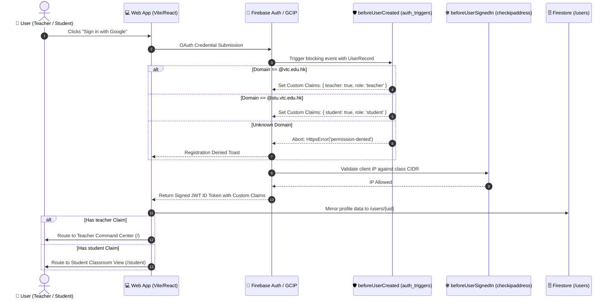
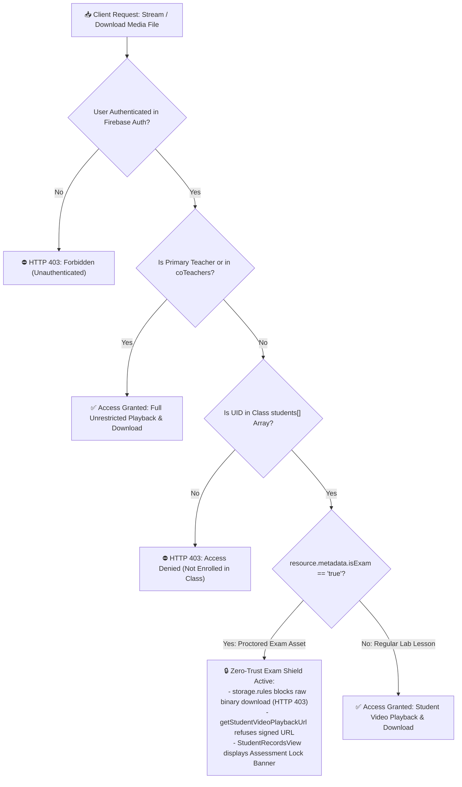
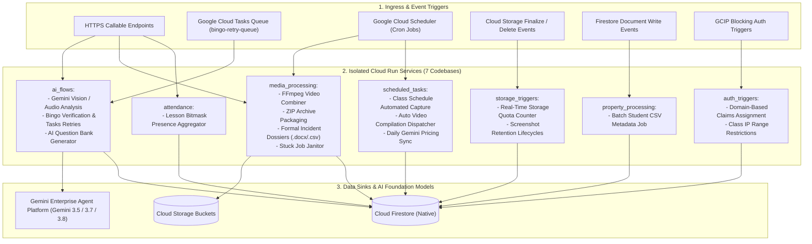
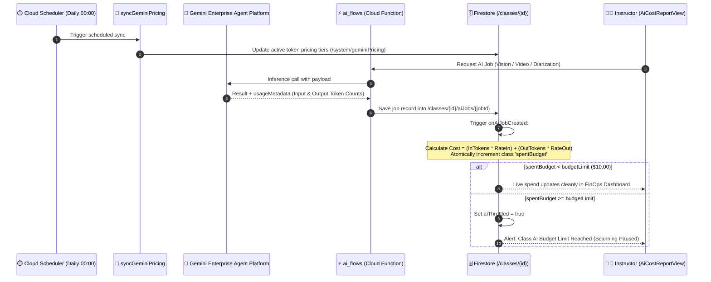

# 🛠️ System Administrator & DevOps User Manual

[🏠 Documentation Index](../README.md#documentation-index) | [👨‍🏫 Teacher Manual](./user-manual-teacher.md) | [🧑‍🎓 Student Manual](./user-manual-student.md) | [📘 UI Catalog](./comprehensive-ui-controls-and-features-catalog.md)

---

Welcome to the **Google AI Classroom Assistant** Administrator and DevOps Manual. This guide details cloud provisioning, Terraform infrastructure-as-code, Firebase security rules governance, multi-codebase Cloud Functions, automated identity lifecycle management, AI FinOps budgeting, and disaster recovery.

---

## 📑 Table of Contents
1. [System Architecture & Google Cloud Topology](#1-system-architecture--google-cloud-topology)
2. [Automated 1-Command Cloud Provisioning](#2-automated-1-command-cloud-provisioning)
3. [Environment Management & Build-Time Guardrails](#3-environment-management--build-time-guardrails)
4. [Identity, Roles & Institutional Domain Mapping](#4-identity-roles--institutional-domain-mapping)
5. [Firestore & Cloud Storage Security Governance](#5-firestore--cloud-storage-security-governance)
6. [Cloud Functions Architecture (7 Multi-Codebases)](#6-cloud-functions-architecture-7-multi-codebases)
7. [AI FinOps, Model Pricing & Quota Governance](#7-ai-finops-model-pricing--quota-governance)
8. [Automated Scheduled Tasks & Cloud Scheduler](#8-automated-scheduled-tasks--cloud-scheduler)
9. [Administrative Scripts & Environment Resets](#9-administrative-scripts--environment-resets)
10. [Testing, CI/CD & Production Verification](#10-testing-cicd--production-verification)
11. [Monitoring, Cloud Logging & Incident Diagnostics](#11-monitoring-cloud-logging--incident-diagnostics)

---

## 1. System Architecture & Google Cloud Topology

The platform operates on a serverless, zero-maintenance Google Cloud and Firebase architecture designed for extreme horizontal scalability across institutional cohorts:

```
┌────────────────────────────────────────────────────────────────────────┐
│                        Google Cloud Platform                           │
│                                                                        │
│   ┌─────────────────────┐   ┌──────────────────────────────────────┐   │
│   │ Gemini Enterprise   │   │ Cloud Tasks Queue                    │   │
│   │ Agent Platform      │   │ dispatchBingoRetryTask (2-Strike)    │   │
│   └──────────▲──────────┘   └──────────────────▲───────────────────┘   │
│              │                                 │                       │
│   ┌──────────┴─────────────────────────────────┴───────────────────┐   │
│   │ Cloud Functions Gen 2 (7 Isolated Codebases)                   │   │
│   │ ai_flows │ media_processing │ storage_triggers │ attendance... │   │
│   └──────────▲───────────────────▲─────────────────────▲───────────┘   │
│              │                   │                     │               │
│   ┌──────────┴──────────┐ ┌──────┴──────────────┐ ┌────┴───────────┐   │
│   │ Firestore NoSQL DB  │ │ Cloud Storage       │ │ Cloud Scheduler│   │
│   │ Rules: Token Checks │ │ Zero-Trust Exam Tags│ │ Pricing / Jobs │   │
│   └─────────────────────┘ └─────────────────────┘ └────────────────┘   │
│                                  ▲                                     │
│   ┌──────────────────────────────┴─────────────────────────────────┐   │
│   │ Firebase Hosting (React + Vite + WebAssembly MediaPipe Edge)   │   │
│   └────────────────────────────────────────────────────────────────┘   │
└────────────────────────────────────────────────────────────────────────┘
```

### Key Infrastructure Components
- **Gemini Enterprise Agent Platform / Google GenAI SDK:** Real-time multimodal analysis using Gemini 3 Series (`gemini-3.5-flash-lite`, `gemini-3.7-flash`, `gemini-3.8-flash`, `gemini-3.7-pro`, `gemini-3.5-transcribe-preview`).
- **Cloud Functions for Firebase (Gen 2):** Eventarc, HTTPS callable, and scheduled triggers distributed across 7 isolated codebases running on Google Cloud Run.
- **Cloud Tasks:** Serverless HTTP retry queue for Bingo presence retries with zero idle compute cost.
- **Cloud Storage:** High-capacity object storage with automated lifecycle rules for screenshot and MP4 video retention.
- **Cloud Firestore:** Distributed document database with document-level composite security rules and real-time client snapshot listeners.
- **Firebase Authentication & Identity Platform:** Google Cloud Identity Platform (GCIP) with `beforeUserCreated` and `beforeUserSignedIn` blocking cloud triggers.

---

## 2. Automated 1-Command Cloud Provisioning

The entire Google Cloud and Firebase environment can be provisioned from scratch with **Zero UI clicks** using the automated setup script.

### Prerequisites
- Google Cloud CLI (`gcloud`) authenticated with an Owner or Project Creator account.
- Terraform CLI (`terraform >= 1.5.0`).
- Node.js (`>= 20.x`) and Firebase CLI (`npx -y firebase-tools@latest`).

### Running the Provisioner
```bash
./setup-new-project.sh <PROJECT_ID> [BILLING_ACCOUNT_ID]
```

**Example:**
```bash
./setup-new-project.sh it114115-2627 01C74C-667DFE-538DBC
```

### What the Provisioner Automates
1. Enables all necessary Google Cloud APIs (`aiplatform.googleapis.com`, `firebasevertexai.googleapis.com`, `generativelanguage.googleapis.com`, `firestore.googleapis.com`, `cloudfunctions.googleapis.com`, `cloudscheduler.googleapis.com`, `cloudtasks.googleapis.com`, etc.).
2. Creates the default Firestore database in Native mode.
3. Provisions Cloud Storage buckets with default CORS policies.
4. Initializes Firebase Authentication and binds GCIP blocking functions.
5. Deploys Firestore composite indexes.
6. Packages and deploys all 7 Cloud Function codebases.
7. Builds and deploys the production web application to Firebase Hosting.

---

## 3. Environment Management & Build-Time Guardrails

The repository uses an environment switcher script to support isolated Development and Production environments:

| Environment | Firebase Project ID | Hosting Domain | Default Purpose |
| :--- | :--- | :--- | :--- |
| **Development** | `it114115-dev-2026` | `https://it114115-dev-2026.web.app` | Integration testing, seeding, sandboxed verification. |
| **Production** | `it114115-2627` | `https://it114115-2627.web.app` | Live institutional classroom operations. |

### Switching Environments
```bash
# Switch to Development
./switch-env.sh dev

# Switch to Production
./switch-env.sh prod
```

### Build-Time Production Guardrails
To prevent accidental deployment of development configuration or mock credentials to production, `web-app/vite.config.js` enforces a strict project ID assertion:
```javascript
// vite.config.js build guard
if (mode === 'production' && env.VITE_PROJECT_ID !== 'it114115-2627') {
  throw new Error(`[FATAL] Production build must target 'it114115-2627'. Found: ${env.VITE_PROJECT_ID}`);
}
```
If an administrator runs `npm run build:prod` while connected to the dev environment, the build aborts immediately.

---

## 4. Identity, Roles & Institutional Domain Mapping

Authentication is decoupled from manual database role grants through automated institutional email domain matching.

### Domain Configuration
Institutional domains are defined in `web-app/.env`:
```env
# Teacher & Instructor Domains (Comma-separated)
VITE_TEACHER_DOMAINS="vtc.edu.hk"

# Student Domains (Comma-separated)
VITE_STUDENT_DOMAINS="stu.vtc.edu.hk"

# Display Institution
VITE_INSTITUTION_NAME="VTC"
```

### Automated Claims via Blocking Cloud Functions
When a user authenticates for the first time:
1. The **`beforeUserCreated`** blocking trigger (`functions/auth_triggers/`) executes.
2. The function inspects the email domain:
   - If `email.endsWith('@vtc.edu.hk')` $\to$ sets Custom Claims `{ teacher: true, role: 'teacher' }`.
   - If `email.endsWith('@stu.vtc.edu.hk')` $\to$ sets Custom Claims `{ student: true, role: 'student' }`.
   - Unrecognized domains are denied registration unless explicitly whitelisted.
3. The **`checkipaddress`** trigger (`beforeUserSignedIn`) verifies the user's IP against any class CIDR restrictions if configured.

### Admin CLI User Management
For manual overrides and local testing:
```bash
# Grant teacher claims to an individual account
node admin/scripts/grantTeacherRole.js instructor@school.edu

# Verify a user's email address in Firebase Auth
node admin/scripts/verifyUser.js student@stu.school.edu
```

### 🔐 GCIP Blocking Function & Role Resolution Sequence



---

## 5. Firestore & Cloud Storage Security Governance

Security is governed by strict, real-token database rules and storage metadata validations verified across **42 automated assertions** (`tests/security_rules.test.mjs`).

### Firestore Rules Core Principles (`firestore.rules`)
- **Users Collection (`/users/{userId}`):** Users can read and write only their own profile. Role fields (`role`, `isTeacher`) are immutable by clients.
- **Classes Collection (`/classes/{classId}`):**
  - Read: Allowed if user is the primary teacher, listed in `coTeachers`, or listed in `students`.
  - Write: Restricted strictly to the primary teacher.
- **Subcollections (`bingoRecords`, `lessons`, etc.):**
  - Students can only submit their own Bingo responses (`request.auth.uid == resource.data.studentUid`).
  - Read access to historical logs is restricted to class instructors.
- **AI Question Bank (`/questionBank/{questionId}`):** Instructors can read, write, and generate questions. Students have zero read/write access.
- **Audio Audits (`/audio_audits/{auditId}`):** Write access restricted to the speaking student; read access restricted to class instructors.

### Cloud Storage Rules Core Principles (`storage.rules`)
- **Media Upload Paths:**
  - Screenshots: `/classes/{classId}/screenshots/{fileName}`
  - Videos: `/classes/{classId}/videos/{fileName}`
  - Audio: `/classes/{classId}/audio/{studentUid}/{fileName}`
- **Zero-Trust Exam Shielding:**
  ```cel
  // storage.rules
  allow read: if isTeacher(classId) || 
    (isStudentInClass(classId) && resource.metadata.isExam != 'true');
  ```
  Students are unconditionally blocked from downloading or streaming any asset flagged with `resource.metadata.isExam == 'true'`.

### 🛡️ Zero-Trust Exam Confidentiality Security Enforcement Flow



---

## 6. Cloud Functions Architecture (7 Multi-Codebases)

To eliminate dependency conflicts and ensure sub-second deployment times, backend functions are organized into **7 isolated Node.js codebases**:

| Codebase | Primary Triggers | Description & Primary Endpoints |
| :--- | :--- | :--- |
| **`ai_flows`** | HTTPS Callable, Cloud Tasks, Firestore Write | Gemini multimodal analysis (`analyzeImage`, `analyzeAllImages`, `analyzeFaceFallback`, `analyzeAudio`), Bingo presence verification (`triggerBingoCheck`, `submitBingoAnswer`, `dispatchBingoRetryTask`, `generateQuestionBankAi`), and video rubric batch jobs (`processVideoAnalysisJob`). |
| **`media_processing`** | Firestore Create/Update, HTTPS Callable, Cloud Scheduler | FFmpeg video compilation (`processVideoJob`), ZIP archive assembler (`processZipJob`), formal exam incident dossier generator (`processReportJob`), student signed video URL dispenser (`getStudentVideoPlaybackUrl`), and stuck job cleanup (`cleanupStuckJobs`). |
| **`auth_triggers`** | GCIP Blocking Auth, Firestore Write | Domain-based custom claims resolution (`beforeUserCreated`), IP CIDR filtering (`checkipaddress`), and class roster syncing (`onClassUpdate`). |
| **`storage_triggers`** | Cloud Storage Finalize/Delete, HTTPS Callable | Storage quota aggregation (`updateStorageUsageOnUpload`, `updateStorageUsageOnDelete`), selective retention deletion (`deleteScreenshotsByDateRange`), and asset cleanup (`onClassRetentionUpdated`). |
| **`scheduled_tasks`** | Cloud Scheduler Pub/Sub | Timetable automated capture initiator (`handleAutomaticCapture`), after-class video compiler (`handleAutomaticVideoCombination`), and Gemini pricing sync (`syncGeminiPricing`). |
| **`property_processing`** | Firestore Write | Asynchronous CSV processor for student custom metadata (`processPropertyUploadJob`). |
| **`attendance`** | HTTPS Callable | Lesson presence bitmask aggregator and Bingo penalty evaluator (`getAttendanceData`). |

### Deploying Specific Codebases
```bash
# Deploy only AI flows
npx firebase-tools deploy --only functions:ai_flows --project it114115-2627

# Deploy only media processing
npx firebase-tools deploy --only functions:media_processing --project it114115-2627
```

### 🌐 Cloud Functions Event Topology & Service Architecture



---

## 7. AI FinOps, Model Pricing & Quota Governance

The platform includes built-in financial operations (FinOps) tracking to prevent runaway AI token costs.

### Dynamic Pricing Synchronization (`syncGeminiPricing`)
Every 24 hours, Cloud Scheduler triggers `syncGeminiPricing` to ensure token calculations match active Google Cloud rates:

| Model ID | Input Cost (per 1M Tokens) | Output Cost (per 1M Tokens) | Primary Use Case |
| :--- | :--- | :--- | :--- |
| `gemini-3.5-flash-lite` | **$0.075** | **$0.30** | Frame scanning, question generation, gaze fallbacks. |
| `gemini-3.7-flash` | **$0.15** | **$0.60** | Balanced vision & code evaluation. |
| `gemini-3.8-flash` | **$0.15** | **$0.60** | Automated rubric synthesis & video evaluation. |
| `gemini-3.7-pro` | **$1.25** | **$5.00** | Deep reasoning for high-stakes exam incident investigation. |
| `gemini-3.5-transcribe-preview` | **$0.002** (per audio minute) | — | Multi-speaker diarization and speech STT. |

### Quota Enforcement
- Every class has a configurable budget limit (default: **$10.00**).
- Whenever an AI job completes, `onAiJobCreated` increments the class spend total.
- If cumulative spend reaches 100% of the budget cap, non-essential continuous vision scanning is automatically halted while essential presence verification remains active.

### 💰 Real-Time AI FinOps Accounting & Dynamic Pricing Flow



---

## 8. Automated Scheduled Tasks & Cloud Scheduler

The following Cloud Scheduler cron jobs operate continuously in the background:

| Job Name | Cron Schedule | Function Target | Description |
| :--- | :--- | :--- | :--- |
| `firebase-schedule-handleAutomaticCapture` | `*/5 * * * *` | `handleAutomaticCapture` | Inspects class timetables every 5 minutes and marks classes as active when scheduled lesson slots begin. |
| `firebase-schedule-handleAutomaticVideoCombination` | `*/10 * * * *` | `handleAutomaticVideoCombination` | Scans for concluded lessons and automatically dispatches video compilation jobs for all attending students. |
| `firebase-schedule-cleanupStuckJobs` | `*/15 * * * *` | `cleanupStuckJobs` | Detects video or ZIP jobs stuck in `processing` state for $>30$ minutes and resets or marks them as failed. |
| `firebase-schedule-syncGeminiPricing` | `0 0 * * *` | `syncGeminiPricing` | Daily update of Gemini Enterprise Agent Platform token pricing models in Firestore. |

---

## 9. Administrative Scripts & Environment Resets

The `/admin/scripts` directory contains administrative tools supporting Google Cloud Application Default Credentials (ADC):

### 1. Reset Environment & Re-seed (`reset_environment.mjs`)
Purges all Firestore collections, empties Cloud Storage buckets, restores default AI prompt libraries, and seeds demo classes and accounts:
```bash
# Reset active environment
npm run reset:env

# Reset a specific project
node admin/scripts/reset_environment.mjs it114115-dev-2026

# Reset and purge all Firebase Authentication user accounts
node admin/scripts/reset_environment.mjs it114115-dev-2026 --delete-users
```

### 2. Seeding AI Prompts (`seed_prompts.cjs`)
Restores baseline system prompts for Image Vision, Screencast Video Inspection, and Audio Invigilation:
```bash
node admin/scripts/seed_prompts.cjs
```

### 3. Seeding Demo Class (`seed_demo_class.js`)
Seeds the 24/7 active demo classroom (`IT114115-Demo`) with simulated student heartbeats, attendance records, and video recordings:
```bash
node admin/scripts/seed_demo_class.js
```

---

## 10. Testing, CI/CD & Production Verification

The repository enforces a test suite spanning **844 tests and assertions** exceeding the **80% line and function coverage benchmark**:

```bash
# Run all test suites
npm test

# Run frontend React component tests (636 tests across 90 suites)
npm run test:frontend

# Run Cloud Functions logic tests (138 tests across 6 codebases)
npm run test:functions

# Run live cloud smoke tests (28 end-to-end assertions)
npm run test:smoke

# Run real-token Firestore & Storage security rules tests (42 assertions)
npm run test:security

# Generate full V8 coverage report
npm run test:coverage
```

### Production Deployment Checklist
1. Switch to production environment: `./switch-env.sh prod`.
2. Run test suite: `npm test`.
3. Verify Firestore indexes: `npx firebase-tools deploy --only firestore:indexes --project it114115-2627`.
4. Deploy Cloud Functions: `npx firebase-tools deploy --only functions --project it114115-2627`.
5. Deploy Hosting: `npm run build:prod && npx firebase-tools deploy --only hosting --project it114115-2627`.

---

## 11. Monitoring, Cloud Logging & Incident Diagnostics

### Inspecting Cloud Run Logs
All Cloud Functions Gen 2 stream logs directly to Google Cloud Logging:
```bash
# View live logs for AI flows
gcloud logging read "resource.type=cloud_run_revision AND resource.labels.service_name=ai_flows" --limit 50 --format json

# View live logs for Media Processing (FFmpeg)
gcloud logging read "resource.type=cloud_run_revision AND resource.labels.service_name=media_processing" --limit 50
```

### Common Administrative Diagnostics

| Issue | Root Cause | Administrative Resolution |
| :--- | :--- | :--- |
| **Video compilation jobs failing** | Insufficient memory in Cloud Run during FFmpeg encoding. | Verify that `media_processing` Cloud Run service is allocated at least `2 GiB` of RAM (`functions/media_processing/index.js`). |
| **New teacher cannot log in** | Email domain does not match `VITE_TEACHER_DOMAINS`. | Run `node admin/scripts/grantTeacherRole.js <email>` to grant manual teacher claims, or update domain whitelist in `.env`. |
| **Cloud Tasks retries failing** | Cloud Tasks queue permissions or queue deletion. | Verify that the queue `bingo-retry-queue` exists in Google Cloud Tasks console and has the Cloud Run Invoker role granted to the default compute service account. |
| **Firestore index missing errors** | Complex query executed before composite index deployment. | Deploy index definitions using `npx firebase-tools deploy --only firestore:indexes`. |

---

[← Back to Documentation Index](../README.md#documentation-index)
