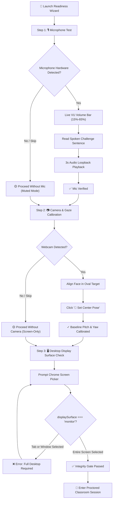
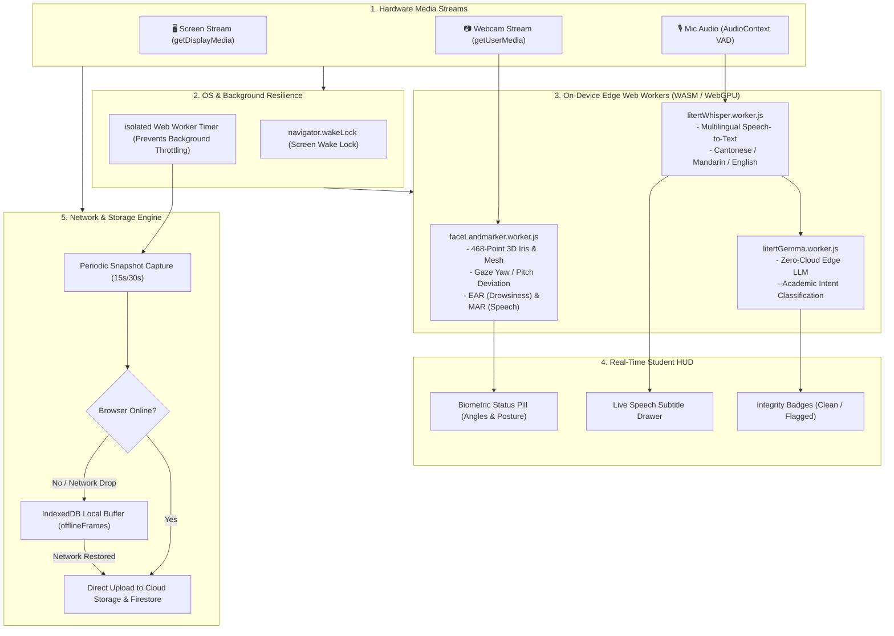
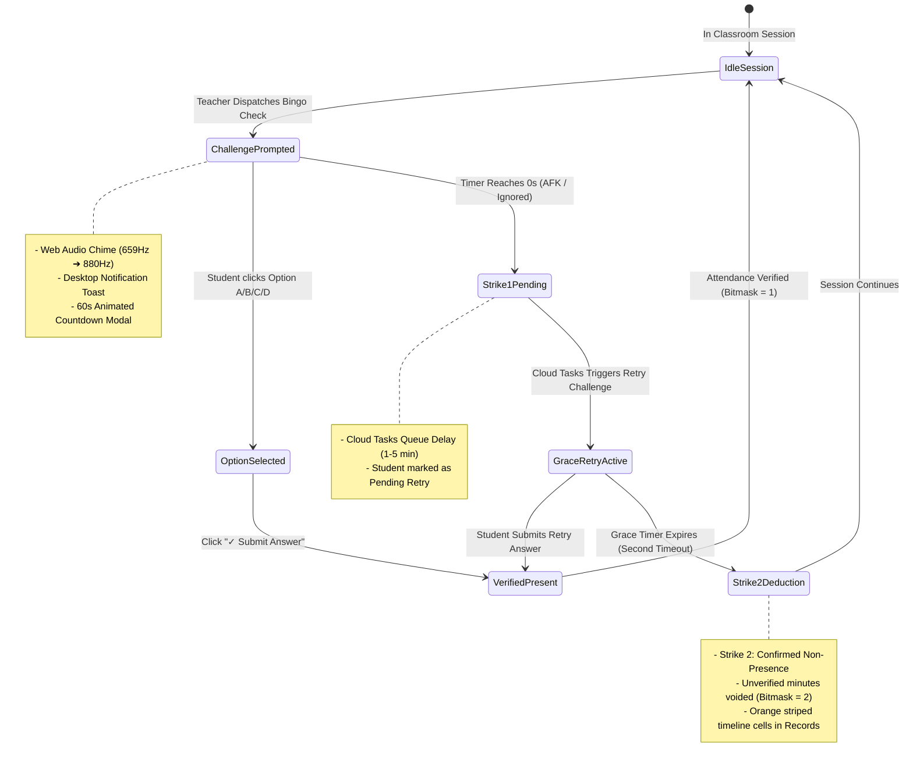

# 🧑‍🎓 Student User Manual & Guide

[🏠 Documentation Index](../README.md#documentation-index) | [👨‍🏫 Teacher Manual](./user-manual-teacher.md) | [🛠️ Admin Manual](./user-manual-admin.md) | [📘 UI Catalog](./comprehensive-ui-controls-and-features-catalog.md)

---

Welcome to the **Gemini Multimodal Classroom Agent** Student Guide. This manual walks you through system requirements, the pre-flight readiness test, in-session proctoring indicators, active presence verification challenges, and how to access your learning records, attendance breakdowns, and feedback.

---

## 📑 Table of Contents
1. [System & Browser Requirements](#1-system--browser-requirements)
2. [Logging In & Getting Started](#2-logging-in--getting-started)
3. [The 3-Step Pre-Flight Readiness Wizard](#3-the-3-step-pre-flight-readiness-wizard)
4. [The Active Classroom Streaming Experience](#4-the-active-classroom-streaming-experience)
5. [Understanding On-Device AI Feedback (HUD)](#5-understanding-on-device-ai-feedback-hud)
6. [Viewing the Teacher's Screen Broadcast](#6-viewing-the-teachers-screen-broadcast)
7. [Responding to "Bingo" Active Presence Challenges](#7-responding-to-bingo-active-presence-challenges)
8. [Session Displacement & Background Execution](#8-session-displacement--background-execution)
9. [Student Self-Service Records Portal](#9-student-self-service-records-portal)
10. [Assessment Privacy & Exam Confidentiality Shields](#10-assessment-privacy--exam-confidentiality-shields)
11. [Troubleshooting & Frequently Asked Questions](#11-troubleshooting--frequently-asked-questions)

---

## 1. System & Browser Requirements

### Mandatory Browser: Google Chrome
To protect academic integrity and ensure smooth on-device AI performance, **you must use the official Google Chrome desktop browser** (version 120 or higher) on macOS, Windows, or Linux.

> [!WARNING]
> **Unsupported Browsers:** If you open the portal in Apple Safari, Mozilla Firefox, or Microsoft Edge, an **Unsupported Browser Notice** will appear, and streaming will be blocked. Google Chrome is required because the platform relies on advanced WebRTC display capture APIs, WebGPU/WASM threading, and MediaPipe face landmarking hardware acceleration.

### Hardware Prerequisites
- **Computer:** Laptop or desktop computer (mobile phones and tablets are not supported for proctored streaming).
- **Webcam:** Built-in laptop camera or external USB webcam (unless your instructor has configured a Screen-Only lab).
- **Microphone:** Built-in microphone, USB headset, or external microphone (unless your class has disabled audio monitoring).
- **Network:** Stable broadband connection ($\ge 5 \text{ Mbps}$ upload).

---

## 2. Logging In & Getting Started

1. Open **Google Chrome** and navigate to your school's application portal URL (e.g., `https://it114115-2627.web.app/student`).
2. Sign in using your **institutional student Google account** (e.g., `student1@stu.vtc.edu.hk`).
3. When prompted by your browser:
   - Click **Allow** for **Notifications** so you receive alerts when your teacher sends messages or triggers presence checks.
   - Click **Allow** for **Camera** and **Microphone** permissions.
4. You will arrive at the **Student Home Dashboard**:
   - **`🚀 Start Setup & Readiness Test`**: Launches the guided calibration wizard.
   - **`🖥️ Quick Start (Screen Only)`**: Used only when instructed by your teacher for screen-only programming labs.
   - **`📋 My Records`**: Direct access to your attendance history, video recordings, and lab grades.

---

## 3. The 3-Step Pre-Flight Readiness Wizard

Before entering any proctored session or exam, you must complete the 3-step **Exam Readiness Wizard** ([`ExamReadinessWizard.jsx`](file:///home/developer/Documents/Gemini-AI-Classroom-Assistant/web-app/src/components/ExamReadinessWizard.jsx)).



### Step 1: Microphone & Voice Verification
1. **Device Selection:** Choose your active microphone from the dropdown list.
2. **Volume Sensitivity Bar:** Speak a few words normally. The volume bar should bounce into the green zone (15%–65%).
3. **Voice Verification Challenge:**
   - Click **`▶ Start Voice Test`**.
   - Read the displayed challenge sentence aloud (e.g., *"The quick brown fox jumps over the lazy dog"*).
   - The on-device speech recognizer will transcribe your speech and mark your mic as **`✅ Microphone Verified`**.
4. **Hear Yourself (3-Second Loopback Test):**
   - Click **`🎧 Hear My Voice (3s Test)`**.
   - The app records 3 seconds of audio and immediately plays it back to ensure your voice is loud and clear.
5. *No Microphone?* If your computer has no microphone, the wizard displays a yellow banner with a **`Skip / Proceed Without Mic`** button.

### Step 2: Camera & Neutral Gaze Pose Calibration
1. **Device Selection:** Select your webcam from the dropdown.
2. **Alignment Target:** Position yourself so your face is comfortably centered inside the dashed oval outline on the screen.
3. **Neutral Pose Calibration:**
   - Look straight ahead at the center of your monitor in your natural working posture.
   - Click **`🎯 Set Center Pose`**.
   - The system records your personal baseline pitch and yaw angles so natural desk posture is not mistaken for looking away.
   - The button changes to **`✓ Pose Calibrated`**.
4. *No Camera?* If your device lacks a webcam, click **`Skip / Proceed Without Camera`** to enter in screen-only mode.
5. Click **`Next: Screen Share →`**.

### Step 3: Full Desktop Screen Verification
Proctoring integrity requires sharing your **entire desktop monitor**, rather than an individual application window or browser tab.

1. Click **`🖥️ Select & Share Entire Screen`**.
2. When the Chrome screen picker appears:
   - Click the **Entire Screen** tab at the top.
   - Select your screen thumbnail.
   - Click **Share**.
3. **Display Integrity Verification:**
   - The app verifies that `displaySurface === 'monitor'`.
   - If you mistakenly pick an individual tab or window, the system displays an error and asks you to select your **Entire Screen**.
4. When verified, click **`🚀 Complete Calibration & Enter Session`**.

---

## 4. The Active Classroom Streaming Experience

Once connected, your active session top bar displays your real-time telemetry:

### Top Navigation & Control Bar
- **`🟢 Streaming Active`**: Indicates your screen and camera feeds are transmitting.
- **`📸 15s capture`**: Shows how frequently snapshots are uploaded.
- **Microphone Button (`🔇 Unmute` / `🎙️ Mic Active` / `🔊 Speaking`)**: Mutes or enables your microphone.
- **Camera Switcher Dropdown**: Allows switching between webcams if you have multiple cameras connected.
- **`⚙️ Setup & Re-Test`**: Opens the readiness wizard to recalibrate your gaze or adjust devices.
- **`⏹️ Stop Session`**: Closes all media tracks, releases screen locks, and ends your proctored session.

### Picture-in-Picture Dual Viewport
- Your screen stream fills the main display, with your webcam video in the corner picture-in-picture box.
- Click **`🔄 Swap Focus`** to swap the feeds, placing your webcam in the main viewport and your screen in the corner.
- Click **`🕸️ AI Mesh: ON/OFF`** to view or hide the 468-point biometric face mesh overlay.

---

## 5. Understanding On-Device AI Feedback (HUD)

The student client runs privacy-preserving on-device AI directly in your browser using WebAssembly. No biometric video is permanently stored on external servers during continuous tracking.

### Biometric Head Pose & Gaze HUD
A status pill at the top of your webcam feed shows your alignment:
- `🟢 Face Centered (~65 cm, Yaw: +2°, Pitch: -4°)`: Perfect alignment.
- `🟡 Please Face Screen (Yaw: +36°)`: You have turned your head away from your monitor. Re-center your gaze on your screen.
- `🔴 No Face Detected`: Your camera is blocked or you have stepped away.
- `🔴 Multiple People in Frame`: An unauthorized person is in view.

> [!TIP]
> **Momentary Glances:** Looking down at your keyboard briefly will not trigger an alert. The system uses a **debounce gate** (2–5 seconds) to ignore natural brief glances.

### Speech AI & Intent Verification HUD
- **Volume Meter:** Real-time green/yellow/red bar showing your current speech level.
- **Whisper Speech Subtitles:** Spoken phrases appear in a live subtitle box tagged with language indicators (`💬 粵` Cantonese, `💬 普` Mandarin, or `💬 EN` English).
- **Gemma Intent Tag:** An on-device language model (LiteRT Gemma) checks spoken phrases against exam integrity guidelines:
  - `✅ BENIGN / CLEAN`: Normal self-talk or technical question to instructor.
  - `🚨 FLAGGED (COLLUSION_EXAM)`: Discussing test answers or questions.
  - `🚨 FLAGGED (EXTERNAL_AI_ASSIST)`: Querying Siri, Google Assistant, or an external AI tool.

### 🔄 In-Session Runtime Streaming & Edge AI Processing Architecture



---

## 6. Viewing the Teacher's Screen Broadcast

When your teacher shares their screen during class, a presentation viewer automatically appears on your display ([`TeacherScreenViewerModal.jsx`](file:///home/developer/Documents/Gemini-AI-Classroom-Assistant/web-app/src/components/TeacherScreenViewerModal.jsx)).

You can customize how the broadcast is displayed without interrupting your work:
- **`🪟 Float`**: Keeps the teacher's presentation in a compact picture-in-picture window that you can reposition over your code.
- **`🔲 Standard`**: Docks the broadcast into a clean side-by-side drawer.
- **`⛶ Max`**: Expands the presentation to fullscreen.
- **`➖ Min`**: Minimizes the broadcast into a small floating pill (`🖥️ Teacher Screen Sharing (Click to Expand)`).

---

## 7. Responding to "Bingo" Active Presence Challenges

To confirm that students are actively attending lectures and not running automated screen-recording loops, your teacher may issue an interactive **Bingo Challenge** ([`BingoModal.jsx`](file:///home/developer/Documents/Gemini-AI-Classroom-Assistant/web-app/src/components/BingoModal.jsx)).

```
  🔊 Dual-Tone Audio Chime Sounds (659 Hz ➔ 880 Hz)
                         │
                         ▼
  ╔════════════════════════════════════════════════╗
  ║  🎯 Presence Verification Challenge            ║
  ║  🏷️ [DevOps & CI/CD] (Issuing Class Badge)    ║
  ║  ⏱️ 45 Seconds Remaining [██████████░░]        ║
  ║                                                ║
  ║  Question: What port is standard for HTTPS?    ║
  ║  ○ A) 80                                       ║
  ║  ● B) 443                                      ║
  ║  ○ C) 8080                                     ║
  ║  ○ D) 22                                       ║
  ║                                                ║
  ║  [✓ Submit Answer]                             ║
  ╚════════════════════════════════════════════════╝
```

### How to Respond
1. When a challenge is triggered, an **audio chime sounds** and a desktop or mobile notification appears.
2. **Desktop View vs Mobile View:**
   - **On Desktop:** Appears as a high-contrast centered modal dialog.
   - **On Mobile Devices / Student Companion View (`StudentMobileView`):**
     - **Portrait Orientation:** Appears as a centered modal dialog with thumb-friendly answer cards and safe perimeter margins (`max-width: min(92vw, 420px)`).
     - **Horizontal / Landscape Orientation:** Automatically expands across the screen (`width: min(98vw, 960px)`) into a side-by-side 2-column layout. The left column gives full unclipped visibility and touch-scrolling to the question text at high contrast (`1rem`, `font-weight: 600`), while the right column displays 4 full-height option buttons (`min-height: 42px`).
     - **Maximized / Fullscreen Broadcast Screen:** If you are watching the teacher's screen in maximized fullscreen mode, the Bingo challenge automatically surfaces into the Top Layer (and exits fullscreen mode if active) so the challenge is never hidden underneath your screen.
3. **Multi-Class Support:** If you are enrolled in multiple classes and an instructor from an off-schedule class triggers a check, a class badge pill (e.g. `DevOps & CI/CD`) is displayed in the modal header so you know which course issued it.
4. Read the question, tap or click your chosen answer card (A, B, C, or D), and the answer is submitted immediately.
5. The dialog confirms your presence and closes automatically.

### How Deductions Work (Two-Strike Grace Policy)
- **What if I get the question wrong?**
  - Answering incorrectly verifies that you are physically sitting at your computer and trying. **Your attendance is NOT docked for wrong answers.**
- **What if I miss the countdown (AFK)?**
  - **Strike 1 (Warning):** If you fail to respond before the 45-second timer expires, the system schedules a **grace retry in 1–5 minutes**.
  - **Strike 2 (Deduction):** If you also miss the grace retry, the system logs consecutive non-presence and voids elapsed unverified attendance minutes between the checks (recorded as code `2` / orange stripes in your attendance matrix).

### 🎯 Bingo Challenge Response & Attendance State Machine



---

## 8. Session Displacement & Background Execution

### Single-Session Protection Wall
To prevent sharing credentials or running multiple sessions simultaneously, the platform allows only **one active stream per student**:
- If you open the portal in a second browser tab, the original tab is immediately disconnected.
- A displacement banner appears: *"Classroom session active in another tab."*
- Click **`Resume Session Here`** to transfer streaming to your current tab.

### Background Tab Execution
- **Screen Wake Lock:** The app automatically requests an OS wake lock (`navigator.wakeLock`) to keep your screen and CPU active during exams.
- **Web Worker Timers:** Frame captures run in a background Web Worker thread, ensuring your screen stream continues uninterrupted even if you switch between coding IDEs, terminals, and reference materials.
- **Offline Resilience:** If your laboratory WiFi drops momentarily, captured telemetry is cached in local IndexedDB storage and seamlessly re-uploaded once connection is restored.

---

## 9. Student Self-Service Records Portal

You have full transparency into your learning progress and attendance records. Navigate to **`📋 My Records`** (`/student/records`) to inspect your data ([`StudentRecordsView.jsx`](file:///home/developer/Documents/Gemini-AI-Classroom-Assistant/web-app/src/components/StudentRecordsView.jsx)).

### Top KPI Summary Bar
- **Cumulative Attendance %:** Overall course attendance rate.
- **Screen Share %:** Percentage of total class time you shared your full desktop.
- **AI Working %:** AI-estimated focus time spent on programming and lab activities.
- **Sessions Attended:** Total count of completed classes.

### Records Tabs
1. **🎬 Video Screencasts (`videos`):**
   - View a complete list of your past lab recordings with date, duration, and file size.
   - Click **`▶ Watch`** to stream your recording, or **`⬇ Download`** to save the MP4 file for your portfolio.
2. **📅 Attendance Matrix (`attendance`):**
   - Switch between **`Per Lesson Breakdown`** and **`All Lessons Summary`**.
   - Inspect the **Minute-by-Minute Heatmap Table**:
     - 🟩 **Green:** Verified present and working.
     - 🟥 **Red:** Absent / stream dropped.
     - 🟧 **Orange Striped:** Minutes deducted due to missed Bingo checks.
   - Read teacher notes, class summaries, and personalized AI feedback.
3. **📋 Tasks & Lab Progress (`tasks`):**
   - Track your progress across milestone lab exercises (e.g., *Task 1: Git MFA*, *Task 2: CloudShell*).
   - See completion timestamps, durations, and AI rubric feedback.
4. **⚠️ Irregularities (`irregularities`):**
   - Review any proctoring flags logged during class (e.g., look-away alerts, multi-face detections).
5. **🎙️ Audio Transcripts (`audio`):**
   - Review speech captured during lessons with language tags and click **`▶ Play Clip`** to review audio recordings.

---

## 10. Assessment Privacy & Exam Confidentiality Shields

During formal examinations, strict academic confidentiality rules apply:

```
╔═══════════════════════════════════════════════════════════════╗
║  🔒 Official Examination Material Restricted                  ║
║  Screen recordings and incident telemetry from proctored     ║
║  exam periods are protected and withheld from student view    ║
║  under institutional assessment policy.                       ║
╚═══════════════════════════════════════════════════════════════╝
```

- When an **Exam Period** is active, recordings, audio clips, and detailed irregularity snapshots are shielded by zero-trust security rules to protect exam questions from unauthorized disclosure.
- In your records portal, exam sessions display an exam confidentiality lock shield.
- Regular lab lessons outside exam windows remain fully accessible for on-demand playback and download.

---

## 11. Troubleshooting & Frequently Asked Questions

### Q: Why does the app say "Google Chrome Required"?
**A:** Other browsers (Safari, Firefox, Edge) do not support the exact WebRTC display surface verification or MediaPipe WebAssembly threading required by the system. Install the latest version of **Google Chrome** to resolve this.

### Q: Why was my screen share rejected with an error?
**A:** You likely selected an individual application window or a single browser tab. In the Chrome screen picker, choose the **Entire Screen** tab and share your complete display.

### Q: What if my webcam turns off during class?
**A:** Look at the top bar. If your camera indicator shows red, click **`⚙️ Setup & Re-Test`** to reselect and restart your camera hardware.

### Q: What should I do if my WiFi disconnects?
**A:** Do not close your browser tab. The app will cache captured telemetry locally in IndexedDB and automatically sync with the server once your connection recovers.

### Q: Can my instructor hear everything I say?
**A:** The microphone only records when audio monitoring is enabled for your class. When enabled, audio is processed locally or in short 30-second clips for academic integrity. Quiet periods are automatically suppressed and discarded.

---

[← Back to Documentation Index](../README.md#documentation-index)
