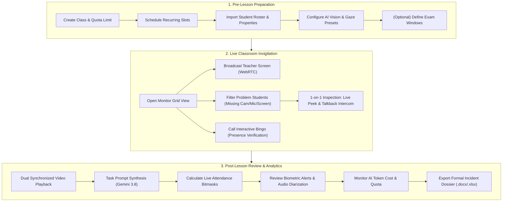
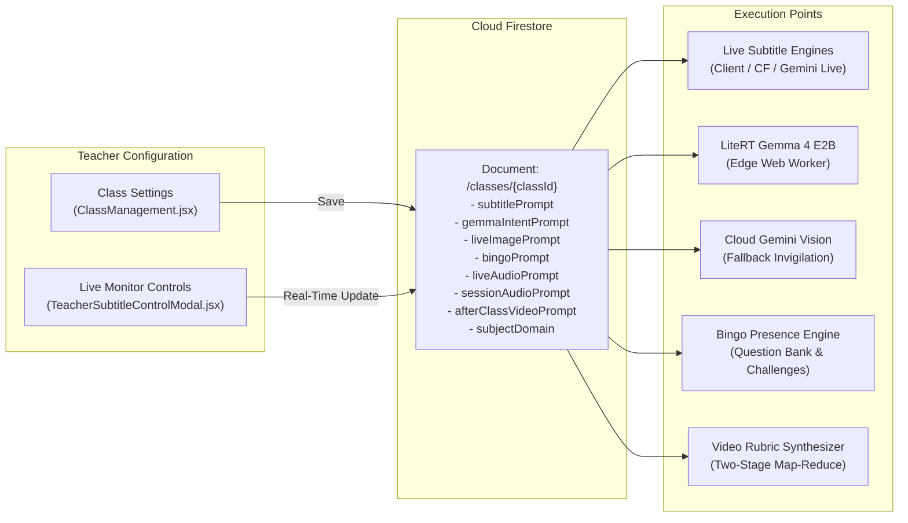
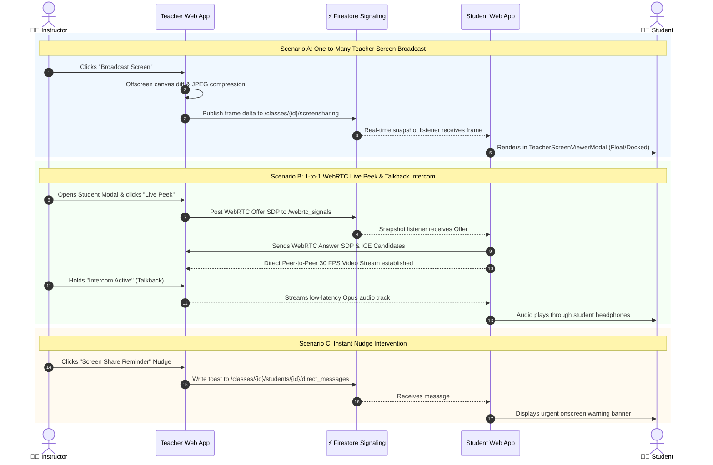
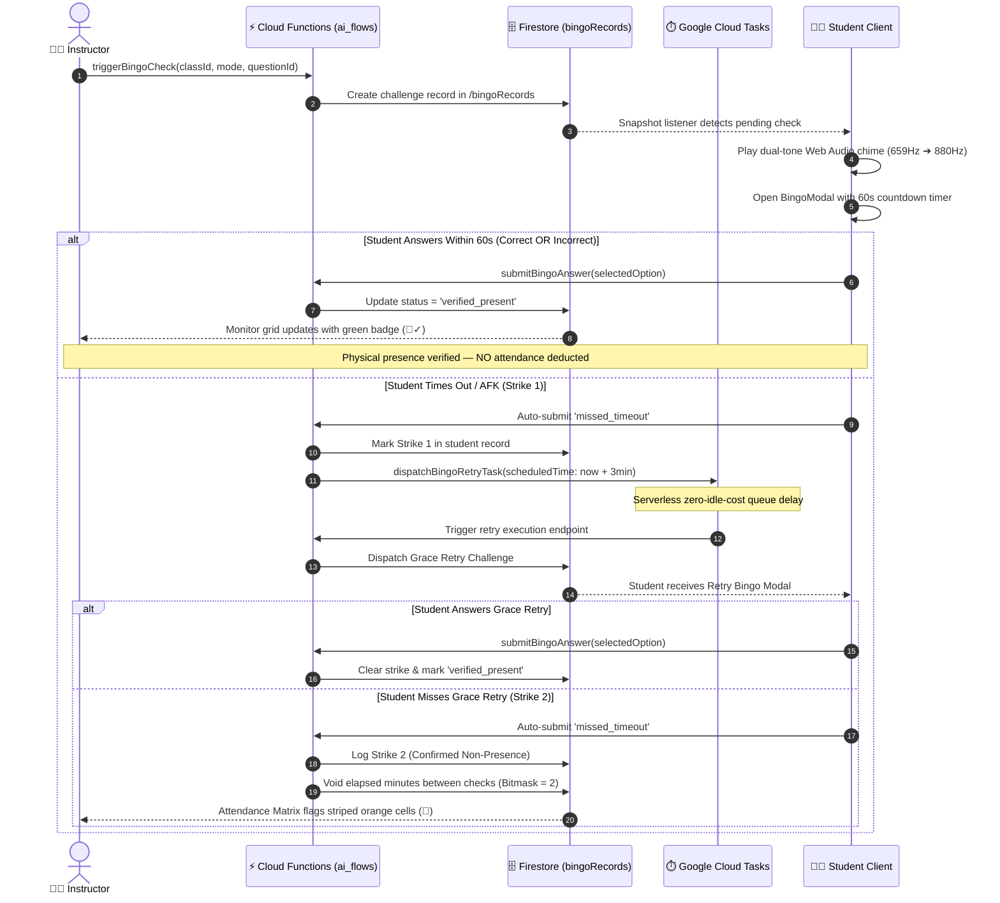
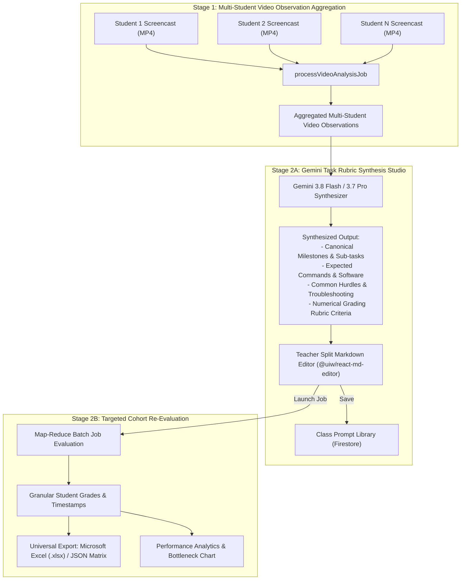
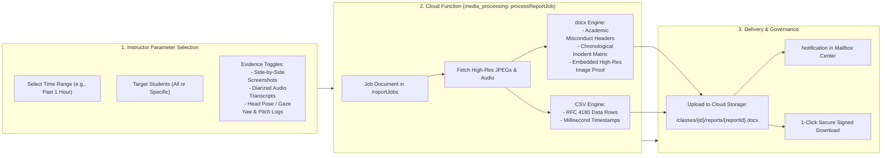

# 👨‍🏫 Instructor & Teaching Assistant User Manual

[🏠 Documentation Index](../README.md#documentation-index) | [🧑‍🎓 Student Manual](./user-manual-student.md) | [🛠️ Admin Manual](./user-manual-admin.md) | [📘 UI Catalog](./comprehensive-ui-controls-and-features-catalog.md)

---

Welcome to the **Google AI Classroom** Instructor Guide. This manual details everything you need to know to create classes, configure proctoring settings, monitor live student sessions, conduct one-on-one interventions, trigger active presence challenges, review synthesized AI rubrics, and export formal academic incident dossiers.

---

## 📑 Table of Contents
1. [Getting Started & Navigation](#1-getting-started--navigation)
2. [Classroom Setup & Timetable Configuration](#2-classroom-setup--timetable-configuration)
3. [Managing Student Rosters & Custom Properties](#3-managing-student-rosters--custom-properties)
4. [Configuring AI Models & Proctoring Parameters](#4-configuring-ai-models--proctoring-parameters)
5. [Exam Mode & Assessment Confidentiality Safeguards](#5-exam-mode--assessment-confidentiality-safeguards)
6. [Live Invigilation & Classroom Monitor](#6-live-invigilation--classroom-monitor)
7. [Screen Broadcasting to Students](#7-screen-broadcasting-to-students)
8. [Individual Student Inspection, Intercom & Interventions](#8-individual-student-inspection-intercom--interventions)
9. [Interactive "Bingo" Active Presence Verification](#9-interactive-bingo-active-presence-verification)
10. [Session Review, Video Library & Synchronized Scrubbing](#10-session-review-video-library--synchronized-scrubbing)
11. [Practical Hands-On Tasks & Google Drive Archival](#11-practical-hands-on-tasks--google-drive-archival)
12. [AI Video Analysis & Task Prompt Synthesis Studio](#12-ai-video-analysis--task-prompt-synthesis-studio)
13. [Attendance Matrix, Bitmasks & Working Time Estimation](#13-attendance-matrix-bitmasks--working-time-estimation)
14. [Irregularities, Biometric Logs & Audio Diarization](#14-irregularities-biometric-logs--audio-diarization)
15. [Performance Analytics & Milestone Bottlenecks](#15-performance-analytics--milestone-bottlenecks)
16. [AI Cost Monitoring & FinOps Governance](#16-ai-cost-monitoring--finops-governance)
17. [Exporting Formal Incident Dossiers](#17-exporting-formal-incident-dossiers)
18. [Troubleshooting & Best Practices](#18-troubleshooting--best-practices)

---

## 1. Getting Started & Navigation

### Authentication & First Login
1. Navigate to your institution's deployment URL (e.g., `https://it114115-2627.web.app`).
2. Click **Sign in with Google** or enter your assigned institutional email and password.
3. Your account must end in an approved instructor domain (e.g., `@vtc.edu.hk`). Upon login, the system automatically routes you to the **Teacher Command Center** (`/`).

### Global Header Navigation
- **Class Switcher (`<select>`):** Located in the top header; allows you to jump directly between courses you teach without navigating back to the home dashboard.
- **Top Navigation Links:**
  - `Classes`: Returns to the main teacher dashboard listing all your classrooms.
  - `Prompts`: Opens the AI Prompt Studio to draft, optimize, and share rubric prompts.
  - `Mailbox`: Displays system notices, asynchronous export downloads, and background job alerts (badged with unread count).
- **Profile Menu & Role Switcher:** Click your avatar in the upper right corner to view your account details, trigger password changes, or sign out. On administrative accounts, you can toggle between **Teacher** and **Student** view simulations.

### 🔄 End-to-End Instructor Lesson Lifecycle Flow



---

## 2. Classroom Setup & Timetable Configuration

### Creating a New Class
1. On the Teacher Dashboard, click the **`+ Create Class`** button.
2. Fill in the **Basic Class Information**:
   - **Class ID:** A unique alphanumeric identifier (e.g., `IT114115-2026-A`).
   - **Display Name:** Friendly course title (e.g., *DevOps & Cloud Computing Laboratory*).
   - **Storage Quota:** Select `5 GB`, `10 GB`, `20 GB`, or `Unlimited`. Each class is pre-allocated 5 GB by default with a $10.00 AI token budget cap.
   - **Screenshot Retention:** Choose how long raw student frame snapshots are retained before automatic deletion (`7` to `365` days).
   - **Video Retention:** Choose how long compiled MP4 videos are kept (`14` to `730` days).

### Timetable & Schedule Builder
Open the **Settings** tab in your class workspace and locate the **Timetable & Schedule** panel:
1. **Semester Dates:** Set the course **Start Date** and **End Date**.
2. **Timezone:** Select your local timezone (e.g., `Asia/Hong_Kong`).
3. **Weekly Slots:**
   - Select the day of the week (e.g., `Tuesday`).
   - Pick the **Start Time** and **End Time** in 30-minute intervals.
   - Click **`+ Add Schedule`**. The system contains built-in collision detection to prevent overlapping slots.
4. **Automated Scheduling Behaviors:**
   - ✅ *Automatically start live capture during scheduled hours*: Student clients automatically connect when a scheduled lesson begins.
   - ✅ *Automatically compile lesson screencasts into MP4 videos after class*: Cloud Functions assemble student frames into full MP4 videos as soon as the scheduled lesson finishes.

### Mid-Semester Timetable Changes & Past Lesson Safeguard (Schedule Segments)
If your class schedule changes mid-semester (e.g. room reallocations, department rescheduling, or day/time shifts):

1. **Automatic Safeguard Interception**:
   - If lessons have already taken place under the current schedule, modifying the dates or time slots and clicking **"Save Class Settings"** will automatically trigger the **Class Timetable Change Safeguard Modal**.
   - This prevents past attendance records, video recordings, and custom titles from becoming orphaned.

2. **Safeguard Options**:
   - **Option 1 (Recommended): Archive Past Lessons & Apply New Timetable From Today**  
     Archives the existing timetable up to yesterday (or the last completed lesson date) into `scheduleHistory`. The new timetable automatically takes effect starting today without shifting or altering any past class history.
   - **Option 2: Overwrite Entire Schedule (Recalculate Past)**  
     Retroactively recalculates all lesson slots from the original start date. (Only use this if the previous timetable was entered incorrectly and you intentionally wish to rewrite the entire semester).

3. **Multiple Timetable Changes Throughout a Semester**:
   - If a class changes schedule multiple times (e.g., Week 3, Week 7, and Week 11), each change appends another segment to `scheduleHistory`.
   - The scheduling engine seamlessly chains all segments together into one continuous, unbroken semester portfolio (`Lesson 01`, `Lesson 02`, `Lesson 03`...).
   - In all lesson dropdowns (`DateRangeFilter`), teachers and students see the complete semester sequence in chronological order. Selecting any past lesson pulls up the exact attendance records and videos recorded during that period.

> [!NOTE]
> **Does normal class completion add to `scheduleHistory`?**  
> **No.** When a class session finishes normally, student attendance is recorded in `attendance/{lessonId}` and video jobs are processed. `scheduleHistory` is **only** modified when an instructor explicitly updates the class timetable in Class Management. If a class never has its schedule changed, `scheduleHistory` remains empty (`[]`) for the entire semester.

---

## 3. Managing Student Rosters & Custom Properties

### Unified Student Identity & Roster Structure
The system utilizes a single, unified **`Student Name`** format (e.g., `Chan Tai Man`, `Bob Ross`, `Wong Ka Yan`), reflecting standard institutional formatting without arbitrary first/last name fragmentation.

Each enrolled student profile contains:
- **Email**: Institutional student email (e.g., `student@stu.vtc.edu.hk`).
- **Student Name**: Full official Romanized name.
- **Nickname (Optional)**: Preferred English or informal name (e.g., `Timmy`, `Painter`).
- **Programme (Optional)**: Academic programme of study (e.g., `Higher Diploma in Cloud and Data Centre Administration`).
- **Class / Cohort (Optional)**: Academic cohort or tutorial section (e.g., `IT114115/1A`).

### Cross-Class Student Profile Propagation ("One Class Provided It, All Classes Work")
Students often take multiple modular classes across semesters and teaching teams. The platform features an **Institutional Student Directory**:
1. **One-Time Upload**: Once a student's profile metadata is entered, imported via Excel, or uploaded in **any single class**, it is stored in the central institutional directory.
2. **Instant Auto-Enrichment**: Whenever you create a new class or add student emails to an existing class (by typing, pasting, or importing emails), known profiles from other classes are **immediately auto-filled**.
3. **Visual Transparency**:
   - The roster summary displays: `✨ X auto-filled from other classes`.
   - Each auto-enriched student displays a `✨ Directory` badge next to their name in the Enrolled Roster Details table.
4. **Zero Manual Migration**: Existing classes automatically inherit institutional directory records on load without requiring any database migration scripts.

### Adding & Managing Students
1. In the **Class Management (`⚙️ Settings`)** tab, scroll to **Student Roster**.
2. **Manual Input:** Enter student institutional emails separated by commas or new lines into the textarea. As you type, matching directory profiles appear below in real time.
3. **Batch Import Modal (`📥 Batch Import Students`):**
   - Click to open the structured import dialog.
   - Download the official template: `📄 Download Excel Template` (`student_roster_template.xlsx`).
   - Drag & drop or upload an Excel spreadsheet (`.xlsx` or `.xls`) with standard headers: `StudentEmail,StudentName,Nickname,Programme,Class`.
   - Full Unicode preservation guarantees that Chinese names and nicknames (e.g., `大文`, `陳大文`, `阿欣`) load perfectly without encoding issues.
   - Preview changes and apply them directly to the roster.
4. **Export Roster (`📤 Export Excel`):**
   - Click **`📤 Export Excel`** to download current roster records as an OpenXML spreadsheet (`Class_{id}_Roster.xlsx`). The exported Excel file includes all auto-enriched names, nicknames, programmes, and cohort classes merged from institutional memory.

### Custom Properties & AI Injection
The platform supports passing contextual variables directly into Gemini prompts:
- **Class-wide Properties:** Define key-value pairs (e.g., `ProjectRepo: github.com/school/lab1`, `OperatingSystem: Ubuntu 24.04`). These keys are automatically available in all video and vision evaluation prompts.
- **Student-Specific Properties:**
  1. Click **`📥 Export / Download Existing Excel`** in the Custom Properties Manager.
  2. Populate columns for each student (e.g., `AssignedSeat: Lab-302-A`, `AccommodationTier: ExtendedTime`).
  3. Click **`📤 Choose Excel (.xlsx) to Upload`**. Cloud Functions asynchronously parse and link these attributes to individual student UIDs.

---

## 4. Configuring AI Models & Proctoring Parameters

In **Class Settings (`⚙️ Settings`)**, configure the automated proctoring intelligence:

### Vision AI Settings
- **Default Capture Mode:**
  - `Dual (Screen + Webcam)`: Recommended for official labs and proctored exams.
  - `Screen Only`: For coding labs without webcam requirements.
  - `Webcam Only`: For oral presentations or interviews.
- **Vision Model Selection:**
  - `gemini-3.5-flash-lite`: Lowest latency and lowest token cost ($0.075/1M tokens); ideal for continuous frame scanning.
  - `gemini-3.7-flash` / `gemini-3.8-flash`: Balanced multi-modal models for nuanced screen and code reading.
  - `gemini-3.7-pro`: Deep reasoning model for high-stakes exam integrity checks.

### Biometric Gaze & Face Tracking
- **MediaPipe Monitoring Mode:** Choose `Hybrid (Client MediaPipe + Cloud Fallback)`, `Client Only`, `Cloud Only`, or `Disabled`.
  - In *Hybrid Mode*, students' devices run 468-point face tracking locally in WebAssembly. If a student's machine lacks GPU acceleration, the system seamlessly falls back to cloud Gemini vision.
- **Gaze Sensitivity Presets:** `Relaxed`, `Standard`, `Strict`, or `Custom`.
- **Custom Angular Limits (in Custom Mode):**
  - **Yaw Tolerance Slider:** Adjust between ±10° and ±50° (flags turning head away from display).
  - **Pitch Down Tolerance Slider:** Adjust between -45° and -10° (detects looking down at phones or notes).
  - **Pitch Up Tolerance Slider:** Adjust between +10° and +45° (detects looking up at ceiling or bystanders).
- **Face Debounce Gate:** Set a delay (2–10 seconds) before logging a look-away event to prevent false alarms from momentary natural glances.

### Acoustic & Speech Monitoring
- **Microphone Requirement:** `Mandatory` (forces students to grant mic permissions) or `Optional`.
- **Client-Side Silence Suppression (VAD):** When enabled, client Web Audio nodes mute chunks below the volume threshold, saving over 80% in cloud storage and transcription costs.
- **Mode 1 (Moving Window Transcription):** Continuously transcribes 20s–45s rolling audio slices using on-device Whisper or `gemini-3.5-transcribe-preview`.
- **Mode 2 (Session Audio Diarization):** Assembles recorded audio clips into a full session timeline with speaker separation.

### Universal AI Prompt Studio & Multi-Modal Class Configuration
All AI models across the entire classroom lifecycle are configurable directly by the teacher. Instructors are never locked into static prompts. Configuration occurs across two complementary surfaces:
1. **Class Settings (`ClassManagement.jsx`)**: Sets persistent default prompts stored in `classes/{classId}`.
2. **Live Monitor Subtitle Modal (`TeacherSubtitleControlModal.jsx`)**: Allows in-flight prompt selection, discipline switching, and inline prompt editing during live broadcast.



#### Complete Multi-Modal Prompt Configuration Matrix

| Modality & Setting | Configuration UI Surface | Firestore Field | Runtime Inference Engine | Purpose & Customization Options |
| :--- | :--- | :--- | :--- | :--- |
| **Live Subtitles & Translation** | Class Settings (Sec 8) & Live Subtitle Modal | `subtitlePrompt` & `subjectDomain` | Cloud Function `translateTeacherSpeech` / Chrome Nano / Gemini Live | Select discipline (Healthcare, CS, Business, etc.) and custom prompt preserving technical glossaries. |
| **On-Device Gemma Voice Intent** | Class Settings (Sec 6) | `gemmaIntentPrompt` | Edge Web Worker `litertGemma.worker.js` (LiteRT-LM Gemma 4 E2B) | Detects vocal exam collusion (`COLLUSION_EXAM`, `EXTERNAL_AI_ASSIST`, `UNAUTHORIZED_TALK`) 100% on-device. |
| **Live Image & Screen Invigilation** | Class Settings (Sec 6) | `liveImagePrompt` | Cloud Function `analyzeFaceFallbackFlow` (Gemini Vision) | Guides visual fallback checks (face presence, looking away, suspicious screen states) with template tags (`{{studentEmail}}`, etc.). |
| **Bingo Active Presence Challenge** | Class Settings (Sec 5) | `bingoPrompt` | Cloud Functions `resolveBingoQuestion` & `generateBingoQuestionBank` | Shapes presence verification questions from teacher screen, student screen, or question bank generator (`{{topic}}`, `{{count}}`). |
| **Live Audio Acoustic Invigilation** | Class Settings (Sec 6) | `liveAudioPrompt` | Cloud Function `analyzeAudioChunk` (Gemini Audio) | Evaluates rolling 30s student audio chunks for background collusion or unauthorized proctoring anomalies. |
| **Discussion Diarization Summary** | Class Settings (Sec 6) | `sessionAudioPrompt` | Cloud Function `summarizeSessionAudio` (Gemini Audio) | Synthesizes multi-speaker student group discussion transcripts and evaluates collaborative engagement. |
| **After-Class Video Analysis Rubric** | Class Settings (Sec 6) & Video Analysis Studio | `afterClassVideoPrompt` | Cloud Function `processVideoJob` (Gemini Vision Map-Reduce) | Directs two-stage rubric synthesis and grading across recorded student MP4 screencasts. |

> 📘 **Architectural Deep Dive:** For an exhaustive code trace of all prompt execution paths, template variable tags, and fallback hierarchies, refer to [**Teacher AI Prompt & Discipline Domain Configuration Architecture**](./teacher-ai-prompt-configuration-guide.md).

### Live Subtitles, Translation & Course Discipline Domain
In **Class Settings ➔ Section 8: Live Subtitles, Translation & Subject Domain** and in the live **Monitor View (`🎙️ Subtitle Settings`)**:
- **Course Subject / Discipline Domain**: Select your field of study (`Computer Science & Software Development`, `Business, Finance & Accounting`, `Design, Media & Visual Arts`, `Healthcare, Nursing & Medical Sciences`, `Engineering & Construction`, `Hospitality, Culinary & Tourism`, `Languages, Humanities & Social Sciences`, `General Studies & Interdisciplinary`, or `Custom Subject Domain...`).
  - *Prevents IT Bias*: Ensures speech recognizers and translation engines preserve medical, financial, culinary, or engineering terminologies instead of mistranslating them as software keywords.
- **Live Subtitle & Speech Translation AI Prompt**: Click **`Select Subtitle Translation Prompt`** to choose or write a specialized translation system prompt.
  - Custom prompts can specify translation tone, code-switching guidelines (e.g. colloquial Cantonese with English technical acronyms), and glossary definitions.
  - In the live **Monitor View**, click **`✏️ Edit Prompt`** inside the Subtitle Control Modal to tweak prompt instructions on the fly and click **`Apply Custom Instructions`**—changes take effect immediately for all students without stopping the broadcast.
  - **Saved with Class**: The selected domain and translation prompt are saved directly to the class document in Cloud Firestore (`classes/{classId}`), persisting across all lectures and automatically synchronizing to all co-instructors in real time.

---

## 5. Exam Mode & Assessment Confidentiality Safeguards

### Pre-Scheduling Exam Windows
1. In **Class Settings**, scroll to **Exam & Assessment Windows**.
2. Specify the **Exam Title** (e.g., `Final Practical Exam`), **Start Datetime**, and **End Datetime**.
3. Click **`+ Add Exam Window`**.

### Live Exam Mode Activation
If you need to conduct an unscheduled quiz or immediate test, activate Exam Mode instantly:
1. In the **Monitor (`🖥️ Monitor`)** tab, locate the **Proctored Exam Mode** toggle in the controls toolbar.
2. Click **`🔒 Exam Mode: ACTIVE`**.

### Zero-Trust Security Guarantees
When Exam Mode is active:
- **Cloud Storage Shields:** Storage security rules automatically reject student read requests for any video or evidence asset flagged as exam material.
- **Student Portal Redaction:** Students attempting to view recordings, transcripts, or incident details in their self-service portal see a locked shield: `🔒 Official Examination Material — Records Withheld Under Proctoring Policy`.
- **Full-Screen Enforcement:** Student browsers are locked into full-desktop sharing (`displaySurface === 'monitor'`). Window or single-tab shares are rejected with an irregularity alert.
- **Watermark Banner:** A persistent red security banner appears on all student viewports.

---

## 6. Live Invigilation & Classroom Monitor

The **Monitor View** ([`MonitorView.jsx`](file:///home/developer/Documents/Gemini-AI-Classroom-Assistant/web-app/src/components/MonitorView.jsx)) is your primary live control center.

### Layout & Cadence Controls
- **Layout Density Selector:** Select `2x2`, `3x3`, `4x4`, or `Dynamic Auto-Fit` to adjust student grid cards according to your monitor size.
- **Snapshot Upload Cadence Slider:** Adjust the student upload interval between **5 seconds** (high security) and **60 seconds** (bandwidth-conserving).
- **Audio Master Listen / Mute Toggle:** Listen in on classroom ambient microphones or mute all incoming student audio.

### Problem Student Quick Filters
Use the zero-space filter buttons on top of the student grid to focus immediately on anomalies:
- `👥 All Students`: Default view.
- `⚠️ Problems`: Shows students with active flags (missing feeds, looking away, or unverified presence).
- `📷 Missing Cam`: Isolates students who have not initialized or have muted their webcam.
- `🎙️ Missing Mic`: Isolates students whose microphones are disabled.
- `🖥️ Not Sharing`: Displays students whose desktop screen stream has dropped.
- `🚨 AI Alerts`: Filters students triggering active MediaPipe or LiteRT Gemma intent violations.
- `📢 Targeted Nudge`: Sends an immediate visual alert to all filtered students with one click.

### Reading Student Card Telemetry
Each card in the student grid provides real-time multi-sensor status:
- **Dual Viewports:** Picture-in-picture student desktop and webcam. Click **`🔄 Swap View`** to flip them, or **`⛶ Fullscreen`** to inspect full-size.
- **Biometric Pills:**
  - `🟢 Centered`: Normal posture.
  - `🟡 Looking Away`: Head rotated past configured angle threshold.
  - `🔴 Multiple People`: Unauthorized persons detected in frame.
  - `🔴 No Person`: Student has stepped away from camera.
- **VU Meter:** Visual green-to-red bar indicating speech volume.
- **Whisper Speech Bubble:** Displays real-time subtitles of student speech with language tags (粵 / 普 / EN).
- **Gemma Intent Tag:** If LiteRT Gemma detects an anomaly, a red tag appears: `COLLUSION_EXAM`, `EXTERNAL_AI_ASSIST`, or `UNAUTHORIZED_TALK`.
- **Bingo Status Pill:** Displays active countdown (`🎯 Bingo Pending (35s)`) or verification badge (`🎯✓ Passed`).

---

## 7. Screen Broadcasting to Students & Public Presentation Mode

You can broadcast your instructor desktop and live speech subtitles directly to all 50+ students in real-time, or open an anonymous public presentation mode for conference audiences:

### 7.1 Standard In-Class Screen Broadcast
1. In the **Controls Panel**, locate the **Teacher Screen Sharing** section.
2. Select **Broadcast Quality**:
   - `720p (Fast) [Recommended]`: Default high-efficiency mode (`1280x720`) balancing crystal-clear terminal text with minimal bandwidth consumption.
   - `1080p (Standard)`: Full HD quality (`1920x1080`).
   - `1440p (High-Res)`: 2K resolution for extra-fine terminal fonts or high-DPI displays.
3. Select **Broadcast Frame Interval**:
   - `3.0s / 0.3 FPS (Default)`: Economy bandwidth mode ideal for slides, lectures, and terminal code.
   - `1.5s / 0.7 FPS`: Standard responsiveness.
   - `0.8s / 1.2 FPS` or `0.5s / 2.0 FPS`: High responsiveness for live UI interactions.
4. Click **`🖥️ Broadcast Screen & Audio`** to open the setup modal.
5. In **Step 1**, select your microphone device (for live subtitles) and audio recording preferences.
6. In **Step 2**, confirm resolution and interval presets.
7. Click **`Start Sharing & Subtitles`** and select the display or application window you wish to present.
8. The broadcast transmits through lightweight diffed JPEG frames directly into the student client's floating presentation window.
9. Click **`⏹️ Stop Sharing`** when your demonstration is finished.

---

### 7.2 Anonymous Public Presentation Mode (Conference & Open Talks)

When delivering a seminar, lightning talk, or public conference presentation, you can allow any attendee in the room to view your live screen and real-time multilingual subtitles on their mobile phone—**without requiring student account registration or prior enrollment**.

> [!IMPORTANT]
> **Control Location**: Public Presentation Mode is controlled directly inside the **"Broadcast Screen & Audio"** modal (Step 2) and live broadcast HUD.
> 
> **Why is it NOT in Class Management?**
> Public Mode is designed as an **ephemeral, session-level feature** rather than a permanent class setting:
> - Normal classes remain **100% private** by default.
> - Teachers can safely use an existing class that already has registered students without modifying the class roster or exposing sensitive classroom data.
> - As soon as you click **"Stop Sharing"**, public access is **automatically terminated and revoked immediately**, restoring total classroom privacy without any manual cleanup.

#### Step-by-Step Speaker Workflow:
1. **Open Broadcast Modal**: In any class (e.g., `it3101-ab` or a dedicated talk class like `open-talk`), click **`🖥️ Broadcast Screen & Audio`**.
2. **Enable Public Presentation Mode**: In **Step 2 (Broadcast Settings)**, locate the **"Public Presentation Mode (QR Code & PIN)"** card and switch the toggle **ON**.
3. **Session PIN & QR Code**:
   - The system automatically generates a secure 4-digit PIN (e.g., `8341`). You can also click **`Generate New PIN`** or type a custom 4-digit number.
   - Click **`Show Projector QR`** to open the full-screen projector modal.
4. **Project to the Audience**:
   - The **Projector QR Code Modal** (`PresentationQrModal`) displays a crisp SVG QR code pointing to `https://<domain>/live/<classId>?pin=XXXX` along with the bold 4-digit PIN and a quick link copy button.
   - Project this QR code onto the auditorium projector screen so attendees can scan it with their smartphone cameras.
5. **Start Broadcast**: Click **`Start Sharing & Subtitles`** to begin.
6. **In-Flight Live HUD Controls**:
   - During the live talk, a floating broadcast HUD displays a green **`📢 Public PIN: XXXX`** badge.
   - Click the **`Projector QR`** button in the HUD at any time during your presentation to re-display the QR code on stage for late arrivals.
7. **Instant Automatic Teardown**:
   - Click **`⏹️ Stop Sharing`** at the end of the talk.
   - The session document in Firestore instantly resets `isBroadcasting: false`, `isPublic: false`, and `publicPin: null`.
   - Firestore security rules immediately revoke external access. Spectator devices display "Broadcast ended".

#### Audience Spectator Experience (`/live/:classId`):
- **Zero Login Friction**: When an attendee scans the QR code, the public viewer automatically logs them in anonymously (`signInAnonymously`).
- **Automatic PIN Verification**: Because the QR code includes `?pin=XXXX`, attendees are validated instantly without needing to manually type the PIN. (If accessing directly via URL without parameters, a sleek 4-digit PIN pad is displayed).
- **Responsive Screen Viewing**: Spectators see the live instructor screen with zoom controls (`1x`, `1.5x`, `2x`) optimized for mobile screens.
- **Multilingual Subtitles Overlay**: Real-time subtitles appear at the bottom with a native translation picker (English, Traditional Chinese, Simplified Chinese, Japanese, Korean, French, German, Spanish, Vietnamese).
- **Privacy & Isolation**: Attendees have **zero access** to any other classroom collections, student names, grades, submissions, or teacher administrative tools.

---


## 8. Individual Student Inspection, Intercom & Interventions

Clicking any card in the Student Grid opens the **Individual Student Modal** ([`IndividualStudentView.jsx`](file:///home/developer/Documents/Gemini-AI-Classroom-Assistant/web-app/src/components/IndividualStudentView.jsx)).

### Viewing Channels
- **`Dual View`:** High-res side-by-side feed of screen and webcam.
- **`Screen Only`:** High-definition desktop view with anti-aliasing.
- **`Webcam Only`:** Full camera feed with live MediaPipe 3D face mesh vectors.
- **`Live Peek (P2P)`:** Initiates a direct 30 FPS peer-to-peer WebRTC stream.

### Push-to-Talk Intercom
1. Under the **Intercom & Talkback** section, select your instructor microphone from the device dropdown.
2. Click and hold (or toggle) **`🎙️ Intercom Active (Speaking...)`**.
3. Speak directly into your microphone; your voice will play through the student's headphones in real-time.
4. Release the button to close the channel.

### Quick Nudge Interventions
Send instant standardized visual toasts to the student's viewport:
- **`🖥️ Screen Share Reminder`**: Prompts the student to restore entire-screen sharing.
- **`📷 Cam Turn On`**: Nudges the student to turn their webcam on.
- **`🎙️ Mic Enable`**: Nudges the student to enable their microphone.
- **`👁️ Face Screen`**: Reminds the student to align their face with the display.
- **Custom Direct Message:** Type any message in the input box and click **`Send`**.

### Isolated Anti-Decoy Bingo Check
Click **`🎯 Call Bingo`** inside the student modal to trigger a surprise presence check targeting *only this student*. The system captures an unannounced screen snapshot (`student_screen`) to confirm the student is not running an automated video looper.

### Audio Clip Inspection & Diarization
- **HTML5 Player:** Listen to the student's latest 30-second audio clip.
- **`📋 Clips Drawer`**: Expand to see the playlist of all recorded audio segments for this student during the lesson.
- **`📜 View Transcript & Diarization`**: Opens the full diarization modal showing multi-speaker turn-taking, risk level, and Gemini cheat-detection rationale.

### 📡 Real-Time Broadcasting, Live Peek & Intercom Signaling Flow



---

## 9. Interactive "Bingo" Active Presence Verification

The Bingo system distinguishes between genuinely engaged students and unattended computers running loopers or background browser tabs.

### Choosing a FinOps Cost Mode
Open **`📚 Bingo Question Bank`** in the controls panel:
1. **Mode 1: Predefined Question Bank ($0.00 / 0 AI tokens):** Uses questions you have written or imported. Completely free.
2. **Mode 2: Teacher Screen Broadcast (1 AI Call per Lecture):** Gemini analyzes your instructor screen, automatically drafts a question based on what you are presenting, and sends it to all students. Costs ~$0.00015 for the whole class.
3. **Mode 3: Student Individual Screens:** Gemini reviews each student's current coding screen to verify active task work.

### Launching a Class-Wide Bingo Check & Auto-Bingo
1. **Manual Bingo Dispatch:** On the live monitor controls bar, click **`🎯 Call Bingo (All Students)`**. Every student receives an audio chime and an urgent 45-to-60 second countdown popup with 4 multiple-choice options.
2. **Auto-Dispatch Bingo:** Enable the **`🔄 Auto-Dispatch Bingo`** switch in the controls sidebar to schedule automatic presence checks. Use the slider to set intervals between 1 and 30 minutes (with 1-min Fast Test available for rapid verification).
3. **Fail-Safe Auto-Stop Guarantees:**
   - **Capture Dependency:** Auto-Bingo *never* fires if class capture is inactive (`isCapturing == false`), even if a scheduled lesson timetable is running.
   - **Screen Share Dependency:** Auto-Bingo strictly requires the teacher to be actively sharing their screen (`isBroadcasting === true`). If screen sharing stops, scheduled jobs automatically skip.
4. **Instant Cancellation & Abort:**
   - Click the **`⏹️ Cancel`** button beside **`🎯 Call Bingo`** at any time to immediately dismiss pending challenges on all student screens and abort scheduled retries.
   - Stopping class capture or toggling Auto-Bingo off automatically triggers `cancelActiveBingo`, ensuring no orphan challenges remain when a session ends.

### Question Bank Management Studio
In the Question Bank Modal:
- **Manual Question Creator:** Enter a question, options A/B/C/D, specify the correct answer, and save.
- **AI Generator (`✨ Generate with Gemini`):** Enter a lecture topic (e.g., *Docker Container Networking*) and question count (3–10). Gemini 3.5 Flash Lite generates formatted questions with options and answer keys for one-click import.
- **Bulk Import:** Paste questions formatted in Aiken format (`ANSWER: B`) or raw JSON arrays and click **`Import All`**.

### The Two-Strike Attendance Deduction Rule
- **Incorrect Answer (`failed_incorrect`):** The student is physically present and tried to answer. Their presence is verified; **attendance is NOT docked**.
- **Timeout / AFK (`missed_timeout`):** The student did not respond within 60 seconds.
  - **Strike 1:** Schedules a grace retry in 1–5 minutes (handled serverlessly via Google Cloud Tasks).
  - **Strike 2:** If the retry also times out, elapsed minutes between the checks are automatically voided (coded as bitmask state `2` / Orange in the attendance matrix).

### 🎯 Interactive Bingo Challenge & Cloud Tasks Two-Strike Grace Flow



### 📊 Classroom Bingo Presence Report & Student Performance Review

Instructors can review all dispatched questions, correct answers, individual student selections, response latencies, and window focus status in real time through the dedicated **Classroom Bingo Presence Report** view:

#### 1. How to Access (No Modals)
- **Primary Access (Analytics Dedicated Sub-tab):** Click the **AI Analytics & Insights** tab and select the **`🎲 Bingo Presence Report`** sub-tab (`/class/:classId?tab=analytics&sub=bingo`).
- **Cross-Link from Attendance Matrix:** In **`Attendance`** (`/class/:classId?tab=analytics&sub=attendance`), the legend row provides a direct link: **`🎲 View Bingo Presence Report →`**, allowing instant correlation of attendance deductions with failed or missed Bingo challenges.

#### 2. Lesson Schedule Filter Integration
The Bingo Presence Report is deeply integrated with the class schedule:
- **Automatic Lesson Window Scoping:** When a lesson is selected in the global date filter or lesson schedule, records are automatically scoped to that lesson period (with 15-minute grace padding before and after class bells to preserve prompt checks issued right around start/dismissal).
- **Interactive Lesson Scope Banner:** Prominently displays the active lesson period (e.g., `Sep 17, 2026 (09:00 AM - 11:00 AM)`), the count of student responses within this scope, and total historical challenges recorded.
- **Banner Quick-Switch Dropdown:** Instructors can swiftly toggle between lessons or select **"All Lessons (All History)"** directly from within the report banner.
- **Lesson-Specific Empty State:** If no challenges were dispatched during the chosen lesson, an empty state card displays the lesson hours, indicates the number of records available in other sessions, and provides a one-click button to reset the view to all lessons.

#### 3. Key Interface Features
1. **Real-Time Live Sync Indicator:** A pulsing green dot (`LIVE SYNC`) confirms an active Firestore snapshot listener on `classes/{classId}/bingoRecords`. Incoming student answers pop up automatically without manual page refreshing.
2. **Aggregated KPI Summary Cards:**
   - **Total Challenged:** Total number of student verification requests dispatched within the active lesson scope.
   - **Verified Present (%):** Percentage of students who actively answered within the countdown window.
   - **Incorrect Choice (%):** Percentage who selected an incorrect distractor (presence verified; no penalty).
   - **Timed Out / AFK (%):** Percentage who failed to answer within 45s (accruing attendance strikes).
   - **Average Response Latency (s):** Mean reaction time from dispatch to student submission.
   - **OS Window Focus (%):** Rate of students whose browser window was in active OS focus when answering.
3. **Challenge Round Selector & History:**
   - Automatically groups records into timestamped rounds within the selected lesson.
   - Allows instructors to inspect historical questions dispatched earlier in the lecture or choose **"All Challenges"** for cumulative review.
4. **Question & Correct Answer Showcase:**
   - Displays full question text and origin pill (`Question Bank`, `Instructor Screen`, or `Student Screen`).
   - Renders all 4 options ($A, B, C, D$) with the designated correct answer highlighted in emerald green with a bold **`✓ Correct Answer`** badge.
   - For vision-generated challenges, renders the captured screenshot thumbnail with one-click lightbox enlargement and the AI model's observed evidence explanation.
5. **Detailed Student Response Table:**
   - **Student Email & UID:** Direct identity breakdown.
   - **Chosen Answer:** Displays option letter pill ($A, B, C, D$) and selected text, or `⏱️ No answer (Countdown expired)`.
   - **Result Badges:** Color-coded status (`✅ Verified Present`, `❌ Incorrect Choice`, `⚠️ Timed Out`, `⏳ Pending`).
   - **Latency:** Seconds taken to answer.
   - **Window Focus:** `🖥️ Focused` (green) or `❌ Unfocused` (rose red).
   - **Strike Indicator:** `Strike 1` or `🚨 Strike 2 (Deduction)` badges.
6. **Student Search & Status Filtering:** Search by email prefix or student UID, and filter by status tabs (`All`, `Passed`, `Incorrect`, `Timed Out`, `Pending`).
7. **Excel Export (`📥 Export Excel`):** Click **`📥 Export Excel`** to download an OpenXML `.xlsx` spreadsheet with student names, nicknames, cohorts, programmes, timestamps, lesson periods, questions, options, correct answers, student choices, latency, focus states, and strikes. The generated filename dynamically incorporates the active lesson date (e.g., `Bingo_Results_CLASS101_2026_09_17.xlsx`).

---

## 10. Session Review, Video Library & Synchronized Scrubbing

Navigate to the **`🎥 Videos`** tab to inspect completed screencasts.

### Synchronized Dual Playback (`SessionReviewView.jsx`)
1. Select the **Session Review** subtab.
2. Filter by student name or email using the search dropdown.
3. The player loads both the student's desktop recording and webcam recording.
4. Dragging the timeline scrubber advances both video streams in synchronized lock-step, allowing you to cross-examine what was on the student's screen with their physical head posture.
5. Click **`📥 Export Video Jobs (Excel)`** to download all lesson video compilation jobs (`Class_{classId}_Video_Jobs_{timestamp}.xlsx`) enriched with student display names and cohort section badges.

### Teacher Lecture Recordings & Multilingual YouTube CC (`LectureRecordingsView.jsx`)

Teachers can review their own screen/microphone lecture recordings, play them with AI-generated multilingual subtitles, and retrieve YouTube-ready upload packages:

1. **How to Access:**
   - **Main Class Navigation:** Go to **`🎬 Video Archive & AI Analysis`** tab ➔ **`🎥 Teacher Lecture Recordings`** sub-tab (`/class/:classId?tab=video&sub=recordings`).
   - **Screen Broadcast HUD:** When screen broadcasting, click the **`View Past Recordings`** link in the floating recording HUD.
2. **Automated Lecture Concatenation & Multi-Clip Merging:**
   - **Automated Broadcast Auto-Merge:** If you pause, stop, or restart screen sharing during a lecture, multiple recording clips are generated. When you click **"Stop Sharing"** in the monitor view, the system automatically runs a serverless stream-copy merge in the background.
   - **Fuzzy Timetable Tolerance:** If you start recording up to 45 minutes before class begins (e.g. 10:28 AM for a 10:30 AM class) or overrun by up to 60 minutes after class ends, all clips are automatically clustered into the same session group.
   - **Smart Detection Alert Banner:** If unmerged clips exist from the same class period, a blue alert banner appears:
     > 💡 **2 separate recording clips detected from 9/21/2026** (53m 5s total). Would you like to merge them into a single continuous full lecture? `[ 🔗 Merge into Full Lecture ]`
   - **🔗 Custom Merge:** Click "Custom Merge" to select specific clips with checkboxes and merge them on demand.
   - **Badges:** Combined master lectures display `🌟 Combined Full Lecture`, while individual clips display `✂️ Part 1` / `✂️ Part 2 (Merged into master lecture)`.
3. **Features & Retrieval:**
   - **HTML5 Player with Subtitle Tracks:** Preview the recorded lecture with synchronized closed captions in Original, English (`en`), Traditional Chinese (`zh-Hant`), Simplified Chinese (`zh-Hans`), and Japanese (`ja`).
   - **📥 Download YouTube Package (.zip):** One-click bundle containing the clean high-definition video, multi-language `.srt` subtitle files, and a pre-formatted `youtube_metadata.txt`.
   - **📋 1-Click Clipboard Copy:** Instant buttons to copy the generated YouTube Title and YouTube Description (complete with timestamped chapter markers like `00:00 - Introduction`, `14:20 - Code Walkthrough`).
   - **🔄 Subtitle Regeneration:** If Gemini AI processing needs to be re-run, click **`Generate Subtitles`** to trigger fresh multi-language closed captions without re-uploading the video.

### Student Video Library & Bulk Downloads (`VideoLibrary.jsx`)
1. Select the **Video Library** subtab.
2. Review the table of compiled MP4 recordings with date, duration, and file size.
3. Select checkboxes for specific recordings or select all.
4. Click **`📦 Request Selected as ZIP`** (or **`📦 Request All as ZIP`**). Cloud Functions will assemble a single ZIP package in the background. A download notification will appear in your **Mailbox** upon completion.
5. Click **`📥 Export Video Manifest (Excel)`** to export recording URLs, durations, and timestamps mapped to student display names and emails (`Class_{classId}_Video_Manifest_{timestamp}.xlsx`).

### Standardized Lesson Naming & Google Drive Archival
1. **Automated Lesson Name Resolution:** Videos and lecture recordings are automatically mapped to syllabus lessons using a 3-tier hierarchy:
   - **Tier 1 (Hands-on Tasks):** Screencasts submitted for practical tasks are grouped under `Tasks / [Task Title]`.
   - **Tier 2 (Syllabus Timetable Matching):** Sessions falling within $\pm 30$ minutes of a scheduled class slot are formatted as `Lesson 01 - Docker Architecture (2026-09-23)`.
   - **Tier 3 (Ad-hoc Fallback):** Unscheduled recordings fall back to `Lesson (YYYY-MM-DD)`.
2. **Configuring Base Google Drive Folder:** In the toolbar, customize the top-level Google Drive folder (defaults to `Classroom Archives`). All recordings are archived under `[Base] / [Class] / [Lesson or Tasks] / ...` without cluttering personal Drive files.
3. **One-Click & Bulk Drive Backups:**
   - In `VideoLibrary.jsx`, click **`☁️ Backup Selected to Drive`** or **`☁️ Backup All Class Videos to Drive`** to archive recordings.
   - Monitor real-time progress via the dual-bar `DriveBackupProgressModal`.
   - Table rows display a `📁 Drive ↗` button with direct links to backed-up files.

---

## 11. Practical Hands-On Tasks & Google Drive Archival

Instructors can design interactive laboratory tasks, specify milestone-based grading rubrics, evaluate student screencasts, and back up submission recordings to Google Drive:

### 1. Managing & Creating Tasks (`TasksManagementView.jsx`)
- Navigate to the **`📝 Tasks`** sub-tab in Class Management.
- Click **`➕ Create Task`** to launch the **Task Editor Modal** (`TaskEditorModal.jsx`).
- Configure task parameters:
  - **Task Title & Description:** Set clear instructions and expected terminal commands.
  - **Max Score & Duration:** Set point total and time limit in minutes.
  - **Allowed Attempts:** Specify maximum attempts per student (e.g. 3).
  - **✨ Extract Steps from Demo:** Upload a teacher reference recording, and Gemini 3.8 Flash automatically extracts structured rubric milestones (`rubricSteps`).

### 2. Task Grading Matrix View (`TaskGradingMatrixView.jsx`)
Click **`📊 Grade Submissions`** on any task card to open the grading matrix:
- **Real-Time Synchronized Table:** Displays enrolled students, submission status, attempt count, duration, effective score, and scores for each rubric milestone.
- **Manual Score Override & Feedback:** Click on any student's score cell to adjust points or add individualized teacher feedback.
- **Inspect AI Report (`🔍 Inspect`):** Open the student's evaluation modal to review AI reasoning for each milestone, evidence timestamps, and error analysis.

### 3. Backing Up Task Videos to Google Drive
- **Top Toolbar Action:** Click **`☁️ Backup Task Videos (N)`** to archive all completed student screencasts to Google Drive. The counter dynamically reflects how many student recordings exist in Firebase Storage.
- **Target Drive Hierarchy:** Media is systematically saved under:
  ```text
  [Base Folder] / [Class Name] / Tasks / [Task Title] / Students / [studentEmail] /
  ```
- **Single-Student Backup:** Click **`☁️ Backup`** on any student's row to archive only their video immediately.
- **Direct Drive Links (`📁 Drive ↗`):** Once backed up, the cell renders a clickable blue Drive button opening the video in Google Drive.
- **Built-In Screencast Preview (`▶️ Watch`):** Click **`▶️ Watch`** to open the in-browser HTML5 video player modal and inspect the student's attempt recording without leaving the grading workspace.
- **Excel Gradebook Export with Drive Links:** Click **`📥 Export Excel`** to download an OpenXML `.xlsx` spreadsheet (`Task_{Title}_Grading_Results.xlsx`). The report includes complete student profiles, individual milestone points, and a dedicated **Google Drive Link** column.

---

## 12. AI Video Analysis & Task Prompt Synthesis Studio

Navigate to the **Video Analysis Jobs** subtab to run asynchronous rubric evaluations across recorded video screencasts.

### Two-Stage Lab Task Prompt Synthesis
Rather than writing grading rubrics by hand, let Gemini synthesize rubrics from actual student recordings:
1. In the Video Analysis Jobs tab, click **`✨ Synthesize Task Prompt`**.
2. Select your analysis engine: **Gemini 3.8 Flash** or **Gemini 3.7 Pro**.
3. Gemini inspects student video observations across the class cohort and generates:
   - Canonical task milestones (e.g., *Task 1: GitHub MFA Setup*, *Task 2: AWS CloudShell Execution*).
   - Expected technical tools and commands.
   - Common blockers and pitfalls.
   - Granular grading rubric criteria with expected outputs.
4. Review the generated rubric in the split Markdown editor.
5. Check **`Save to Prompt Library`** to store the rubric for future classes.
6. Select evaluation scope: *Analyze only videos in this job* vs *Analyze all class videos*.
7. Click **`🚀 Launch Analysis Job`**.

### Reviewing and Exporting Results
- **Live Progress Monitoring**: As jobs run, track real-time progress via the live counter: **`Progress: {processedCount} / {totalVideos}`**. Because evaluation is orchestrated via Google Cloud Tasks push queues, jobs of arbitrary cohort size (e.g. 40, 80, 100+ students) execute to completion without timeout constraints.
- Click any job to open the **Level 2 Detail Matrix** (powered by View Transitions API) showing individual student subjobs with student display names and cohort tags.
- **Inspecting Single-Student Findings (`JobResultModal`)**:
  - Click any student subjob row to inspect their AI evaluation report.
  - **Dynamic Labeling**: The modal accurately indicates **`Analysis Output:`** for text and Markdown narratives, or **`Analysis Output (JSON):`** for structured objects.
  - **Automatic Word Wrap**: Long continuous evaluation text wraps cleanly within the window (`whiteSpace: pre-wrap`), completely eliminating horizontal scrolling across long single-line outputs.
  - **Wrap Toggle (`↩ Wrap: ON` / `➡ Wrap: OFF`)**: Toggle between word-wrapped reading mode and raw unformatted monospace layout.
  - **Single-Student Export Toolbar**: Download findings instantly via **`📥 Excel`**, **`📥 JSON`**, **`📝 Markdown`**, **`📄 Text Report`**, or copy to clipboard with **`📋 Copy`**.
- Click **`👁️ View Prompt`** to inspect the exact system prompt applied during evaluation.
- Click **`📥 Export Results (Excel)`** or **`📥 Export Results (JSON)`** to download comprehensive grades and feedback across the entire class, fully populated with Student Name, Email, Class/Cohort, and Programme.
- **One-Click In-Place Retry**: If any video encountered errors (e.g. quota limits or video encoding anomalies), the master job status will display **`PARTIAL_FAILURE (N failed)`**. Click **`🔄 Retry Failed Jobs (N)`** to instantly re-queue only the failed videos into the Cloud Tasks queue. The operation returns immediately to the browser without HTTP timeouts while workers process in the background.

### 🔬 Two-Stage AI Video Analysis & Rubric Synthesis Architecture



---

## 12. Attendance Matrix, Bitmasks & Working Time Estimation

Navigate to **`📊 Analytics` $\to$ `Attendance`** ([`AttendanceView.jsx`](file:///home/developer/Documents/Gemini-AI-Classroom-Assistant/web-app/src/components/AttendanceView.jsx)).

### Computing Attendance
1. Click **`Calculate Live Attendance`** to trigger the Cloud Function.
2. The system computes attendance by combining screen-share duration bitmasks, camera presence logs, and Bingo responses.

### Understanding the 3 Core Metrics
- **Attendance Presence %:** Percentage of scheduled lesson time the student was logged in and active.
- **Screen Sharing %:** Percentage of lesson time the student shared their entire desktop without interruption.
- **AI Working %:** Estimated percentage of time the student spent actively engaged in IDEs, compilers, or class tasks (calculated from screen telemetry).

### Reading the Timeline Matrix Grid
- 🟩 **Green (1):** Present, verified, desktop stream active.
- 🟥 **Red (0):** Absent or stream dropped.
- 🟧 **Striped Orange (2):** Deducted minutes resulting from consecutive missed Bingo presence checks.

### Detailed Student AI Feedback
Click any student's row in the attendance table to open the **Student AI Summary Modal**:
- **Class-wide Summary:** General observations across all students.
- **Student-Specific Summary:** Individual assessment of the student's progress and focus.
- **Actionable Recommendations:** Specific technical guidance tailored to that student's work.
- Click **`Export to Excel`** to download `attendance-{classId}-{start}-{end}.xlsx` containing the complete bitmask matrix, AI summaries, and teacher feedback. All records feature full student identity columns: **`Student Display Name`**, **`Student Email`**, **`Class / Cohort`**, and **`Programme`**.

---

## 13. Irregularities, Biometric Logs & Audio Diarization

Navigate to **`📊 Analytics` $\to$ `Irregularities`** ([`IrregularitiesView.jsx`](file:///home/developer/Documents/Gemini-AI-Classroom-Assistant/web-app/src/components/IrregularitiesView.jsx)).

### Filtering Incidents
- Choose a scope button: `Today`, `Past 24h`, `Past 7 Days`, or `Custom Range...` (with start and end datetime pickers).
- Click **`Apply Filter`**.
- Click **`Quick Excel Page`** to export the current paginated view with resolved student display names into `.xlsx`.

### Inspecting Evidence
Click on any incident thumbnail to launch the **Dual Evidence Player**:
- **Dual Screen & Webcam Snapshots:** Side-by-side high-resolution captures taken at the exact second the alert was triggered.
- **Acoustic Incident Bar:** Plays the corresponding audio recording.
- **Transcript Quote:** Displays the captured speech quote highlighted in red.
- **`🎙️ Diarization Timeline & Seek`:** Launches the Audio Diarization Modal. Click any speaker turn to seek audio playback directly to that phrase, or export dialogue turns to Excel (`.xlsx`).

---

## 14. Performance Analytics & Milestone Bottlenecks

Navigate to **`📊 Analytics` $\to$ `Performance`** ([`PerformanceAnalyticsView.jsx`](file:///home/developer/Documents/Gemini-AI-Classroom-Assistant/web-app/src/components/PerformanceAnalyticsView.jsx)).

### Class Performance KPIs
- **Completion Rate:** Percentage of students who completed all assigned lab milestones.
- **Average Completion Time:** Mean time spent per student across all tasks.
- **Primary Bottleneck Milestone:** Highlights the specific exercise that took the longest average time (e.g., *Task 3: DevOps Assignment 2 (48m)*).
- **Students Needing Attention:** Counter of students taking $\ge 1.5\times$ the class average duration.

### Visual Bottleneck Bar Chart
Review the interactive `recharts` bar chart to compare average completion times across tasks and identify where students encountered technical hurdles.

### Student Performance Table
- Search by student name, nickname, or email.
- Filter by status: `All Students`, `Completed All`, `In Progress`, or `Needs Help`.
- Students exceeding 1.5× the average duration on a task are highlighted with red warning badges.
- Click **`📥 Export Performance (Excel)`** or **`📥 Export Matrix Excel`** to download `Performance_Analytics_Matrix_{timestamp}.xlsx` containing milestone metrics, duration distributions, and complete student profiles (`Student Name`, `Student Email`, `Class / Cohort`, `Programme`).

---

## 15. AI Cost Monitoring & FinOps Governance

Navigate to **`📊 Analytics` $\to$ `AI Cost`** ([`AiCostReportView.jsx`](file:///home/developer/Documents/Gemini-AI-Classroom-Assistant/web-app/src/components/AiCostReportView.jsx)).

### Financial Metrics & Quotas
- **Total AI Spend:** Real-time dollar amount formatted in USD and percentage of your class budget used (e.g., *84.2% of $10.00 budget limit*).
- **Token Consumption:** Exact breakdown of Input Tokens vs Output Tokens.
- **Execution Volume:** Total jobs run and overall success rate percentage.
- **Unit Economics:** Average cost per evaluated job (e.g., *$0.0034 / job*).

### Spend Distribution Graphs
- **By Gemini Model:** Visual color bars tracking spend across `gemini-3.5-flash-lite`, `gemini-3.7-flash`, `gemini-3.8-flash`, and `gemini-3.7-pro`.
- **By Job Category:** Spend breakdown across single screenshots, multi-student grids, video screencasts, and audio transcription.

### Student AI Consumption Table
- Lists token usage and dollar spend per student with resolved student names and cohorts.
- Click **`📥 Export Excel Report`** to download `AiCostReport_{timestamp}.xlsx` with detailed FinOps accounting sheets (Executive Summary, By Model, By Category, By Student, and Full Audit Trail).

---

## 16. Exporting Formal Incident Dossiers

When academic misconduct or severe proctoring violations occur during an exam, you can generate a formal, signed incident report.

1. In the **Irregularities** tab, click **`📄 Export Formal Dossier (.docx / .csv)`**.
2. Select your **Time Range**: `Current Active Session`, `Past 1 Hour`, `Past 3 Hours`, or `Custom Range`.
3. Choose the **Format**: Check **Microsoft Word (.docx)** and/or **Data Spreadsheet (.csv)**.
4. Select **Evidence Types to Embed**:
   - ✅ *High-Resolution Screenshots (Screen & Webcam)*
   - ✅ *Audio Incident Recordings & Transcripts*
   - ✅ *Biometric Gaze & Head Pose Deviation Logs*
5. Choose **Students**: Export for *All Students* or check individual student names.
6. Optional: Enter your email to receive a notification upon completion.
7. Click **`🚀 Generate Incident Dossier`**.
8. Cloud Functions compile the Word document, embed the full-resolution evidence images, and format standard academic misconduct declarations.
9. When the progress pill displays `✅ Completed`, click **`⬇ Download Dossier`**.

### 📋 Formal Incident Dossier Export Pipeline



---

## 18. Managing Practical Tasks & Lab Exams
**Primary Tab:** `📋 Tasks & Homework` (in Class View navigation)

The **Practical Task & Lab Exam System** enables instructors to evaluate hands-on technical skills and code execution via continuous screen recording and automated Gemini 3.8 Flash multimodal rubric grading.

### 18.1 Creating a Practical Task
1. Navigate to your class and click the **`📋 Tasks & Homework`** tab.
2. Click **`+ Create Practical Task`** to launch the 4-tab Task Editor modal:
   - **Tab 1: Basic Info**: Enter the assignment title, detailed instructions (Markdown supported), total points (e.g. 100), and schedule mode:
     - **`🏠 Homework (Asynchronous)`**: Available 24/7 without requiring an active lecture. Students complete on their own schedule before the deadline.
     - **`🏫 In-Class Lab Exam`**: Linked to a specific scheduled lesson slot.
     - **`🔄 Flexible`**: Homework that can also be completed in class.
   - **Tab 2: Constraints**: Set time limit (e.g., 45 minutes), maximum attempts allowed (e.g., 2 attempts, or 0 for unlimited), and deadline date/time.
   - **Tab 3: Gemini Demo Video Rubric Extraction**:
     - Select a walkthrough recording from the class video library.
     - Click **`✨ Analyze Video & Extract Rubric`**.
     - Gemini 3.8 Flash analyzes the instructor demonstration video in Google Cloud Storage and automatically generates the step-by-step rubric.
   - **Tab 4: Rubric Checklist**: Review, fine-tune, or adjust points for each extracted step.
3. Click **`Save & Publish Task`**.

### 18.2 Monitoring & Reviewing Submissions (Grading Matrix)
1. On the task card, click **`📊 Grading Matrix`**.
2. View the full class roster populated with student display names, cohorts, and programmes.
3. For each student:
   - View their latest attempt status (`⏳ Evaluating`, `✅ Completed`).
   - Click to inspect the step-by-step breakdown: which criteria passed, point deductions, and Gemini's technical findings.
   - Jump directly to exact timecodes in the student's submission video.
4. **Override Scores & Add Feedback**: Enter instructor adjustments in the score override field and provide direct guidance notes.
5. **Exporting Grades**: Click **`📥 Export Matrix (.xlsx)`** to download a pure OpenXML Excel spreadsheet containing complete student identities, attempt numbers, step criteria scores, and timestamps ready for official grade submission.

---

## 19. Troubleshooting & Best Practices

| Symptom | Cause | Solution |
| :--- | :--- | :--- |
| **Student card displays `🖥️ Not Sharing`** | Student stopped desktop share or minimized browser. | Click the **`🖥️ Screen`** nudge button in the student modal, or use the Intercom to remind the student to restore full-screen sharing. |
| **False positive gaze warnings** | Student is seated at an angle or has multiple monitors. | Open the student's modal and click **`🎯 Calibrate View`** to reset their neutral gaze baseline. In Class Settings, increase the **Debounce Gate** to 5s. |
| **High AI token consumption** | Continuous video analysis or Gemini 3.7 Pro usage. | In Class Settings, switch the Vision Model to `gemini-3.5-flash-lite`, increase the capture interval to 30s, and switch Bingo to **Question Bank Mode ($0)**. |
| **Audio clips are missing** | Silence suppression is discarding quiet chunks. | This is normal behavior to save storage. If you require continuous audio, disable **Silence Suppression (VAD)** in Class Settings. |
| **Student cannot see recordings** | An active exam window is currently open. | Recordings are deliberately withheld behind exam confidentiality shields. Once the exam window ends, recordings become visible to students automatically. |

---

[← Back to Documentation Index](../README.md#documentation-index)
