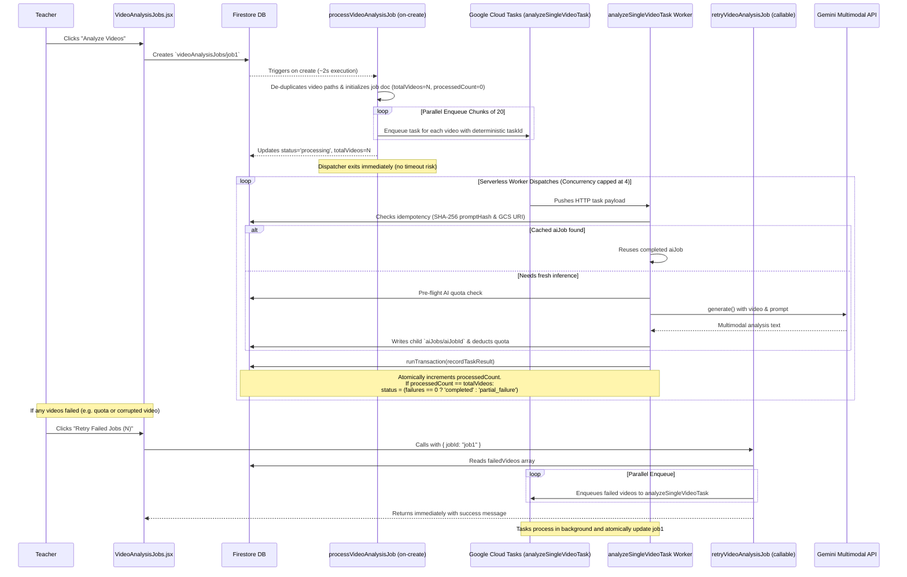
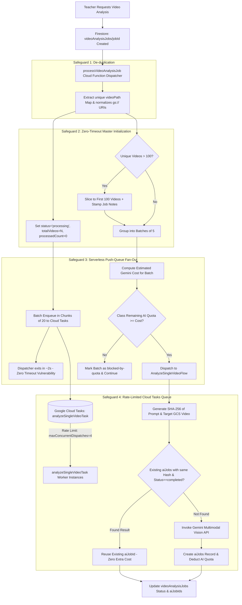
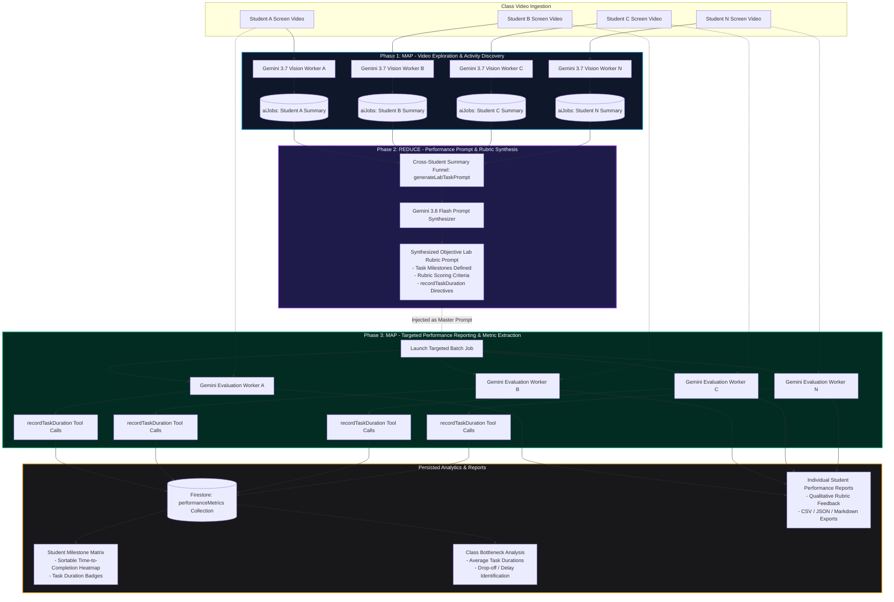
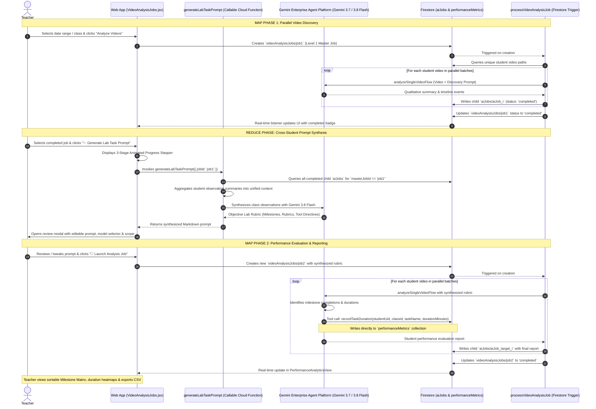

# Video Analysis Workflow

[🏠 Documentation Index](../README.md#documentation-index) | [👨‍🏫 Teacher Manual](./user-manual-teacher.md) | [🧑‍🎓 Student Manual](./user-manual-student.md) | [🛠️ Admin Manual](./user-manual-admin.md) | [📘 UI Catalog](./comprehensive-ui-controls-and-features-catalog.md)

---

This document provides a detailed explanation of the video analysis workflow, which is powered by Google's Gemini Enterprise Agent Platform (formerly Vertex AI). Given that this is the most resource-intensive and expensive feature in the application, several safeguards have been implemented to ensure it runs efficiently and to prevent unnecessary costs from duplicate or runaway jobs.

---

## 📑 Table of Contents

1. [Workflow Overview](#workflow-overview)
2. [1. Initial Job Creation (`processVideoAnalysisJob`)](#1-initial-job-creation-processvideoanalysisjob)
   - [Safeguard 1: De-duplication](#safeguard-1-de-duplication)
   - [Safeguard 2: Job Size Limiting](#safeguard-2-job-size-limiting)
   - [Safeguard 3: Batch Quota Checking](#safeguard-3-batch-quota-checking)
3. [2. Preventing Duplicate Analysis (Idempotency)](#2-preventing-duplicate-analysis-idempotency)
   - [Safeguard 4: Idempotency Check](#safeguard-4-idempotency-check)
4. [3. Retry Mechanism](#3-retry-mechanism)
   - [In-Place Retry with History](#in-place-retry-with-history)
5. [4. Map-Reduce-Map AI Jobs Architecture: Performance Prompt Synthesis & Rubric Reporting](#4-map-reduce-map-ai-jobs-architecture-performance-prompt-synthesis--rubric-reporting)
   - [4.1 The Map-Reduce-Map Paradigm Explained](#41-the-map-reduce-map-paradigm-explained)
   - [4.2 Architectural Flowchart: Map-Reduce-Map Pipeline](#42-architectural-flowchart-map-reduce-map-pipeline)
   - [4.3 Sequence Diagram: End-to-End Execution Flow](#43-sequence-diagram-end-to-end-execution-flow)
   - [4.4 Phase Characteristics & Operational Matrix](#44-phase-characteristics--operational-matrix)
   - [Tool Safety & Zero Prompt Corruption Guarantees](#tool-safety--zero-prompt-corruption-guarantees)

---

## Workflow Overview

The process begins when a teacher requests an AI analysis on one or more videos. This request creates a master job document that orchestrates individual analysis tasks for each video via a distributed **Google Cloud Tasks Map-Reduce architecture**.

Unlike legacy monolithic functions that executed sequentially inside a single Cloud Function (and inevitably hit the hard **540-second Firestore trigger timeout** when analyzing cohorts larger than 15–20 students), the modern architecture completely decouples cohort size from function runtime:
1. **Map (Dispatcher)**: `processVideoAnalysisJob` triggers on `videoAnalysisJobs/{jobId}` creation, validates and deduplicates videos, records the master metadata (`totalVideos`, `processedCount: 0`), enqueues individual tasks to Google Cloud Tasks in parallel batches, and finishes in **~2 seconds**.
2. **Worker (Push Queue)**: Google Cloud Tasks invokes `analyzeSingleVideoTask` serverless worker instances in `asia-east2`, throttled by queue concurrency controls (`maxConcurrentDispatches: 4`, `maxDispatchesPerSecond: 2`) to protect Gemini API rate limits.
3. **Reduce (Atomic State Machine)**: Each worker executes its analysis independently (with an isolated 300s timeout and 2GiB RAM) and executes an atomic Firestore transaction (`recordTaskResult`) to increment `processedCount` and flip the master status to `completed` or `partial_failure` when the last task resolves.

### Data Flow Diagram

This diagram illustrates the end-to-end lifecycle of a video analysis job:



---

## 1. Initial Job Creation & Dispatch (`processVideoAnalysisJob`)

When a teacher requests a new analysis, a document is created in the `videoAnalysisJobs` collection. This triggers the lightweight `processVideoAnalysisJob` Cloud Function dispatcher, which orchestrates the fan-out with 4 layers of safety guardrails:



### Safeguard 1: De-duplication & Storage Path Normalization

When an analysis is requested for a time range, the function queries all `videoJobs` within that range. To prevent analyzing the same video multiple times if duplicate records exist, it de-duplicates the list based on the unique `videoPath` and normalizes paths into canonical `gs://` Cloud Storage URIs.

**Code Justification (`processVideoAnalysisJob.js`):**
```javascript
// De-duplicate videos by path to prevent redundant analysis
const videoMap = new Map();
querySnapshot.forEach(doc => {
  const video = doc.data();
  if (video.videoPath && !videoMap.has(video.videoPath)) {
    videoMap.set(video.videoPath, { 
      studentUid: video.studentUid, 
      studentEmail: video.studentEmail, 
      videoPath: video.videoPath 
    });
  }
});
videosToAnalyze = Array.from(videoMap.values());
```

### Safeguard 2: Zero-Timeout Serverless Dispatcher

Legacy architectures attempted to process all videos sequentially inside a single Cloud Function, which failed at the hard 540-second Firestore trigger ceiling when analyzing cohorts larger than 15–20 videos.

The modern dispatcher initializes master document progress counters and fans out tasks to Google Cloud Tasks in parallel batches of 20. The dispatcher finishes execution in **~2 seconds**, completely decoupling the job orchestration from video cohort execution time.

**Code Justification (`processVideoAnalysisJob.js`):**
```javascript
const totalVideos = videosToAnalyze.length;
await masterJobRef.update({
  status: 'processing',
  totalVideos,
  processedCount: 0,
  successCount: 0,
  failureCount: 0,
  failedVideos: [],
  dispatchedAt: FieldValue.serverTimestamp()
});

const queue = getFunctions().taskQueue(`locations/${FUNCTION_REGION}/functions/analyzeSingleVideoTask`);
const CHUNK_SIZE = 20;
for (let i = 0; i < videosToAnalyze.length; i += CHUNK_SIZE) {
  const chunk = videosToAnalyze.slice(i, i + CHUNK_SIZE);
  await Promise.all(chunk.map((video, chunkIdx) => {
    const globalIdx = i + chunkIdx;
    const sanitizedId = `video-${jobId}-${globalIdx}-${Date.now()}`.replace(/[^a-zA-Z0-9_-]/g, '-').slice(0, 100);
    return queue.enqueue({
      masterJobId: jobId,
      classId: jobData.classId,
      video,
      promptText: jobData.prompt,
      modelUsed: targetModel,
      bucketName
    }, { id: sanitizedId });
  }));
}
```

### Safeguard 3: Concurrency Throttling & Gemini Quota Protection

Tasks are handled by the dedicated Cloud Tasks queue `locations/asia-east2/functions/analyzeSingleVideoTask`. Concurrency rate limits strictly cap concurrent execution to 4 workers:

```javascript
export const analyzeSingleVideoTask = onTaskDispatched(
  {
    region: FUNCTION_REGION,
    rateLimits: {
      maxConcurrentDispatches: 4,
      maxDispatchesPerSecond: 2
    },
    retryConfig: {
      maxAttempts: 2,
      minBackoffSeconds: 10
    },
    memory: '2GiB',
    timeoutSeconds: 300
  },
  async (req) => { ... }
);
```

- **Concurrency Capped at 4**: Avoids Gemini API `429 RESOURCE_EXHAUSTED` rate spikes.
- **Dedicated Resources**: Each video is processed inside an isolated 2GiB container with its own 300-second timeout.

---

## 2. Preventing Duplicate Analysis (Idempotency) & Pre-Flight Quota

This is the most critical safeguard against unnecessary cloud spending. Before invoking the generative AI model, each worker performs both idempotency and quota verification:

### Safeguard 4: SHA-256 Idempotency Check & Pre-Flight Quota

Inside `analyzeSingleVideoTask.js`:
1. **Idempotency**: Computes a SHA-256 hash of the prompt text. Checks for any completed `aiJobs` matching the same storage path and prompt hash. If found, reuses the existing `aiJobId` at $0.00 cost.
2. **Quota Check**: Calculates estimated token cost and verifies classroom balance in `classes/{classId}/aiUsage` before invoking Gemini.
3. **Execution**: Invokes `analyzeSingleVideoFlow` with the video and prompt.

---

## 3. Atomic State Machine & In-Place Retry

### Atomic State Machine (`recordTaskResult`)
As individual workers finish, they execute an atomic Firestore transaction (`recordTaskResult`) against `videoAnalysisJobs/{masterJobId}`:
- Atomically increments `processedCount` and `successCount` (or `failureCount`).
- Appends successful job IDs to `aiJobIds`, or failed video objects to `failedVideos`.
- When `newProcessedCount >= totalVideos`, flips `status` to `completed` (if 0 failures) or `partial_failure` (if any failures) and timestamps `finishedAt`.

### Zero-Timeout In-Place Retry
When a job encounters partial failures (e.g. invalid video format or quota interruption):
1. **Trigger**: Teacher clicks **"Retry Failed Jobs (N)"** in the UI, calling `retryVideoAnalysisJob`.
2. **Immediate Return**: The callable function reads `failedVideos`, resets the job status to `processing`, enqueues all failed videos to `analyzeSingleVideoTask` in Cloud Tasks, and immediately returns `{ result: 'Successfully enqueued...' }` to the browser client.
3. **Zero Browser HTTP Timeouts**: The browser does not wait for video analyses to finish; progress updates stream in real time via Firestore snapshot listeners.

---

## 4. UI Inspection & Default Word Wrap

When teachers inspect individual student video analysis results via `JobResultModal.jsx`:

1. **Dynamic Header Labeling**:
   - For structured JSON responses: displays `Analysis Output (JSON):`.
   - For unstructured text or markdown reports: displays `Analysis Output:` (accurately reflecting text content instead of mislabeling as JSON).
2. **Default Word Wrap Enabled (`Wrap: ON`)**:
   - Long continuous AI evaluation narratives, rubric breakdowns, and markdown paragraphs wrap automatically (`whiteSpace: pre-wrap`, `wordBreak: break-word`, `overflowWrap: anywhere`).
   - Completely eliminates horizontal scrolling across single-line strings.
3. **Toolbar Controls**:
   - **`↩ Wrap: ON` / `➡ Wrap: OFF`**: Allows toggling between wrapped reading mode and raw monospace preformatted mode.
   - Multi-format exports: **`📥 CSV`**, **`📥 JSON`**, **`📝 Markdown`**, **`📄 Text Report`**, and **`📋 Copy`** with live feedback.
4. **Live Job Progress Bar**:
   - `VideoAnalysisJobs.jsx` displays real-time progress counters (`Progress: {processedCount} / {totalVideos}`) as Cloud Tasks workers complete.

---

## 4. Map-Reduce-Map AI Jobs Architecture: Performance Prompt Synthesis & Rubric Reporting

Real-world laboratory classrooms (e.g., cloud computing labs with AWS, Azure, Docker, Kubernetes) involve distinct tasks, rubrics, and milestone requirements for each lesson session. Predefined static prompts are often too generic to measure specific task durations or evaluate complex coursework milestones, while expecting instructors to manually write exhaustive 3-page rubric prompts before every lab session creates prohibitive pedagogical overhead.

To solve this, the platform implements a **Map-Reduce-Map AI Jobs Architecture** that automatically discovers lab milestones from actual student activity, synthesizes a standardized rubric prompt, and then evaluates the entire cohort against that unified benchmark.

### 4.1 The Map-Reduce-Map Paradigm Explained

The workflow mirrors the classic distributed computing MapReduce pattern across three distinct phases:

1. **Map Phase 1 (Parallel Video Discovery & Observation)**:
   - **Input**: All student screen recording videos ($V_1, V_2, \dots, V_n$) recorded during a practical lab session.
   - **Mapping Operation**: A master analysis job (`videoAnalysisJobs`) fans out parallel child AI jobs (`aiJobs`) to Google Gemini Enterprise Agent Platform Multimodal Vision API (`gemini-3.7-flash` or `gemini-3.5-flash-lite`).
   - **Output**: Each video is processed independently, extracting qualitative student observations, terminal commands executed, error messages encountered, and milestone attempts into structured text summaries saved in `aiJobs`.

2. **Reduce Phase (Cross-Student Intelligence Aggregation & Prompt Synthesis)**:
   - **Input**: The collection of all completed child `aiJob` summaries from Phase 1.
   - **Reduction Operation**: The `generateLabTaskPrompt` Cloud Function aggregates all $N$ student summaries into a unified cross-student context payload. Gemini 3.8 Flash acts as the **Reducer**:
     - Analyzes class-wide behavioral patterns, common error roadblocks, and genuine milestones reached.
     - Synthesizes an **Objective Lab Milestone Rubric** and **Performance Evaluation Prompt**.
     - Automatically embeds explicit system directives and task names tailored for the `recordTaskDuration` tool.
   - **Output**: A comprehensive, production-ready Markdown performance evaluation prompt with standardized scoring criteria and milestone definitions.

3. **Map Phase 2 (Targeted Performance Reporting & Rubric Evaluation)**:
   - **Input**: The synthesized Performance Prompt from Phase 2 + all student screen recording videos ($V_1, V_2, \dots, V_n$).
   - **Mapping Operation**: The instructor launches a targeted evaluation batch job. Parallel child `aiJobs` run across each student's video using the synthesized rubric.
   - **Autonomous Tool Execution**: Gemini evaluates the student against the unified criteria and calls `recordTaskDuration(studentUid, classId, taskName, durationMinutes)` for each completed lab milestone.
   - **Output**: Individual student performance reports with strengths and improvement recommendations, written to `aiJobs`, while structured milestone durations are persisted into `performanceMetrics` to power the **Student Milestone Matrix** and bottleneck analytics.

### 4.2 Architectural Flowchart: Map-Reduce-Map Pipeline

The diagram below illustrates how raw video recordings transition through the Map $\to$ Reduce $\to$ Map pipeline into actionable performance analytics:



### 4.3 Sequence Diagram: End-to-End Execution Flow



### 4.4 Phase Characteristics & Operational Matrix

| Dimension | Map Phase 1 (Video Discovery) | Reduce Phase (Prompt Synthesis) | Map Phase 2 (Performance Evaluation) |
| :--- | :--- | :--- | :--- |
| **Primary Goal** | Ground-truth activity discovery from raw screen video | Synthesize objective rubric & milestones across cohort | Evaluate individual competencies against unified rubric |
| **Target Dataset** | $N$ Student MP4 screen recordings | $N$ Text summaries from completed child `aiJobs` | $N$ Student MP4 screen recordings + Synthesized Rubric |
| **Gemini Model** | `gemini-3.7-flash` or `gemini-3.5-flash-lite` | `gemini-3.8-flash` (High-reasoning synthesis) | `gemini-3.7-flash` (Deep Multimodal Reasoning) |
| **Execution Layer** | Cloud Run Function (`processVideoAnalysisJob`) | Callable Cloud Function (`generateLabTaskPrompt`) | Cloud Run Function (`processVideoAnalysisJob`) |
| **Tool Calling** | Disabled or generic invigilation tools | None (Pure prompt engineering & reasoning) | Enabled: `recordTaskDuration` tool execution |
| **Firestore Reads** | `videoJobs` collection | `aiJobs` sub-collection | `videoJobs` collection + synthesized prompt |
| **Firestore Writes** | `aiJobs` records (observations & summaries) | None (Prompt returned in-memory to client) | `aiJobs` (reports) + `performanceMetrics` (milestones) |
| **UI Surface** | `VideoAnalysisJobsTable.jsx` (Level 1 Table) | Animated 3-Stage Progress Stepper Modal | `AiJobsTable.jsx` + `PerformanceAnalyticsView.jsx` |
| **Primary Output** | Raw chronological findings per student | Tailored Markdown prompt with milestone rubric | **Student Milestone Matrix**, duration heatmaps & reports |

### Tool Safety & Zero Prompt Corruption Guarantees

When new tools are introduced to the AI toolset, there is an important engineering consideration: *Could adding a new tool inadvertently corrupt, distract, or alter the execution of existing, working prompts (e.g., standard invigilation or simple attentiveness monitors)?*

The system prevents prompt corruption through **4 Strict Architectural Safeguards**:

1. **Negative Constraint Scoping in Tool Definitions**:
   The tool definition for `recordTaskDuration` in [`functions/ai_flows/aiTools.js`](file:///home/developer/Documents/Gemini-AI-Classroom-Assistant/functions/ai_flows/aiTools.js) explicitly defines its applicability boundary:
   ```javascript
   description: 'Records the estimated duration in minutes spent on a specific coursework task or milestone during the lesson. Only invoke this tool when the prompt explicitly asks to track individual lab tasks, milestones, or coursework durations. Do NOT call this tool for general invigilation or if the prompt does not specify coursework tasks to measure.'
   ```
   Gemini's function-calling planner checks each tool's schema and description against the caller's prompt. Because existing invigilation prompts (like `AI invigilator.md`) only request attendance, distraction detection, and overall working time, Gemini's planner will **never** invoke `recordTaskDuration` during those runs.

2. **Data Model Isolation (Zero Collision)**:
   - `recordActualWorkingTime`: Writes directly to `classes/{classId}/lessons/{lessonId}` under `students.{studentUid}.workingMinutes`.
   - `recordLessonSummary`: Writes to `classes/{classId}/lessons/{lessonId}` under `students.{studentUid}.summary`.
   - `recordIrregularity` / `recordVideoIrregularity`: Writes to `irregularities` collection.
   - `recordTaskDuration`: Writes exclusively to the independent `performanceMetrics` collection.
   
   Because each tool interacts with disjoint Firestore documents and collections, tool calls cannot overwrite, mutate, or corrupt lesson documents, student working minutes, or invigilation logs.

3. **Strict Action & Response Protocols in Prompts**:
   Built-in prompts (such as `AI invigilator.md`) enforce numbered action protocols:
   - *"If there were no distractions at all, your final answer MUST be: 'The student remained focused and on track throughout the video.'"*
   The model is strictly constrained to output the exact required textual response structure regardless of tool executions.

4. **Idempotency & Clamping Guardrails**:
   All metric tools enforce idempotency and boundary validation. For example, `recordActualWorkingTime` replaces `[studentPath]: cappedWorkingMinutes` (clamped between 0 and total lesson length) rather than incrementing, ensuring retries or multiple passes never inflate student working minutes.

---

[← Back to Documentation Index](../README.md#documentation-index)

